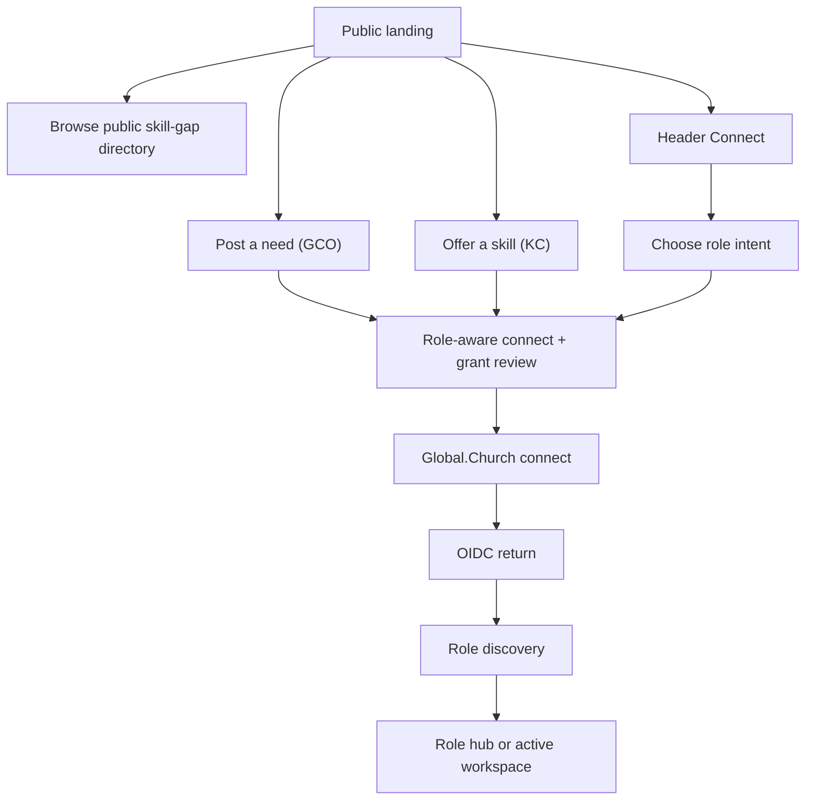
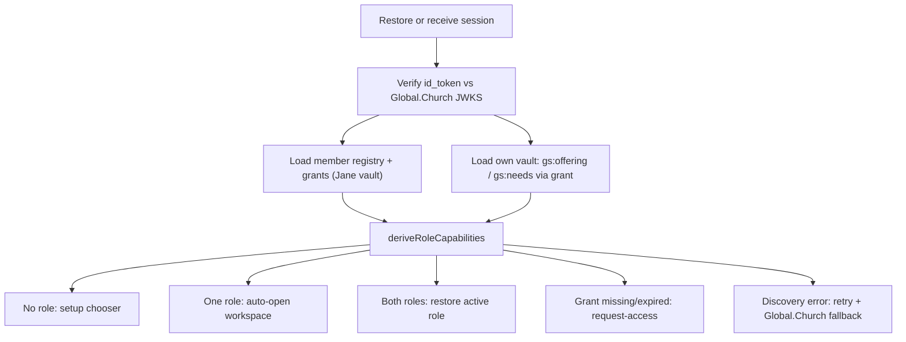
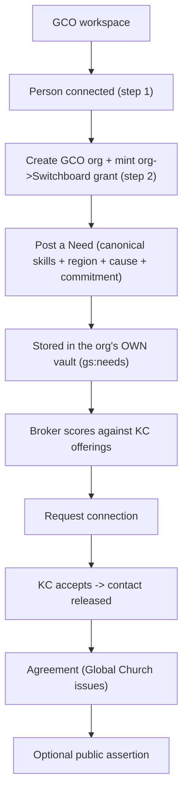
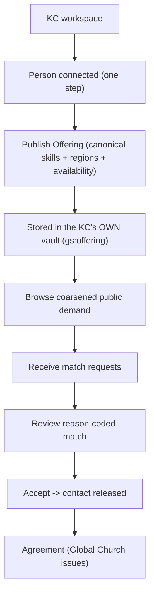
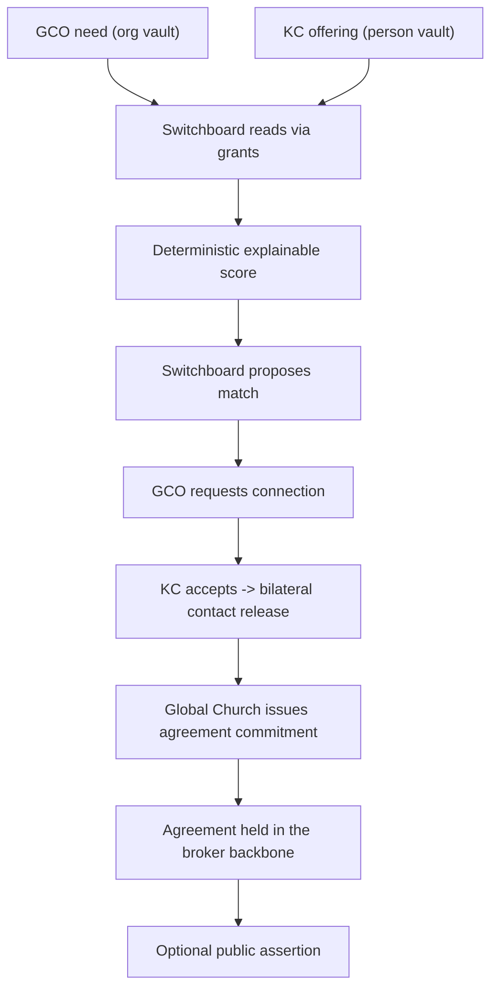

# demo-gs Production UX Design Spec

Status: planning handoff for the next development wave (started in parallel with the demo-jp redesign; a
final alignment pass will follow once demo-jp's redesign lands).
Companion app: `apps/demo-gs` (Global Switchboard — a skills/expertise marketplace).
Sibling spec: [`demo-jp Production UX Design Spec`](../../demo-jp/docs/production-ux-design-spec.md).
Product spec: [`spec 250`](../../../specs/250-demo-gs-global-switchboard.md); substrate
[`spec 251`](../../../specs/251-skills-and-geo-features.md); vault model
[`spec 252`](../../../specs/252-demo-gs-vault-persistence.md).

## 1. Purpose

Turn `demo-gs` from a visible persona-switching demo into a production-shaped **Global Switchboard**
application experience — a skills/expertise marketplace where Great Commission Organizations (GCOs) post
skill **Needs**, Kingdom Consultants (KCs) publish expertise **Offerings**, Global Switchboard brokers
explainable matches, and Global Church issues the connection agreement.

This is a structural UX spec, not a style refresh. It defines the app shell, role model, member journeys,
demo admin shortcuts, state model, screen hierarchy, and validation targets needed to make the next
development wave coherent.

**Relationship to demo-jp.** demo-gs is the **second customer on the shared demo-sso identity backend**
(demo-jp brands it "Impact"; demo-gs brands it "Global.Church" — same homes at `<name>.impact-agent.me`,
same Connect/OIDC, same per-agent MCP vaults). The two apps share an intent-spine primitive
(Need → Offering → IntentMatch → Agreement) and almost all of the demo-jp UX structure applies here. This
spec **follows demo-jp's structure deliberately** and notes where demo-gs's different user stories diverge.

**What is already built (important — demo-gs is ahead of demo-jp on the data model).** The Wave-2
least-privilege model is live: member-owned data lives in each member's own vault (`gs:offering` in the KC
person vault; `gs:needs` in the GCO org vault), the broker reads it only through a delegation each member
grants at Connect, and every view is a persona-scoped **entitled view** (no shared operational blob). This
spec therefore concentrates on the **production shell + journey UX layered on top of the existing
least-privilege substrate**, not on building the substrate.

## 2. Design Mockups

> **To generate.** Unlike the demo-jp spec, the demo-gs mockups are not yet rendered. The screen concepts
> below should be produced (same visual language as demo-jp — light corporate palette, indigo
> "switchboard" accent) and dropped under `apps/demo-gs/docs/assets/`. Until then, §15a's detailed screen
> specs + the ASCII wireframes are the visual reference.

Mockups to produce:

- `demo-gs-landing.png` — signed-out landing (GCO demand vs KC supply value, trust model).
- `demo-gs-role-hub.png` — post-connect role hub (GCO / KC workspaces).
- `demo-gs-gco-dashboard.png` — GCO Organization workspace (needs lifecycle + supply directory).
- `demo-gs-kc-dashboard.png` — KC Expert workspace (offering + demand directory).
- `demo-gs-header-dropdown.png` — connected identity dropdown + Jane/Pete demo shortcuts.
- `demo-gs-deep-role-discovery.png` — post-connect role discovery timeline + access table.
- `demo-gs-deep-gco-flow.png` — GCO org-create → post need → match → agreement lifecycle.
- `demo-gs-deep-kc-flow.png` — KC publish offering → receive requests → agreement.
- `demo-gs-deep-match-agreement.png` — match → agreement timeline (broker → issuer).
- `demo-gs-broker-board.png` — Jane / Switchboard broker demo admin (match board + bridge + signal).
- `demo-gs-connect-grant-review.png` — role-aware connect + grant review before handoff.
- `demo-gs-access-request-state.png` — missing-delegation / limited-view state.

## 3. Product Principles

- **One connected person, multiple workspaces.** A user signs in once through Global.Church, then works as
  a GCO signatory, a KC expert, or both.
- **Role is not identity.** GCO/KC is an active workspace state. The connected identity is always the
  person Smart Agent (and, for a GCO, the org Smart Agent it creates).
- **The GCO role belongs to the ORG; the KC role belongs to the PERSON.** A GCO is an *organization* a
  connected person creates and signs for (≈ demo-jp adopter org). A KC is an *individual* person agent with
  skills (≈ demo-jp facilitator, but always a person, never an org).
- **Demo admin shortcuts stay demo shortcuts.** Jane/Global Switchboard (broker) and Pete/Global Church
  (issuer) are quick-access demo admin surfaces in the header dropdown, driven by deterministic anchor
  keys the app holds. They are not production authorization roles.
- **Global.Church owns identity and member data; the app reads through user-approved delegations.** Member
  needs/offerings live in each member's own vault. Switchboard reads them only through the grant the member
  issued at Connect. Until spec 248 record-type scope enforcement lands, UI copy must say "intended
  Switchboard program scope," not imply cryptographic record-level enforcement.
- **Skills and geo are canonical references, never free text.** Needs and Offerings cite the same
  on-chain `SkillRef.gcUri` / `GeoFacet` concept ids (spec 251). Labels are display only. This concept-join
  is the cross-app payoff and must be visible, not hidden behind free-text fields.
- **Members never read the other side's raw vaults.** A KC browsing demand and a GCO browsing supply see
  only the **coarsened public feed** Switchboard publishes — sensitive regions collapsed, confidential
  contact withheld, "who matched whom" private. Cross-member visibility is the broker's, via grants.
- **No local source of truth, no fallback reads.** No app-local person↔org store, no public-chain
  inference, no try-fast-catch-slow (ADR-0013). If a screen needs data the app has no grant for, it shows a
  request-access state — it does not silently read a broader path.

## 3a. Critical UX/Product Audit Findings

Structural audit from UX/UI, product management, product analysis, and technical architecture. Several
demo-jp P0s are **already addressed** in demo-gs (the entitled-view model); they are restated here as
"keep/finish," and the genuinely-open items are marked.

### P0 Findings

- **Persona switching is still a visible free toggle (OPEN).** `RoleSwitcher` lets anyone flip between
  GCO/KC/Jane/Pete with no connect gate or identity model. Production needs an app shell where member
  roles require a real Connect session and Jane/Pete are demo-admin shortcuts.
- **No role-specific grant review before Connect (OPEN).** `OnboardPanel` says "Connect via Global.Church"
  but does not present an explicit access review (data owner, scope, purpose, limits) before redirect.
- **Role discovery is implicit (OPEN).** On connect-return the app sets a session + persona; there is no
  visible discovery (verify session → load member registry/grants → resolve which workspaces exist).
- **Lifecycle status is thin (OPEN).** GCO/KC views show forms + lists, not "where am I in the
  need → match → agreement lifecycle."
- **Missing-delegation is not a first-class state (OPEN).** If a member's grant is missing/expired (or a
  GCO never minted the org→Switchboard grant), the app throws an error banner instead of an
  access-request/limited-view state.
- **Least-privilege entitled views (DONE — keep).** Each view already reads only entitled data (own vault +
  coarsened public feed; Jane via grants; Pete agreements-only). Do not regress this in the reshell.
- **Product success metrics are missing (OPEN).** No activation/completion analytics.

### P1 Findings

- **Landing reduces choice anxiety poorly.** "Register a GCO organization" vs "Register as a KC expert"
  needs a "not sure" path + role explanations (demand vs supply).
- **KC value is less obvious than GCO value.** KCs need a clear promise: publish your skills once, get
  better-fit, explainable matches, accept on your terms; contact stays private until you accept.
- **Agreement flow is too abstract.** Users need a timeline explaining Switchboard broker → party consent →
  Global Church issuer → private credential → optional public assertion.
- **The bridge + public read API are invisible to members.** Pattern-A bridged demand and the public
  `/api/directory` are powerful proof points but only surface in Jane's view; the landing should leverage
  the public skill-gap signal as an acquisition surface.
- **Demo admin shortcuts need guardrails.** Jane/Pete must be labeled demo shortcuts and must not mutate a
  connected member session.

### P2 Findings

- **Directory/search can become a stronger acquisition surface.** The public directory should be
  browsable pre-connect (it already exists at `/api/directory`).
- **Retention loop needs a post-match surface.** Accepted connections + agreement progress should be the
  reason members return.
- **Operational dashboards need reporting hooks.** Jane/Pete should expose funnel counts + stuck states.

## 3b. Revised UX/UI Design Recommendations

- Replace the free `RoleSwitcher` with an **app shell header**: member roles behind Connect; Jane/Pete in a
  labeled demo-admin dropdown.
- Add a **role-aware connect + grant review screen** before the Global.Church handoff.
- Add a visible **post-connect role discovery** screen (verify → load registry/grants → resolve).
- Add a **lifecycle rail** to GCO need/match and KC offering/request screens.
- Add a **command-center summary** to the KC + GCO workspaces.
- Add a **request-access / limited-view state** for missing/expired grants (incl. the GCO org→Switchboard
  grant).
- Add **next-best-action cards** to every workspace.
- Add **"who can see what" panels** in match, agreement, and contact-release flows, anchored on the
  coarsened-public-feed model.
- Make the **canonical skill/geo concept-join visible** (skill chips cite registry ids; show the on-chain
  substrate badge already wired in `SubstrateClaimsPanel`).
- Add **analytics events** for activation, role setup, grants, needs/offerings, matches, agreements,
  bridge imports, disconnect.
- Keep Jane/Pete demo shortcuts, labeled, not tied to production authorization.

## 4. User Personas And Use Cases

### GCO Organization (demand) — ≈ demo-jp Adopter

Primary job: a connected person creates a Great Commission Organization that posts skill **Needs** and
requests a matched Kingdom Consultant through Global Switchboard.

Core use cases:

- Connect to Global Switchboard through the person's Global.Church home.
- Create the GCO organization (e.g. *Hope Church Missions Team*); the org SA is custodied by the person's
  Global.Church credential, and mints an org→Switchboard read grant.
- Post one or more skill Needs (required skills, region, cause, languages, commitment).
- Review the broker's explainable matches against KC offerings.
- Request a connection with a KC; on accept, exchange contact and form an agreement.
- Track match → agreement → issuance status.
- Disconnect Switchboard access without deleting the Global.Church home or org vault data.

Success state:

- The GCO sees its posted needs, clear match/agreement status, and understands exactly what Switchboard can
  read (only what the org granted).

Detailed GCO journey:

1. **Arrive with demand intent.** From marketing, the public skill-gap directory, or the header Connect.
   Preserve "GCO" intent through handoff.
2. **Connect through Global.Church (step 1).** The person Smart Agent signs in; Switchboard never collects
   credentials. Returns a session + the person's site grant.
3. **Create the GCO org (step 2).** The home deploys the org SA (custodied by the person's ROOT credential)
   **and mints the org→Switchboard broker grant** (we pass `grantOrg` = the deployed Switchboard org SA).
   No grant returned → request-access state, not a silent failure.
4. **Resolve role state.** Load the member registry entry + read the org's `gs:needs` through the grant.
5. **Post a Need.** Pick canonical required skills, region (sensitivity-aware), cause, languages, and
   commitment. Stored in the org's own vault.
6. **Review matches + request a connection.** The broker scores the org's needs against KC offerings;
   the GCO requests a connection from a proposed match.
7. **Track broker → issuer progress.** Requested → confirmed (KC accepts, contact released) → ongoing →
   fulfilled, with optional public assertion.
8. **Manage privacy and access.** See what is in the org vault, what Switchboard can read, and what
   disconnect changes.

GCO failure/recovery cases:

- Global.Church session expires → `Reconnect to refresh Switchboard access`.
- Org-create returned no broker grant → access-request state ("retry org creation to mint the Switchboard
  grant"); do not write needs to a path Switchboard can't read.
- Org-create cancelled → resume at step 2, not the public landing.
- Need references a skill not on the registry → block with "pick a canonical skill" (no free text).
- Duplicate need → show existing + allow edit/withdraw.

### KC Expert (supply) — ≈ demo-jp Facilitator (but always an individual)

Primary job: an individual connected person publishes an expertise **Offering** and receives explainable
match requests from GCOs.

Core use cases:

- Connect to Global Switchboard through the person's Global.Church home (one step — no org).
- Publish an Offering: offered skills, regions, causes, languages, availability, evidence.
- Browse the coarsened public demand feed (where the demand is).
- Review + accept/decline incoming connection requests; release contact only on accept.
- Move from accepted connection to agreement.
- Disconnect when needed.

Success state:

- The KC sees its published offering, the demand it could serve (coarsened), open requests, and the next
  action — in one workspace.

Detailed KC journey:

1. **Arrive with service intent.** A consultant offering a skill.
2. **Connect through Global.Church.** The person Smart Agent signs in; KC is a workspace role, not a second
   account. The site grant (person→Switchboard) lets Switchboard read the KC's offering.
3. **Publish an Offering.** Canonical offered skills (cite registry ids → on-chain substrate badge),
   regions, causes, languages, availability, evidence. Stored in the KC's own vault.
4. **Browse demand.** The coarsened public feed of open needs the KC could serve (sensitive regions
   collapsed; no confidential GCO detail).
5. **Receive + review requests.** The broker introduces GCO needs whose skills overlap the offering, with a
   reason-coded "why this match."
6. **Accept → contact release → agreement.** On accept, both parties' contacts are released and the
   agreement proceeds.
7. **Track lifecycle + return.** Confirmed → ongoing → fulfilled.

KC failure/recovery cases:

- No grant returned at sign-in → access-request state.
- Offering missing required canonical skill → block publish with a clear prompt.
- No matches → empty state explaining the matching criteria + how to improve the offering.
- Session expired → reconnect copy.

### Jane / Global Switchboard Demo Admin (broker) — ≈ demo-jp Jill/JP

Primary job: demonstrate the broker side quickly. Entitled (via the grants members issued) to the full
member view + the bridged public demand.

Core use cases:

- Open the Jane / Switchboard demo admin surface from the header dropdown.
- See all connected members' needs/offerings (via grants), the scored explainable match board, the
  directory, and the public skill-gap signal.
- Run the **Pattern-A read bridge** (import external Switchboard Role JSON → `gc:Need` against the shared
  taxonomy) — the published public demand.
- Broker a connection (request → the agreement backbone).

UX rule: a labeled demo admin shortcut; must not mutate a connected member session.

### Pete / Global Church Demo Admin (issuer) — ≈ demo-jp Pete/GC

Primary job: demonstrate the issuer side quickly. Sees the **agreements/issuance backbone only** — never
member needs or offerings.

Core use cases:

- Open the Pete / Global Church demo admin surface from the header dropdown.
- Issue the agreement commitment for a confirmed connection.
- Run the agreement through its lifecycle (issue → ongoing → fulfilled); optional public assertion.

UX rule: a labeled demo admin shortcut; issuer-oriented, not a second broker; no member data access.

## 5. Information Architecture

Top-level app zones:

- **Public site**
  - Landing
  - How it works
  - Public skill-gap signal / directory (the `/api/directory` + `/api/signal` payoff)
  - GCO CTA (post a need) · KC CTA (offer a skill)
- **Connected member app**
  - Role hub
  - GCO workspace
  - KC workspace
  - Global.Church home handoffs
- **Demo admin surfaces**
  - Jane / Switchboard broker demo admin
  - Pete / Global Church issuer demo admin

Recommended member navigation:

- `Overview`
- Role-specific task tab:
  - GCO: `Needs`
  - KC: `Offering`
- `Directory` (the coarsened public feed for the other side)
- `Connections` (matches + agreements the member is a party to)

The header account dropdown is global and available in every zone.

## 5a. Current Product Mechanics To Preserve

The redesign must respect what is already implemented (Wave 2):

- `App.tsx` activates a persona-scoped **entitled view** via `setActiveContext({persona, session})` →
  `store.hydrate()`. Keep the persona-scoped store; the reshell changes routing/shell, not the entitlement
  model.
- `session.ts` holds the per-kind `MemberSession` (login credential + the member's grant). Keep.
- `member-vault.ts`: `gs:offering` (KC person vault), `gs:needs` (GCO org vault), `gs:member:<sa>`
  registry + grant (Jane's vault), `loadBrokerView()` (entitled). Keep.
- `store.ts`: agreements + bridged demand in Jane's vault (`gs:broker:agreements` / `gs:broker:bridge`);
  member needs/offerings NEVER in the broker blob. Keep.
- Connect capture: KC site-login → `tok.delegation`; GCO site-login → org-create with
  `grantOrg = deployed Switchboard SA` → `tok.org.brokerDelegation`; throws if a grant is missing. Keep —
  promote the throw into a first-class access-request state.
- `ExpertOfferingWizard` / `GcoNeedWizard` write to the member's own vault via the grant. Keep.
- `MatchBoard` + `score-match.ts`: deterministic, reason-coded matching (exact-skill ≫ category + geo +
  cause + language + availability + evidence). Keep — surface the reason codes + "why this match" prominently.
- `SwitchboardBridgePanel` (Pattern-A import), `DirectoryPanel` (dual-source: pre-coarsened entries for
  members vs raw for Jane), `PublicSignalPanel`, `SubstrateClaimsPanel` (on-chain skill/geo badge),
  `AgreementsPanel`. Keep; reorganize into the new shell.
- `chain.ts` reads the live `SkillDefinitionRegistry` / `GeoFeatureRegistry` (spec 251). Keep.

Design implication: reorganize these surfaces into clearer flows before replacing business logic; a first
wave can reuse most current wizards/panels while changing routing, shell, role resolution, and hierarchy.

## 5b. Screen Flow Maps

### Signed-Out Flow



### Connected Role Discovery



### GCO Flow



### KC Flow



### Match To Agreement Flow



## 6. App Shell And Header

Replace the free `RoleSwitcher` with a real app shell header.

Header requirements:

- Left: `Global Switchboard` brand.
- Center, when useful: product navigation tabs.
- Right, signed out:
  - primary `Connect`
  - dropdown caret
  - dropdown includes Jane/Pete demo shortcuts + privacy/data-access help.
- Right, connected:
  - connected identity pill: display name, handle (`<name>.impact-agent.me`), active role.
  - dropdown: identity summary, `Open Global.Church home`, `Disconnect`, role switching/setup, Jane/Pete
    demo shortcuts, help.

Dropdown rules:

- `Connect` opens the role-aware entry path: GCO, KC, or help-me-choose.
- `Disconnect` clears the member session(s) + active role + the persona-scoped store context. It does NOT
  delete Global.Church / vault data.
- Jane/Pete shortcuts route to demo admin surfaces without changing the connected member identity.
- Role switching appears only when role capabilities are known.

## 7. State Model

The current `persona` toggle + per-kind `MemberSession` is close but not production-shaped. Split connected
state into clear concepts (most already exist — formalize them):

- `MemberSession` (per kind, exists in `session.ts`)
  - `kind` (`gco` | `kc`), `sa`, `name`, `orgName?`, `signatory?`, `grant`
- `activeRole`
  - `gco` | `kc`, persisted only as a UI preference keyed by canonical person SA + `demo-gs`; never identity
    or authorization.
- `roleAccess`
  - the grants/records needed per workspace (own-vault reads via grant). Derived, not persisted as authority.
- `memberRegistryState`
  - `loading` | `ready` | `error` — the Jane-vault member registry that backs the broker view.
- `roleCapabilities`
  - derived result of the role resolver.

Add one resolver boundary:

```ts
deriveRoleCapabilities({
  kcSession,        // loadSession('kc')
  gcoSession,       // loadSession('gco')
  pendingGco,       // person connected, org not yet created
})
```

The resolver returns:

- available roles
- missing setup steps per role (KC: publish offering; GCO: create org, post first need)
- whether a fresh Global.Church grant is required
- recommended landing role
- whether role switching can happen immediately
- state per role: `empty`, `record-absent`, `grant-missing`, `org-pending`, `load-failed`, `ready`,
  `incomplete`

Resolver constraints:

- A GCO role is `org-pending` after step 1 (person connected) until org-create returns the broker grant.
- Treat `grant-missing` (org→Switchboard grant absent) and `load-failed` differently from "no role."
- Never infer a role from public chain or local storage; the member registry + the per-kind session are
  the only sources.

## 8. Signed-Out Landing

Goal: explain demand vs supply value and route into the right role-aware connect path.

Screen structure:

- Hero:
  - title: "Find the Kingdom expertise you need — or offer yours."
  - copy: Global.Church holds your identity + data; Global Switchboard brokers explainable matches.
  - CTAs: `Post a need (GCO)`, `Offer a skill (KC)`
- Three-step explainer:
  - Connect via Global.Church.
  - Choose your role (post a need / offer a skill).
  - Work from your secure workspace.
- Live proof: the **public skill-gap signal** (top open-skill categories, unmet demand) sourced from
  `/api/signal` — a real acquisition surface, browsable pre-connect.
- Trust cards:
  - Your data stays in your Global.Church home.
  - Global Switchboard brokers + explains matches; you grant scoped access, revocable anytime.
  - Global Church issues the connection agreement.

Structural requirement: the header `Connect` must not bypass role intent — open a chooser or preserve the
clicked CTA.

## 9. Post-Connect Role Hub

Goal: let a connected user choose or resume the right workspace.

Role hub states:

- **No role discovered** → GCO + KC setup cards (what each will create/grant).
- **One role discovered** → auto-land in that workspace after a short loading state; hub stays in dropdown.
- **Both roles discovered** → restore last active role; workspace switcher in dropdown.
- **GCO org pending** → resume the org-create step (the existing `GcoOrgCreate`).
- **Grant missing** → request-access card (reconnect / re-mint grant).
- **Discovery error** → retry + "Open Global.Church home" fallback.

Role hub cards:

- GCO Organization: create org (if pending) · post a need · review matches.
- KC Expert: publish offering · browse demand · accept requests.

## 10. GCO Workspace

Goal: make the GCO's next demand action obvious.

Recommended hierarchy:

- Header: active role pill `Working as GCO · <org name>`.
- Progress rail/checklist:
  - Org created (org SA + Switchboard grant).
  - First need posted.
  - Match reviewed.
  - Connection requested.
  - Agreement issued.
- Primary task card:
  - `Post a skill need`
  - canonical required-skills picker (cites registry ids)
  - region (sensitivity-aware), cause, languages, commitment
  - `Post need to your org vault`
- Secondary card:
  - posted needs (status pills) — read from the org's own vault
- Directory card:
  - the **coarsened public supply feed** (browse KCs by skill/region/cause; contact withheld).
- Right rail:
  - what happens next (broker match → request → KC accept → Global Church issues).
- Trust/data footer:
  - data in your Global.Church org vault; the scoped grant Switchboard reads through; revoke path.

Copy guidance: "your Global.Church org home" in primary copy; canonical skill ids + on-chain badge present
but secondary; "Switchboard reads only what your org granted" as the privacy anchor.

## 11. KC Workspace

Goal: help a KC publish a strong offering and manage requests.

Recommended hierarchy:

- Header: active role pill `Working as KC · <name>`.
- Summary cards: offering status · open requests · demand-fit hint.
- Primary task card:
  - `Publish your expertise offering`
  - canonical offered-skills picker · regions · causes · languages · availability · evidence
  - `Publish to your vault`
- Demand directory:
  - the **coarsened public demand feed** (open needs you could serve; sensitive regions collapsed).
- Request queue:
  - incoming connection requests with reason-coded "why this match"; `Accept` / `Decline`.
- Trust/data footer: data in your Global.Church vault; scoped grant; revoke path.

Copy guidance: lead with "your skills, matched and explained"; keep evidence/credentials as trust status,
not the first job; contact privacy ("released only when you accept") is prominent.

## 12. Dual-Role Behavior

A person who is both a KC and a GCO signatory should feel like they are changing workspaces, not accounts.

Rules:

- Role switcher appears only after capabilities are loaded.
- Switching preserves unsaved form state where practical.
- Switching to a missing role opens setup with a clear explanation of what Global.Church will create/grant
  (GCO: deploy org + mint grant; KC: nothing to create, just publish).
- Header always shows the same connected person identity.
- Disconnect clears active role + both workspaces' sessions/grants.

## 13. Loading, Empty, And Error States

Required states:

- Restoring saved session(s).
- Verifying restored id_token against Global.Church JWKS.
- Loading the member registry + grants (Jane vault).
- Loading own vault (`gs:offering` / `gs:needs`).
- Role discovery pending.
- Grant missing/expired (incl. GCO org→Switchboard grant not minted).
- Org-create cancelled / incomplete.
- Vault unreachable (relayer/paymaster down) — the existing `loadError()`.
- Disconnect completed.

UX requirements: never show a blank workspace while discovery is pending; every blocking error offers retry
+ Global.Church fallback; expired-session copy: "Please reconnect to refresh Switchboard access." On vault
failure show the error, never silently fall back to local data (ADR-0013).

## 14. Mobile Behavior

- Header collapses to brand, active role pill, menu button.
- Dropdown becomes a full-width drawer.
- Role hub + directory cards stack vertically.
- Progress rail becomes a horizontal scroll / compact checklist.
- Primary task stays above secondary status.
- Full-width controls, large tap targets; canonical-skill picker is a searchable full-screen sheet on mobile.

## 15. Component-Level Implementation Targets

Likely changes:

- `apps/demo-gs/src/App.tsx`
  - replace the free `RoleSwitcher` with `AppShellHeader`; route members through `RoleHub` or active
    workspace; Jane/Pete become demo-admin dropdown entries (keep the existing entitled `setActiveContext`).
  - promote the connect-return throws into request-access states.
- `apps/demo-gs/src/components/RoleSwitcher.tsx`
  - retire / stop rendering in the production shell.
- New: `AppShellHeader` — signed-out + connected header, identity dropdown, demo shortcuts.
- New: `RoleHub` — zero/one/both/org-pending/grant-missing states + setup CTAs.
- New: `role-capabilities.ts` — the resolver over the per-kind sessions + pendingGco.
- New: `ConnectGrantReview` — role-aware access review before the Global.Church handoff (wraps the existing
  `OnboardPanel` connect launch).
- New: `RoleDiscovery` — visible post-connect timeline + access table.
- `ExpertOfferingWizard` / `GcoNeedWizard` — keep vault-write logic; re-home into workspace primary-task
  cards with a lifecycle rail.
- `MatchBoard` / `AgreementsPanel` / `SwitchboardBridgePanel` / `DirectoryPanel` / `PublicSignalPanel` /
  `SubstrateClaimsPanel` — keep logic; reorganize under the new shell (member vs Jane vs Pete surfaces).

## 15a. Detailed Screen Specifications

### Public Landing

Purpose: convert a visitor into a role-aware Global.Church connection.

Regions: app header (Connect + dropdown); hero (demand/supply value); role CTAs; trust model; the public
skill-gap signal/directory preview; footer/demo disclosure.

Primary actions: `Post a need (GCO)`, `Offer a skill (KC)`, `Browse the directory`, `Connect`.

State rules: a role CTA sets intent before handoff; header Connect opens a chooser; Jane/Pete demo
shortcuts remain in the dropdown for fast demo operation.

```
+------------------------------------------------------------------+
|  Global Switchboard            [ Browse directory ]  [Connect ▼]  |
+------------------------------------------------------------------+
|  Find the Kingdom expertise you need — or offer yours.           |
|  Global.Church holds your data · Switchboard brokers matches.     |
|     [ Post a need (GCO) ]      [ Offer a skill (KC) ]            |
+------------------------------------------------------------------+
|  Open skill gaps right now (public signal)                       |
|   Grant Writing ███████ 7   ·  Translation ████ 4  · ...         |
+------------------------------------------------------------------+
|  [Your data stays home] [Switchboard brokers] [Global Church...] |
+------------------------------------------------------------------+
```

### Role-Aware Connect + Grant Review

Purpose: preserve intent + show the access review before the Global.Church handoff.

Regions: selected path summary; what Global.Church will do; what Switchboard will receive (owner, scope,
purpose, limits); switch-path option; continue.

Content model:

- GCO: "You'll connect your Global.Church home, create an organization (deployed + custodied by your
  credential) that mints a scoped grant so Switchboard can read that org's needs, then post a need."
- KC: "You'll connect your Global.Church home and grant Switchboard scoped access to read the offering you
  publish. Your contact stays private until you accept a connection."
- Undecided: "Connect first, then choose a workspace."

### Role Discovery

Purpose: avoid landing in the wrong workspace while async reads run.

Regions: connection-status timeline (verify id_token → load registry/grants → resolve); found-workspace
cards; missing-setup / grant-missing cards; "what Switchboard can access" table; retry/error panel.

Data dependencies: verified `MemberSession`(s); the Jane-vault member registry; the member's own vault
read via grant.

Blocking states: token verification pending; registry pending; own-vault read pending; grant missing;
relayer/vault unavailable.

### GCO Workspace / KC Workspace

See §10 / §11. Primary-task states:

- GCO: `org-pending` → `no-need` → `need-posted` → `match-available` → `connection-requested` →
  `agreement-issued` → `public-assertion-available`.
- KC: `no-offering` → `offering-published` → `requests-empty` → `requests-pending` → `accepted` →
  `agreement-issued`.

### Match And Agreement Timeline

Purpose: make the multi-party process understandable without exposing private relationships by default.

Regions: actor swimlanes (GCO · Switchboard broker · KC · Global Church issuer); current agreement state;
the reason-coded match explanation; "who-can-see-what" panel; demo shortcuts to Jane/Pete.

Visibility rules: member needs/offerings are private (owner vault); the broker sees both via grants; the
public sees only coarsened aggregates; "a specific KC matched a specific need" is confidential; Global
Church issues the credential but does not broker; public assertion is explicit + opt-in; never publish
person↔org links.

## 15b. Data And Trust Disclosure Model

Each member workspace answers four questions without forcing the user to understand internals:

- **Who am I connected as?** display name, handle, shortened person SA (and org SA for a GCO).
- **What role am I working as?** GCO / KC active role.
- **Where is my data?** "Your Global.Church home holds your profile and organizations; your needs/offerings
  live in your own vault."
- **What can Switchboard do?** "Switchboard reads only the program access you granted at sign-in. Production
  record-level enforcement requires spec 248 vault-scope caveats."

Deeper technical language stays in secondary details: Smart Agent address, approved delegation, canonical
skill/geo id, on-chain registry, credential hash, Base Sepolia, ERC-1271 / EIP-712.

Disclosure locations: connect grant review (before handoff); role discovery (access table); workspace
footer (persistent trust card); match/agreement timeline (who-can-see-what); disconnect confirmation.

## 15b.1 MCP Privacy And Delegation Access Model

All private app data comes from MCP-backed vault reads/writes authorized by delegations (already built in
Wave 2). The UI must never assume that being connected as a person means Switchboard, the GCO org, another
KC, Jane, or Pete can read every related record.

**Spec 248 caveat:** today the vault boundary is owner-keyed — a delegation opens the delegator's vault
namespace; record-type scope is the intended model but not enforceable until spec 248 C-2. UX copy must not
claim Switchboard can cryptographically read "only" specific record types. Real pilot data requires
enforced vault-scope caveats + operator-custody hardening (Jane/Pete are deterministic demo keys today).

Rules to preserve:

- A vault record is keyed by the **delegation's delegator** (the data owner), not a caller-supplied address.
- `vaultReadWithDelegation` / `vaultWriteWithDelegation` touch the delegator's namespace via a grant the
  owner already issued. `vaultRead` / `vaultWrite` let an operator (Jane/Pete) touch its **own** vault only.
- The member registry + grants live in **Jane's** vault (`gs:member:<sa>`); broker agreements + bridged
  demand in Jane's vault (`gs:broker:*`); a KC's offering in the **KC's** vault (`gs:offering`); a GCO's
  needs in the **GCO org's** vault (`gs:needs`).
- The coarsened public feed members browse is computed with Jane's app-held key, then projected — members
  never hold raw confidential data even in memory.

### Access Matrix

| User story | Data needed | Owner | Current access path | Recommendation |
| --- | --- | --- | --- | --- |
| Role discovery after connect | member registry, own offering/needs | connected person / its org | Jane-vault registry + own-vault read via grant | Keep. Add discovery loading/error + grant-missing states. |
| KC publishes offering | offered skills, regions, availability, evidence | KC person | member grant writes `gs:offering` | Keep. No org needed. |
| GCO posts a need | required skills, region, cause, commitment | GCO org | org→Switchboard grant writes `gs:needs` | Keep. Requires the org-create broker grant; surface request-access if missing. |
| KC/GCO browse the other side | coarsened public needs/offerings | broker-published feed | broker view (Jane key) → projected | Keep coarsened. Never expose confidential contact or sensitive geo; never "who matched whom." |
| Jane brokers matches | all members' needs/offerings | each member | `loadBrokerView()` via each grant | Keep. Entitled via grants only; a revoked grant drops that member. |
| Bridge external demand | external Role JSON | Switchboard (no member) | `gs:broker:bridge` in Jane's vault | Keep. Bridged demand is public; coarsen on display. |
| GCO requests connection | need + offering match | GCO + broker | broker view (Jane has both) | Keep. Request creates the agreement in the broker backbone. |
| KC accepts → contact release | both parties' contact | each party vault | resolved from the broker view at accept | Keep. Release bilaterally only on accept; never pre-accept. |
| Global Church issues agreement | commitment + lifecycle | Global Church (Pete) | broker agreement record | Keep. Pete sees agreements only — never member needs/offerings. |
| Optional public assertion | proof hash, parties, status | asserting org(s) | on-chain by explicit action | Keep opt-in only; never auto-publish person↔org links. |

### Delegation Recommendations For New UX Stories

Do not silently broaden access. When a story needs more data, introduce an explicit grant with clear copy
stating: which agent owns the data, which app/org receives access, exactly which record types, what the
grantee can do (read/write/append/list), and how the user revokes from Global.Church.

Example grant prompt:

> Let Global Switchboard read the needs your organization posts. Your profile and documents stay in your
> Global.Church home. In production, Switchboard access is limited to your posted needs, match status, and
> connections for this program.

### Privacy Constraints By Connected User

- **GCO connected user:** read/write its own org needs via the org grant; see only KC projections the
  broker released + the coarsened public supply; cannot see other GCOs' needs, the broker pool, or another
  party's private data.
- **KC connected user:** read/write its own offering via the member grant; see only the coarsened public
  demand + requests the broker routed to it; cannot browse all needs or other KCs' offerings.
- **Jane / Switchboard demo admin:** read member data only where a valid grant exists; labeled a demo
  shortcut while operator custody is deterministic.
- **Pete / Global Church demo admin:** read GC issuance records + on-chain facts only; never member
  needs/offerings/contact unless explicitly delivered.

Product rule: if a screen needs data and no grant exists, show a request-access state. No local storage, no
public-chain inference, no broader fallback read (ADR-0013).

## 15c. Edge Cases And Recovery UX

| Situation | User-facing behavior |
| --- | --- |
| Saved session expired | Clear session; `Please reconnect to refresh Switchboard access.` |
| id_token verification fails | Clear session; explain saved sign-in could not be verified. |
| OIDC returns without a grant | Connection-incomplete recovery with retry (KC: re-sign-in; GCO: re-run org create). |
| GCO org-create returns no broker grant | Request-access state; do NOT write needs to an unreadable path. |
| Vault/relayer unreachable | Show `loadError`; never fall back to local data. |
| Need/offering references a non-canonical skill | Block with "pick a canonical skill"; no free text. |
| Duplicate need | Show existing + edit/withdraw. |
| KC has no matches | Explain matching criteria + how to improve the offering. |
| Jane/Pete shortcut opened while a member is connected | Keep member identity intact; show demo-admin banner. |

## 15d. Development Wave Breakdown

Wave A — app shell + state foundation:

- add `AppShellHeader`; retire the visible `RoleSwitcher`.
- formalize `MemberSession` (exists) + `activeRole` + `roleCapabilities` + `memberRegistryState`.
- add role-aware connect + grant-review entry; route Jane/Pete through dropdown shortcuts.

Wave B — role hub + resolver:

- add `deriveRoleCapabilities`; add `RoleHub` (zero/one/both/org-pending/grant-missing); add visible role
  discovery loading/error; persist last active role per person SA.

Wave C — GCO workspace restructure:

- lifecycle rail; primary "post a need" card; coarsened supply directory; next-best-action; trust footer;
  duplicate/edit/withdraw states; org-pending + grant-missing first-class.

Wave D — KC workspace restructure:

- summary cards; primary "publish offering" card; coarsened demand directory; request queue with reason
  codes; trust footer; empty-state guidance.

Wave E — match/agreement clarity:

- match-to-agreement timeline; who-can-see-what panel; optional public-assertion copy; link Jane/Pete demo
  shortcuts from timeline actions; surface the canonical concept-join + on-chain substrate badge.

## 15e. UX Acceptance Criteria

The next wave is successful when:

- A new visitor understands GCO (demand) vs KC (supply) before connecting.
- Header Connect cannot skip role intent.
- A connected user can always tell who they are connected as + which role they are working as.
- Jane/Pete shortcuts are visible but clearly demo-only and never mutate a member session.
- A dual-role user switches workspaces without feeling like they changed accounts.
- Role discovery never shows a blank or wrong workspace; grant-missing is its own state.
- GCO next action is obvious at every lifecycle stage; same for KC.
- The UI explains what Global.Church holds, what Switchboard can access, and what can become public — and a
  member never sees the other side's raw confidential data.
- Disconnect is understandable and does not imply deletion of Global.Church/vault data.

## 15f. Product Management Scope And MVP Slice

### MVP Goal

A first-time user connects through Global.Church, sees what Switchboard can access, chooses GCO or KC,
completes the minimum setup for one role (GCO: create org + post one need; KC: publish one offering), and
sees a clear next action — without the persona toggle.

### In-Scope (next wave)

- production app shell + account dropdown; role-aware connect + grant review; session/active-role split +
  resolver; role discovery; role hub; GCO lifecycle restructure; KC workspace restructure; request-access
  state for missing grants; Jane/Pete demo shortcuts in dropdown; analytics events.

### Out Of Scope (next wave)

- production operator authorization; spec 248 custody hardening; encrypted agreement drafts; real
  white-label branding beyond the existing `gs-brand.ts`; a full external skill/geo indexer; real
  payment/scheduling/messaging; live "Jane publishes the coarsened public feed to a public endpoint"
  (today the member-facing public feed is computed client-side via the anchor key — fine for the demo, but
  a real public publish needs a public-read path); public-launch claims implying production security.

### Product Risks

- **Too much setup before value (esp. GCO two-step).** Mitigation: role hub + next-best-action immediately;
  make org-create feel like one guided flow.
- **KC value unclear.** Mitigation: lead with explainable matches + private-until-accept contact.
- **Users may not understand Global.Church vs Switchboard.** Mitigation: every grant/access screen states
  owner, receiver, scope, revocation.
- **Demo shortcuts may imply production authority.** Mitigation: label + visually separate Jane/Pete.
- **Privacy broken by shortcuts.** Mitigation: no local source of truth, no public inference, no fallback
  reads; preserve the entitled-view model.

## 15g. Product Analytics And Success Metrics

Prefix events `gs_`.

### Activation Funnel

| Event | When |
| --- | --- |
| `gs_landing_viewed` | public landing loads |
| `gs_role_intent_selected` | GCO / KC / not sure |
| `gs_connect_grant_review_viewed` | grant review shown |
| `gs_gc_handoff_started` | redirect to Global.Church begins |
| `gs_gc_returned` | OIDC return received |
| `gs_role_discovery_started` / `gs_role_discovery_completed` | discovery |
| `gs_role_hub_viewed` | role hub shown |

### GCO Funnel

| Event | When |
| --- | --- |
| `gs_gco_workspace_opened` | GCO workspace opens |
| `gs_gco_org_created` | org SA + broker grant minted |
| `gs_gco_need_posted` | need written to org vault |
| `gs_gco_match_viewed` | match surfaced |
| `gs_gco_connection_requested` | connection requested |
| `gs_gco_agreement_viewed` | issued agreement visible |

### KC Funnel

| Event | When |
| --- | --- |
| `gs_kc_workspace_opened` | KC workspace opens |
| `gs_kc_offering_published` | offering written to KC vault |
| `gs_kc_demand_browsed` | demand directory viewed |
| `gs_kc_request_reviewed` | request opened |
| `gs_kc_request_accepted` | accept → contact release |

### Broker / Trust / Privacy Events

| Event | When |
| --- | --- |
| `gs_bridge_import_run` | Pattern-A bridge import |
| `gs_access_request_viewed` | missing-grant state shown |
| `gs_access_request_started` | user starts grant at Global.Church |
| `gs_limited_view_selected` | user continues without grant |
| `gs_public_assertion_selected` | opt into public assertion |
| `gs_disconnect_clicked` / `gs_disconnect_completed` | disconnect |

### Success Metrics

Connect completion · role discovery success · first-role activation · need-posted rate · offering-published
rate · connection-request rate · accept rate · agreement-issuance view rate · access-request acceptance vs
limited-view · disconnect/reconnect.

## 15h. Missing Or Underdeveloped Use Cases

- **User unsure of role** → guided choice (demand vs supply), not a forced pick.
- **User is both GCO signatory and KC** → separate workspace state, same connected person.
- **GCO signatory creates multiple orgs** → org selector + "create another" without ambiguity (today a
  single per-kind session — extend to multiple GCO orgs).
- **Member revokes Switchboard access** → link to Global.Church + explain what Switchboard loses immediately.
- **Grant expired** → re-mint flow (the member grant has a ~365-day expiry; the app can't re-mint it,
  only the home can — reconnect).
- **Need fulfilled / withdrawn** → statuses for matched, requested, agreement_active, fulfilled, withdrawn.
- **KC availability changes after a match** → ask whether matched GCOs should be notified.
- **Switchboard can't read a record** → request-access state + limited view.
- **Public assertion** → a later explicit action, never part of posting a need / publishing an offering.

## 16. P0 / P1 / P2 Implementation Priorities

P0:

- Replace `RoleSwitcher` with the app shell header.
- Formalize the session/active-role/resolver split.
- Role-aware connect + grant-review entry.
- Role capability resolver + role hub.
- Missing-grant request-access state (incl. GCO org→Switchboard grant).
- Jane/Pete demo shortcuts in the dropdown without mutating member session.

P1:

- GCO workspace hierarchy around post-need + lifecycle.
- KC workspace hierarchy around offering + request queue + reason codes.
- Match-to-agreement timeline + who-can-see-what.
- Analytics events; robust loading/empty/error states; disconnect semantics; mobile drawer.

P2:

- Pre-connect directory/search browsing surface; agreement timeline polish; deeper provenance view;
  multiple-org support; a real public-feed publish path; production copy pass after spec 248.

## 17. Validation Plan

Automated (where practical):

- restored expired session clears correctly; restored valid session still verifies the id_token.
- member registry fetch failure shows retry/fallback.
- active role persists independently of session.
- disconnect clears sessions, active role, role access, store context.
- Jane/Pete shortcuts route without changing the connected member session.
- the role resolver handles zero / one / both / org-pending / grant-missing cases.
- the entitled-view invariant holds: a KC view never contains a raw confidential GCO need (only coarsened).

Manual:

- signed-out landing; connect from GCO CTA; connect from KC CTA; connect from header; connected no-role;
  GCO org-pending; GCO-only; KC-only; dual-role switching; Jane shortcut; Pete shortcut; grant-missing
  state; mobile header/drawer.

Run:

```bash
cd apps/demo-gs && pnpm typecheck && pnpm test && pnpm build
```

## 18. Production Gates

This UX can be made production-shaped before all hardening is complete, but real pilot data should wait for:

- spec 248 vault-scope caveat enforcement + operator-custody hardening (Jane/Pete are deterministic demo
  keys today).
- a real public-feed publish path (so the member-facing demand/supply feed isn't computed via the anchor
  key client-side).
- clear demo-shortcut disclosure while Jane/Pete remain demo-key based.
- no local person↔org persistence; no public person↔org relationship creation.

## 19. Final Alignment Note

This spec was written in parallel with the demo-jp redesign so the demo-gs work can start now. Once the
demo-jp production redesign lands, do a **final alignment pass**: reconcile shared components
(`AppShellHeader`, role hub, connect/grant-review, role-discovery, lifecycle rail, who-can-see-what panel)
into a common pattern both apps consume, since demo-jp and demo-gs are two customers on the same demo-sso
backend and should not diverge in shell UX. Where a shared shell component emerges, consider promoting it
to an app-shared location (not into generic `packages/*`, per ADR-0021 — white-label/shell UX stays in the
app layer).
