# demo-jp Production UX Design Spec

Status: planning handoff for the next development wave.
Companion plan: [`JP Production UX Plan`](/home/barb/.cursor/plans/jp_production_ux_2fc86df9.plan.md).
Primary app: `apps/demo-jp`.

## 1. Purpose

Turn `demo-jp` from a visible persona-switching demo into a production-shaped JP Adopt application experience.

This is a structural UX spec, not a style refresh. It defines the app shell, role model, member journeys, demo admin shortcuts, state model, screen hierarchy, and validation targets needed to make the next development wave coherent.

## 2. Design Mockups

Use these generated screen concepts as visual references during implementation.

### Landing Page

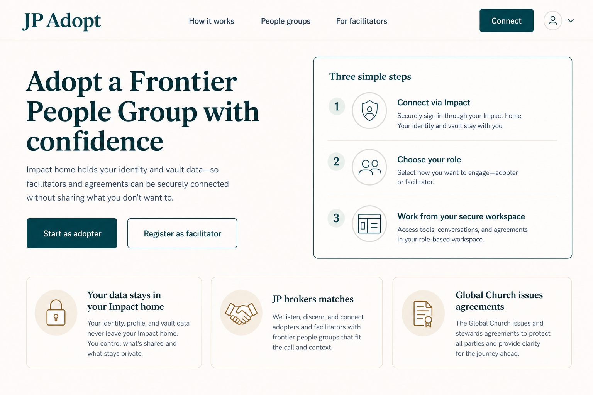

### Connected Role Hub

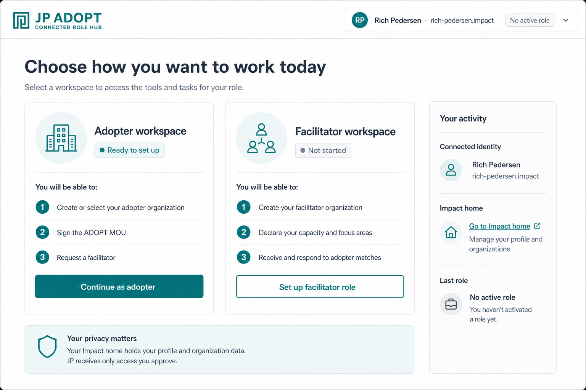

### Adopter Dashboard

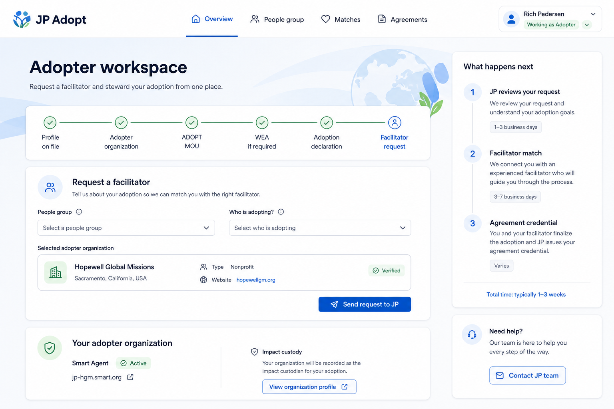

### Facilitator Dashboard

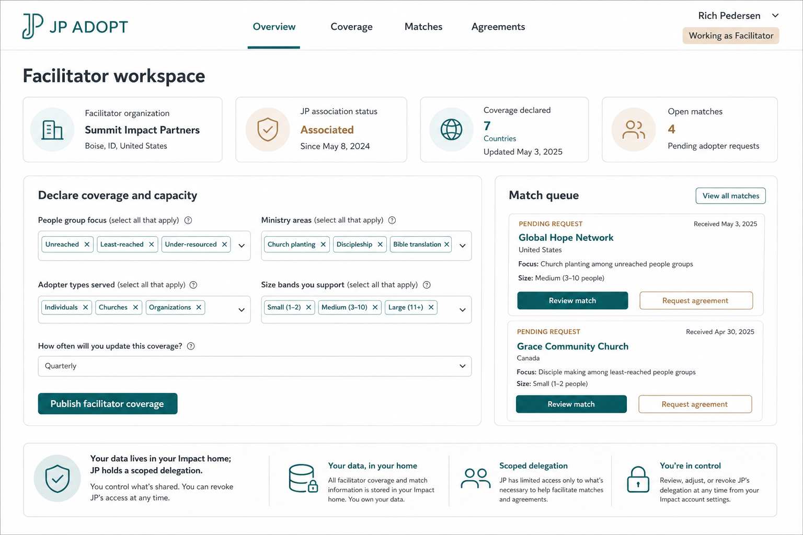

### Header Dropdown

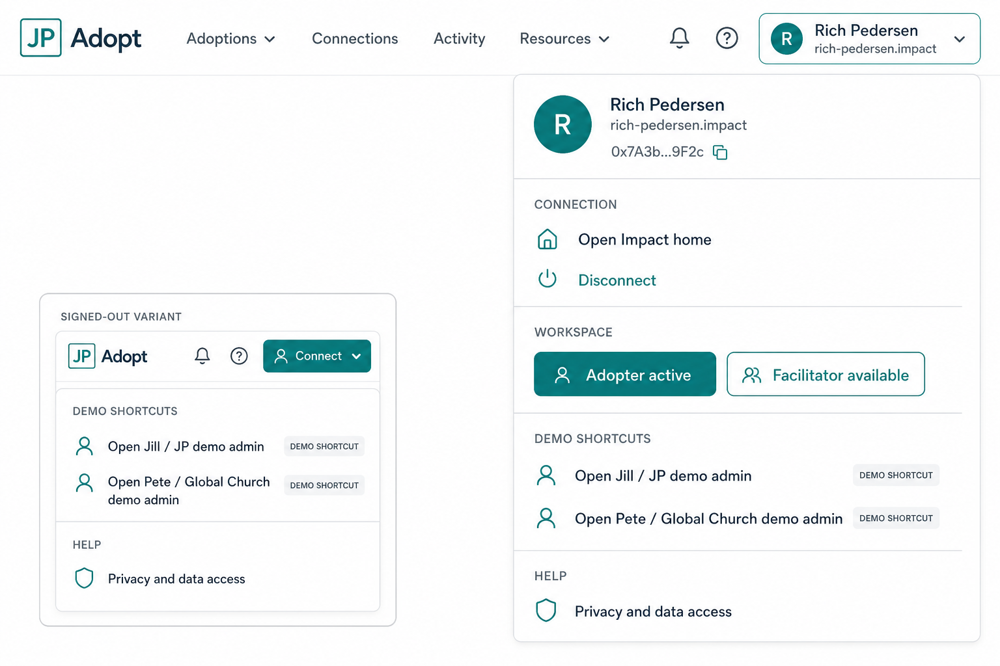

### Deep Role Discovery

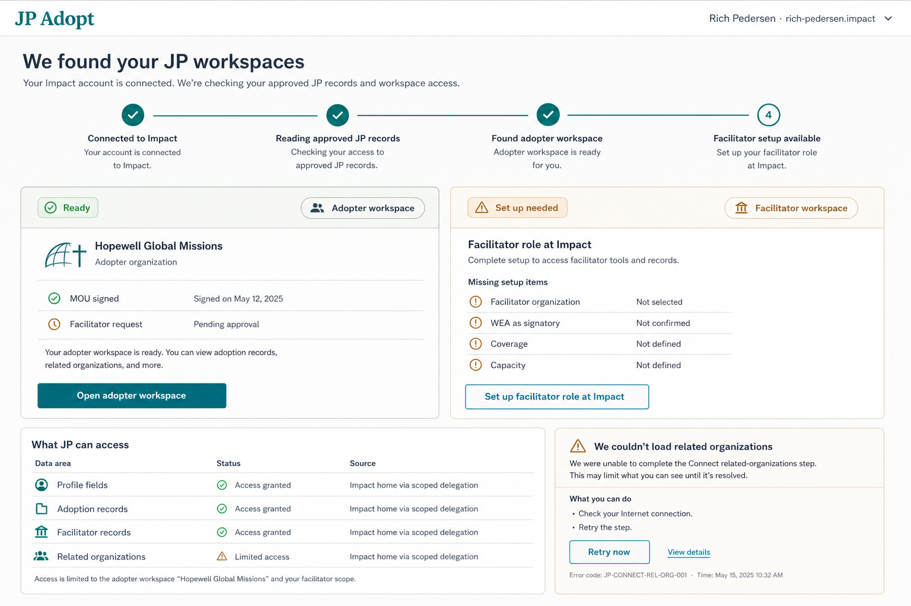

### Deep Adopter Flow

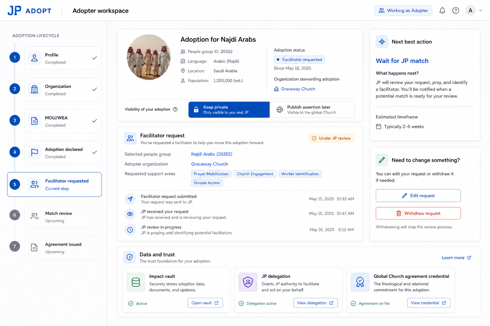

### Deep Facilitator Flow

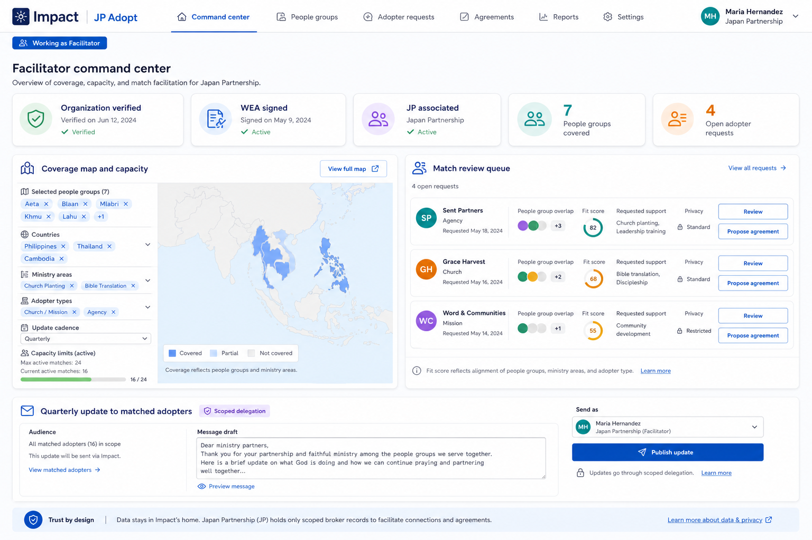

### Match To Agreement Flow

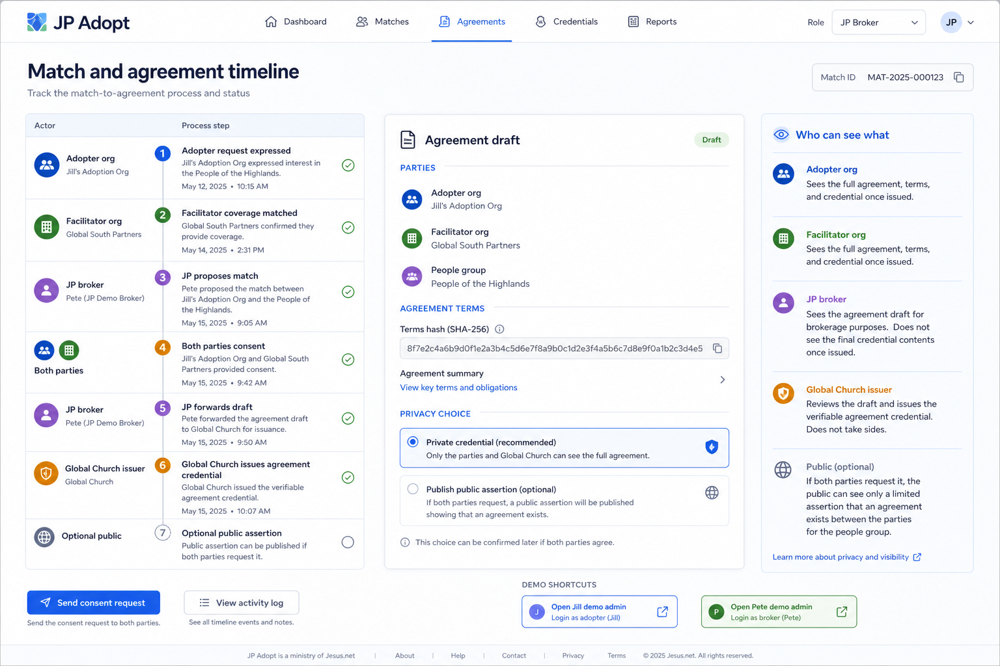

### Role-Aware Connect And Grant Review

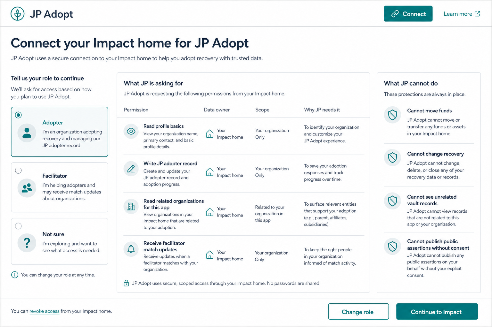

### Missing Delegation Access State

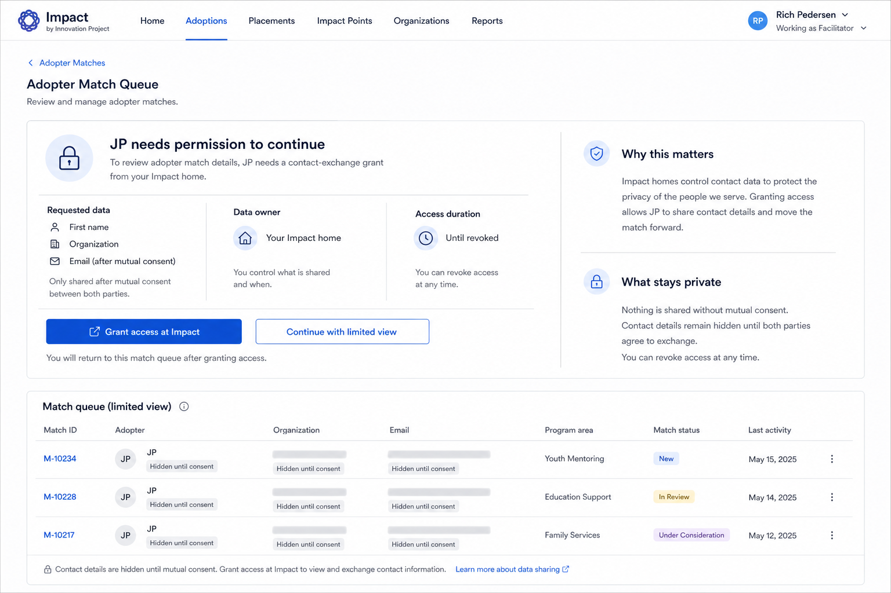

## 3. Product Principles

- **One connected person, multiple workspaces.** A user signs in once through Impact, then works as adopter, facilitator, or both.
- **Role is not identity.** Adopter/facilitator is an active workspace state. The connected identity remains the person Smart Agent.
- **Demo admin shortcuts stay demo shortcuts.** Pete/GC and Jill/JP are quick-access demo admin surfaces in the header dropdown. They are not production authorization roles.
- **Impact owns identity and vault data.** JP reads and writes through user-approved delegations. Until spec 248 record-type scope enforcement lands, UI copy must say "intended JP program scope" rather than implying cryptographic record-level enforcement.
- **No local person-to-org source of truth.** Related organizations come from Connect-scoped related-agent links and member vault records, not public graph inference or app-local person-org storage.

## 3a. Critical UX/Product Audit Findings

This section captures the structural audit from UX/UI, product management, product analysis, and technical architecture.

### P0 Findings

- **Grant review is currently under-designed.** The app tells users "Connect via Impact" but does not yet provide a strong role-specific permission review before redirect. Production-quality UX needs an explicit access review screen that explains data owner, scope, purpose, and limits.
- **Role discovery must not be hidden in dashboard loading.** The app must make post-connect discovery visible: verifying session, loading related orgs, reading approved JP records, resolving role availability.
- **Adopter and facilitator flows need lifecycle status, not just forms.** The current plan has task screens, but production users need to know where they are in the adoption/match/agreement lifecycle.
- **Missing delegation must be a first-class UX state.** If a story needs data JP does not have permission to read, the UI must show an access-request state and a limited-view alternative.
- **Product success metrics are missing.** Without activation and completion metrics, the next development wave cannot tell if UX improved.

### P1 Findings

- **The landing page should reduce choice anxiety.** "Start as adopter" and "Register as facilitator" need a "not sure" path and role explanations.
- **Facilitator value is less obvious than adopter value.** Facilitators need a clearer promise: publish capacity once, receive better-fit adopter requests, and send updates to matched adopters.
- **Agreement flow is too abstract.** Users need a timeline that explains JP broker, party consent, Global Church issuer, private credential, and optional public assertion.
- **Demo admin shortcuts need guardrails.** Pete/Jill shortcuts are useful, but the UI must label them as demo shortcuts and preserve the connected member session.
- **Mobile critical paths need smaller steps.** Long forms should be broken into task cards and saved drafts.

### P2 Findings

- **People-group browsing can become a stronger acquisition surface.** The landing should eventually let users browse/search people groups before connecting.
- **Retention loop needs a clear post-match surface.** Facilitator updates and adopter progress should become the reason users return.
- **Operational dashboards need reporting hooks.** JP/GC demo admin surfaces should eventually expose funnel counts and stuck states.

## 3b. Revised UX/UI Design Recommendations

Apply these updates to the design direction:

- Add a **role-aware connect and grant review screen** before Impact handoff.
- Add a visible **post-connect role discovery screen** instead of silently deciding where to route.
- Add a **lifecycle rail** to adopter and match/agreement screens.
- Add a **command-center summary** to facilitator screens.
- Add a **request-access / limited-view state** for missing delegations.
- Add **next-best-action cards** to every workspace.
- Add **"who can see what" panels** in agreement and contact-exchange flows.
- Add **analytics events** for activation, role setup, grants, requests, matches, and disconnect.
- Keep demo admin shortcuts, but label them as demo shortcuts and do not tie them to production authorization.

## 4. User Personas And Use Cases

### Adopter

Primary job: adopt a Frontier People Group and request JP help finding a facilitator.

Core use cases:

- Connect to JP Adopt through the user's Impact home.
- Create or select an adopter organization when adopting as a church, organization, network, or group.
- Complete reusable profile data at Impact instead of re-entering it in JP.
- Sign the ADOPT MOU and WEA when required.
- Declare adoption intent for a selected people group.
- Request a facilitator through JP.
- Track match and agreement status.
- Disconnect JP access without deleting the Impact home or vault data.

Success state:

- The adopter sees a clear request status, knows what JP will do next, and understands what data JP can access.

Detailed adopter journey:

1. **Arrive with intent.** The user lands from public marketing, a direct people-group link, or the top-right connect button. The app must preserve whether they intended adopter, facilitator, or undecided.
2. **Connect through Impact.** JP never collects credentials. Impact verifies the person Smart Agent and returns a session plus the user's approved JP access grant.
3. **Resolve role state.** JP reads approved records through the grant: Impact profile, `JpAdopterRecord`, `JpFacilitatorRecord`, and Connect-related org links.
4. **Set up adopter role.** If no adopter role exists, explain what JP will create or record: adopter type, optional adopter org, MOU, WEA when required, adoption declaration.
5. **Act as person or org.** The adopter can request a facilitator as the person Smart Agent or one Connect-returned organization whose `purpose` is specifically `jp-adopter-org`. Do not fall back to unrelated stewarded orgs.
6. **Declare adoption.** The user selects a people group, confirms adoption intent, and chooses whether to request facilitator matching.
7. **Track broker progress.** The dashboard shows JP review, match discovery, consent, agreement, and optional public assertion as separate states.
8. **Manage privacy and access.** The user sees what is in Impact, what JP can read, what JP wrote, and how disconnect changes access.

Adopter failure and recovery cases:

- Impact session expires: show `Reconnect to refresh JP access`.
- Related org read fails: keep person-level adoption available, show retry for org-backed adoption.
- Missing profile fields: deep link to Impact profile completion with explicit missing-field labels.
- MOU/WEA handoff cancelled: return to same step with retry, not the public landing.
- Facilitator request already exists: show status and allow edit/withdraw instead of a duplicate submission.

### Facilitator

Primary job: declare coverage/capacity and receive adopter matches from JP.

Core use cases:

- Connect to JP Adopt through Impact.
- Create or select a facilitator organization.
- Complete organization/contact profile data at Impact.
- Sign the ADOPT MOU and WEA as the facilitator signatory.
- Declare coverage for people groups and capacity for adopter types, size bands, and ministry areas.
- Review incoming adopter match requests.
- Move from match to agreement.
- Disconnect JP access when needed.

Success state:

- The facilitator sees current coverage, association status, open matches, and next actions in one workspace.

Detailed facilitator journey:

1. **Arrive with service intent.** The user comes to facilitate adoptions, usually as a mission organization or network representative.
2. **Connect through Impact.** The same person Smart Agent signs in; facilitator is a workspace role, not a second account.
3. **Create/select facilitator org.** Facilitators should act through an organization by default. The org is custodied by the user's Impact credential.
4. **Complete required trust setup.** Impact profile, WEA, and ADOPT MOU gate meaningful facilitator activity.
5. **Declare capacity.** The facilitator records people-group coverage, adopter types served, size bands, ministry areas, and description.
6. **Receive match requests.** JP introduces adopters whose intent overlaps the facilitator's coverage and capacity.
7. **Review and propose agreement.** The facilitator can review a match, request contact exchange, and proceed toward agreement.
8. **Send ongoing updates.** After matches exist, the facilitator can publish updates scoped to matched adopters for a people group.

Facilitator failure and recovery cases:

- No facilitator org: show the org setup as the primary task, not a warning buried in the page.
- Capacity incomplete: preserve partially selected people groups, ministry areas, and size bands.
- No matches: use an empty state explaining how JP matches and what the facilitator can improve.
- Update audience is zero: allow draft save, but explain no matched adopters will receive it yet.
- JP association missing: show it as a trust status that Jill/JP can issue through the demo admin shortcut.

### Jill / JP Demo Admin

Primary job: demonstrate the broker side quickly.

Core use cases:

- Open the Jill / JP demo admin surface from the header dropdown.
- View delegated organizations and broker board state.
- Issue JP Association Credentials.
- Review intents, matches, drafts, and JP-brokered agreements.

UX rule:

- This is a demo shortcut. It must be visually labeled as a demo admin shortcut and must not mutate the connected member session.

### Pete / Global Church Demo Admin

Primary job: demonstrate the issuer side quickly.

Core use cases:

- Open the Pete / Global Church demo admin surface from the header dropdown.
- Register agreement commitments.
- Submit joint assertions.
- Review issued agreements.

UX rule:

- This is a demo shortcut. It must be visually labeled as a demo admin shortcut and must not imply production authorization.

## 5. Information Architecture

Top-level app zones:

- **Public site**
  - Landing
  - How it works
  - People group context
  - Adopter CTA
  - Facilitator CTA
- **Connected member app**
  - Role hub
  - Adopter workspace
  - Facilitator workspace
  - Impact home handoffs
- **Demo admin surfaces**
  - Jill / JP broker demo admin
  - Pete / Global Church issuer demo admin

Recommended member navigation:

- `Overview`
- Role-specific task tab:
  - Adopter: `People group`
  - Facilitator: `Coverage`
- `Matches`
- `Agreements`

The header account dropdown is global and should be available in every zone.

## 5a. Current Product Mechanics To Preserve

The redesign must respect the actual application mechanics already implemented:

- `App.tsx` restores and verifies the OIDC session from local storage, then calls `listRelatedOrgs` against the user's Impact home.
- `JpAdopterRecord` contains adopter type, ADOPT MOU attestation, and adoption declaration.
- `JpFacilitatorRecord` contains ADOPT MOU attestation, facilitator coverage/capacity, and published updates.
- Impact profile and WEA attestation are Impact-owned. JP observes them through the member grant.
- `MemberOrgSection` creates adopter/facilitator organizations through Impact org-create and must remain the privacy-preserving path.
- `IntentRequest` lets the adopter express need for a facilitator as either person Smart Agent or a purpose-specific adopter org Smart Agent returned by Connect.
- `MatchedFacilitatorsPanel`, `MatchedAdoptersPanel`, `ContactExchangeWidget`, and update publishing represent the current brokered relationship surfaces.
- `JillDashboard` and `PeteDashboard` should remain reachable, but only as demo shortcuts. They do not define member identity or role authorization.

Design implication:

- The new UX should reorganize these surfaces into clearer flows before replacing business logic.
- A successful first implementation wave can reuse most current forms and panels while changing routing, shell, role resolution, and screen hierarchy.

## 5b. Screen Flow Maps

### Signed-Out Flow

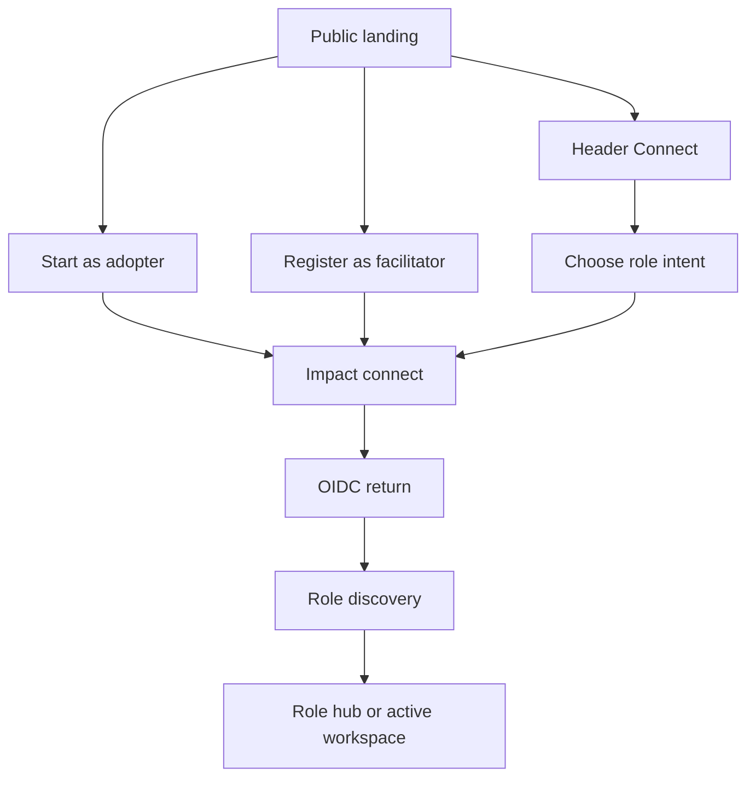

### Connected Role Discovery

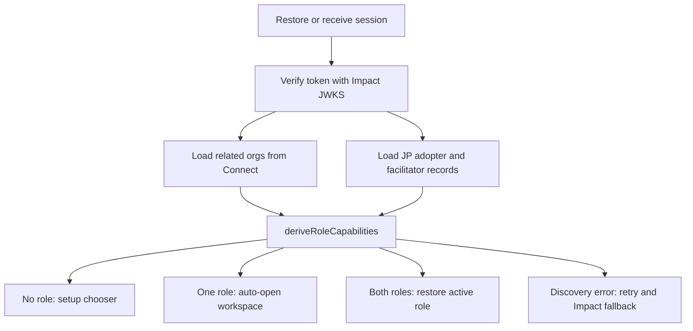

### Adopter Flow

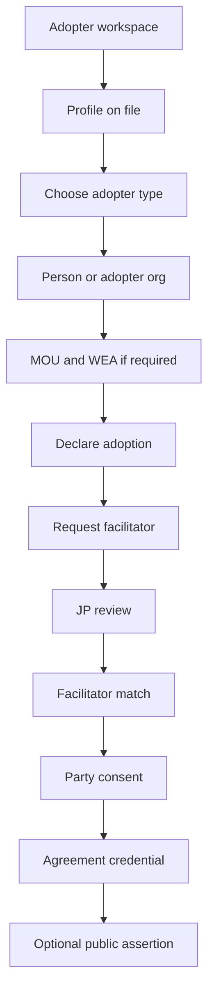

### Facilitator Flow

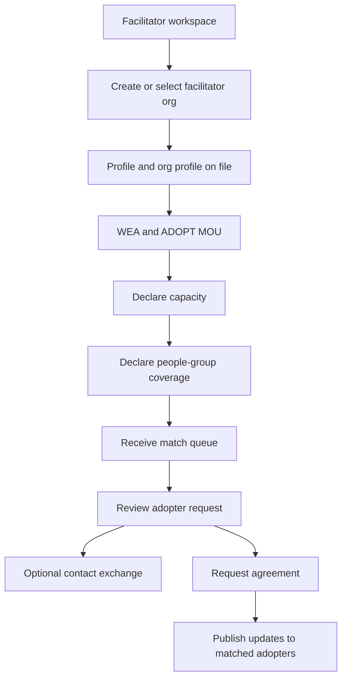

### Match To Agreement Flow

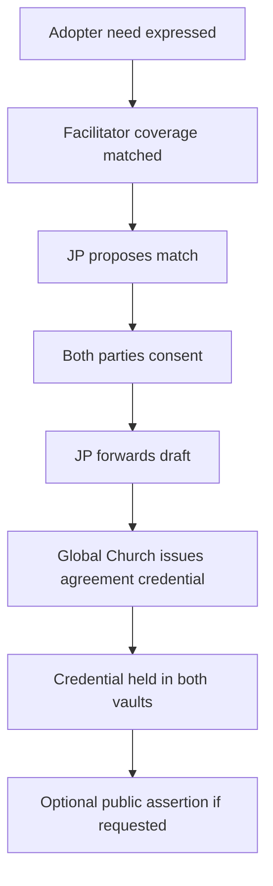

## 6. App Shell And Header

Replace `PersonaBar` with a real app shell header.

Header requirements:

- Left: `JP Adopt` brand.
- Center, when useful: product navigation tabs.
- Right, signed out:
  - primary `Connect`
  - dropdown caret
  - dropdown includes Pete/Jill demo shortcuts and privacy/data access help.
- Right, connected:
  - connected identity pill showing display name, handle, and active role.
  - dropdown includes identity summary, `Open Impact home`, `Disconnect`, role switching/setup, Pete/Jill demo shortcuts, and help.

Dropdown rules:

- `Connect` must open the role-aware entry path: adopter, facilitator, or help-me-choose.
- `Disconnect` clears JP session, active role, role access, and local role state. It does not delete Impact data.
- Pete/Jill shortcuts route to demo admin surfaces without changing the connected member identity.
- Role switching appears only when role capabilities are known.

## 7. State Model

The current `Session.kind` model is not production-ready. Split connected state into separate concepts:

- `MemberSession`
  - `token`
  - `name`
  - `address`
  - `fresh`
  - optionally base member grant, if still required by current flows
- `activeRole`
  - `adopter`
  - `facilitator`
  - persisted only as UI preference, keyed by canonical Smart Agent address + `demo-jp`
  - never treated as identity, authorization, or proof of role access
- `roleAccess`
  - role-keyed grants and records needed for each workspace
  - derived from verified grants and loaded records
  - not persisted as authority
- `relatedOrgsState`
  - `loading`
  - `ready`
  - `error`
  - related org list from Connect
- `roleCapabilities`
  - derived result from the role resolver

Add one resolver boundary, for example:

```ts
deriveRoleCapabilities({
  session,
  relatedOrgs,
  adopterRecord,
  facilitatorRecord,
})
```

The resolver should return:

- available roles
- missing setup steps per role
- selected org per role
- whether a fresh Impact grant is required
- recommended landing role
- whether role switching can happen immediately
- state per role: `empty`, `record-absent`, `unauthorized`, `grant-missing`, `load-failed`, `ready`, or `incomplete`

Resolver constraints:

- Select role organizations by `RelatedOrgLink.purpose`: `orgPurpose('adopter')` for adopter and `orgPurpose('facilitator')` for facilitator.
- Do not fall back to any stewarded org for workspace activation. A generic stewarded org may be shown as "available to link," but not auto-selected as the active JP role org.
- Treat `record-absent`, `grant-missing`, and `load-failed` differently. They must not all collapse into "no role."

## 8. Signed-Out Landing

Goal: explain the value and route the user into the right role-aware connect path.

Screen structure:

- Hero:
  - title: "Adopt a Frontier People Group with confidence"
  - copy: Impact holds identity and vault data; JP brokers matches.
  - CTAs: `Start as adopter`, `Register as facilitator`
- Three-step explainer:
  - Connect via Impact.
  - Choose your role.
  - Work from your secure workspace.
- Trust cards:
  - Your data stays in your Impact home.
  - JP brokers matches.
  - Global Church issues agreements.

Structural requirement:

- The top-right `Connect` button should not bypass role intent. It should open a chooser or preserve the role CTA that was clicked.

## 9. Post-Connect Role Hub

Goal: let a connected user choose or resume the right workspace.

Role hub states:

- **No role discovered**
  - show adopter and facilitator setup cards.
  - explain what each role will create/grant.
- **One role discovered**
  - auto-land in that workspace after a short loading state.
  - keep role hub accessible from dropdown.
- **Both roles discovered**
  - restore last active role.
  - show workspace switcher in dropdown.
- **Discovery error**
  - show retry and "Open Impact home" fallback.

Role hub cards:

- Adopter workspace:
  - Create/select adopter org.
  - Sign ADOPT MOU.
  - Request facilitator.
- Facilitator workspace:
  - Create facilitator org.
  - Declare capacity.
  - Receive adopter matches.

## 10. Adopter Workspace

Goal: make the user's next adoption action obvious.

Recommended hierarchy:

- Header: active role pill `Working as Adopter`.
- Progress rail/checklist:
  - Profile on file.
  - Adopter organization.
  - ADOPT MOU.
  - WEA if required.
  - Adoption declaration.
  - Facilitator request.
- Primary task card:
  - `Request a facilitator`
  - people group selector
  - "who is adopting" selector
  - selected org card
  - `Send request to JP`
- Secondary card:
  - adopter org status
  - Smart Agent address/name
  - Impact custody note
- Right rail:
  - what happens next
  - JP review
  - facilitator match
  - agreement credential

Copy guidance:

- Use "your Impact home" instead of implementation-heavy vault language in primary copy.
- Use "JP receives access you approve" as the privacy anchor.
- Keep Smart Agent details present but secondary.

## 11. Facilitator Workspace

Goal: help facilitators publish useful coverage and manage matches.

Recommended hierarchy:

- Header: active role pill `Working as Facilitator`.
- Summary cards:
  - facilitator organization
  - JP association status
  - coverage declared
  - open matches
- Primary task card:
  - `Declare coverage and capacity`
  - people group focus
  - ministry areas
  - adopter types served
  - size bands
  - update cadence
  - `Publish facilitator coverage`
- Match queue:
  - pending adopter requests
  - `Review match`
  - `Request agreement`
- Trust/data panel:
  - data in Impact home
  - scoped delegation
  - user control / revoke path

Copy guidance:

- Use "coverage" and "capacity" as the main facilitator concepts.
- Keep association credentials visible as trust status, not as the first job.

## 12. Dual-Role Behavior

Dual-role users should feel like they are changing workspaces, not signing into a second account.

Rules:

- Role switcher appears only after capabilities are loaded.
- Switching to an available role should preserve unsaved form state where practical.
- Switching to a missing role should open setup with a clear explanation of what Impact will create or grant.
- Header always shows the same connected identity.
- Disconnect clears active role and role access for both workspaces.

## 13. Loading, Empty, And Error States

Required states:

- Restoring saved session.
- Verifying restored token against JWKS.
- Loading related orgs from Connect.
- Loading member vault records.
- Role discovery pending.
- Related-org fetch failed.
- Missing role setup required.
- Expired session.
- Impact handoff cancelled.
- Disconnect completed.

UX requirements:

- Never show a blank dashboard while role discovery is pending.
- Every blocking error should offer retry and Impact home fallback when relevant.
- Use clear security copy for expired sessions: "Please reconnect to refresh JP access."

## 14. Mobile Behavior

Mobile requirements:

- Header collapses to brand, active role pill, and menu button.
- Dropdown becomes full-width drawer or large touch menu.
- Role hub cards stack vertically.
- Dashboard progress rail becomes horizontal scroll or compact checklist.
- Primary task stays above secondary status panels.
- Form controls use full-width layout and large tap targets.

## 15. Component-Level Implementation Targets

Likely changes:

- `apps/demo-jp/src/App.tsx`
  - split `Session` into `MemberSession` plus `activeRole`.
  - add role discovery/loading/error state.
  - route signed-in users through `RoleHub` or active workspace.
  - ensure Pete/Jill shortcuts do not mutate member session.
- `apps/demo-jp/src/components/PersonaBar.tsx`
  - retire or stop rendering in production shell.
- New component: `AppShellHeader`
  - signed-out and connected header states.
  - identity dropdown.
  - demo shortcuts.
- New component: `RoleHub`
  - zero/one/both role states.
  - role setup CTAs.
- New module: `role-capabilities.ts`
  - central resolver for role availability and missing setup.
- `MemberOrgSection`
  - preserve current org-create behavior, but make it a role setup card inside the workspace.
- `IntentRequest`
  - move visually into adopter primary task card; keep current business logic.
- `OperatorDashboards`
  - keep existing Pete/Jill dashboards, but enter through demo shortcuts.

## 15a. Detailed Screen Specifications

### Public Landing

Primary purpose:

- Convert a visitor into a role-aware Impact connection.

Required regions:

- app header with Connect and dropdown
- hero explaining adopter/facilitator value
- role CTAs
- trust model explainer
- people-group preview or stats
- footer/legal demo disclosure

Primary actions:

- `Start as adopter`
- `Register as facilitator`
- `Connect`

State rules:

- Role CTA sets intended role before Impact handoff.
- Header Connect opens a chooser, not a blind OIDC launch.
- Pete/Jill demo shortcuts remain available in the dropdown for fast demo operation.

### Role-Aware Connect Entry

Primary purpose:

- Preserve user intent before handing off to Impact.

Required regions:

- selected path summary
- what Impact will do
- what JP will receive
- switch path option
- continue button

Content model:

- Adopter: "You will connect your Impact home, optionally create/select an adopter organization, then declare an adoption."
- Facilitator: "You will connect your Impact home, create/select a facilitator organization, then declare coverage and capacity."
- Undecided: "Connect first, then choose a workspace."

### Role Discovery

Primary purpose:

- Avoid landing the user in the wrong workspace while async reads are still running.

Required regions:

- connection status timeline
- found workspace cards
- missing setup cards
- what JP can access table
- retry/error panel

Data dependencies:

- verified `MemberSession`
- `listRelatedOrgs`
- `loadImpactProfile`
- `loadJpAdopterRecord`
- `loadJpFacilitatorRecord`

Blocking states:

- token verification pending
- related orgs pending
- records pending
- grant missing
- Connect unavailable

### Role Hub

Primary purpose:

- Let a connected person resume or add adopter/facilitator workspaces.

Required regions:

- identity confirmation
- adopter card
- facilitator card
- Impact home link
- privacy/access note

Card states:

- `ready`: role can be opened now
- `incomplete`: role exists but setup remains
- `not-started`: role can be added
- `unavailable`: access cannot be resolved; retry or reconnect

### Adopter Workspace

Primary purpose:

- Drive the adopter toward a clear facilitator request and agreement outcome.

Recommended screen sections:

- lifecycle rail
- people-group/adoption summary
- selected adopter identity: person or org
- facilitator request status
- next best action
- data and trust cards
- match/agreement timeline

Primary task states:

- `setup-needed`: profile/type/MOU/WEA/adoption missing
- `ready-to-request`: adoption declared, facilitator request not sent
- `under-jp-review`: request sent and waiting
- `match-ready`: JP has proposed facilitator
- `agreement-pending`: parties need consent
- `agreement-issued`: Global Church has issued credential
- `public-assertion-available`: both parties can choose whether to publish

### Facilitator Workspace

Primary purpose:

- Help a facilitator publish high-quality coverage/capacity and manage match requests.

Recommended screen sections:

- command-center summary cards
- facilitator org card
- JP association status
- coverage map/list
- capacity editor
- match review queue
- quarterly update publisher
- data/trust footer

Primary task states:

- `setup-needed`: org/profile/WEA/MOU missing
- `coverage-draft`: coverage partially filled
- `coverage-published`: coverage available for JP matching
- `matches-empty`: no current adopter requests
- `matches-pending`: requests need review
- `agreement-requested`: match is moving to consent/agreement
- `updates-ready`: matched adopters can receive updates

### Match And Agreement Timeline

Primary purpose:

- Make the multi-party process understandable without exposing private relationships by default.

Required regions:

- actor swimlanes
- current agreement draft
- privacy choice
- who-can-see-what panel
- demo shortcuts to Jill/Pete admin surfaces

Visibility rules:

- Private credential is the default.
- Public assertion is explicit and optional.
- The public should not see person-to-org links.
- JP may see draft for brokerage in the current W1 model.
- Global Church issues credentials but does not broker matches.

## 15b. Data And Trust Disclosure Model

Each member workspace should answer four questions without forcing the user to understand all internals:

- **Who am I connected as?** Show display name, handle, and shortened Smart Agent address.
- **What role am I working as?** Show adopter/facilitator active role.
- **Where is my data?** "Your Impact home holds your profile, organizations, and signed documents."
- **What can JP do?** "JP can use the approved JP program access you granted for this demo. Production record-level enforcement requires spec 248 vault-scope caveats."

Use the deeper technical language only in secondary details:

- Smart Agent address
- approved delegation
- credential hash
- Base Sepolia
- ERC-1271 / EIP-712

Recommended disclosure locations:

- connect entry: before OIDC handoff
- role discovery: access table
- workspace footer: persistent trust card
- agreement timeline: who-can-see-what panel
- disconnect confirmation: what disconnect changes

## 15b.1 MCP Privacy And Delegation Access Model

All private app data must come from MCP-backed vault reads/writes authorized by delegations. The UI must never assume that being connected as a person means JP, the adopter org, the facilitator org, Jill/JP, or Pete/GC can read every related record.

**Spec 248 caveat:** today the vault privacy boundary is owner-keyed: a delegation opens the delegator's vault namespace. Record-type scope is the intended product model, but it is not enforceable until spec 248 C-2 lands. Any UX copy for the current demo must avoid saying JP can cryptographically read "only" specific record types. Production use with real pilot data requires enforced vault-scope caveats plus spec 248 operator custody hardening.

Current rules to preserve:

- A vault record is keyed by the **delegation's delegator**. The MCP principal is the data owner, not a caller-supplied owner address.
- `vaultReadWithDelegation` and `vaultWriteWithDelegation` read/write the delegator's namespace through a delegation the data owner already granted.
- `vaultRead` and `vaultWrite` let an operator-controlled org read/write its **own** vault only.
- `listRelatedOrgs` returns Connect-scoped related organizations for the connected person. It is the only source for person-related org discovery.
- `RelatedOrgLink.membershipDelegation` lets the org read its member's approved profile slice.
- `RelatedOrgLink.stewardshipDelegation` lets the person oversee/read approved org data from their Impact home.
- JP broker state lives in JP org's vault.
- GC issuance state lives in Global Church org's vault.
- Agreement terms, member contact details, and private relationship data stay in party/member vaults unless explicitly delegated.

### Access Matrix

| User story | Data needed | Data owner | Current access path | Recommendation |
| --- | --- | --- | --- | --- |
| Role discovery after connect | Impact profile, `jp:adopter`, `jp:facilitator`, related org links | connected person | member's JP grant + `listRelatedOrgs` | Keep. Add loading/error states and do not infer role from public chain. |
| Adopter requests facilitator as person | adopter type, adoption declaration, people group, request flag | connected person | member's JP grant writes `jp:adopter` | Keep. No org delegation required. |
| Adopter requests facilitator as org | adopter org metadata, purpose-specific org proof, adoption request | adopter org + connected person | `listRelatedOrgs` returns `jp-adopter-org`; request can name org SA | Keep for v1. Do not select arbitrary stewarded orgs. If richer org profile is shown, require an org-issued JP read delegation for profile fields. |
| JP reviews adopter request | adopter projection and intent row | member + JP org | member JP grant + JP broker vault | Keep. JP should store broker row/receipt, not copy all source profile data. |
| Facilitator declares coverage | coverage/capacity, MOU attestation | connected person or facilitator org, depending current implementation | member JP grant writes `jp:facilitator` | For production, move durable facilitator coverage to the facilitator org vault and require an explicit org->JP coverage/update grant. |
| Facilitator sees matched adopters | matched adopter projection | adopter member vault | JP-brokered disclosure projection | Keep projection minimal. Open richer contact data only through contact-exchange delegation. |
| Contact exchange after match | last name, email, phone, optional notes | each party's member vault | currently modeled as exchange records | Require explicit bilateral contact-exchange delegation before showing full contact fields. |
| Facilitator publishes updates | update text, audience, people group | facilitator member/org vault | `jp:facilitator.publishedUpdates` via member grant | For production, use facilitator org-owned update record and an org->JP append/read delegation. |
| JP issues Association Credential | credential stored by JP and delivered to org | JP org + subject org | JP org vault + subject org delegation if present | Keep. If delivery fails, surface "stored by JP only" and prompt org to grant delivery access. |
| Agreement draft review | parties, terms hash, consent state | parties + JP broker | JP broker vault for draft, parties sign consent at homes | Keep W1 visibility honest: JP sees draft. Future improvement: party->GC encrypted draft with JP seeing match receipt only. |
| GC issues Agreement Credential | commitment, credential, assertion state | GC org + party vaults | GC org vault + on-chain read; no member vault delegation | Keep. GC dashboard should show on-chain facts and GC-owned issuance receipts only unless parties explicitly grant more. |
| Optional public assertion | proof hash, issuer, subject orgs, public status | asserting org(s) | on-chain AttestationRegistry by explicit action | Keep opt-in only. Never auto-publish person->org links. |

### Delegation Recommendations For New UX Stories

The next development wave should not silently broaden access. When a story needs more data, introduce an explicit grant with clear UI copy.

Recommended new or sharper delegation scopes:

- **JP member program grant:** intended production scope is `jp:adopter`, `jp:facilitator`, `jp:exchange`, and minimal Impact profile fields required by JP. Do not claim record-level enforcement until spec 248 C-2 lands.
- **Org profile read grant:** when JP needs richer adopter/facilitator org profile data, request an org-issued read delegation scoped to org profile fields.
- **Facilitator coverage grant:** move long-lived coverage/capacity to the facilitator org vault and grant JP read/write or append access to `jp:coverage` and `jp:capacity`.
- **Adopter intent grant:** if adoption requests become org-owned, create an adopter-org->JP grant scoped to `jp:intent` / `jp:adoption`.
- **Contact exchange grant:** require bilateral consent before revealing last name, email, phone, or direct contact channels.
- **Agreement draft grant:** keep JP draft visibility for W1, but make it explicit. For a stronger privacy model, add a party->GC draft delivery grant or encrypted envelope so JP sees match metadata only.
- **Update fan-out grant:** for facilitator updates, use facilitator-org-owned update records and JP-held delivery rights only to matched adopter projections.

UI copy requirements for any new grant:

- Say which agent owns the data.
- Say which app/org receives access.
- Say exactly which record types or data categories are included.
- Say what the grantee can do: read, write, append, list, or deliver.
- Say how the user revokes access from Impact.

Example grant prompt:

> Let JP read and update your facilitator coverage for this program. Your profile and documents stay in your Impact home. In production, JP access is limited to coverage, capacity, match status, and updates for JP Adopt.

### Privacy Constraints By Connected User

Adopter connected user:

- Can read/write their own JP adopter records through the member grant. In the current demo, record-level scope is intended but not enforceable until spec 248 C-2.
- Can see only facilitator projections JP has released to them.
- Can see their own related orgs returned by Connect.
- Cannot see all facilitator records, JP broker pool, GC issuance records, or another adopter's private data.

Facilitator connected user:

- Can read/write their own facilitator setup and coverage through the member or org grant. In production, durable coverage should move to org-owned records with an explicit org->JP grant.
- Can see only adopter projections JP has released to them.
- Can publish updates only to matched adopter audiences.
- Cannot browse all adopter requests unless JP has explicitly released them as match candidates.

Jill / JP demo admin:

- Can read/write JP org vault records and broker board state.
- Can read member/org data only when JP holds a valid delegation for that owner.
- Should not see full party agreement terms unless the W1 draft flow explicitly routes them through JP.
- Must be labeled as a demo shortcut while deterministic operator custody remains.

Pete / Global Church demo admin:

- Can read/write GC org issuance records and on-chain agreement/assertion facts.
- Should not read member contact, Impact profile, JP broker pool, or agreement terms from party vaults unless a party or JP grants a specific delivery/read delegation.
- Must stay issuer-oriented, not broker-oriented.

Product rule:

- If a screen needs data and no delegation exists, show a request-access state. Do not fall back to local storage, public chain inference, or another broader read path.

## 15c. Edge Cases And Recovery UX

| Situation | User-facing behavior |
| --- | --- |
| Saved session expired | Clear session and show `Please reconnect to refresh JP access.` |
| JWKS verification fails | Clear session; explain saved sign-in could not be verified. |
| OIDC returns without grant | Show connection-incomplete recovery with retry. |
| Related orgs fail to load | Keep person-level actions available; show org retry. |
| Impact profile missing fields | Show exact missing fields and deep link to Impact profile. |
| WEA handoff cancelled | Resume WEA step with retry and read-statement option. |
| Org creation cancelled | Return to org setup card with no partial local person-org state. |
| Adopter request duplicated | Show existing request and allow edit/withdraw. |
| Facilitator has no matches | Explain matching criteria and suggest improving coverage/capacity. |
| Pete/Jill demo shortcut opened while member connected | Keep member identity intact; show demo admin banner. |

## 15d. Development Wave Breakdown

Wave 1: app shell and state foundation.

- add `AppShellHeader`
- retire visible `PersonaBar`
- add `MemberSession`
- add `activeRole`
- add `relatedOrgsState`
- add `roleCapabilities`
- add role-aware connect entry
- route Pete/Jill through dropdown shortcuts

Wave 2: role hub and role resolver.

- add `deriveRoleCapabilities`
- add `RoleHub`
- add role discovery loading/error states
- add missing-role setup CTAs
- preserve last active role per Smart Agent address

Wave 3: adopter workspace restructure.

- move adopter setup into lifecycle layout
- promote facilitator request/status as primary task
- add next-best-action rail
- add data/trust cards
- add duplicate request/edit/withdraw states

Wave 4: facilitator workspace restructure.

- add command-center summary
- promote coverage/capacity as primary task
- add match queue hierarchy
- add update publisher state
- add empty-state guidance

Wave 5: match/agreement clarity.

- add match-to-agreement timeline
- add who-can-see-what panel
- add optional public assertion copy
- link Jill/Pete demo admin shortcuts from relevant timeline actions

## 15e. UX Acceptance Criteria

The next wave is successful when:

- A new visitor understands adopter vs facilitator before connecting.
- Header Connect cannot accidentally skip role intent.
- A connected user can always tell who they are connected as.
- A connected user can always tell which role they are working as.
- Pete/Jill shortcuts are visible but clearly demo-only.
- A dual-role user can switch workspaces without feeling like they changed accounts.
- Role discovery never shows a blank or wrong dashboard.
- Adopter next action is obvious at every lifecycle stage.
- Facilitator next action is obvious at every lifecycle stage.
- The UI explains what Impact holds, what JP can access, and what can become public.
- Disconnect behavior is understandable and does not imply deletion of Impact data.

## 15f. Product Management Scope And MVP Slice

The next development wave should prioritize structural readiness over visual completeness.

### MVP Goal

A first-time user can connect through Impact, understand what JP can access, choose adopter or facilitator, complete the minimum setup for one role, and see a clear next action without touching the demo persona bar.

### In-Scope For The Next Wave

- production app shell and account dropdown
- role-aware connect entry
- permission/grant review screen
- session/active-role split
- role discovery state
- role hub
- adopter lifecycle restructuring
- facilitator command-center restructuring
- request-access state for missing delegations
- Pete/Jill demo shortcuts in dropdown
- product analytics events

### Explicitly Out Of Scope For The Next Wave

- full production operator authorization
- final spec 248 custody hardening
- encrypted agreement drafts
- external real JP/GC branding
- full people-group search/indexer
- real payment/scheduling/messaging
- public launch claims that imply production security

### Product Risks

- **Too much setup before value.** Mitigation: show a role hub and next-best-action card immediately after connect.
- **Facilitators may not understand why they should register.** Mitigation: make coverage/capacity and matched adopter requests the center of the facilitator workspace.
- **Users may not understand Impact vs JP.** Mitigation: every grant/access screen states owner, receiver, scope, and revocation path.
- **Demo shortcuts may confuse production authority.** Mitigation: label them as demo shortcuts and keep them visually separate.
- **Privacy expectations may be broken by operational shortcuts.** Mitigation: no local person-org source of truth, no public person-org inference, no fallback reads.

## 15g. Product Analytics And Success Metrics

Add event tracking so the UX wave can be evaluated.

### Activation Funnel

| Event | When |
| --- | --- |
| `jp_landing_viewed` | public landing loads |
| `jp_role_intent_selected` | user selects adopter, facilitator, or not sure |
| `jp_connect_grant_review_viewed` | grant review screen shown |
| `jp_impact_handoff_started` | redirect to Impact begins |
| `jp_impact_returned` | OIDC return received |
| `jp_role_discovery_started` | post-connect discovery starts |
| `jp_role_discovery_completed` | role resolver completes |
| `jp_role_hub_viewed` | role hub shown |

### Adopter Funnel

| Event | When |
| --- | --- |
| `jp_adopter_workspace_opened` | adopter workspace opens |
| `jp_adopter_type_selected` | adopter type saved |
| `jp_adopter_org_selected_or_created` | adopter org chosen/created |
| `jp_adopter_mou_signed` | ADOPT MOU attestation saved |
| `jp_adopter_wea_confirmed` | WEA available where required |
| `jp_adoption_declared` | adoption declaration saved |
| `jp_facilitator_requested` | facilitator request submitted |
| `jp_adopter_match_viewed` | matched facilitator surfaced |
| `jp_agreement_credential_viewed` | issued agreement visible |

### Facilitator Funnel

| Event | When |
| --- | --- |
| `jp_facilitator_workspace_opened` | facilitator workspace opens |
| `jp_facilitator_org_selected_or_created` | facilitator org chosen/created |
| `jp_facilitator_mou_signed` | ADOPT MOU attestation saved |
| `jp_facilitator_wea_confirmed` | WEA available |
| `jp_facilitator_capacity_saved` | capacity saved |
| `jp_facilitator_coverage_published` | coverage published |
| `jp_facilitator_match_reviewed` | match request opened |
| `jp_facilitator_update_published` | update published to matched adopters |

### Trust And Privacy Events

| Event | When |
| --- | --- |
| `jp_access_request_viewed` | missing delegation state shown |
| `jp_access_request_started` | user starts grant at Impact |
| `jp_limited_view_selected` | user continues without grant |
| `jp_contact_exchange_requested` | contact-exchange request begins |
| `jp_public_assertion_selected` | user opts into public assertion |
| `jp_disconnect_clicked` | disconnect begins |
| `jp_disconnect_completed` | local JP state cleared |

### Success Metrics

- Connect completion rate.
- Role discovery success rate.
- First-role activation rate.
- Adopter declaration completion rate.
- Facilitator coverage publication rate.
- Facilitator request submission rate.
- Match review completion rate.
- Agreement issuance view rate.
- Access-request acceptance vs limited-view rate.
- Disconnect rate and reconnect rate.

## 15h. Missing Or Underdeveloped Use Cases

Add these to the implementation backlog:

- **User is unsure of role.** Provide a guided choice instead of forcing adopter/facilitator.
- **User is both adopter and facilitator.** Preserve separate workspace state and clarify they are the same connected person.
- **User has multiple adopter orgs.** Add org selector and "create another org" without making the current org ambiguous.
- **User has multiple facilitator orgs.** Same selector pattern as adopter orgs.
- **User wants to revoke JP access.** Link to Impact home and explain what JP loses immediately.
- **User wants to change public/private visibility.** Make publication a later explicit action, not part of adoption declaration by default.
- **JP cannot access a record.** Show request-access state and limited view.
- **GC cannot see terms.** Show on-chain/credential facts only unless terms are explicitly delivered.
- **Match is stale or declined.** Add statuses for declined, withdrawn, expired, and needs-update.
- **Facilitator capacity changes after match.** Ask whether existing matched adopters should be notified.

## 16. P0 / P1 / P2 Implementation Priorities

P0:

- Replace `PersonaBar` with app shell header.
- Split identity session from active role.
- Add role-aware connect entry.
- Add role-aware grant review screen.
- Add role capability resolver.
- Add role hub.
- Add missing-delegation request-access state.
- Add Pete/Jill demo shortcuts to dropdown without mutating member session.

P1:

- Rework adopter dashboard hierarchy around request facilitator and progress.
- Rework facilitator dashboard hierarchy around coverage/capacity and match queue.
- Add lifecycle/timeline model for match-to-agreement.
- Add product analytics events for activation and role completion.
- Add robust loading/error/empty states.
- Add disconnect semantics and post-disconnect confirmation.
- Add mobile menu/drawer behavior.

P2:

- Add richer people-group browsing.
- Add agreement timeline polish.
- Add deeper audit/provenance view.
- Add production copy pass after spec 248 hardening.

## 17. Validation Plan

Automated validation where practical:

- restored expired session clears correctly.
- restored valid session does not skip token verification.
- related-org fetch failure shows retry/fallback.
- active role persists independently from session.
- disconnect clears session, active role, role access, and related-org state.
- Pete/Jill shortcuts route without changing connected member session.
- role resolver handles zero, one, and both-role cases.

Manual validation:

- signed-out landing.
- connect from adopter CTA.
- connect from facilitator CTA.
- connect from generic header button.
- connected no-role state.
- adopter-only state.
- facilitator-only state.
- dual-role switching.
- Pete shortcut.
- Jill shortcut.
- mobile header/dropdown.

Run:

```bash
cd apps/demo-jp && pnpm typecheck && pnpm build
```

## 18. Production Gates

This UX can be made production-shaped before all hardening is complete, but real pilot data should wait for:

- spec 248 vault-scope caveat enforcement.
- spec 248 operator custody hardening.
- clear disclosure for demo admin shortcuts while Pete/Jill remain demo-key based.
- no local person-to-org persistence.
- no public person-to-org relationship creation.
