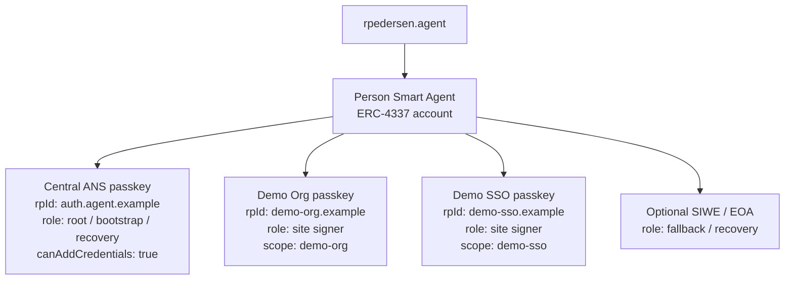
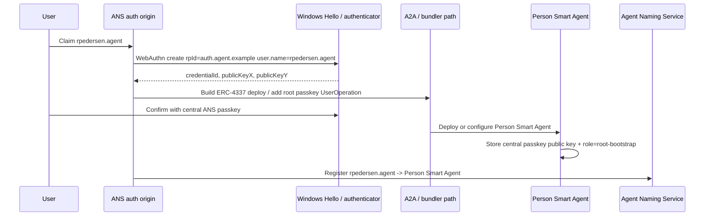
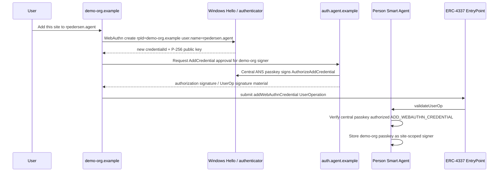
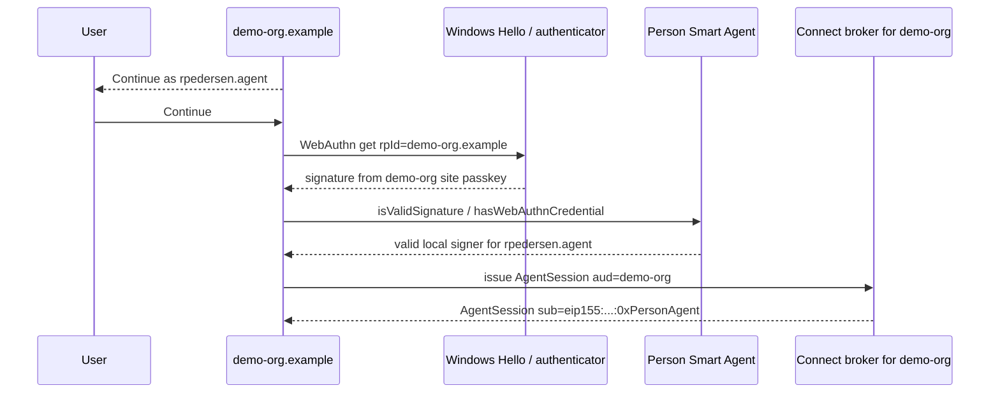
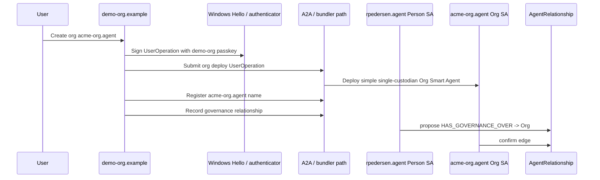
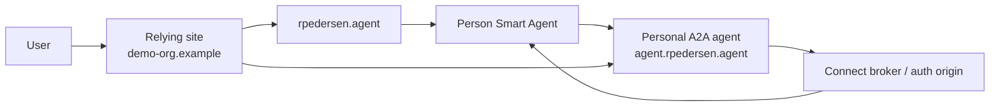

# Name-first per-site passkey SSO

This is the closest passkey-native SSO shape that still respects WebAuthn's
origin rules.

The key difference from normal SSO: the user does not carry one bearer account
or one reusable passkey across every relying site. The portable identity is the
Agent Naming Service name, such as `rpedersen.agent`, and the authority anchor is
the person ERC-4337 Smart Agent. Passkeys are scoped credentials attached to that
agent.

The key difference from ordinary per-site passkeys: a new site's passkey is not a
new account. It is a new P-256/WebAuthn signer authorized by the existing person
Smart Agent.

```text
rpedersen.agent
  -> Person Smart Agent / ERC-4337 account
     -> central ANS passkey signer      rpId: auth.agent.example
     -> demo-org site passkey signer    rpId: demo-org.example
     -> demo-sso site passkey signer    rpId: demo-sso.example
     -> optional SIWE / EOA signer
```

The central ANS passkey does not directly become the passkey for every relying
site. It is the root/bootstrap credential that can authorize adding a new
site-local passkey to the same Smart Agent.

---

## Product model

Use this language in UX and docs:

> `rpedersen.agent` is the portable identity. The central ANS passkey is the
> bootstrap/root credential. Each relying site can add its own local passkey to
> the same Smart Agent after the central credential approves it.

Avoid telling users about credential IDs, RP IDs, P-256, or key hashes unless
they open advanced settings.

User-facing copy:

```text
Connect to Smart Agent

[ rpedersen____________ ]

✓ Found rpedersen.agent

This is your first time using rpedersen.agent on Demo Org.

[ Add this site to rpedersen.agent ]
[ Continue once with wallet ]
```

After approval:

```text
Passkey added

You can now use Windows Hello to continue as rpedersen.agent on Demo Org.
```

Return visit:

```text
Continue as rpedersen.agent
```

---

## Why this is different

| Common solution | Problem | This model |
| --- | --- | --- |
| Password/OIDC SSO | Central provider remains the account authority | Smart Agent is the account; Connect only helps authenticate facets |
| One passkey per website | Easy UX, but each site creates a separate identity | Each site passkey binds back to the same `rpedersen.agent` Smart Agent |
| One central WebAuthn passkey reused everywhere | Fights WebAuthn RP scoping | Central passkey authorizes site-local passkeys |
| Wallet-only connect | Cross-origin, but not passkey-native | Passkey-first, with SIWE only as fallback/bootstrap |

This is passkey-driven, but it uses ERC-4337 to make the passkey model portable:
site credentials become scoped signers on one account instead of becoming
separate accounts.

---

## Credential tree



Only public keys and metadata are registered with the Smart Agent. Private keys
stay inside Windows Hello, iCloud Keychain, Android, or a hardware key.

---

## Phase 1 — Initial creation at the ANS auth origin

The user creates or claims `rpedersen.agent` through the central ANS auth origin,
for example `auth.agent.example`.



The person Smart Agent stores the central credential as a custody credential:

```ts
type WebAuthnSigner = {
  agentName: 'rpedersen.agent';
  rpId: 'auth.agent.example';
  rpIdHash: Hex;              // sha256(rpId)
  credentialIdHash: Hex;
  publicKeyX: Hex;
  publicKeyY: Hex;
  role: 'root';
  scope?: string;
  canAddCredentials: true;
  canRecover: true;
  canRotate: true;
  addedByCredentialIdHash?: Hex;
  createdAt: bigint;
  revokedAt?: bigint;
};
```

---

## Phase 2 — First visit to a new relying site

The user visits `demo-org.example` and enters `rpedersen`.

```mermaid
sequenceDiagram
  participant U as User
  participant Site as demo-org.example
  participant Naming as Agent Naming Service
  participant Agent as Person Smart Agent

  U->>Site: Enter rpedersen
  Site->>Naming: resolve rpedersen.agent
  Naming-->>Site: 0xPersonAgent
  Site->>Agent: Read WebAuthn signers
  Agent-->>Site: central ANS passkey exists; demo-org passkey missing
  Site-->>U: Found rpedersen.agent. Add this site?
```

The site does not assume the new local credential is trusted. It first creates a
site-local WebAuthn credential, then asks the root credential to authorize adding
it.



The authorization payload should bind every important field:

```ts
type AuthorizeAddCredential = {
  agentName: 'rpedersen.agent';
  smartAccount: Address;
  action: 'ADD_WEBAUTHN_CREDENTIAL';
  newRpId: 'demo-org.example';
  newRpIdHash: Hex;             // sha256('demo-org.example')
  newCredentialIdHash: Hex;     // sha256 or keccak256 of credentialId, consistently chosen
  newPublicKeyX: Hex;
  newPublicKeyY: Hex;
  scope: 'demo-org';
  chainId: 8453 | 84532;
  nonce: bigint;
  expiresAt: string;
};
```

The account call is conceptually:

```solidity
personAgent.addWebAuthnCredential(
  rpIdHash,
  credentialIdHash,
  publicKeyX,
  publicKeyY,
  scope,
  label
);
```

Under ERC-4337, the EntryPoint calls `validateUserOp`; the Smart Agent verifies
that a credential with `canAddCredentials = true` authorized the operation before
execution.

---

## Phase 3 — Return visit to that relying site

Later visits do not need the central ANS passkey.



The user sees one stable name: `rpedersen.agent`. Underneath, each origin uses its
own passkey.

---

## Phase 4 — Org creation from the site-local passkey

Once `demo-org.example` has a local passkey bound to `rpedersen.agent`, that
passkey can sign the org creation flow.



This connects the name-first SSO model to the org app:

```text
rpedersen.agent signs with demo-org passkey
  -> create org Smart Agent
  -> org Smart Agent has simple single custodian
  -> rpedersen.agent HAS_GOVERNANCE_OVER acme-org.agent
```

---

## A2A endpoint architecture

The same model can be self-sovereign rather than provider-centric. The person
Smart Agent can have an A2A service agent and endpoint domain that helps manage
site connections.



In this shape:

- `rpedersen.agent` is still the canonical identity.
- The personal A2A endpoint can advertise how to connect, which credentials are
  acceptable, and where to request add-site authorization.
- The root ANS passkey remains the high-power credential.
- Site-local passkeys remain narrow, aud/scope-bound credentials.

This avoids turning a central IdP into the permanent authority. Connect helps
authenticate and issue sessions; the Smart Agent owns the credential graph.

---

## Implementation notes

### WebAuthn algorithm

For on-chain verification, require or strongly prefer ES256 / P-256:

```ts
pubKeyCredParams: [
  { type: 'public-key', alg: -7 } // ES256 / P-256
]
```

If the authenticator returns RSA or EdDSA, the current P-256 verifier cannot
validate it unless the account adds verifier support for those algorithms.

### EVM verification

Use a P-256 verifier/precompile where available. EIP-7951 introduces
`P256VERIFY` at address `0x100` for secp256r1/P-256 signatures and supersedes
the earlier RIP-7212 direction. Some rollups already expose RIP-7212-style
verification for WebAuthn/passkey signatures.

### Signer policy

Root credential:

```text
auth.agent.example
  canAddCredentials = true
  canRecover = true
  canRotate = true
```

Site credential:

```text
demo-org.example
  canSignInToDemoOrg = true
  canCreateOrg = true, if approved
  canAddCredentials = false by default
```

Do not make every site-local passkey a root key.

---

## Main warning

Correct:

```text
central passkey authorizes adding site passkeys
```

Incorrect:

```text
central passkey is directly used by all relying sites
```

The first model works with WebAuthn and ERC-4337. The second fights WebAuthn's
RP-scoping model.
