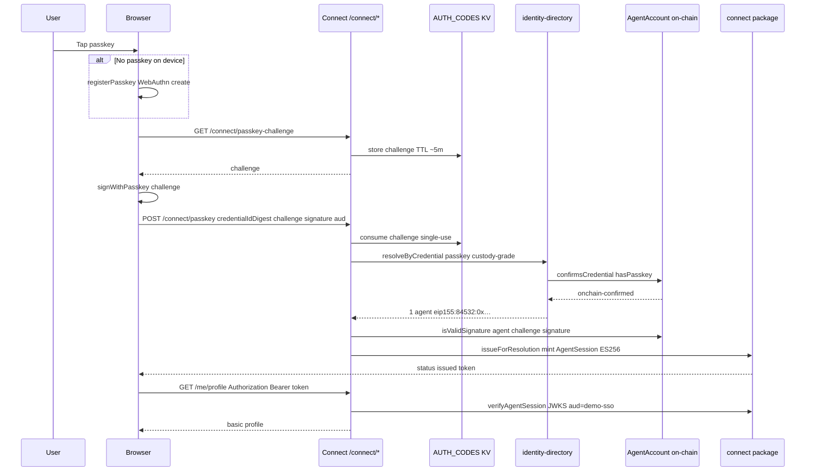
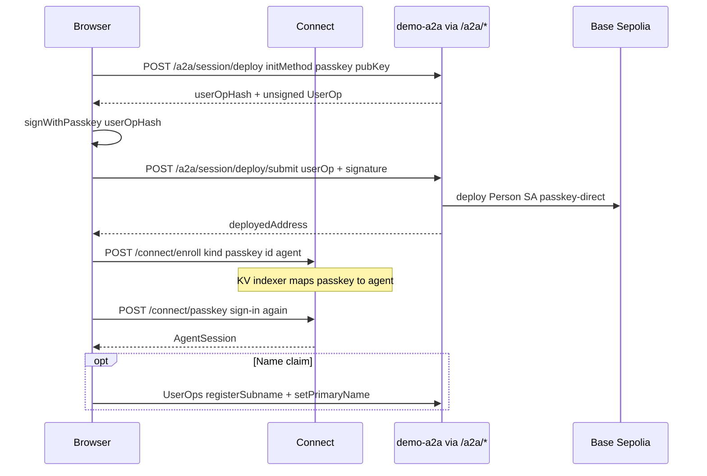
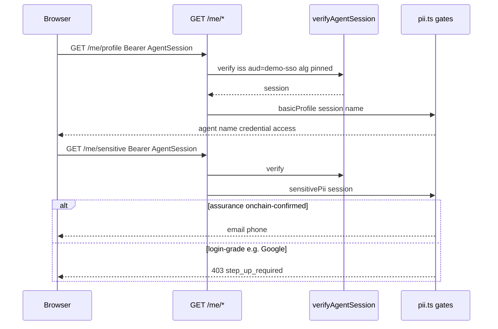
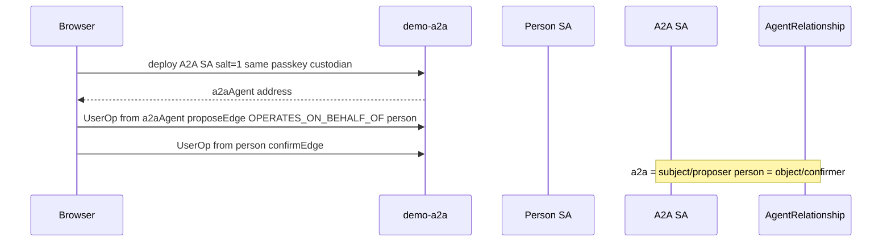
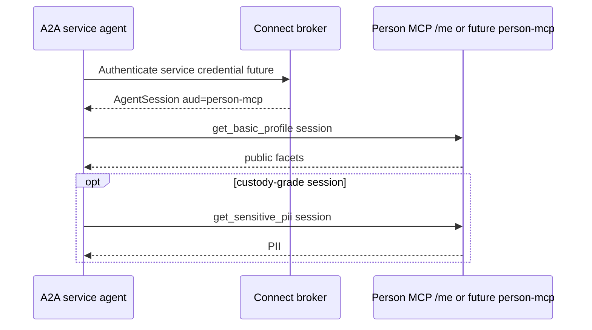

# Passkey SSO flow — Connect, A2A, and person MCP (PII)

End-to-end interaction for **passkey sign-in** on `demo-sso`: credential ceremony at the Connect origin, optional **person Smart Agent** bootstrap via **demo-a2a**, optional **A2A service agent** provisioning, and **PII** from the demo **person MCP** (`GET /me/*`).

**Specs:** [224](../../../specs/224-agentic-connect.md) (broker + `AgentSession`), [223](../../../specs/223-identity-directory.md) (resolve), [227](../../../specs/227-real-connect-experience.md) (real journey).

For the separate-origin SSO product shape, see
[Name-first per-site passkey SSO](./name-first-per-site-passkey-sso.md): the
central ANS passkey is a root/bootstrap credential on the person Smart Agent, and
each relying site adds its own local WebAuthn/P-256 signer to that same agent.

---

## Actors

| Actor | Role |
| --- | --- |
| **Browser** | WebAuthn passkey, holds `AgentSession` JWT, calls Connect + `/a2a` proxy + `/me` |
| **Connect origin** (`demo-sso` Pages) | Broker (JWKS), `/connect/*`, `/me/*` (person MCP), proxies `/a2a/*` |
| **identity-directory** | Indexer proposes agent; on-chain `hasPasskey` confirms |
| **demo-a2a** (upstream Worker) | ERC-4337 deploy + UserOp build/submit (Base Sepolia 84532) |
| **Person SA** | Canonical agent (`sub` = `eip155:84532:0x…`) |
| **A2A SA** | Second Smart Agent; `OPERATES_ON_BEHALF_OF` → person |
| **Person MCP** | In this demo: **`/me/profile` and `/me/sensitive`** on Connect (not a separate MCP worker yet) |

---

## System map

```mermaid
flowchart TB
  subgraph browser [Browser]
    PK[WebAuthn passkey]
    UI[demo-sso UI]
  end

  subgraph connect [Connect origin - demo-sso]
    CH["/connect/passkey-challenge + /connect/passkey"]
    BR[Broker: issue + verify AgentSession]
    DIR[identity-directory + KV indexer]
    ME["/me/profile · /me/sensitive"]
    JWKS[/jwks/]
  end

  subgraph a2a_proxy [/a2a proxy]
    A2A[demo-a2a Worker]
  end

  subgraph chain [Base Sepolia]
    PSA[Person Smart Agent]
    ASA[A2A Smart Agent]
    REL[AgentRelationship]
  end

  PK --> UI
  UI --> CH --> BR
  BR --> DIR
  DIR --> chain
  UI --> ME
  ME --> JWKS
  UI --> a2a_proxy --> A2A --> chain
  A2A --> PSA
  A2A --> ASA
  ASA --> REL --> PSA
```

---

## Phase 1 — Passkey sign-in (returning user)

User clicks **Connect with passkey**. This UI uses a fixed `aud` of `demo-sso` (not a separate relying-site redirect).



**Checks on `/connect/passkey`** ([`functions/connect/passkey.ts`](../functions/connect/passkey.ts)):

1. **Membership** — directory + on-chain: passkey is a **current** custodian.
2. **Proof-of-possession** — `isValidSignature` over the **single-use** challenge.
3. **Issuance** — `principal.role = custody-grade`, `assurance = onchain-confirmed`.

**`AgentSession` (no `owner` field):**

```json
{
  "sub": "eip155:84532:0x…",
  "assurance": "onchain-confirmed",
  "principal": { "kind": "passkey", "id": "<credentialIdDigest>", "role": "custody-grade" },
  "aud": "demo-sso",
  "iss": "<Connect origin>"
}
```

---

## Phase 2 — Bootstrap (first-time passkey, 0 agents)

Resolution returns `bootstrap` → UI shows **Create my workspace**.



**Code:** [`src/connect-client.ts`](../src/connect-client.ts) — `bootstrapWithPasskey`, `claimName`.

---

## Phase 3 — Person MCP: basic profile + sensitive PII

The demo **person MCP** is implemented as Connect Pages routes **`/me/*`**, not `apps/demo-mcp` (spec 227 allows either; this app verifies on-origin).



| Route | Gate | Data |
| --- | --- | --- |
| `GET /me/profile` | Any valid session | Canonical id, `.demo.agent` name, credential kind, access label |
| `GET /me/sensitive` | `assurance === 'onchain-confirmed'` only | Email, phone (demo store keyed by `sub`, never email) |

**UI:** blurred placeholder → **Confirm to view contact details** → `fetchSensitive` ([`src/App.tsx`](../src/App.tsx)).

**Passkey vs Google:** passkey session is custody-grade → sensitive PII allowed. Google OIDC is login-grade → `/me/sensitive` returns 403 until step-up with passkey or wallet (ADR-0017).

**Not the same as** `connect.requiresStepUp('credential-change')` — that gates **on-chain writes**. PII read uses `canReadSensitivePii` on `assurance` ([`src/lib/pii.ts`](../src/lib/pii.ts), spec 227 §7).

---

## Phase 4 — A2A service agent (optional)

After sign-in (wallet or passkey; not the Google-only UI path for provision), user may click **Provision an agent service**.



**Code:** `provisionA2aAgent` in [`src/connect-client.ts`](../src/connect-client.ts).

---

## Phase 5 — A2A agent → MCP PII (specified, not wired in UI yet)

Per [spec 227 §6–7](../../../specs/227-real-connect-experience.md), the A2A agent must **not** reuse the person’s browser session. It obtains its **own** `AgentSession` with `aud` = the MCP client id, then calls tools:



**Today:** the demo proves **person → MCP** via the user’s passkey session. **A2A → MCP** is the next integration (A2A obtains its own token; the person session is never forwarded).

---

## HTTP surface (passkey path)

| Method | Path | Purpose |
| --- | --- | --- |
| GET | `/connect/passkey-challenge` | Single-use challenge |
| POST | `/connect/passkey` | Verify PoP + issue `AgentSession` |
| POST | `/connect/enroll` | Map credential → agent after bootstrap |
| GET | `/jwks` | Verify tokens (`/me`, relying sites) |
| GET | `/me/profile` | Person MCP — basic |
| GET | `/me/sensitive` | Person MCP — PII (custody session) |
| POST | `/a2a/session/deploy` | Build deploy UserOp (proxied) |
| POST | `/a2a/session/deploy/submit` | Submit UserOp |
| POST | `/a2a/account/build-call-userop` | Naming, relationships, etc. |

---

## Key source files

| File | Responsibility |
| --- | --- |
| [`src/connect-client.ts`](../src/connect-client.ts) | `passkeyLogin`, bootstrap, A2A provision, `fetchProfile` / `fetchSensitive` |
| [`src/lib/passkey.ts`](../src/lib/passkey.ts) | WebAuthn register/assert |
| [`functions/connect/passkey.ts`](../functions/connect/passkey.ts) | Server resolve + PoP + issue |
| [`functions/me/[[path]].ts`](../functions/me/[[path]].ts) | Person MCP routes |
| [`src/lib/pii.ts`](../src/lib/pii.ts) | PII gates |
| [`functions/a2a/[[path]].ts`](../functions/a2a/[[path]].ts) | Proxy to demo-a2a |
| [`src/lib/real-directory.ts`](../src/lib/real-directory.ts) | Production directory + on-chain reads |

---

## Running locally

```bash
# UI only — vite dev does not serve /connect or /me (needs Pages Functions)
pnpm --filter @agenticprimitives-demo/sso dev   # :5373

# Full passkey + /me + /a2a
cp .dev.vars.example .dev.vars
node scripts/gen-broker-key.mjs
pnpm --filter @agenticprimitives-demo/sso build
wrangler pages dev dist --kv AUTH_CODES
```

Set `DEMO_A2A_URL`, `RPC_URL`, `BROKER_PRIVATE_JWK` per [`.dev.vars.example`](../.dev.vars.example). See [OIDC-SETUP.md](../OIDC-SETUP.md) for Google OIDC.
