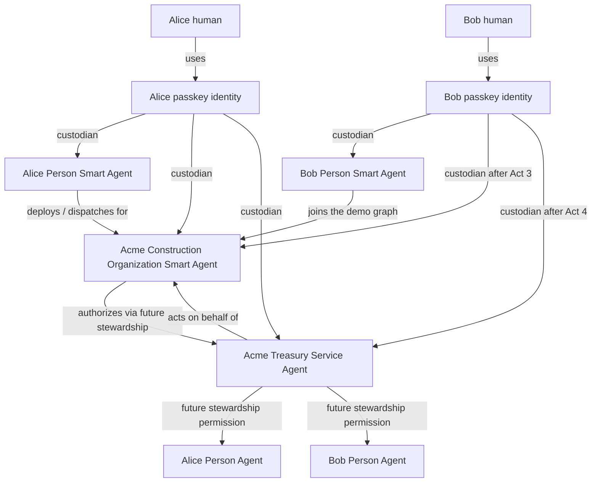
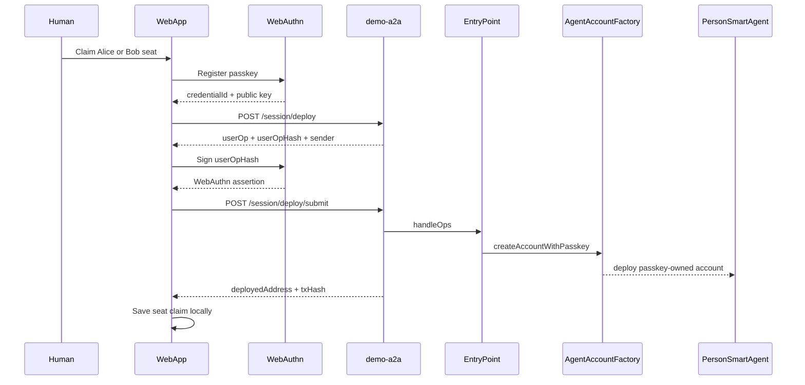
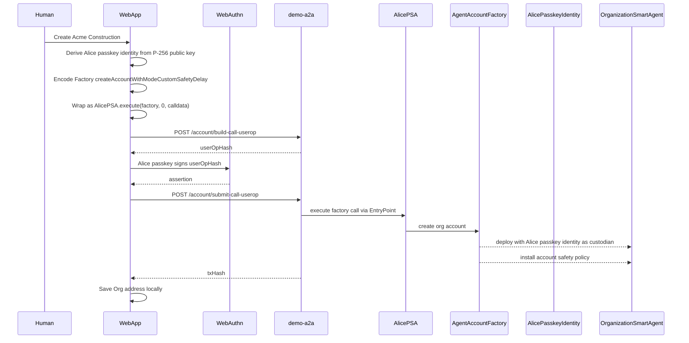
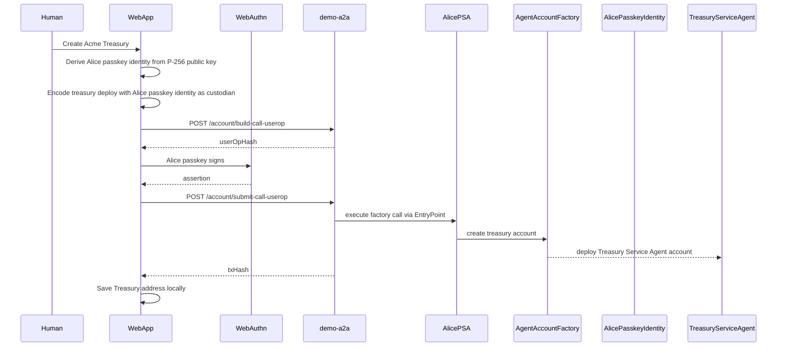
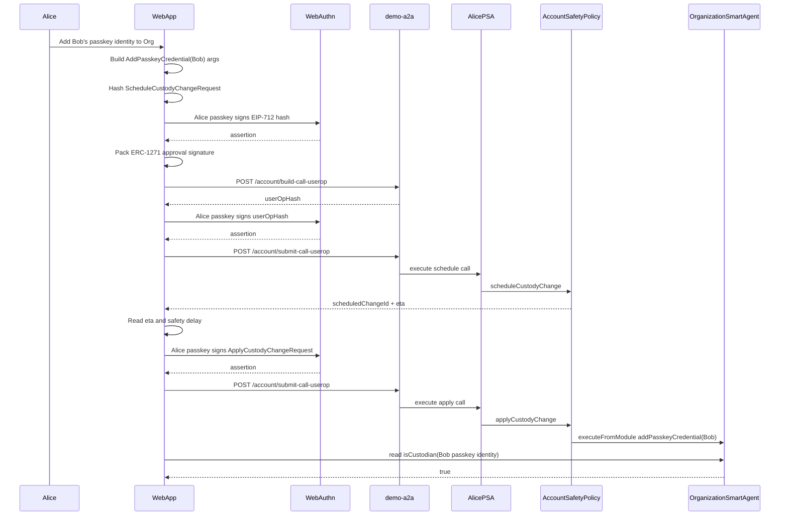
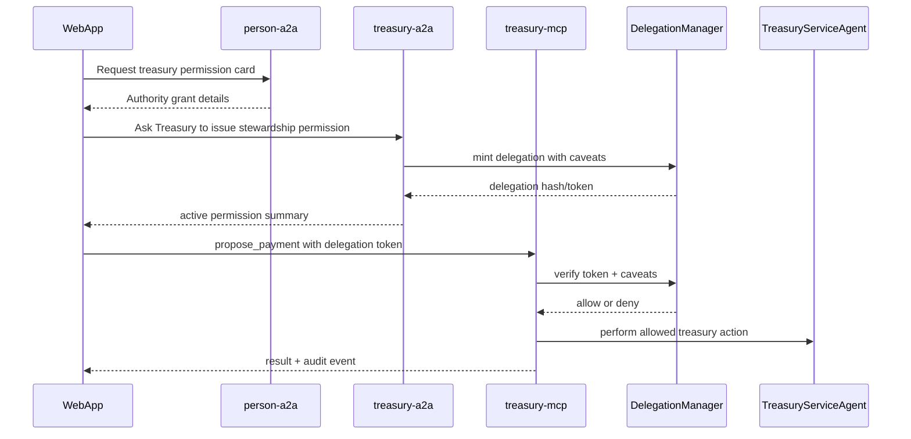

# Treasury Service Agent demo guide

## Status

This guide describes the current `demo-web-pro` app shape:

- **Live:** Act 1, Act 2, Act 2.5, Act 3.
- **Not started in UI:** Act 4, Act 5, Act 6.
- **Simulated in current UI:** Org-to-Treasury stewardship delegation enforcement.

The app is not a multi-sig gallery. It is one story:

> Alice and Bob each control a Person Smart Agent with a passkey. Together they form Acme Construction, create Acme Treasury as a Service Agent, and progressively move from bootstrap control to agent-to-agent stewardship.

## Vocabulary

Use product language in the UI:

| Product term | Implementation mapping |
| --- | --- |
| Person Smart Agent | Passkey-identity-custodied `AgentAccount` |
| Organization Smart Agent | Acme Construction `AgentAccount`, also passkey-identity-custodied |
| Treasury Service Agent | Acme Treasury `AgentAccount`, also passkey-identity-custodied |
| Passkey identity | Address-shaped custodian derived from a WebAuthn public key |
| Account safety policy | `CustodyPolicy` module |
| Scheduled admin change | `scheduleCustodyChange` / `applyCustodyChange` |
| Approvals required | Custody threshold / quorum |
| Stewardship permission | Delegation token + caveats |

Avoid old gallery language:

- wallet,
- user account,
- proposal,
- validator,
- quorum,
- session key as the main product concept.

## Current app structure

Primary entry point:

- `apps/demo-web-pro/src/App.tsx`
- `apps/demo-web-pro/src/treasury/TreasuryShell.tsx`

Treasury act ladder:

- `apps/demo-web-pro/src/treasury/acts.ts`
- `apps/demo-web-pro/src/treasury/acts/Act1AlicePerson.tsx`
- `apps/demo-web-pro/src/treasury/acts/Act2CreateOrg.tsx`
- `apps/demo-web-pro/src/treasury/acts/Act2_5CreateTreasury.tsx`
- `apps/demo-web-pro/src/treasury/acts/Act3BobJoins.tsx`

Shared browser state:

- `apps/demo-web-pro/src/lib/seats.ts`
- `apps/demo-web-pro/src/lib/demo-state.ts`
- `apps/demo-web-pro/src/lib/passkey.ts`

Web-to-a2a helpers:

- `apps/demo-web-pro/src/lib/deploy-person.ts`
- `apps/demo-web-pro/src/lib/execute-call.ts`
- `apps/demo-web-pro/src/lib/csrf.ts`

## Four-agent picture



## Universal custody invariant

Every Smart Agent account in this demo is custodied by passkey identities.

This includes:

- Alice Person Smart Agent,
- Bob Person Smart Agent,
- Acme Construction Organization Smart Agent,
- Acme Treasury Service Agent,
- future Service Agents.

No Smart Agent is the literal custodian of another Smart Agent. Smart Agents authorize one another through stewardship/provenance/delegation, not by being inserted into each other's custodian sets.

Important distinctions:

- The human uses a passkey.
- The passkey public key derives a passkey identity.
- The passkey identity is the custodian/admin-control handle.
- The Person Smart Agent is Alice or Bob's durable on-chain agent identity.
- Organization and Treasury authority should be modeled as Agent-to-Agent authority.
- The web app is an operator surface, not the authority root.

## Custodian ownership vs stewardship

There are two different authority relationships in this demo.

### Custodian ownership

Custodian ownership is account-control authority over a Smart Agent itself. It is used for admin changes like adding another custodian, changing approvals required, or rotating recovery policy.

In the current implementation, no Smart Agent is created with another Agentic Primitives Smart Agent address as its custodian. The demo uses passkey-direct custody: each custodian is a passkey-derived identity.

The same rule applies to Treasury and any future Smart Agent. A Smart Agent may authorize another Smart Agent through stewardship/provenance, but it is not written into that other Smart Agent's custodian set. Literal custody entries are passkey identities.

```text
Alice human
  └── uses

Alice passkey identity
  ├── custodian of Alice Person Smart Agent
  ├── custodian of Acme Construction Organization Smart Agent
  └── custodian of Acme Treasury Service Agent

Alice Person Smart Agent
  └── durable on-chain agent identity; dispatches userOps
```

In code, Act 2 builds the Org deployment with:

```ts
const alicePia = passkeyIdentity(passkey.pubKeyX, passkey.pubKeyY);

const initParams = {
  mode: 1,
  custodians: [alicePia],
  ...
}
```

`alicePia` is a passkey-derived identity. Alice's Person Smart Agent still participates as the durable agent identity and dispatch account, but it is not the custodian written into the Org or Treasury custodian set.

In Act 3, Alice uses her passkey custodian authority to add Bob's passkey credential to the Org:

```text
Acme Construction Organization Smart Agent
  custodians:
    - Alice passkey identity
    - Bob passkey identity
```

This is the current "ownership" relationship in the live demo: passkey identities are custodians of Smart Agents. Person, Organization, and Service Agents are still first-class agents in the story, but they are not literal custodian entries for one another.

### Stewardship

Stewardship is different. It is delegated operational authority between Agents. It does not mean the delegate owns the account.

Examples planned for Acts 5-6:

```text
Treasury Service Agent
  grants bounded treasury permission to
Alice Person Agent / Bob Person Agent
```

That permission might allow a Person Agent to draft a payment, read balances, or request execution within limits. It should not allow the Person Agent to add custodians, bypass approvals, or change the account safety policy.

Short version:

| Relationship | Meaning | Current status |
| --- | --- | --- |
| Alice passkey identity -> Alice Person Smart Agent | Alice's passkey-derived identity is custodian/admin controller of Alice's Person Smart Agent | Live |
| Bob passkey identity -> Bob Person Smart Agent | Bob's passkey-derived identity is custodian/admin controller of Bob's Person Smart Agent | Live |
| Alice passkey identity -> Org Smart Agent | Alice's passkey-derived identity is initial custodian/admin controller of the Org | Live |
| Bob passkey identity -> Org Smart Agent | Bob's passkey-derived identity is added as second Org custodian | Live in Act 3 |
| Alice passkey identity -> Treasury Service Agent | Alice's passkey-derived identity is initial custodian/admin controller of Treasury | Live |
| Bob passkey identity -> Treasury Service Agent | Bob's passkey-derived identity is added to Treasury custody in Act 4 | Live |
| Alice/Bob Person Smart Agents -> Org/Treasury Smart Agents | Person Smart Agents deploy, dispatch, and participate in the agent graph, but are not literal custodians of other Smart Agents | Live |
| Org Smart Agent -> Treasury Service Agent | Org authorizes Treasury by intended stewardship/provenance relation, not by being Treasury's literal custodian | Account deploy live; stewardship enforcement simulated |
| Treasury Service Agent -> Person Agents | Bounded treasury operating permission | Planned Acts 5-6 |

## Act ladder

| Act | Status | What happens |
| --- | --- | --- |
| Act 1 — Alice joins | Live | Register Alice passkey and deploy Alice Person Smart Agent through demo-a2a/paymaster. |
| Act 2 — Create Org | Live | Alice Person Smart Agent dispatches `createAccountWithModeCustomSafetyDelay`; Alice's passkey identity is the Org's initial custodian. |
| Act 2.5 — Create Treasury | Live account deploy; simulated stewardship | Alice Person Smart Agent dispatches Treasury deploy; Alice's passkey identity is the Treasury's initial custodian. |
| Act 3 — Bob joins | Live | Bob claims a passkey-controlled Person Smart Agent; Alice schedules and applies `AddPasskeyCredential(Bob)` on the Org. |
| Act 4 — Two-person control | Live | Add Bob's passkey to Treasury and set Org approvals required to 2. |
| Act 5 — Delegate Treasury | Not started | Treasury issues stewardship permissions to Alice and Bob Person Agents. |
| Act 6 — Org dashboard | Not started | Read-only snapshot of agents, authority, active permissions, pending changes, and audit trail. |

## Web app responsibilities

The web app does:

- render the act ladder,
- register passkeys through WebAuthn,
- store demo-local seat state,
- build contract calldata,
- ask the passkey to sign userOp hashes or EIP-712 hashes,
- call demo-a2a endpoints,
- read chain state for confirmation,
- explain what is live vs simulated.

The web app does not:

- hold private keys,
- sponsor gas itself,
- bypass account safety policy,
- enforce MCP tool access,
- execute scheduled admin changes automatically.

## demo-a2a responsibilities

`demo-a2a` is the gasless execution and session packaging service.

Current live paths used by `demo-web-pro`:

- `POST /session/deploy`
- `POST /session/deploy/submit`
- `POST /account/build-call-userop`
- `POST /account/submit-call-userop`
- `GET /auth/csrf`

The web app sends either deploy parameters or already-composed `AgentAccount.execute(...)` calldata. `demo-a2a` builds the UserOperation, attaches paymaster data, and submits it after the browser signs the userOp hash.

## MCP responsibilities

MCP is not yet active in the live acts. In this demo direction, MCP becomes important when Acts 5–6 land.

Planned MCP surfaces:

- **person-mcp:** person profile, delegated relationships, person-agent actions.
- **org-mcp:** org metadata, members, service agents, governance/admin state.
- **treasury-mcp:** balances, pending treasury actions, proposed payments, approvals, execution, audit trail.

MCP should verify delegation/stewardship authority before serving tools. It should not trust the web app directly.

## Interaction: Act 1 Person Smart Agent deploy



## Interaction: Act 2 Organization deploy



## Interaction: Act 2.5 Treasury deploy



Current limitation: the Org-to-Treasury stewardship relationship is displayed as the intended authority model, but full delegation enforcement is not yet active in the UI. The Org is not the Treasury's literal custodian in the current deployed account shape.

## Interaction: Act 3 Bob joins Org



## Planned interaction: stewardship through MCP

This is the target for Acts 5–6.



Rules for this future path:

- MCP verifies the delegation token and caveats.
- A2A packages/session material but does not replace MCP authorization.
- Treasury Service Agent remains the authority-bearing service, not the web browser.
- Audit events should say which Agent acted on behalf of which Agent.

## Local configuration

`apps/demo-web-pro/src/config.ts` reads:

```bash
VITE_CHAIN_ID=84532
VITE_FACTORY_ADDRESS=0x...
VITE_CUSTODY_POLICY=0x...
VITE_DELEGATION_MANAGER=0x...
VITE_QUORUM_ENFORCER=0x...
VITE_APPROVED_HASH_REGISTRY=0x...
VITE_DEMO_A2A_URL=http://127.0.0.1:8787
VITE_DEMO_MCP_URL=http://127.0.0.1:8788
```

Current live acts require `VITE_DEMO_A2A_URL`, factory, custody policy, and Base Sepolia deployment addresses.

`VITE_DEMO_MCP_URL` is reserved for Acts 5–6 and is not currently used by the live UI.

## Run locally

```bash
pnpm --filter @agenticprimitives-demo/web-pro dev
```

Open:

```text
http://localhost:5273
```

For the full local stack:

```bash
pnpm dev
```

## What changed from the old docs

Removed model:

- independent multi-sig gallery,
- per-use-case `multi-sig/flows/*` walkthroughs,
- hybrid recovery as the main demo,
- future capability cards.

Current model:

- one Treasury Service Agent story,
- passkey-controlled Person Smart Agents,
- Acme Construction Organization Smart Agent,
- Acme Treasury Service Agent,
- web app + demo-a2a live gasless account/userOp path,
- MCP reserved for future stewardship enforcement.

