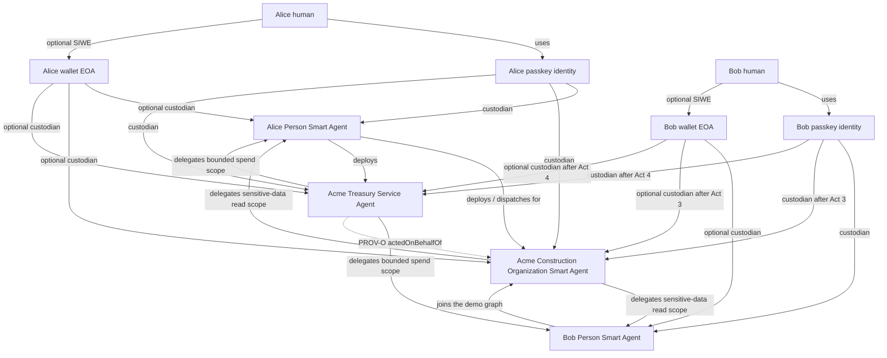
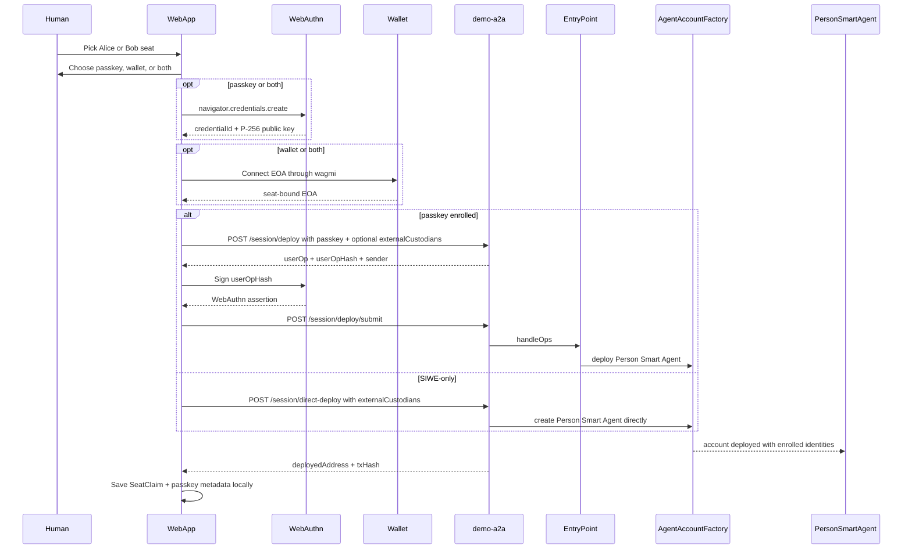
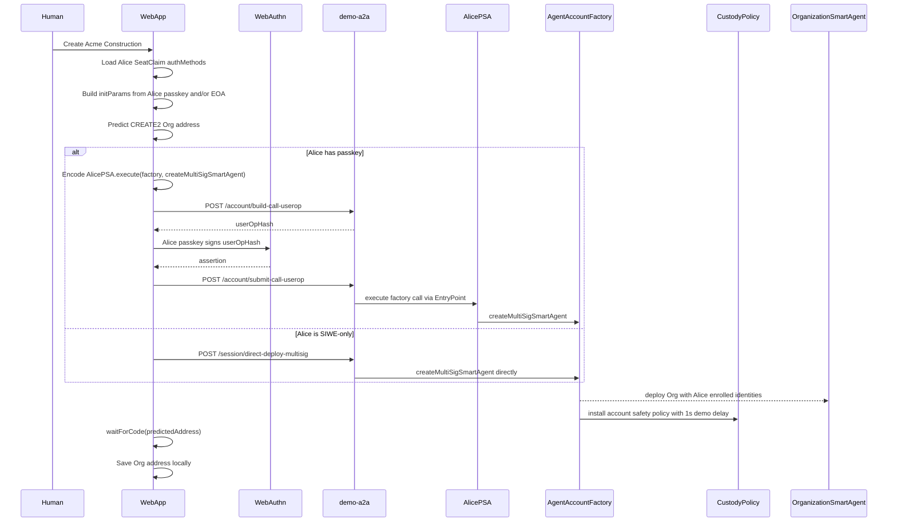
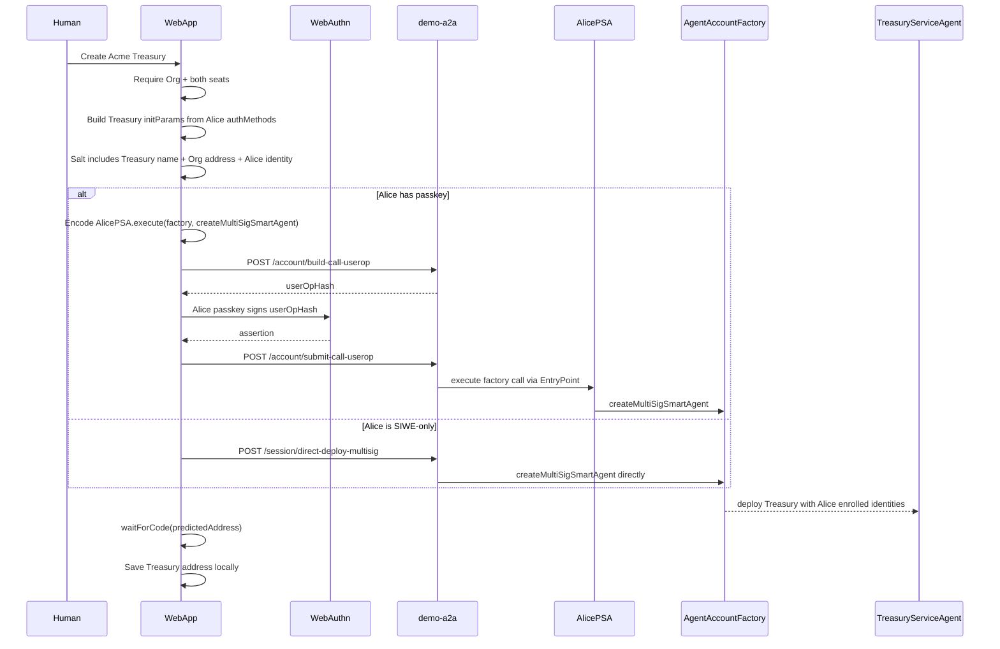
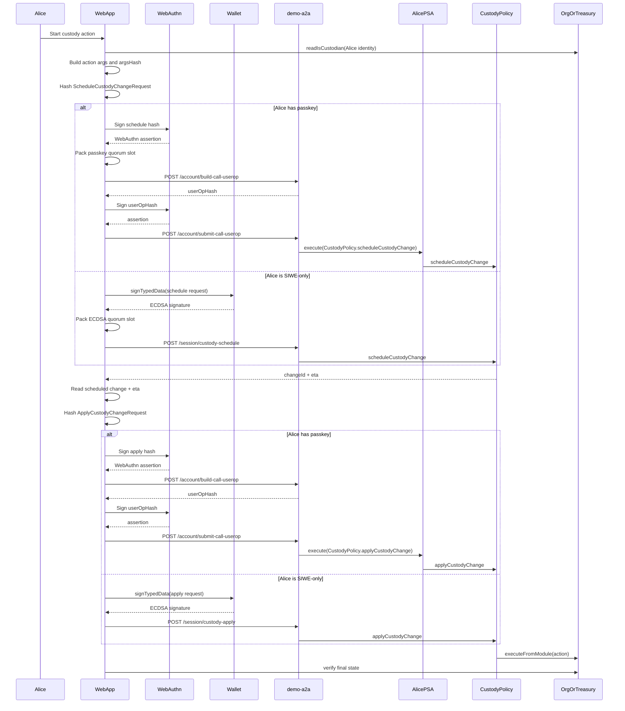
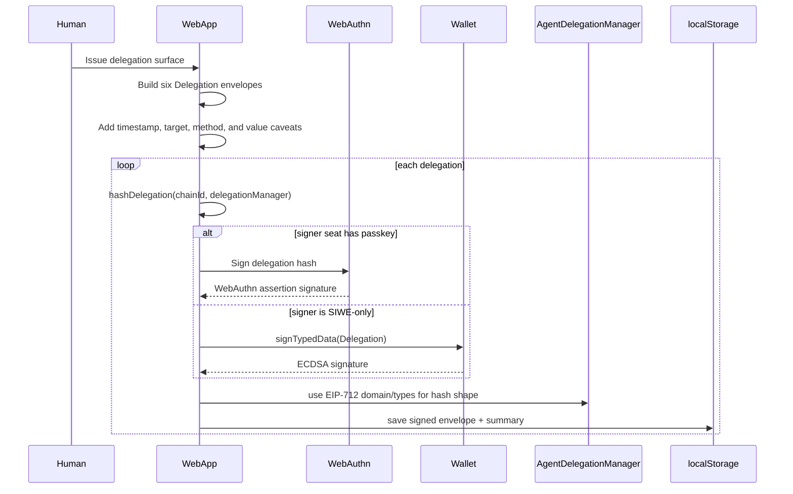
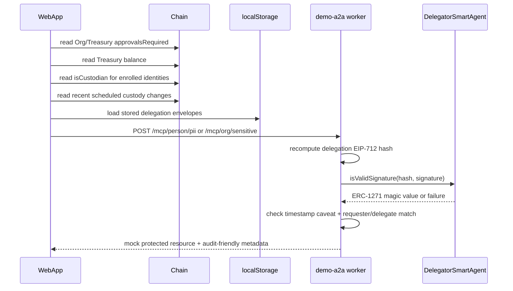

# Treasury Service Agent demo guide

## Status

This guide describes the current `demo-web-pro` app shape:

- **Live:** Act 1, Act 2, Act 2.5, Act 3, Act 4, Act 6.
- **Live object construction + signing:** Act 5 delegation envelopes.
- **Worker-backed MCP-style reads:** Act 6 posts stored delegation envelopes to `demo-a2a` `/mcp/person/pii` and `/mcp/org/sensitive`.
- **Still deferred:** Treasury spend redemption, on-chain caveat-enforcer execution, quorum-caveat redemption, and a standalone `demo-mcp` service.

The app is not a multi-sig gallery. It is one story:

> Alice and Bob each control a Person Smart Agent with a passkey, a wallet EOA, or both. Together they form Acme Construction, create Acme Treasury as a Service Agent, and progressively move from bootstrap control to agent-to-agent stewardship.

## Vocabulary

Use product language in the UI:

| Product term | Implementation mapping |
| --- | --- |
| Person Smart Agent | `AgentAccount` custodied by the seat's enrolled identities |
| Organization Smart Agent | Acme Construction `AgentAccount`, custodied by Alice/Bob enrolled identities |
| Treasury Service Agent | Acme Treasury `AgentAccount`, custodied by Alice/Bob enrolled identities |
| Passkey identity | Address-shaped custodian derived from a WebAuthn public key |
| SIWE identity | Wallet EOA custodian enrolled through the optional wallet login path |
| Account safety policy | `CustodyPolicy` module |
| Scheduled admin change | `scheduleCustodyChange` / `applyCustodyChange` |
| Approvals required | Custody threshold / quorum |
| Stewardship permission | Delegation token + caveats |

Avoid old gallery language:

- wallet as the primary product noun,
- user account,
- proposal,
- validator,
- quorum,
- session key as the main product concept.

## Current app structure

Primary entry point:

- `apps/demo-web-pro/src/App.tsx`
- `apps/demo-web-pro/src/treasury/TreasuryShell.tsx`

Treasury act ladder:

- `apps/demo-web-pro/src/treasury/acts.ts`
- `apps/demo-web-pro/src/treasury/acts/Act1AlicePerson.tsx`
- `apps/demo-web-pro/src/treasury/acts/Act2CreateOrg.tsx`
- `apps/demo-web-pro/src/treasury/acts/Act2_5CreateTreasury.tsx`
- `apps/demo-web-pro/src/treasury/acts/Act3BobJoins.tsx`
- `apps/demo-web-pro/src/treasury/acts/Act4TwoPersonControl.tsx`
- `apps/demo-web-pro/src/treasury/acts/Act5DelegateTreasury.tsx`
- `apps/demo-web-pro/src/treasury/acts/Act6OrgDashboard.tsx`

Shared browser state:

- `apps/demo-web-pro/src/lib/seats.ts`
- `apps/demo-web-pro/src/lib/demo-state.ts`
- `apps/demo-web-pro/src/lib/passkey.ts`
- `apps/demo-web-pro/src/lib/delegations.ts`

Web-to-a2a helpers:

- `apps/demo-web-pro/src/lib/deploy-person.ts`
- `apps/demo-web-pro/src/lib/execute-call.ts`
- `apps/demo-web-pro/src/lib/csrf.ts`
- `apps/demo-web-pro/src/lib/custody-ceremony.ts`

## Four-agent picture



## Universal custody invariant

Every Smart Agent account in this demo is custodied by human-controlled enrolled identities.

This includes:

- Alice Person Smart Agent,
- Bob Person Smart Agent,
- Acme Construction Organization Smart Agent,
- Acme Treasury Service Agent,
- future Service Agents.

The primary identity type is the passkey identity. The current implementation also supports optional SIWE/wallet enrollment, where the wallet EOA is added as another custodian. If a seat enrolls both, both identities are written on chain.

No Smart Agent is the literal custodian of another Smart Agent. Smart Agents authorize one another through stewardship/provenance/delegation, not by being inserted into each other's custodian sets.

Important distinctions:

- The human uses a passkey.
- The passkey public key derives a passkey identity.
- The passkey identity is the custodian/admin-control handle.
- Optional SIWE enrollment adds the wallet EOA as a second custodian handle.
- The Person Smart Agent is Alice or Bob's durable on-chain agent identity.
- Organization and Treasury authority should be modeled as Agent-to-Agent authority.
- The web app is an operator surface, not the authority root.

## Custodian ownership vs stewardship

There are two different authority relationships in this demo.

### Custodian ownership

Custodian ownership is account-control authority over a Smart Agent itself. It is used for admin changes like adding another custodian, changing approvals required, or rotating recovery policy.

In the current implementation, no Smart Agent is created with another Agentic Primitives Smart Agent address as its custodian. The demo uses direct human-signer custody: each custodian is either a passkey-derived identity or an optional SIWE wallet EOA.

The same rule applies to Treasury and any future Smart Agent. A Smart Agent may authorize another Smart Agent through stewardship/provenance, but it is not written into that other Smart Agent's custodian set. Literal custody entries are enrolled human identities.

```text
Alice human
  └── uses

Alice passkey identity
  ├── custodian of Alice Person Smart Agent
  ├── custodian of Acme Construction Organization Smart Agent
  └── custodian of Acme Treasury Service Agent

Alice wallet EOA (optional SIWE)
  ├── optional custodian of Alice Person Smart Agent
  ├── optional custodian of Acme Construction Organization Smart Agent
  └── optional custodian of Acme Treasury Service Agent

Alice Person Smart Agent
  └── durable on-chain agent identity; dispatches userOps
```

In code, Act 2 builds the Org deployment with:

```ts
const initParams = {
  mode: 1,
  custodians: aliceSiwe ? [aliceSiwe.eoa] : [],
  initialPasskeyCredentialIdDigest: alicePasskey?.credentialIdDigest ?? ZERO_BYTES32,
  initialPasskeyX: alicePasskey?.pubKeyX ?? 0n,
  initialPasskeyY: alicePasskey?.pubKeyY ?? 0n,
}
```

If Alice enrolls a passkey, the passkey credential becomes the on-chain passkey custodian. If Alice enrolls SIWE, her wallet EOA is added through `externalCustodians`. Alice's Person Smart Agent still participates as the durable agent identity and dispatch account, but it is not the custodian written into the Org or Treasury custodian set.

In Act 3, Alice uses her enrolled custodian authority to add Bob's enrolled identities to the Org:

```text
Acme Construction Organization Smart Agent
  custodians:
    - Alice passkey identity
    - Alice wallet EOA, if enrolled
    - Bob passkey identity
    - Bob wallet EOA, if enrolled
```

This is the current "ownership" relationship in the live demo: enrolled human identities are custodians of Smart Agents. Person, Organization, and Service Agents are still first-class agents in the story, but they are not literal custodian entries for one another.

### Stewardship

Stewardship is different. It is delegated operational authority between Agents. It does not mean the delegate owns the account.

Examples now represented by Act 5 delegation envelopes:

```text
Treasury Service Agent
  grants bounded treasury permission to
Alice Person Agent / Bob Person Agent
```

That permission might allow a Person Agent to draft a payment, read balances, or request execution within limits. It should not allow the Person Agent to add custodians, bypass approvals, or change the account safety policy.

Short version:

| Relationship | Meaning | Current status |
| --- | --- | --- |
| Alice passkey identity -> Alice Person Smart Agent | Alice's passkey-derived identity is custodian/admin controller of Alice's Person Smart Agent | Live |
| Bob passkey identity -> Bob Person Smart Agent | Bob's passkey-derived identity is custodian/admin controller of Bob's Person Smart Agent | Live |
| Alice/Bob wallet EOA -> Person Smart Agent | Optional SIWE enrollment adds the connected EOA as another custodian | Live |
| Alice enrolled identities -> Org Smart Agent | Alice's passkey and/or wallet EOA are initial custodian/admin controllers of the Org | Live |
| Bob enrolled identities -> Org Smart Agent | Bob's passkey and/or wallet EOA are added as Org custodians | Live in Act 3 |
| Alice enrolled identities -> Treasury Service Agent | Alice's passkey and/or wallet EOA are initial custodian/admin controllers of Treasury | Live |
| Bob enrolled identities -> Treasury Service Agent | Bob's passkey and/or wallet EOA are added to Treasury custody | Live in Act 4 |
| Alice/Bob Person Smart Agents -> Org/Treasury Smart Agents | Person Smart Agents deploy, dispatch, and participate in the agent graph, but are not literal custodians of other Smart Agents | Live |
| Org Smart Agent -> Person Smart Agents | Signed sensitive-data read delegations | Live object signing in Act 5; worker-backed read exercise in Act 6 |
| Treasury Service Agent -> Person Smart Agents | Signed bounded treasury spend delegations | Live object signing in Act 5; spend redemption deferred |
| Treasury Service Agent -> Org Smart Agent | PROV-O `actedOnBehalfOf` relationship | Displayed live in Act 6 |

## Act ladder

| Act | Status | What happens |
| --- | --- | --- |
| Act 1 — Alice joins | Live | Claim Alice or Bob. Enroll passkey, SIWE wallet, or both. Deploy Person Smart Agent through `demo-a2a`; passkey path uses ERC-4337 userOps, SIWE-only path uses direct worker deploy. |
| Act 2 — Create Org | Live | Alice's Person Smart Agent dispatches Org deploy when she has a passkey. SIWE-only Alice uses `demo-a2a` direct deploy. Alice's enrolled identities become the Org's initial custodians. |
| Act 2.5 — Create Treasury | Live account deploy; simulated Org-to-Treasury stewardship | Same deploy pattern as Act 2. Alice's enrolled identities become the Treasury's initial custodians. |
| Act 3 — Bob joins | Live | Bob claims a Person Smart Agent. Alice schedules and applies one custody action per Bob identity on the Org: `AddPasskeyCredential` and/or `AddCustodian`. |
| Act 4 — Two-person control | Live | Add Bob's enrolled identities to Treasury, then set Org T4 approvals required to 2. |
| Act 5 — Delegate Treasury | Live object construction + signing | Sign and locally store six Variant A delegations for Person PII, Org sensitive data, and Treasury spend scope. |
| Act 6 — Org dashboard | Live | Read chain state, show delegations, pending custody changes, and exercise worker-backed MCP-style PII/org-data reads. |

## Web app responsibilities

The web app does:

- render the act ladder,
- register passkeys through WebAuthn,
- connect a wallet for optional SIWE-style EOA custody,
- store demo-local seat state,
- store locally signed delegation envelopes,
- build contract calldata,
- ask the passkey or wallet to sign userOp hashes, EIP-712 custody hashes, or EIP-712 delegation hashes,
- call demo-a2a endpoints,
- read chain state for confirmation,
- explain what is live vs simulated.

The web app does not:

- hold private keys,
- sponsor gas itself,
- bypass account safety policy,
- enforce MCP/tool access without server verification,
- execute scheduled admin changes automatically.

## demo-a2a responsibilities

`demo-a2a` is the gasless execution and session packaging service.

Current live paths used by `demo-web-pro`:

- `POST /session/deploy`
- `POST /session/deploy/submit`
- `POST /session/direct-deploy`
- `POST /session/direct-deploy-multisig`
- `POST /account/build-call-userop`
- `POST /account/submit-call-userop`
- `POST /session/custody-schedule`
- `POST /session/custody-apply`
- `POST /mcp/person/pii`
- `POST /mcp/org/sensitive`
- `GET /auth/csrf`

The web app sends deploy parameters, already-composed `AgentAccount.execute(...)` calldata, custody-policy schedule/apply requests, or delegation envelopes. For passkey-backed account execution, `demo-a2a` builds the UserOperation, attaches paymaster data, and submits it after the browser signs the userOp hash. For SIWE-only bootstrap and custody calls, `demo-a2a` submits direct worker transactions after verifying the relevant signed payload.

## MCP responsibilities

There is not yet a standalone `demo-mcp` service in the live app. The current implementation exercises MCP-style reads through `demo-a2a` worker endpoints:

- `POST /mcp/person/pii`
- `POST /mcp/org/sensitive`

Those endpoints accept the stored delegation envelope, recompute the EIP-712 delegation hash, verify the delegator via ERC-1271, check the timestamp caveat, and return mock data tied to the delegator/requester pair.

In the next service split, those endpoints should move behind a real MCP server.

Planned MCP surfaces:

- **person-mcp:** person profile, delegated relationships, person-agent actions.
- **org-mcp:** org metadata, members, service agents, governance/admin state.
- **treasury-mcp:** balances, pending treasury actions, proposed payments, approvals, execution, audit trail.

MCP should verify delegation/stewardship authority before serving tools. It should not trust the web app directly.

## Interaction: Act 1 Person Smart Agent deploy



## Interaction: Act 2 Organization deploy



## Interaction: Act 2.5 Treasury deploy



Current limitation: the Org-to-Treasury stewardship relationship is displayed through PROV-O and Act 5 delegation cards, but the Org is not the Treasury's literal custodian. Treasury spend redemption is not executed in the live UI yet.

## Interaction: Acts 3-4 custody schedule/apply loop

Acts 3 and 4 share `scheduleAndApply`.



Act 3 actions:

- Org `AddPasskeyCredential(Bob)` if Bob enrolled a passkey.
- Org `AddCustodian(Bob.EOA)` if Bob enrolled SIWE.

Act 4 actions:

- Treasury `AddPasskeyCredential(Bob)` and/or `AddCustodian(Bob.EOA)`.
- Org `ChangeApprovalsRequired(T4, 2)`.

## Interaction: Act 5 delegation issuance



Act 5 does not submit a transaction. It produces signed permission envelopes that later verification endpoints can check with ERC-1271 on the delegator Smart Agent.

## Interaction: Act 6 dashboard and MCP-style reads



Rules for this current path:

- Act 6 uses `demo-a2a` as the worker for MCP-style reads.
- The web app presents the delegation envelope but does not self-authorize the read.
- The worker verifies the signature against the delegator Smart Agent.
- On-chain caveat-enforcer invocation and Treasury spend execution are still deferred.

## Local configuration

`apps/demo-web-pro/src/config.ts` reads:

```bash
VITE_CHAIN_ID=84532
VITE_FACTORY_ADDRESS=0x...
VITE_CUSTODY_POLICY=0x...
VITE_DELEGATION_MANAGER=0x...
VITE_QUORUM_ENFORCER=0x...
VITE_APPROVED_HASH_REGISTRY=0x...
VITE_TIMESTAMP_ENFORCER=0x...
VITE_VALUE_ENFORCER=0x...
VITE_ALLOWED_TARGETS_ENFORCER=0x...
VITE_ALLOWED_METHODS_ENFORCER=0x...
VITE_DEMO_A2A_URL=http://127.0.0.1:8787
VITE_DEMO_MCP_URL=http://127.0.0.1:8788
```

Current live account and custody acts require `VITE_DEMO_A2A_URL`, factory, custody policy, chain id, and Base Sepolia deployment addresses.

Act 5 requires `VITE_DELEGATION_MANAGER` and uses the caveat-enforcer addresses when present. Missing caveat enforcer env vars currently fall back to zero-address placeholders in the signed local delegation objects.

`VITE_DEMO_MCP_URL` is reserved for a future standalone MCP service. The current Act 6 MCP-style calls use `VITE_DEMO_A2A_URL`.

## Run locally

```bash
pnpm --filter @agenticprimitives-demo/web-pro dev
```

Open:

```text
http://localhost:5273
```

For the full local stack:

```bash
pnpm dev
```

## What changed from the old docs

Removed model:

- independent multi-sig gallery,
- per-use-case `multi-sig/flows/*` walkthroughs,
- hybrid recovery as the main demo,
- future capability cards.

Current model:

- one Treasury Service Agent story,
- passkey and optional SIWE-controlled Person Smart Agents,
- Acme Construction Organization Smart Agent,
- Acme Treasury Service Agent,
- web app + demo-a2a live account/userOp/direct-relay paths,
- signed delegation envelopes and worker-backed MCP-style reads,
- standalone MCP and Treasury spend redemption reserved for later work.

