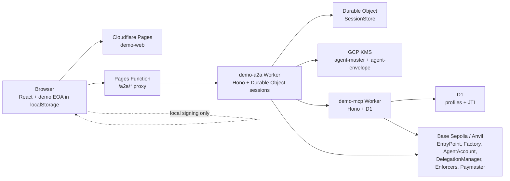
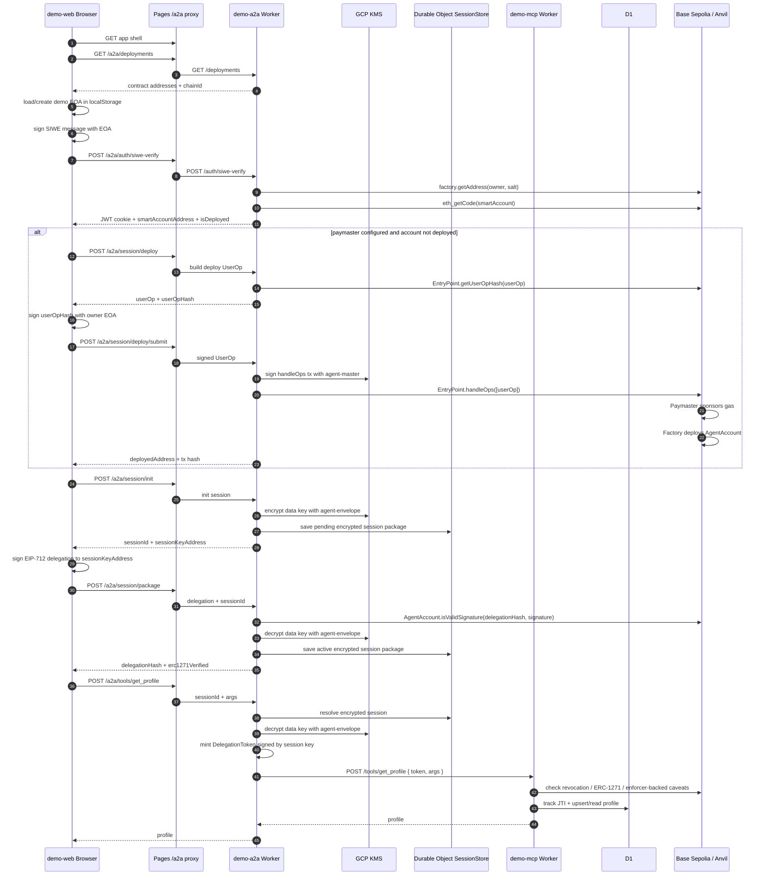

# Demo Web Architecture

`apps/demo-web` is the browser-facing demo for the full agentic primitives stack. It is intentionally thin: the web app holds demo-only user key material, renders the three-step flow, and calls `demo-a2a` through the Pages `/a2a/*` proxy. Authority checks, session custody, token minting, MCP verification, D1 storage, and on-chain reads/writes happen outside the web app.

## Runtime Topology

Local development uses Vite on `5173`, `demo-a2a` on `8787`, `demo-mcp` on `8788`, and Anvil on `8545`. Production uses Cloudflare Pages, Workers, Durable Objects, D1, GCP KMS, and Base Sepolia.

## Responsibilities

| Component | Owns | Does not own |
| --- | --- | --- |
| `demo-web` | UI state, demo EOA, SIWE/delegation/UserOp signing prompts, `/a2a/*` calls | Server auth, session storage, KMS, MCP verification |
| `demo-a2a` | SIWE verification, JWT cookie minting, smart-account address lookup, session lifecycle, delegation packaging, token minting, tool proxy, optional UserOp submission | MCP business data, D1 profile storage |
| `demo-mcp` | Delegation-verified tool execution, JTI tracking, profile read/write in D1 | Browser auth, session custody, token minting |
| Contracts | ERC-4337 account deployment, ERC-1271 signature validation, delegation revocation/enforcer checks, paymaster sponsorship | HTTP/session state |

## End-to-End Interaction

## Step 1: SIWE Login

The browser creates or loads a demo EOA from `localStorage`. This is only for demo repeatability. The EOA signs a SIWE message, then `demo-web` posts it to `/a2a/auth/siwe-verify`.

`demo-a2a` verifies the SIWE signature with `identity-auth/siwe`, derives the deterministic smart-account address through `agent-account`, checks whether code exists at that address, and mints a JWT cookie. The browser receives `smartAccountAddress` and `isDeployed`.

On-chain interactions:

- `AgentAccountFactory.getAddress(owner, salt)` for counterfactual address derivation.
- `eth_getCode(smartAccountAddress)` or equivalent deployment check.

## Step 1.5: Smart Account Deploy

If the account is not deployed and `PAYMASTER` is configured, the web app shows "Deploy smart account."

Flow:

1. `demo-web` calls `/a2a/session/deploy`.
2. `demo-a2a` builds a deploy-only `PackedUserOperation` with `paymasterAndData`.
3. `demo-a2a` asks EntryPoint for `getUserOpHash`.
4. Browser signs the `userOpHash` with the owner EOA.
5. `demo-web` posts the signed UserOp to `/a2a/session/deploy/submit`.
6. `demo-a2a` wraps its KMS signer as a viem account and submits `EntryPoint.handleOps`.

On-chain interactions:

- `EntryPoint.getUserOpHash(userOp)`.
- `EntryPoint.handleOps([signedUserOp], beneficiary)`.
- `SmartAgentPaymaster.validatePaymasterUserOp`.
- `AgentAccountFactory.createAccount(owner, salt)` via UserOp `initCode`.

The user signs account authority; the KMS-backed relayer signs and pays for the transaction. In production this path uses the asymmetric `agent-master` HSM key through `key-custody`.

## Step 2: Authorize Agent

The browser requests `/a2a/session/init`. `demo-a2a` creates a delegation session with `delegation.SessionManager`, stores the session private key encrypted in a Durable Object, and returns `sessionKeyAddress`.

The browser signs an EIP-712 delegation from the smart account to `sessionKeyAddress`, then posts the delegation to `/a2a/session/package`. `demo-a2a` verifies the delegation signature via ERC-1271 and packages the session.

On-chain interactions:

- `AgentAccount.isValidSignature(delegationHash, signature)`.

KMS interactions:

- Symmetric `agent-envelope` wraps and unwraps the session data key.
- The actual session package is AES-GCM encrypted by `delegation.SessionManager`.

## Step 3: Read Profile Through Agent

The browser calls `/a2a/tools/get_profile` with the `sessionId`. `demo-a2a` resolves the encrypted session package, uses the session key to mint a short-lived delegation token, and forwards it to `demo-mcp`.

`demo-mcp` wraps the handler with `mcp-runtime.withDelegation`. The wrapper verifies the token, checks replay through D1-backed JTI storage, performs on-chain verification, and then lets the handler read/write the demo profile.

On-chain interactions:

- Delegation revocation check against `DelegationManager`.
- ERC-1271 validation against the deployed `AgentAccount`.
- Caveat checks tied to deployed enforcer addresses, including timestamp and tool scope / target / method / value where configured.

Data interactions:

- D1 stores profile rows.
- D1 stores JTI usage to block token replay.

## Cloudflare Proxying

In production, the browser calls same-origin `/a2a/*`. A Pages Function forwards those requests to `demo-a2a` using `DEMO_A2A_URL`. This keeps the web app simple and avoids hard-coding the Worker URL in browser code.

`demo-a2a` calls `demo-mcp` by service binding in production and by `MCP_URL` in local dev. The service binding avoids Cloudflare sibling Worker fetch failures and keeps the A2A-to-MCP hop inside Cloudflare.

## Package Coverage

This one demo exercises all seven packages:

- `types`: shared address/hex types.
- `identity-auth`: SIWE verification and JWT session cookies.
- `agent-account`: deterministic addresses, deployment UserOps, ERC-1271 checks.
- `key-custody`: KMS-backed relayer signing and session data-key envelope encryption.
- `delegation`: EIP-712 delegation, session lifecycle, token mint/verify.
- `tool-policy`: MCP tool classification metadata.
- `mcp-runtime`: `withDelegation` wrapper and JTI replay protection.

## Security Notes

- The browser mnemonic in `localStorage` is demo-only.
- Production should require deployed smart accounts before MCP authorization so ERC-1271 checks are live.
- The paymaster path should be treated as sponsorship policy, not account authority.
- `agent-master` signing and `agent-envelope` encryption are separate KMS keys.
- A2A-to-MCP service authentication via HMAC is the next hardening step beyond this demo flow.
