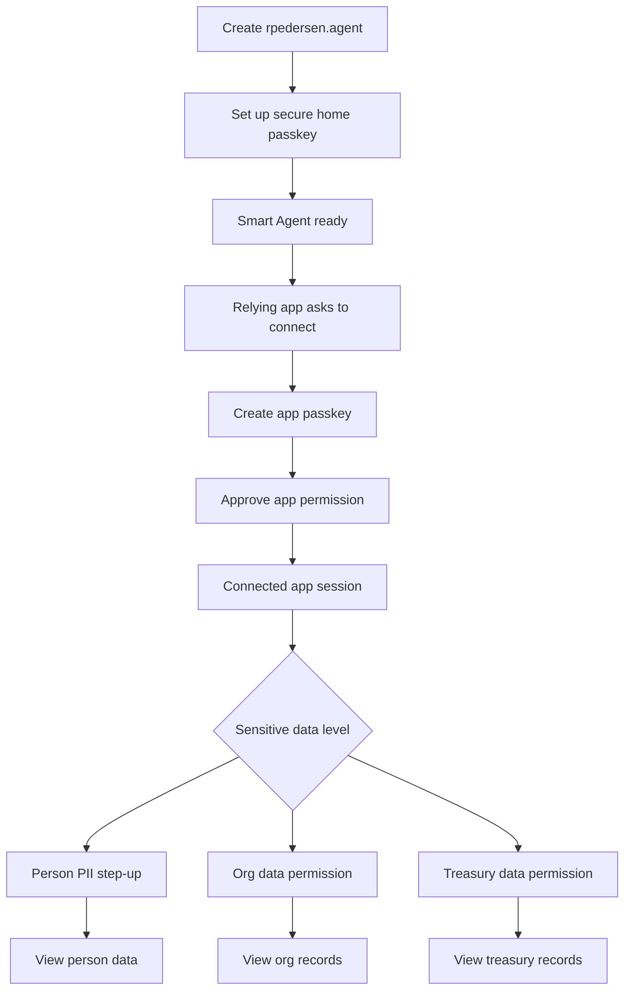

# Agentic Connect Mobile Flows

Mobile-first screen mockups for Agentic Connect as a marketing/product design
input. These screens show the product story, not implementation internals.

Core language:

```text
OIDC answers: who is this?
Delegation answers: what may this app do?
```

User-facing principle:

```text
Your Smart Agent is yours.
Apps only get the permissions you approve.
```

Avoid on-screen jargon like custodian, caveat, RP ID, credentialIdDigest,
ERC-4337, ERC-7710, delegate key, or validator module.

---

## Flow A — Sign Up For A Person Smart Agent

Goal: create `rpedersen.agent`, secure it with a passkey, and introduce the user
to their secure home.

### A1. Welcome

```text
┌─────────────────────────────┐
│ Agentic Connect             │
│                             │
│ Your agent name is your     │
│ portable identity.          │
│                             │
│ Sign in with a passkey.     │
│ Connect apps with approval. │
│ Revoke access anytime.      │
│                             │
│ [ Create my Smart Agent ]   │
│ [ I already have one ]      │
└─────────────────────────────┘
```

Primary CTA: `Create my Smart Agent`.

Secondary: `I already have one`.

### A2. Choose Agent Name

```text
┌─────────────────────────────┐
│ Choose your agent name      │
│                             │
│ This is how apps recognize  │
│ you. You can use it anywhere│
│ Agentic Connect is accepted.│
│                             │
│ [ rpedersen____________ ]   │
│                             │
│ ✓ rpedersen.agent available │
│                             │
│ [ Continue ]                │
└─────────────────────────────┘
```

Validation states:

```text
Checking...
✓ rpedersen.agent available
That name is already taken
Use letters, numbers, and hyphens
```

### A3. Explain Secure Home

```text
┌─────────────────────────────┐
│ Your secure home            │
│                             │
│ rpedersen.agent will have a │
│ secure home for sign-in and │
│ app approvals.              │
│                             │
│ This is where your passkey  │
│ protects your Smart Agent.  │
│                             │
│ [ Set up passkey ]          │
└─────────────────────────────┘
```

Copy note: do not show the subdomain unless the user opens details. If shown in
advanced copy, keep it consistent with the agent name:

```text
Secure home: rpedersen.agentictrust.io
```

### A4. OS Passkey Prompt

```text
┌─────────────────────────────┐
│ Confirm with your device    │
│                             │
│ Use Windows Hello, Face ID, │
│ Android, or a security key  │
│ to protect rpedersen.agent. │
│                             │
│ Waiting for device...       │
└─────────────────────────────┘
```

System prompt appears after this screen.

Accessibility note: keep the app screen visible behind the OS prompt so the
reason for the device prompt is clear.

### A5. Smart Agent Created

```text
┌─────────────────────────────┐
│ rpedersen.agent is ready    │
│                             │
│ ✓ Agent name created        │
│ ✓ Passkey added             │
│ ✓ Smart Agent secured       │
│                             │
│ Apps can now ask to connect │
│ to rpedersen.agent.         │
│                             │
│ [ Go to my secure home ]    │
└─────────────────────────────┘
```

### A6. Secure Home Dashboard

```text
┌─────────────────────────────┐
│ rpedersen.agent             │
│                             │
│ Smart Agent                 │
│ eip155:84532:0x...1234      │
│                             │
│ Connected Apps              │
│ No apps connected yet       │
│                             │
│ Sensitive Data              │
│ Profile, organizations,     │
│ treasury access             │
│                             │
│ [ Manage passkeys ]         │
└─────────────────────────────┘
```

Marketing note: this is the SSI-wallet-like surface. It should feel like a
personal control center, not a developer console.

---

## Flow B — Relying Site Connects After Signup

Goal: a relying site asks to connect to `rpedersen.agent` without becoming a root
credential. The user experiences it as "connected apps."

### B1. Relying Site Sign-In

```text
┌─────────────────────────────┐
│ Connect to Smart Agent      │
│                             │
│ Enter your agent name to    │
│ continue.                   │
│                             │
│ [ rpedersen____________ ]   │
│                             │
│ [ Continue ]                │
└─────────────────────────────┘
```

### B2. Agent Found

```text
┌─────────────────────────────┐
│ Found rpedersen.agent       │
│                             │
│ This app is not connected   │
│ yet.                        │
│                             │
│ Connect this app to         │
│ rpedersen.agent?            │
│                             │
│ [ Connect app ]             │
│ [ Not now ]                 │
└─────────────────────────────┘
```

### B3. Set Up This Site

This is the highest-risk UX moment because the user may see two device prompts:
one for the site-local passkey, then one for the secure-home approval.

Frame it as a two-step setup.

```text
┌─────────────────────────────┐
│ Connect this app            │
│                             │
│ Step 1 of 2                 │
│ Create a passkey for this   │
│ app on this device.         │
│                             │
│ This lets you continue with │
│ one tap next time.          │
│                             │
│ [ Create app passkey ]      │
└─────────────────────────────┘
```

After OS prompt:

```text
┌─────────────────────────────┐
│ Connect this app            │
│                             │
│ Step 2 of 2                 │
│ Approve this app from your  │
│ secure home.                │
│                             │
│ rpedersen.agent stays yours.│
│ This app only gets the      │
│ permission shown next.      │
│                             │
│ [ Review permission ]       │
└─────────────────────────────┘
```

### B4. Consent At Secure Home

```text
┌─────────────────────────────┐
│ Allow this app to work with │
│ rpedersen.agent?            │
│                             │
│ This app can:               │
│ ✓ Sign you in               │
│ ✓ Use approved profile data │
│ ✓ Perform selected actions  │
│                             │
│ This app cannot:            │
│ ✕ Change your passkeys      │
│ ✕ Recover your Smart Agent  │
│ ✕ Move funds without approval│
│ ✕ Act outside permission    │
│                             │
│ [ Approve with device ]     │
│ [ Deny ]                    │
└─────────────────────────────┘
```

If the relying app requests a concrete task, replace "perform selected actions"
with the actual permission:

```text
✓ Create an approved workspace
✓ Read approved profile data
✓ Request treasury approval
```

### B5. Connected

```text
┌─────────────────────────────┐
│ App connected               │
│                             │
│ This app can now work with  │
│ rpedersen.agent within the  │
│ permission you approved.    │
│                             │
│ You can revoke it anytime   │
│ from your secure home.      │
│                             │
│ [ Continue ]                │
└─────────────────────────────┘
```

### B6. Return Visit

```text
┌─────────────────────────────┐
│ Welcome back                │
│                             │
│ Continue as                 │
│ rpedersen.agent             │
│                             │
│ [ Continue with passkey ]   │
│ [ Use another agent ]       │
└─────────────────────────────┘
```

Return visits should be one device prompt.

---

## Flow C — Accessing Person-Level PII

Goal: show sensitive person data only after the user confirms with a suitable
credential.

### C1. Profile Overview

```text
┌─────────────────────────────┐
│ rpedersen.agent             │
│                             │
│ Profile                     │
│ Name: Richard Pedersen      │
│ Agent: eip155:...1234       │
│                             │
│ Contact details             │
│ ▒▒▒▒▒▒▒@▒▒▒▒.▒▒▒            │
│ +1 ▒▒▒ ▒▒▒ ▒▒▒▒             │
│                             │
│ [ Confirm to view ]         │
└─────────────────────────────┘
```

### C2. Step-Up Prompt

```text
┌─────────────────────────────┐
│ Confirm to view             │
│                             │
│ Your contact details are    │
│ protected.                  │
│                             │
│ Confirm with your device to │
│ view them.                  │
│                             │
│ [ Confirm with passkey ]    │
│ [ Cancel ]                  │
└─────────────────────────────┘
```

If the current session is not strong enough, name the fix:

```text
This sign-in can show your profile, but contact details need a passkey
confirmation.
```

### C3. Person PII Revealed

```text
┌─────────────────────────────┐
│ Contact details             │
│                             │
│ Email                       │
│ richard@example.com         │
│                             │
│ Phone                       │
│ +1 415 555 0123             │
│                             │
│ Shared with                 │
│ This app only               │
│                             │
│ [ Hide details ]            │
└─────────────────────────────┘
```

---

## Flow D — Accessing Organization-Level PII

Goal: access org-sensitive data through the person’s connected authority, without
making the app a root controller.

### D1. Organization Selector

```text
┌─────────────────────────────┐
│ Organizations               │
│                             │
│ You can access these through│
│ rpedersen.agent.            │
│                             │
│ Acme Construction           │
│ Role: Governance            │
│ [ View details ]            │
│                             │
│ Northstar Labs              │
│ Role: Member                │
│ [ View details ]            │
└─────────────────────────────┘
```

### D2. Org Sensitive Details Locked

```text
┌─────────────────────────────┐
│ Acme Construction           │
│                             │
│ Organization details        │
│ Public profile visible      │
│                             │
│ Sensitive records           │
│ ▒▒▒▒▒▒▒▒▒▒▒▒▒▒▒▒▒           │
│                             │
│ This app needs permission   │
│ from rpedersen.agent to     │
│ view sensitive org data.    │
│                             │
│ [ Request access ]          │
└─────────────────────────────┘
```

### D3. Org Access Consent

```text
┌─────────────────────────────┐
│ Allow org data access?      │
│                             │
│ This app can:               │
│ ✓ View approved org records │
│ ✓ Use data for this session │
│                             │
│ This app cannot:            │
│ ✕ Change organization access│
│ ✕ Add members               │
│ ✕ Move funds                │
│                             │
│ [ Approve with device ]     │
│ [ Deny ]                    │
└─────────────────────────────┘
```

### D4. Org PII Revealed

```text
┌─────────────────────────────┐
│ Acme Construction           │
│                             │
│ Sensitive records           │
│ Tax contact: finance@...    │
│ Registered address: ...     │
│ Compliance ID: ...          │
│                             │
│ Access expires              │
│ Today at 5:00 PM            │
│                             │
│ [ Revoke access ]           │
└─────────────────────────────┘
```

---

## Flow E — Accessing Treasury-Level PII

Goal: show that treasury data is higher-sensitivity service-agent data and may
require stronger approval.

### E1. Treasury Overview

```text
┌─────────────────────────────┐
│ Treasury                    │
│                             │
│ Acme Treasury               │
│ Service Agent               │
│                             │
│ Balances                    │
│ Available                   │
│ Pending approvals           │
│                             │
│ Sensitive treasury records  │
│ Locked                      │
│                             │
│ [ Request access ]          │
└─────────────────────────────┘
```

### E2. Treasury Permission Explanation

```text
┌─────────────────────────────┐
│ Treasury access             │
│                             │
│ Treasury data can include   │
│ payment contacts, banking   │
│ references, invoices, and   │
│ approval history.           │
│                             │
│ This requires a stronger    │
│ confirmation.               │
│                             │
│ [ Continue ]                │
└─────────────────────────────┘
```

### E3. Treasury Consent

```text
┌─────────────────────────────┐
│ Allow treasury access?      │
│                             │
│ This app can:               │
│ ✓ View approved treasury    │
│   records                   │
│ ✓ Use data for this session │
│                             │
│ This app cannot:            │
│ ✕ Send payments             │
│ ✕ Approve payments          │
│ ✕ Change treasury policy    │
│                             │
│ [ Approve with device ]     │
│ [ Deny ]                    │
└─────────────────────────────┘
```

### E4. Treasury PII Revealed

```text
┌─────────────────────────────┐
│ Acme Treasury               │
│                             │
│ Sensitive records           │
│ Payment contact: ...        │
│ Vendor tax form: ...        │
│ Invoice routing: ...        │
│                             │
│ Access                      │
│ View only · expires soon    │
│                             │
│ [ Hide ] [ Revoke ]         │
└─────────────────────────────┘
```

---

## Combined Mobile Flow



---

## Mobile UX Rules

1. **One reason per device prompt.** Always tell the user why Windows Hello / Face
   ID is about to appear.
2. **Step indicators for multi-prompt flows.** Use `Step 1 of 2` and `Step 2 of
   2` when setting up a new relying site.
3. **Name the unlock method.** If a session is too weak, say: "Confirm with your
   passkey" instead of "step-up required."
4. **Show denies clearly.** Each consent screen needs "This app cannot..." bullets.
5. **Keep revocation visible.** Every sensitive access surface should have a
   revoke or hide affordance nearby.
6. **Avoid implementation words.** Use connected app, permission, secure home,
   access, confirm, revoke.

---

## Accessibility Notes

- CTA targets should be at least 44px tall.
- Do not rely on blur alone for hidden sensitive data; use placeholder characters
  and keep hidden content out of assistive text until revealed.
- Use plain status text in addition to icons: `Available`, `Connected`, `Locked`.
- Preserve context before OS prompts: "Confirm with your device to view contact
  details."
- For popup flows, provide a full-page fallback and a clear "Return to app" state.

---

## Open Product Questions

1. Should the first app connection always create an app-local passkey, or can some
   low-risk apps use a short-lived session only?
2. Should treasury data always require a fresh device confirmation, even if the
   person just confirmed for org data?
3. Should org and treasury PII have separate "view only" permission cards?
4. How long should connected-app access last by default: session, day, 30 days?
5. Should the secure home show "recent access" for person/org/treasury PII reads?
6. Should the mobile app show the Smart Agent address by default, or hide it under
   "Advanced details"?
