# Multi-sig UX use cases and screen flows

Last researched: 2026-05-21

## Purpose

This document captures real multi-sig and multi-sig-adjacent product patterns from Safe, MetaMask Smart Accounts / Delegation Toolkit, Biconomy Nexus, ZeroDev Kernel, Rhinestone, Coinbase Smart Wallet, thirdweb, Web3Auth, Squads, Casa, Fireblocks, BitGo, MPCVault, and MetaMask Institutional.

The goal is not to copy their UI. The goal is to identify the user jobs they support and convert them into screen flows for `apps/demo-web-pro`.

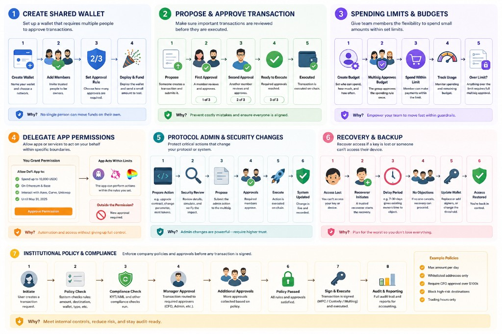

The strongest framing is by job-to-be-done, not by vendor. End users usually do not think "I need Safe" or "I need Biconomy." They think:

- "I am moving team money."
- "I need a backup plan."
- "I want a contractor to spend within a budget."
- "I need an app or agent to act safely on my behalf."
- "I need a protocol admin action to be reviewed before execution."

Core distinction: Safe-style products fit transparent threshold treasury/admin approvals. MetaMask/Biconomy/ZeroDev-style smart accounts lean toward programmable permissions, gas abstraction, delegation, recovery, and optional multisig validation.

## Product Landscape

| Product | Core model | Relevant use cases | UX lesson |
| --- | --- | --- | --- |
| Safe | Smart account with owners, threshold, transaction queue, modules, guards, Safe Apps | Team treasuries, DAOs, protocol admin, shared wallets, spending limits, batched transactions, recovery | Make approvals and execution state explicit. History and pending queue are first-class screens. Users must understand owners, gas, thresholds, and transaction order. |
| MetaMask Institutional | Institutional access layer over custody/self-custody providers | DeFi access, portfolio visibility, reporting, provider-backed approvals, institutional controls | Consumer MetaMask is not itself a multisig wallet. Institutional UX separates access from custody/control. |
| MetaMask Smart Accounts / Delegation Toolkit | Smart accounts with delegation, caveats, caveat enforcers, ERC-7715 permissions | Delegate scoped authority, attach caveats, redeem delegation, chain parent/child permissions, gas abstraction | Permission cards should explain what is allowed, limits, expiry, revocation, and what cannot happen. |
| Biconomy Nexus | Modular smart account with validators, Ownable multisig module, smart sessions, policies | Multi-owner threshold, add/remove owner, set threshold, session keys, value limits, token limits, usage limits, network/time restrictions | Treat sessions as policy objects, not keys. Show every policy condition in plain language. |
| ZeroDev Kernel | Modular smart account with signers, policies, actions, session keys, recovery | Session permissions, multisig validator, passkey/ECDSA/WebAuthn signers, guardians, self-recovery, dApp-assisted recovery | Separate "who signs", "what can be done", and "when it is allowed." |
| Rhinestone | ERC-7579 module ecosystem: validators, executors, hooks, fallbacks | Install validators, session modules, spending limit hooks, scheduled/automated executors, module registry | Users should see the installed capability, module risk, and uninstall/escape path. |
| Coinbase Smart Wallet / CDP | Smart account with spend permissions | Spender permissions, token allowance, period/window, subscriptions, agentic payments, DCA, automated payouts | Spend permissions need a budget-style UI: token, amount, period, spender, start/end. |
| thirdweb Smart Wallet | Admins plus session keys with approved targets, token limits, time windows | Add admin, remove admin, add session key, approved targets, per-transaction native token limit, access window | Distinguish admins from limited session keys visually. |
| Web3Auth / Embedded Wallets | MFA/MPC and smart accounts; recovery factors | MFA setup, device factor, backup factor, social/password/TOTP recovery, gas abstraction, batch transactions | Recovery UX should read like account safety setup, not cryptography setup. |
| Squads | Solana multisig for teams, treasuries, program/token authority | Solana treasury, approvals, token/program management, custom transactions, sub-accounts, spending limits | Best when the asset/admin surface is Solana-native. Similar mental model to Safe, but for Solana ops. |
| Casa | Personal/family multisig custody | 2-of-3 or 3-of-5 vaults, distributed keys, key replacement, inheritance | Personal safety and recovery, not team treasury. UX must teach key geography and loss scenarios. |
| Fireblocks | Institutional custody/MPC/policy infrastructure | Wallet policies, role approvals, destination controls, compliance checks, transaction reporting | Policy engine before signing. It is not classic on-chain multisig, but the UX teaches enterprise approval gates. |
| BitGo | Institutional custody, multisig/MPC wallets, withdrawal policy | Admin approvals, whitelists, velocity limits, custody controls, audit trail | Supports both multisig and MPC. Product UX centers withdrawal policy and regulated operations. |
| MPCVault | Team wallet with MPC signing and approval policies | Vault members, roles, policies, multi-chain approvals, team operations | Policy-enforced MPC, not traditional on-chain multisig. Useful reference for team roles and approval dashboards. |

## Source Notes

- Safe docs: smart accounts, modules, guards, Safe Apps, and transaction approval model.
- MetaMask docs: Smart Accounts Kit / Delegation Toolkit, delegation creation, caveats, caveat enforcers, permissions.
- Biconomy docs: Nexus, Ownable multisig module, Smart Sessions policies.
- ZeroDev docs: Kernel permissions/session keys, policies, recovery.
- Rhinestone docs: ERC-7579 modules, validators, executors, hooks, fallbacks.
- Coinbase docs: Spend Permissions for smart accounts.
- thirdweb docs: Account permissions, admins, session keys.
- Web3Auth docs: MFA, smart accounts, recovery factors.
- Squads product/docs: Solana multisig, token/program management, spending limits.
- Casa product/docs: personal multisig vaults, recovery, key replacement, inheritance.
- Fireblocks product/docs: institutional policy engine, approvals, reporting, compliance controls.
- BitGo product/docs: multisig/MPC custody, withdrawal policies, whitelists, velocity limits.
- MPCVault product/docs: team vaults, roles, policies, MPC signing approvals.

Reference links:

- Safe Smart Account overview: <https://docs.safefoundation.org/smart-account/overview>
- Safe modules: <https://docs.safefoundation.org/smart-account/modules>
- Safe guards: <https://docs.safefoundation.org/smart-account/guards>
- MetaMask Delegation API: <https://docs.metamask.io/smart-accounts-kit/reference/delegation/>
- MetaMask caveat enforcers: <https://docs.metamask.io/delegation-toolkit/development/concepts/delegation/caveat-enforcers/>
- Biconomy Smart Sessions policies: <https://docs.biconomy.io/new/smart-sessions/policies>
- Biconomy Ownable multisig module: <https://docs.biconomy.io/modules/validators/ownableValidator/>
- ZeroDev permissions/session keys: <https://docs.zerodev.app/smart-accounts/permissions/intro>
- ZeroDev recovery: <https://docs.zerodev.app/smart-accounts/account-recovery/sdk-recovery>
- Rhinestone modules: <https://docs.rhinestone.dev/home/resources/modules>
- Coinbase Spend Permissions: <https://docs.cdp.coinbase.com/wallets/using-wallets/spend-permissions>
- thirdweb account permissions: <https://portal.thirdweb.com/typescript/v5/account-abstraction/permissions>
- Web3Auth MFA: <https://docs.metamask.io/embedded-wallets/sdk/js/advanced/mfa/>

## Vocabulary Guidance

Avoid overloaded protocol words in user-facing copy.

| Technical term | Better user-facing label |
| --- | --- |
| Proposal | Scheduled admin change |
| Threshold | Approvals required |
| Quorum | Enough approvals |
| Validator | Policy module |
| Caveat | Limit |
| Session key | Limited agent permission |
| ETA | Earliest execution time |
| Guardian | Recovery contact |
| Module | Installed account capability |

## Picture Groups: End-User Mental Models

These are the highest-value visuals to design first. Each group maps a real user job to a simple metaphor, the best-fit product references, and the screen sequence.

### Picture Group 1: Shared Team Treasury

Use area: DAOs, startups, protocol teams, investment clubs, grants programs.

Core question: "Who is allowed to move shared money, and how many people must agree?"

Best references: Safe, Squads, MPCVault, BitGo, Fireblocks.

Visual metaphor: a vault that only opens when enough trusted people agree.

Screen sequence:

1. Create shared wallet / treasury.
2. Name it: "Protocol Treasury", "Marketing Budget", "Grants Wallet".
3. Choose network.
4. Add owners or members by wallet, ENS, email abstraction, or organization role.
5. Label each member: Founder, Finance, Ops, External accountant.
6. Set approvals required: 2-of-3, 3-of-5, 4-of-7.
7. Review failure modes: unavailable signers, lost access, single-person risk.
8. Deploy or activate.
9. Fund with a small test amount.
10. Run a test transfer.

Picture panels:

1. Three people stand around a vault. Each has a keycard.
2. The vault badge says "2 of 3 required."
3. Two people approve; the vault opens; funds move to a vendor.

End-user copy:

> Use multisig when shared money should not depend on one person, one laptop, or one private key.

### Picture Group 2: High-Value Transfer Approval

Use area: treasury transfers, investor redemptions, vendor payments, large DeFi moves, bridge transfers.

Core question: "How do we make sure a large transfer is reviewed before it goes out?"

Best references: Safe, Squads, Fireblocks, BitGo, MPCVault.

Visual metaphor: the approval train.

Screen sequence:

1. Initiator chooses asset, recipient, amount, and memo.
2. UI shows risk preview: recipient, asset, network, USD value, gas, contract interaction, whether the address is new.
3. Transaction enters approval queue.
4. Approvers see a plain-English card.
5. Approval count updates: "1 of 3 approvals collected."
6. Execute when enough approvals are collected.
7. Cancel/reject path is visible if details are wrong.

Picture panels:

1. A transaction card enters a track: "Send 50,000 USDC."
2. The train stops at approval stations: CFO, Founder.
3. Approved transactions reach Execute; rejected transactions divert to Cancel.

End-user copy:

> Use multisig when a mistake would be expensive, public, or irreversible.

### Picture Group 3: Routine Payments and Spending Limits

Use area: contractors, marketing budgets, grants ops, payroll assistants, recurring vendor payments.

Core question: "How can someone make small approved payments without bothering the whole signer group every time?"

Best references: Safe spending limits, Squads spending limits, Fireblocks policies, BitGo policies, MPCVault policies, Coinbase Spend Permissions.

Visual metaphor: green lane for small payments, board approval for big ones.

Screen sequence:

1. Admin creates a spending rule.
2. Choose beneficiary/operator.
3. Choose asset and limit.
4. Choose reset period.
5. Optionally restrict destinations.
6. Multisig approves the rule once.
7. Operator spends within the rule.
8. Exceptions go back to multisig.
9. Dashboard shows remaining budget.

Picture panels:

1. A small invoice enters a green lane: "Under 1,000 USDC."
2. A large invoice enters a yellow lane: "Needs 2-of-3 approval."
3. The team sees both in a budget dashboard.

End-user copy:

> Use spending limits when you trust someone to operate, but only inside a budget.

### Picture Group 4: DeFi and dApp Access

Use area: DAO DeFi, treasury yield, swaps, bridging, protocol interactions, institutional DeFi, agent automation.

Core question: "How can we use apps without giving one person or one app total control?"

Best references: Safe Apps, MetaMask Institutional, MetaMask Delegation Toolkit, Biconomy Smart Sessions.

Visual metaphor: permission card, not master key.

Safe-style flow:

1. User opens treasury.
2. User connects to a dApp through Safe Apps or a WalletConnect-style flow.
3. User prepares action: swap, stake, bridge, claim, vote, repay, rebalance.
4. UI shows decoded contract action and simulation.
5. Transaction is scheduled/queued for approvals.
6. Signers approve.
7. Transaction executes.

Institutional access-layer flow:

1. User connects an institutional account.
2. MetaMask-style access layer gives dApp access.
3. Custody/self-custody provider enforces approvals and policy.
4. Organization sees portfolio, reporting, and transaction history.

Delegated-permission flow:

1. App requests scoped permission.
2. UI displays amount, token, chain, allowed contracts, expiry, and revocation.
3. User signs once.
4. App or agent acts only within scope.
5. Anything outside scope requires new approval.

Picture panels:

1. User sees a card: "Allow this app to rebalance up to 10,000 USDC."
2. The card lists asset, amount, chains, apps, expiration.
3. The app acts automatically, while a red wall blocks anything outside permission.

End-user copy:

> Use delegated permissions when you want automation without handing over the whole wallet.

### Picture Group 5: Protocol Admin and Security Changes

Use area: smart contract upgrades, token minting, role changes, DAO admin, program authority, validator management.

Core question: "Who can change the system itself?"

Best references: Safe, nested Safes, Safe Transaction Builder, Squads.

Visual metaphor: launch control room.

Screen sequence:

1. Developer prepares admin action: upgrade contract, transfer ownership, change oracle, mint tokens, update parameter, transfer program authority.
2. Security reviewer checks decoded calldata and simulation.
3. UI compares action against governance proposal or release plan.
4. Admin action enters a high-security account.
5. Required engineering/governance/security signers approve.
6. Action executes on-chain.

Picture panels:

1. Developer prepares "Upgrade v2.1."
2. Security reviewer checks contract, calldata, and simulation on a big screen.
3. Governance signers turn launch keys together.

End-user copy:

> Use multisig when changing the rules is more dangerous than moving the money.

### Picture Group 6: Personal/Family Custody and Recovery

Use area: personal Bitcoin/ETH/stablecoin custody, inheritance, key loss protection, family wealth.

Core question: "What happens if I lose my phone, hardware wallet, or pass away?"

Best references: Casa, Safe RecoveryHub-style patterns, ZeroDev recovery, Web3Auth MFA/recovery.

Visual metaphor: no single lost key means lost money.

Casa-style flow:

1. Choose vault structure: 2-of-3 or 3-of-5.
2. Set up multiple keys: phone key, hardware wallet, backup/recovery key.
3. Store keys in different places.
4. Make a small test send.
5. Add recovery/inheritance plan.
6. Replace lost key without losing funds.

Smart-account recovery flow:

1. User adds recoverer/guardian.
2. User chooses recovery delay.
3. If access is lost, recoverer proposes signer replacement.
4. Existing signers can reject during delay.
5. Recovery executes after delay.

Picture panels:

1. Three keys live in three places: phone, home safe, trusted recovery service.
2. One key breaks; the vault does not panic.
3. Owner uses remaining approvals to replace the broken key.

End-user copy:

> Use multisig when your biggest risk is loss, theft, or inheritance failure.

### Picture Group 7: Institutional Policy Engine

Use area: funds, exchanges, fintechs, enterprises, family offices, accounting-heavy teams.

Core question: "How do we enforce company policy before anything is signed?"

Best references: Fireblocks, BitGo, MPCVault, MetaMask Institutional.

Visual metaphor: policy gate before the signing machine.

Screen sequence:

1. Admin defines policy: initiators, approvers, wallets, destinations, amount thresholds, compliance checks, velocity limits.
2. Operator initiates transaction.
3. Policy engine evaluates destination, amount, transaction type, compliance/KYT, and role requirements.
4. Approvers approve through app/API/dashboard.
5. Signing occurs by MPC, custody, or on-chain multisig.
6. Audit/reporting preserves initiator, approver, rejection, execution, and export trail.

Picture panels:

1. Operator submits "Send 250,000 USDC."
2. Transaction passes gates: whitelist, amount, compliance, CFO.
3. Only after all gates open does signing activate.

End-user copy:

> Use institutional multisig or MPC policy when the organization needs controls, auditability, and separation of duties.

## Common End-User Flows To Design

These screen flows cut across vendors and should guide `demo-web-pro` IA.

### A. Create Shared Wallet

Screens:

1. Welcome: "Protect shared funds with multiple approvals."
2. Choose use case: team treasury, family vault, protocol admin, recurring payments.
3. Add members.
4. Set approval rule.
5. Choose recovery plan.
6. Deploy or activate.
7. Run test transaction.

Key UI element: approval simulator.

Example copy:

> With 2-of-3 approval, any two members can move funds. If one person is unavailable, the treasury still works. If two people lose access, funds may be stuck.

### B. Propose Transaction

Screens:

1. Select action: send, swap, bridge, contract interaction, batch.
2. Enter details.
3. Show decoded preview.
4. Show risk warnings.
5. Submit scheduled transaction/admin change.
6. Notify approvers.

Key UI element: human-readable transaction card.

Example copy:

> You are proposing to send 25,000 USDC from Team Treasury to Acme Vendor on Base.

### C. Approve Transaction

Screens:

1. Approver opens notification.
2. UI shows transaction summary.
3. UI shows what changed since scheduling, if anything.
4. Approver signs.
5. Progress updates: "2 of 3 approvals collected."
6. Execute button appears.

Key UI element: approval progress bar.

Example copy:

> One more approval is needed before this transaction can execute.

### D. Reject or Cancel Transaction

Screens:

1. User clicks "Something is wrong."
2. Choose reason: wrong address, wrong amount, suspicious contract, no longer needed.
3. UI explains whether cancellation must happen on-chain.
4. Create cancellation transaction if needed.
5. Approvers confirm cancellation.
6. Queue clears.

Key UI element: red cancel lane with nonce/protocol details hidden behind plain English.

Example copy:

> This cancellation blocks the pending transaction from executing.

### E. Set Budget or Spending Limit

Screens:

1. Choose operator.
2. Choose asset.
3. Set max amount.
4. Set reset period.
5. Optional: restrict destination.
6. Multisig approves rule.
7. Operator gets budget wallet view.

Key UI element: budget meter.

Example copy:

> Marketing Manager can spend up to 1,000 USDC per week. Larger payments still need multisig approval.

### F. Delegate App or Agent Permission

Screens:

1. App requests permission.
2. User sees scope: amount, token, chain, contract, expiration, allowed action.
3. User signs once or collects approvals if high risk.
4. App acts within scope.
5. User can revoke or renew.

Key UI element: permission card.

Example copy:

> This app can rebalance up to 10,000 USDC across approved protocols until June 30. It cannot withdraw to arbitrary addresses.

### G. Recover Account

Screens:

1. User reports lost key.
2. Recoverer proposes signer replacement.
3. Delay period begins.
4. Existing signers can reject.
5. Recovery executes after delay.
6. User verifies new signer set.

Key UI element: recovery countdown.

Example copy:

> Recovery will be available in 28 days unless an existing signer cancels it.

### Clean End-User Message

The simplest product message:

> Multisig is useful whenever the cost of one person making a mistake is too high.

Use it for:

- shared money,
- high-value transfers,
- protocol admin,
- delegated budgets,
- app/agent permissions,
- recovery,
- institutional controls.

## Cross-Product Use Cases

### 1. Create a multi-owner account

Supported by: Safe, Biconomy Ownable module, ZeroDev multisig validator, thirdweb admins, agenticprimitives hybrid/threshold/org modes.

User job: "Create an account controlled by more than one signer."

Screens:

1. Choose account mode
2. Add owners/admins/signers
3. Choose approvals required
4. Review deployment
5. Deploy account
6. Show account home

Screen flow:

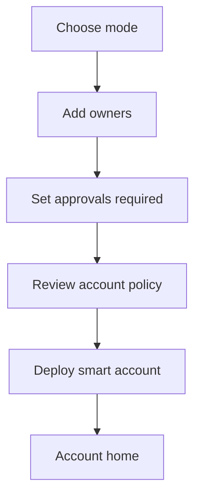

Recommended `demo-web-pro` status:

- Works now: hybrid account deploy with one owner plus optional guardians.
- Future: true threshold/org deploy with multiple owners and non-trivial approval defaults.

### 2. Add or remove an owner

Supported by: Safe owner management, Biconomy `addOwner` / `removeOwner`, thirdweb `addAdmin` / `removeAdmin`, agenticprimitives `AdminAction.AddOwner` / `RemoveOwner`.

User job: "Add a trusted person/device to account control."

Screens:

1. Account settings
2. Owner list
3. Add owner form
4. Explain risk and safety delay
5. Schedule admin change
6. Wait for delay
7. Execute admin change
8. Confirm owner list updated

Screen flow:

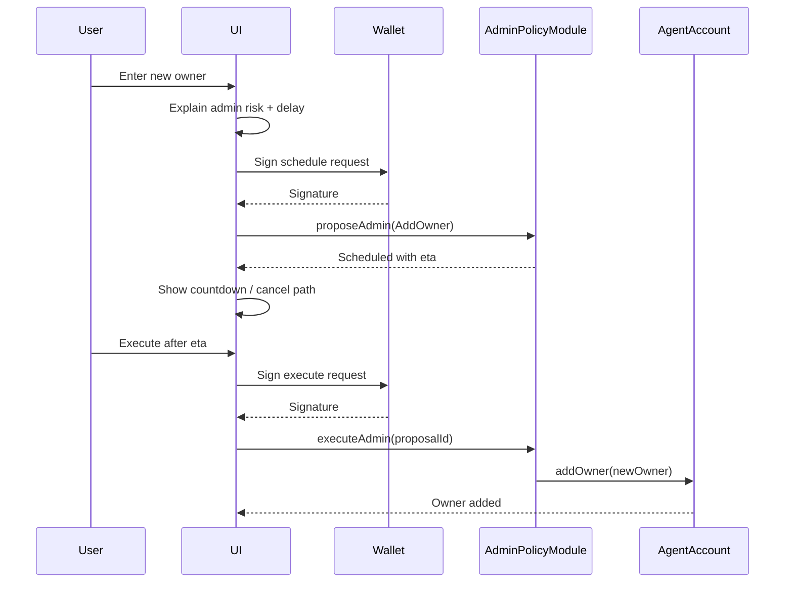

Recommended copy:

- "Schedule owner change"
- "Safety delay: 1 hour"
- "Execute after delay"

Avoid:

- "Proposal"
- "Quorum"
- "Validator"

### 3. Change approvals required

Supported by: Safe threshold settings, Biconomy `setThreshold`, ZeroDev/Biconomy multisig validators, agenticprimitives threshold config roadmap.

User job: "Require more or fewer approvals for account actions."

Screens:

1. Current approval policy
2. Choose new approval count
3. Preview impact by risk tier
4. Schedule policy change
5. Wait safety delay
6. Execute change

Screen flow:

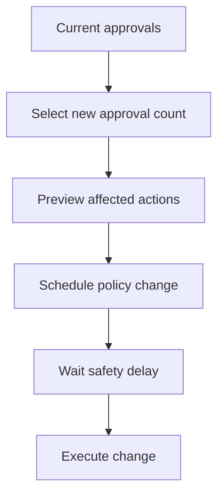

Design notes:

- Show concrete examples: "Owner changes will need 2 approvals."
- Warn if lowering approvals.
- Require stronger confirmation when reducing safety.

### 4. Propose and approve a treasury transaction

Supported by: Safe transaction queue, Safe Apps, Biconomy sessions/policies, Coinbase spend permissions for recurring/agentic payments, agenticprimitives org treasury roadmap.

User job: "Let an org approve a payment before execution."

Screens:

1. Treasury dashboard
2. Create payment
3. Review recipient, amount, token, reason
4. Collect approvals
5. Execute transaction
6. Record audit trail

Screen flow:

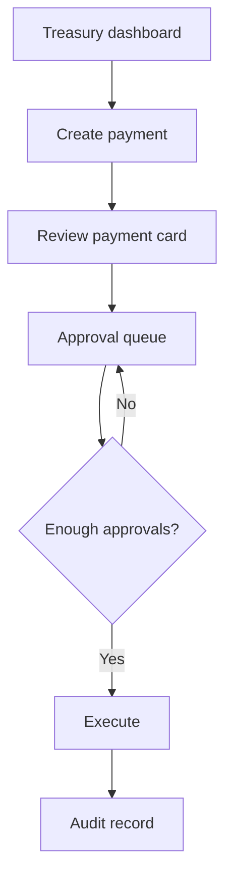

Recommended `demo-web-pro` status:

- Future only until org account deployment and validator proposal writes are supported end-to-end.

### 5. Create a limited session key / agent permission

Supported by: MetaMask delegation caveats, Biconomy Smart Sessions, ZeroDev permissions, thirdweb session keys.

User job: "Let an app or agent do a narrow job without handing it full account control."

Screens:

1. Permission request
2. Permission card
3. Limits editor
4. Approval/signing
5. Active permissions list
6. Revoke permission

Permission card fields:

- Who gets access
- What it can call
- Token/value limit
- Time window
- Usage count
- Network(s)
- What it cannot do
- Revocation path

Screen flow:

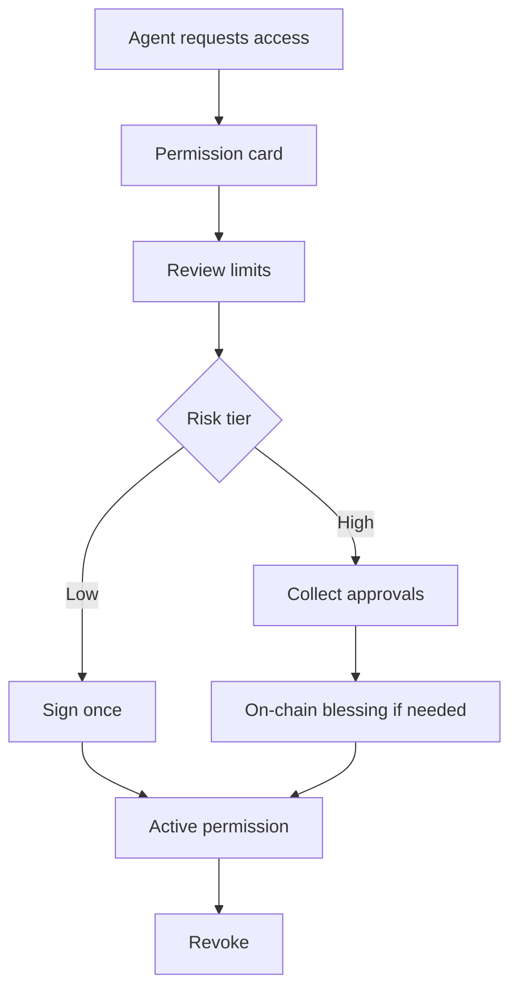

Recommended `demo-web-pro` status:

- Future until session-package validation, accepted-session blessing, and quorum signature collection are wired.

### 6. Spend permission / allowance

Supported by: Coinbase Spend Permissions, Biconomy Smart Sessions token/value limits, thirdweb native token limits, MetaMask caveats.

User job: "Allow a spender to use up to X token amount per period."

Screens:

1. Choose spender
2. Choose token
3. Set allowance
4. Set period/window
5. Review budget
6. Sign permission
7. Track spend
8. Revoke/update

Screen flow:

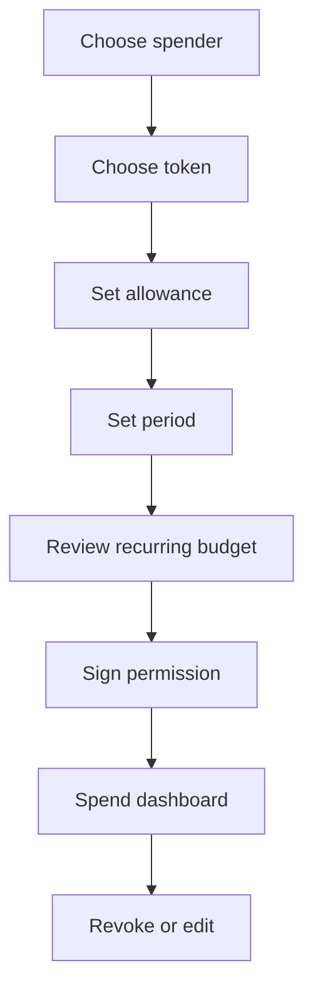

Design notes:

- Use budget language: "Up to 25 USDC per week."
- Show reset time.
- Show already spent vs remaining.

### 7. Install or remove a module

Supported by: Safe modules/guards, Rhinestone ERC-7579 modules, agenticprimitives ERC-7579 module taxonomy.

User job: "Add account capability safely."

Screens:

1. Module marketplace/library
2. Module detail page
3. Permissions requested
4. Risk review
5. Install through admin flow
6. Installed capabilities list
7. Disable/uninstall

Screen flow:

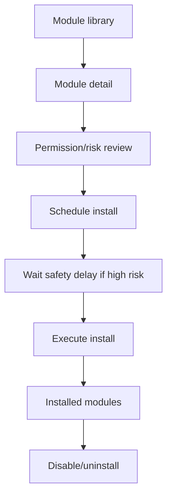

Design notes:

- Guards/hooks can lock accounts if faulty. Copy must say this plainly.
- Show "escape path" before install.

### 8. Add a guard / transaction policy

Supported by: Safe Guards, Rhinestone Hooks, Biconomy policies, ZeroDev policies.

User job: "Restrict what the account can do."

Screens:

1. Policy library
2. Rule builder
3. Preview affected transactions
4. Schedule policy install
5. Test policy with sample transaction
6. Activate

Screen flow:

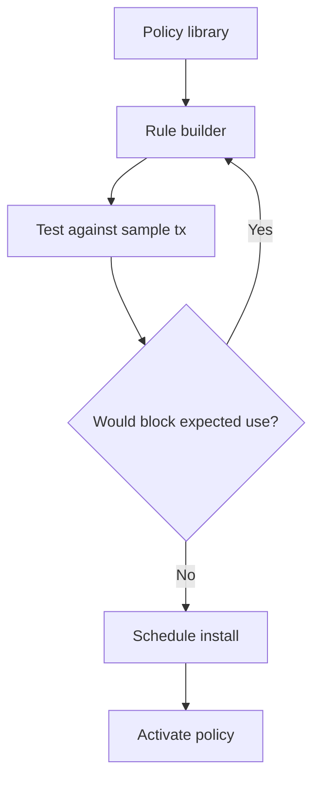

Examples:

- Only allow known token contracts.
- Block transfers above a daily amount.
- Require human approval for unknown contracts.

### 9. Recover a lost owner key

Supported by: ZeroDev recovery, Web3Auth MFA/recovery factors, Safe owner replacement via threshold, agenticprimitives guardian recovery roadmap.

User job: "Regain access without letting attackers take over instantly."

Screens:

1. "I lost access" entry
2. Identify account
3. Choose recovery method
4. Collect guardian/MFA approvals
5. Start recovery delay
6. Owner cancel window
7. Execute recovery
8. Confirm new owner/passkey

Screen flow:

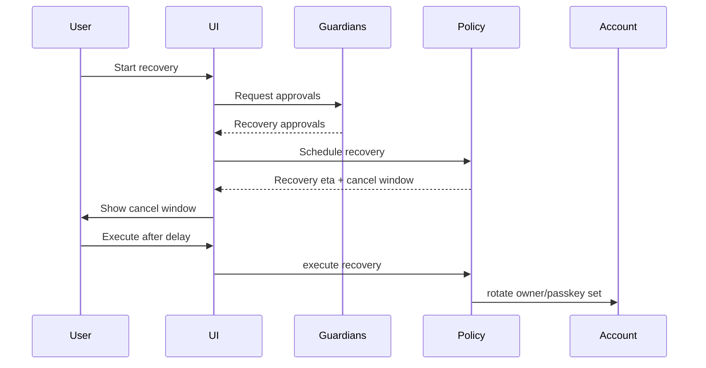

Design notes:

- Recovery must be calm and explicit.
- Show who can cancel and until when.
- Avoid saying "guardian can spend"; guardians recover, they do not operate the account.

### 10. Approve from mobile or multiple devices

Supported by: Safe mobile/web approvals, wallet-based multisig signing, passkeys/WebAuthn in smart accounts, Web3Auth MFA.

User job: "Collect approvals from people/devices that are not on the same browser."

Screens:

1. Pending approval detail
2. Share approval link / QR
3. Sign on another wallet/device
4. Live approval count updates
5. Execute when ready

Screen flow:

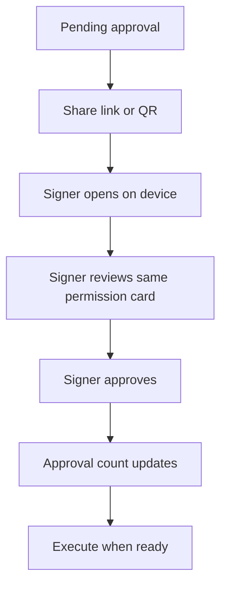

Design notes:

- Every signer must see the same human-readable action.
- Do not ask secondary signers to sign opaque hashes without context.

### 11. Cancel a pending admin change

Supported by: Safe rejection/replacement patterns, agenticprimitives `cancelAdmin`, recovery cancel window.

User job: "Stop a scheduled dangerous change."

Screens:

1. Pending admin change detail
2. Show risk and time remaining
3. Cancel confirmation
4. Sign cancellation
5. Cancelled state in history

Screen flow:

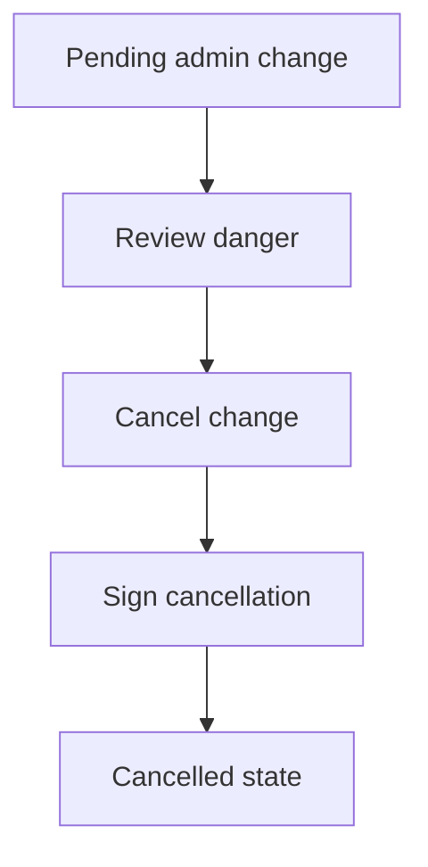

Design notes:

- Cancellation should be more prominent than execution for high-risk changes during the delay window.

## Recommended `demo-web-pro` Information Architecture

### Home

Purpose: make current support obvious.

Sections:

1. What works now
2. Start live hybrid account setup
3. Future capabilities that need on-chain/runtime support
4. Architecture notes

### Live: Hybrid Account Setup

Purpose: deploy the current supported account mode.

Screens:

1. Explain: "This deploys a hybrid AgentAccount."
2. Connect wallet
3. Add optional guardians
4. Preview address
5. Deploy
6. Show tx and resulting account

### Future: Admin Actions

Purpose: demonstrate scheduled owner/policy changes when fully supported.

Preferred labels:

- "Schedule admin change"
- "Safety delay"
- "Execute admin change"

Avoid:

- "Proposal"
- "Validator"
- "Quorum"

### Future: Agent Permission

Purpose: show high-risk delegation UX.

Core component:

- `PermissionCard`

Required implementation before live:

- session package rejects invalid delegation before storage
- accepted session blessing path wired end-to-end
- owner threshold collection for T3

### Future: Org Treasury

Purpose: show team treasury approval workflow.

Required implementation before live:

- org-mode account deployment with multiple owners
- live validator proposal reads/writes
- value policy/treasury package or bounded demo treasury action

### Future: Recovery

Purpose: show guardian/timelock safety model.

Required implementation before live:

- recovery execution UI
- guardian signature collection
- live timelock and cancel-window reads

## Product Patterns To Copy

### From Safe

- Pending transaction queue
- Owner list with threshold summary
- Confirmation count
- Clear executed/cancelled history
- Module/guard installation warnings

### From MetaMask Delegation Toolkit

- Permission-first framing
- Caveat/limit display
- Parent/child delegation context
- Explicit unsafe/unrestricted warning

### From Biconomy and ZeroDev

- Session policy builder
- Function/contract/value/time/network conditions
- Multi-chain or network-scoped permission display
- Signer/policy/action separation

### From Coinbase Spend Permissions

- Allowance dashboard
- Periodic budget language
- Spender/token/amount/period fields
- Remaining allowance display

### From thirdweb

- Admin vs session-key distinction
- Approved target list
- Time-window and native-token-limit summary

### From Web3Auth

- Recovery setup as onboarding
- Backup factor education
- MFA/recovery state checklist

## Product Patterns To Avoid

- Presenting unsupported preview screens as clickable working demos.
- Showing "sign hash" as the primary user action.
- Using "proposal" without saying what will happen.
- Saying "guardian" without explaining that guardians recover, not spend.
- Hiding revocation/cancel paths.
- Combining owner/admin/session/guardian roles in one undifferentiated signer list.

## Suggested Screen Inventory

| Screen | Now/Future | Product inspiration | Needs on-chain/runtime support |
| --- | --- | --- | --- |
| Hybrid account setup | Now | Safe create account, ZeroDev recovery setup | Factory + validator deploy, already present |
| Owner list | Near-term | Safe settings, thirdweb admins | Account owner reads |
| Scheduled admin change | Near-term | Safe pending tx queue | `proposeAdmin`, `executeAdmin`, `cancelAdmin`, pending reads |
| Approval queue | Future | Safe queue | Multi-owner accounts + pending proposal index |
| Permission card | Future | MetaMask DTK, Biconomy sessions | Delegation/caveat verification + accepted-session blessing |
| Spend permission | Future | Coinbase | Treasury/spend policy support |
| Org treasury | Future | Safe org treasury | Org-mode deploy + proposal writes |
| Module manager | Future | Safe modules, Rhinestone | Module registry reads/writes |
| Recovery center | Future | ZeroDev/Web3Auth | Guardian recovery execution + cancel window |
| Audit trail | Future | Safe history + internal audit package | Cross-service event indexing |

## Open UX Questions

1. Should the product call the module `AdminPolicyModule` in UI even if the contract remains `ThresholdValidator`?
2. Should scheduled admin actions be indexed by event logs or by a local backend cache?
3. Should execution after timelock be manual only, or optionally automated by a relayer?
4. Should guardians be allowed to approve non-recovery admin actions, or only recovery?
5. Should session permissions have a single universal permission card across web, A2A, and MCP?

## Naming Recommendations

The current vocabulary mixes Ethereum/account-abstraction terms with the product's trust, delegation, and authority language. Some overlap is useful, but several words are false friends: they sound similar while meaning different things in different layers.

### Naming principles

1. Contract names should describe the authority they enforce, not the implementation mechanism.
2. UI labels should describe the user job, not the protocol primitive.
3. Delegation vocabulary should stay about scoped authority: who can do what, for how long, under which limits.
4. Account-admin vocabulary should stay about account control: owners, recovery, safety delays, policy changes.
5. Reuse a term only when the security meaning is actually the same.

### Terms to separate

| Current term | Problem | Recommended internal name | Recommended UI label |
| --- | --- | --- | --- |
| `ThresholdValidator` | "Validator" usually means signature/UserOp validation. This contract mostly owns admin policy, timelocks, guardians, and scheduled actions. It is even installed as an executor module. | `AdminPolicyModule` or `AccountPolicyModule` | Account safety policy |
| `proposal` | Sounds like DAO governance. Here it is a concrete admin action with args and earliest execution time. | `ScheduledAdminAction` or `AdminChangeRequest` | Scheduled admin change |
| `threshold` | Accurate in contracts, but users think in approvals. Also overlaps with threshold signing/MPC. | `approvalThreshold` | Approvals required |
| `quorumSigs` | Correct technically, but opaque. It means enough owner/guardian signatures for this action. | `approvalSignatures` or `packedApprovalSignatures` | Approvals |
| `caveat` | Accurate in delegation-toolkit vocabulary, but user-facing copy should say limit/condition. | `permissionLimit` or keep `caveat` only in delegation internals | Permission limit |
| `guardian` | Generally good, but must not imply spending authority. | `RecoveryGuardian` | Recovery contact |
| `session key` | In agent UX, the key is less important than the limited permission it represents. | `SessionSigner` for crypto, `AgentPermission` for product | Limited agent permission |
| `validator` in ERC-7579 | Valid for modules that validate UserOps/signatures. Misleading for modules that execute admin changes. | `SignatureValidatorModule`, `SessionValidatorModule` | Sign-in/signature policy |
| `executor` in ERC-7579 | Valid technically, but too broad for users. | `AdminExecutorModule`, `ScheduledActionExecutor` | Applies approved changes |
| `policy` | Good umbrella term, but must be qualified. | `AdminPolicy`, `ToolPolicy`, `DelegationPolicy`, `SpendPolicy` | Safety rule / permission rule |

### Contract renaming recommendations

These are recommended names for future contract/API cleanup. They do not require immediate Solidity renames if migration risk is too high; aliases and UI copy can move first.

| Current contract/API | Recommended name | Why |
| --- | --- | --- |
| `ThresholdValidator.sol` | `AdminPolicyModule.sol` | It governs admin actions, recovery, thresholds, timelocks, and guardian policy. "Validator" is not the primary behavior. |
| `AdminProposal` struct | `ScheduledAdminAction` | It stores a scheduled concrete action, not a deliberative proposal. |
| `proposeAdmin(...)` | `scheduleAdminAction(...)` | The call schedules an action and computes `eta`. |
| `executeAdmin(...)` | `executeScheduledAdminAction(...)` | Makes clear this is the second phase after the safety delay. |
| `cancelAdmin(...)` | `cancelScheduledAdminAction(...)` | Pairs with schedule/execute and reads better in UI. |
| `AdminAction` enum | Keep `AdminAction` | This is clear and accurate. |
| `threshold(account, tier)` | `approvalThreshold(account, tier)` | Distinguishes owner approvals from MPC/TSS threshold cryptography. |
| `recoveryThreshold(account)` | `recoveryApprovalThreshold(account)` | Makes clear this is guardian approval count. |
| `t3HighValueCeiling` | `highValueActionLimit` | Better product language; tier can remain in docs/spec. |
| `timelockDuration(account, tier)` | `safetyDelay(account, tier)` | UI should explain purpose: safety delay. |

### Recommended product vocabulary

Use these labels consistently in `demo-web-pro`.

| Product concept | Preferred phrase | Avoid |
| --- | --- | --- |
| Account owner/admin change | Scheduled admin change | Proposal |
| Delay before execution | Safety delay | Timelock, ETA |
| Required owner signatures | Approvals required | Quorum, threshold |
| Signed owner approvals | Approvals | `quorumSigs` |
| Module that controls admin actions | Account safety policy | Threshold validator |
| Delegated agent capability | Limited agent permission | Session key, caveat bundle |
| Delegation restriction | Permission limit | Caveat |
| Guardian/recovery signer | Recovery contact | Owner, admin |
| On-chain execution after delay | Apply approved change | Execute proposal |

### When overlapping terms are acceptable

Some terms can remain if scoped clearly:

- `Delegation` should remain for authority passed from one actor to another.
- `Permission` should be the user-facing wrapper around delegation, caveats, and session signer details.
- `Policy` is acceptable when qualified: `AdminPolicy`, `ToolPolicy`, `DelegationPolicy`.
- `Threshold` is acceptable in low-level docs and contract code, but UI should say `approvals required`.
- `Validator` is acceptable only for modules that actually validate signatures/UserOps, such as session validators or passkey validators.

### Recommended naming model

Use three layers:

```text
User-facing UX:
  Account safety policy
  Scheduled admin change
  Approvals required
  Limited agent permission
  Permission limits

TypeScript/API:
  AdminPolicyModule
  ScheduledAdminAction
  approvalThreshold
  approvalSignatures
  AgentPermission

Solidity/internal protocol:
  ERC7579 validator/executor/hook/fallback
  AdminAction
  timelock
  caveat
  packed signatures
```

This lets Solidity stay compatible with ecosystem terms while the product avoids confusing users and evaluators.

