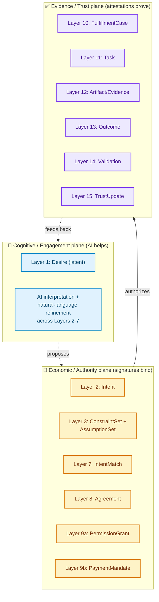
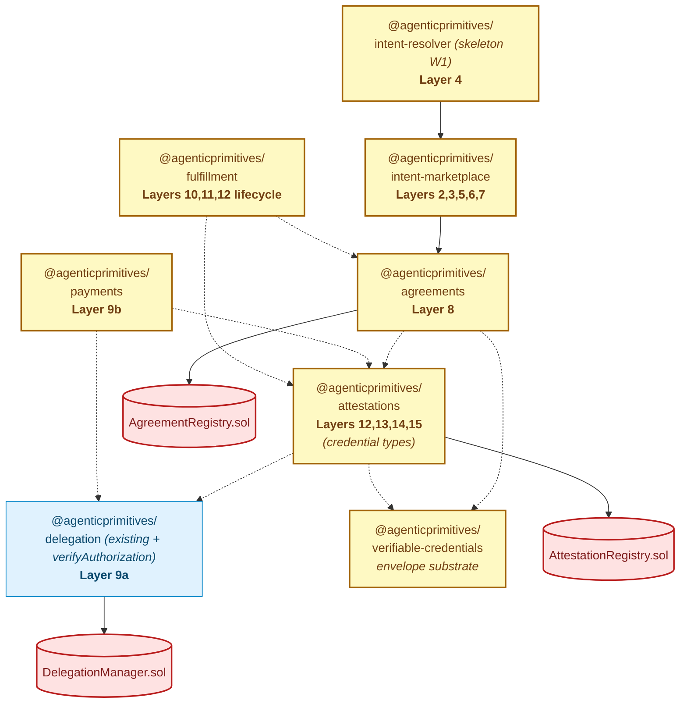
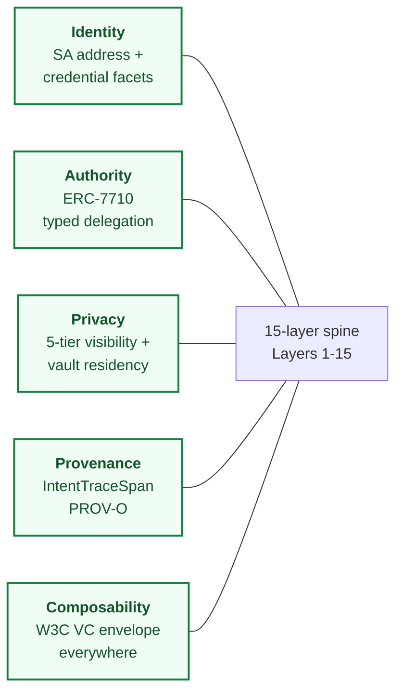

# The Agentic Primitives Coordination Substrate

> **Thesis.** Modern agentic systems — AI agents, human-in-the-loop networks,
> intent-centric DeFi solvers, decentralized identity stacks — keep
> reinventing the same 15 layers of coordination. Each project re-implements
> a partial slice and locks in the wrong abstractions. **Agentic Primitives is
> the substrate** that makes those 15 layers first-class, composable, ERC-1271-
> native, and W3C-VC-aligned, so the **vertical** application (faith,
> marketplace, payments, professional services) is just app-level
> configuration over a generic trust + coordination spine.
>
> This document is the architecture-of-record for that spine. It is the
> highest-level positioning + reference architecture for the platform. Every
> ADR, spec, package, and demo app flows from it.

**Status:** Foundational architecture document (2026-06-02).
**Architecture-of-record:** [ADR-0024 — Intent Coordination Substrate](./decisions/0024-intent-coordination-substrate.md) (decisions).
**Related ADRs:** [0010](./decisions/0010-smart-agent-canonical-identifier.md) (identity), [0011](./decisions/0011-credential-recovery-and-re-association.md) (credentials rotate, identity persists), [0018](./decisions/0018-agenticprimitives-wide-formal-ontology.md) (formal ontology), [0021](./decisions/0021-generic-packages-vs-white-label-apps.md) (packages are generic), [0022](./decisions/0022-authority-must-be-declarative.md) (authority is declarative), [0023](./decisions/0023-attestation-registry-eas-aligned-bilateral-consent.md) (attestation registry).

---

## 1. The problem this substrate solves

Today's agentic stacks are **partial slices**:

| Slice | Strength | What it doesn't do |
|---|---|---|
| **CoW Protocol / UniswapX / Anoma / ERC-7683** | Intent + solver competition + settlement | Identity, agreements, evidence, reputation, off-chain coordination |
| **Anthropic MCP** | Tool/resource access; user consent; sampling | Multi-agent coordination; payment; on-chain authority |
| **Google A2A** | Inter-agent task/message/artifact protocol | Settlement; identity proofs; commitment; matching |
| **EAS / Verax** | On-chain attestations + schemas | Intent expression; matching; agreements; execution |
| **W3C VCs + DIF** | Credential issuance + verification | On-chain integration; intent; solver markets |
| **ERC-4337 + 7579 + 7710 + 7715** | Smart accounts + delegation + permissions | Coordination above the transaction layer |
| **ERC-8004** | Agent identity + reputation registries | Intent + agreement + matching + payment binding |
| **x402 / AgentKit / AP2** | Agent payment protocols | Identity, intent context, evidence binding |

Each slice solves a **layer**. None of them solves **coordination across the layers**. A real-world agentic flow — "Sofia needs grant-writing help; Maria offers coaching; a hub mediates; an org pays; evidence is captured; reputation updates" — crosses **all 15 layers** of the spine. Stitching them together in app code is where every project fails.

**Agentic Primitives ships those 15 layers as a coordination substrate.** Each layer is first-class, composable, identifiable, and audit-trail-emitting. Apps are thin **configuration over substrate**, not bespoke compositions of half-built pieces.

## 2. The value proposition, stated

The substrate enables **six unlocks** that no single existing slice provides:

**(V1) Vertical-agnostic agentic deployment.** Any vertical (faith, healthcare, professional services, marketplaces, education, mutual aid, climate-action coordination) is a configuration of the same coordination substrate. White-label is **app config data**, not forked library code ([ADR-0021](./decisions/0021-generic-packages-vs-white-label-apps.md)).

**(V2) Audit-trail-by-construction.** Every layer of the spine emits typed events, signed credentials, and on-chain anchors. The audit graph IS the architecture; not a logging afterthought ([ADR-0022](./decisions/0022-authority-must-be-declarative.md)).

**(V3) AI agents are first-class participants, not exceptions.** Agents have signed [A2A AgentCards](https://google.github.io/A2A/) + [ERC-8004 identity](https://eips.ethereum.org/EIPS/eip-8004) + [ERC-7710 delegations](https://eips.ethereum.org/EIPS/eip-7710); they can express intents, bid as solvers, fulfill tasks, and accumulate reputation through the same substrate humans use.

**(V4) Composable trust between vertical apps.** A health record issued by one app, an education credential from another, and a payment receipt from a third are all attestations against the **same** `AttestationRegistry`, queryable by any consumer with the right SHACL shape. Cross-app trust composability is the default, not a custom integration.

**(V5) Privacy as a matching dimension, not a UI filter.** Visibility tiers (Public / PublicCoarse / PrivateCommitment / PrivateZK / OffchainOnly) affect what gets stored, what gets matched, who can read which fields, and which evidence is admissible — at the protocol layer. Disclosure policy travels with the intent.

**(V6) Hard rails against agent overreach.** Progressive commitment, bounded authority, scoped payment mandates, evidence-gated reputation, and validator requirements mean an AI agent can act autonomously **only within explicitly granted constraints**. "Agent did X without asking" is a contract-level invariant, not a hope.

## 2.7 The substrate is an intent-to-fulfillment protocol, not just a marketplace

The 15-layer spine is most usefully read as **an AI-assisted intent-to-fulfillment engagement protocol**, not as a static intent marketplace. The substrate's job is to let AI participate in every layer of coordination — discovery, refinement, negotiation, planning, execution, validation, reputation — **while making sure only the durable, signed, scoped pieces ever carry actual authority**.

### The north-star principle (DOC-1)

> **No invisible authority transfer from conversation to execution.**
>
> The user's desire may be conversational, but every delegated action, payment, commitment, and trust update MUST be **typed, scoped, signed, and independently inspectable**. AI proposes; signatures authorize; workflows execute; attestations prove; validation updates trust.

This is the substrate's hardest invariant. It supersedes any local convenience that would weaken it. It is binding on every layer, every package, every demo app, every consumer.

### Three planes of the substrate

The 15 layers organize cleanly into **three operational planes** that have different authority semantics and different AI-engagement boundaries:

**Authority semantics per plane:**

| Plane | Authority status | AI role | Signing/verification posture |
|---|---|---|---|
| **Cognitive / Engagement** | No authority — pure interpretation, suggestion, conversation, memory | Concierge: parse natural language, surface options, infer constraints, ask clarifying questions | Inputs unsigned; outputs require explicit user confirmation before promotion to Economic plane |
| **Economic / Authority** | Carries real authority — every object is a typed, signed primitive that wallets/agents/solvers/merchants/validators MUST rely on | Resolver: convert ambiguous inputs to canonical Intent + ConstraintSet + ResolutionReceipt (with provenance, NOT authority) | EIP-712 + ERC-1271 SA signatures; signatures bind to canonical typed bytes |
| **Evidence / Trust** | Carries proof and reputation — every object is an attestation citable through the audit graph | Solver/Provider, Validator, Reputation: produce artifacts, validate outcomes, update trust | W3C VC + Eip712Signature2026; assertions into `AttestationRegistry` |

### The clean rule (DOC-2)

> **AI proposes. Signatures authorize. Workflows execute. Attestations prove. Validation updates trust.**

This five-verb invariant is the substrate's interaction contract. Read left to right: each phase has a single designated actor type, and crossing a phase boundary requires producing the typed artifact for that phase. AI can be involved in EVERY phase; AI cannot BE the authority for any phase except its own (engagement/proposal).

### What this protects against

Without these doctrines, an agentic system collapses into one of the canonical failure modes:

| Failure mode | What it looks like | DOC-1/DOC-2 prevention |
|---|---|---|
| **AI hallucinates user intent** | "The model understood you wanted to buy X" with no typed Intent | Intent must exist as a signed object before authority transfers |
| **AI exceeds authority** | Agent executes payment beyond authorized scope | PaymentMandate caveats + simulation enforce bounds |
| **AI pays too much** | Agent runs many small payments under aggregate scope | `MandateConstraints.maxAggregateAmount` + closed-mandate-for-final-charge |
| **Solver lies about ability** | Bidder claims credentials they don't hold | Signed AgentCard + capability VCs verified via ERC-1271 |
| **Resolver hides assumptions** | AI quietly normalizes constraints differently from user expectation | First-class `AssumptionSet` + `ResolutionReceipt` with provenance |
| **Work completes; evidence is weak** | Provider claims success without artifact | `EvidenceCredential` with hash-anchored artifact required |
| **Outcome disputed** | "My word against theirs" | Independent `ValidationCredential` required |
| **Reputation manipulated** | Trust score inflated by sybil or collusion | TrustUpdate cites Validation cites Outcome cites Intent — full citation chain mandatory |

Every row is a real failure mode in production agentic systems today. The substrate prevents each one **by construction**, not by hope.

## 3. The 15-layer coordination spine

### 3.1 The spine, by phase

```mermaid
flowchart LR
  classDef latent fill:#f4f4f5,stroke:#a1a1aa,color:#52525b
  classDef decl fill:#dbeafe,stroke:#3b82f6,color:#1e3a8a
  classDef act fill:#fef3c7,stroke:#d97706,color:#78350f
  classDef ops fill:#dcfce7,stroke:#16a34a,color:#14532d
  classDef post fill:#ede9fe,stroke:#7c3aed,color:#4c1d95

  subgraph LATENT["LATENT"]
    L1["1. Desire<br/><i>BDI internal</i>"]
  end
  subgraph DECLARATIVE["DECLARATIVE"]
    L2["2. Intent<br/><i>signed declarative</i>"]
    L3["3. ConstraintSet +<br/>AssumptionSet<br/><i>CSP-shaped</i>"]
    L4["4. Resolution<br/><i>normalize to canonical</i>"]
    L5["5. Proposal /<br/>Order"]
    L6["6. SolverBid /<br/>MatchCandidate"]
  end
  subgraph ACTIONABLE["ACTIONABLE"]
    L7["7. IntentMatch<br/><i>accepted compat</i>"]
    L8["8. Agreement /<br/>Commitment<br/><i>commit-anchored</i>"]
    L9a["9a. PermissionGrant<br/><i>ERC-7710 + 7715</i>"]
    L9b["9b. PaymentMandate<br/><i>x402 / AP2</i>"]
  end
  subgraph OPERATIONAL["OPERATIONAL"]
    L10["10. FulfillmentCase<br/><i>lifecycle container</i>"]
    L11["11. Task / WorkItem<br/><i>A2A state machine</i>"]
    L12["12. Artifact /<br/>Evidence<br/><i>hash-anchored</i>"]
  end
  subgraph POSTFACTO["POST-FACTO"]
    L13["13. Outcome<br/><i>delivered vs expected</i>"]
    L14["14. Validation<br/><i>human/agent/TEE/zkML</i>"]
    L15["15. TrustUpdate<br/><i>cited; not asserted</i>"]
  end

  L1 -.-> L2
  L2 --> L3
  L3 --> L4
  L4 --> L5
  L5 --> L6
  L6 --> L7
  L7 --> L8
  L8 --> L9a
  L8 --> L9b
  L8 --> L10
  L10 --> L11
  L11 --> L12
  L12 --> L13
  L13 --> L14
  L14 --> L15
  L15 -.feedback.-> L4

  class L1 latent
  class L2,L3,L4,L5,L6 decl
  class L7,L8,L9a,L9b act
  class L10,L11,L12 ops
  class L13,L14,L15 post
```

**Five phases.** Each phase is **bounded** — the next phase only starts when the previous one produces a typed artifact. Each phase emits **provenance + audit events**.

**No phase is optional.** A direct human-to-human handshake still passes through all 15 layers — just with degenerate cases (e.g., layer 5 = trivial; layer 6 = single bid). The substrate makes the layers OBSERVABLE, not necessarily ELABORATE.

**Feedback loop.** TrustUpdate (Layer 15) feeds forward into future Resolution (Layer 4) for the same actor — solvers + matchmakers consult trust history when normalizing constraints and surfacing candidates. This is how the substrate's reputation graph becomes load-bearing without ever requiring KYC.

### 3.2 Package ownership of the spine

Solid arrows = runtime dependency. Dashed arrows = type-only. Layers 12–15 collapse into one contract (`AttestationRegistry.sol`) discriminated by `credentialType` — the architectural inverse of the smart-contract-per-credential anti-pattern.

### 3.3 Cross-cutting concerns

Every layer respects all five cross-cutting concerns; they're **substrate properties**, not features of specific layers.

## 4. Layer-by-layer architecture

### Layer 1 — Desire (latent)

**What it is.** The internal LLM/agent state representing "what does this actor want." Untyped, unbound, not actionable.

**Why first-class even when out of scope.** Naming the boundary prevents confusion: agentic systems often blur "desire" with "intent" and lose the consent boundary. Desire is **not actionable** until an actor commits it to an Intent.

**Status:** Out of W1 substrate; ontology-documented only ([spec 225](../../specs/225-ontology.md)). Industry analog: [DOLCE/UFO-C Desire](https://www.w3.org/TR/dpv/).

### Layer 2 — Intent (declarative)

**What it is.** The actor's signed, declarative statement of desired end-state. **Not a plan. Not a transaction. Not a task.** Direction (`receive` | `give`) + object (SKOS concept) + topic + payload + expectedOutcome.

**Industry analog.** [ERC-7521 UserIntent](https://eips.ethereum.org/EIPS/eip-7521), [ERC-7683 Order](https://www.erc7683.org/), [Anoma intents](https://anoma.net/), [CoW signed trade intents](https://www.shoal.gg/p/cow-swap-intents-mev-and-batch-auctions), [UniswapX signed orders](https://docs.uniswap.org/contracts/uniswapx/overview).

**Owning package.** `@agenticprimitives/intent-marketplace`.

**Status:** W1 first-class. Already specified in [spec 239](../../specs/239-intent-spine.md) (Direct Lane).

### Layer 3 — ConstraintSet + AssumptionSet (declarative)

**What it is.** Structured requirements (geo, time window, capacity, role, skill, credentials, budget, privacy tier, beneficiary, counterparty policy, expiry, revocation policy, settlement preference) — **not** freeform payload. Plus structured **AssumptionSet** (resolverId, namedAssumptions, risks, requiredValidations) per the ERC-7683 resolver-assumption pattern.

**Why first-class.** When LLMs infer missing constraints, the inferred values MUST be distinguishable from user-asserted ones. Solvers MUST validate the resolver's named assumptions. Burying these in opaque payload defeats both safety and competition.

**Industry analog.** [ERC-7683 resolver assumptions](https://www.erc7683.org/), [A2A AgentCard requirements](https://google.github.io/A2A/specification/), [DIF Presentation Exchange constraints](https://identity.foundation/presentation-exchange/).

**Owning package.** `@agenticprimitives/intent-marketplace`.

**Status:** W1 first-class (D-38).

### Layer 4 — Resolution (declarative → actionable bridge)

**What it is.** A typed normalization of an intent into an executable interpretation: validated constraints, expanded credential requirements, named resolver assumptions, allowed counterparty policies, evidence requirements. The intent says **what**; the resolution says **what shape "what" takes for fulfillment**.

**Industry analog.** [ERC-7683 Resolver contract](https://www.erc7683.org/) translating opaque order → canonical order.

**Owning package.** `@agenticprimitives/intent-marketplace` (folded in for W1; can split to `intent-resolver` later if surface grows — PD-25).

**Status:** W1 substrate; specific resolver implementations are app-layer.

### Layer 5 — Proposal / Order (actionable)

**What it is.** A concrete possible way to satisfy an Intent: a signed candidate solution from a solver, a market maker, a counterparty, or the intent author themselves (when a Direct Lane match exists). Mirrors UniswapX signed orders and CoW order-book entries.

**Industry analog.** UniswapX Order, CoW order-book entry, [A2A](https://google.github.io/A2A/) task proposal.

**Owning package.** `@agenticprimitives/intent-marketplace`.

**Status:** W1 Direct Lane only; Pool/Proposal lanes deferred (L-13/L-14 in spec 239).

### Layer 6 — SolverBid / MatchCandidate (actionable)

**What it is.** A competing solver's proposed solution + surplus/fit score + execution path + payment terms. **Matching is strategic surfacing, not simple pairing.** For non-financial domains, "surplus" becomes "fit quality" or "mission impact"; for financial, it's standard CoW-style surplus + price improvement.

**Industry analog.** [CoW solvers](https://www.shoal.gg/p/cow-swap-intents-mev-and-batch-auctions), UniswapX fillers, [ERC-7683 solver competition](https://eco.com/support/en/articles/14799834-erc-7683-cross-chain-intents-standard-explained), Anoma compositional matching.

**Owning package.** `@agenticprimitives/intent-marketplace`.

**Status:** W1 Direct Lane only; competitive bidding deferred (L-14).

### Layer 7 — IntentMatch (actionable → operational bridge)

**What it is.** An accepted compatibility relation between two (or n) intents. The bridge from discovery to execution. Carries the chosen Proposal/Bid + matchScore + selection rationale.

**Industry analog.** EAS attestation linking two intents; A2A task acceptance.

**Owning package.** `@agenticprimitives/intent-marketplace`.

**Status:** W1 first-class. Already specified in spec 239.

### Layer 8 — Agreement / Commitment (operational)

**What it is.** Explicit mutual commitment between the matched parties. **Commitment-only on chain** (privacy-preserving anchor); full agreement body held in party vaults. Bilateral signed status transitions.

**Industry analog.** Hyperledger Indy Trust Registry commitments, [Sidetree-style anchor pattern](https://identity.foundation/sidetree/spec/), W3C VC AgreementCredential.

**Owning package + contract.** `@agenticprimitives/agreements` (PD-22) + `AgreementRegistry.sol`.

**Status:** W1 first-class. Specified in [spec 241](../../specs/241-agreement-commitment-registry.md).

### Layer 9a — PermissionGrant (operational)

**What it is.** Bounded authority to act on behalf of an actor: scoped, expiring, revocable, optionally caveat-enforced. The typed authority object that lets a solver, agent, or counterparty actually execute.

**Industry analog.** [ERC-7710 Delegation Manager](https://eips.ethereum.org/EIPS/eip-7710) (shipped), [ERC-7715 scoped permissions](https://eips.ethereum.org/EIPS/eip-7715), [ERC-7579 modular accounts](https://eips.ethereum.org/EIPS/eip-7579).

**Owning package.** `@agenticprimitives/delegation` (existing).

**Status:** Shipped; extended in [spec 242](../../specs/242-trust-credentials-and-public-assertions.md) with `verifyAuthorization(...)` view-only entrypoint for bilateral-consent attestations.

### Layer 9b — PaymentMandate (operational)

**What it is.** A signed, scoped, time-bound mandate to make a payment under specified terms: payer, payee, amount policy, payment rail (x402 / wallet / invoice / escrow / sponsored / paymaster), max amount, asset, chain, reason, bound to a specific intentId / taskId / agreementCommitment, expiry, signature-bound to context.

**Industry analog.** [Coinbase x402](https://www.x402.org/) (HTTP-based agent payment), [Coinbase AgentKit](https://docs.cdp.coinbase.com/agentkit/welcome) (wallet management + onchain actions), [Google AP2](https://github.com/google/A2A) (Agent Payments Protocol), [ERC-4337 paymasters](https://eips.ethereum.org/EIPS/eip-4337), [EIP-5792 wallet capabilities](https://eips.ethereum.org/EIPS/eip-5792).

**Owning package + contract.** `@agenticprimitives/payments` (PD-23) — W1 package per the user's elevation; specific contract surface in [spec 243](../../specs/243-payments.md) (drafted in this wave).

**Critical safety property.** Payment signatures MUST be bound to the exact resource, amount, nonce, chain, intentId/taskId, and expiration. Recent x402 security research flags context-binding, replay, substitution, concurrency, and atomicity as the highest-leverage risks. The substrate enforces these by signature scheme, not by convention.

**Status:** W1 first-class.

### Layer 10 — FulfillmentCase (operational)

**What it is.** The operational container that ties a committed Agreement to its execution: state machine (drafted → clarified → expressed → acknowledged → proposed → accepted → committed → in_progress → fulfilled → validated → archived), participant set, allowed handoffs, evidence accumulator, payment binding.

**Industry analog.** [A2A Task lifecycle](https://google.github.io/A2A/specification/), OpenAI Agents SDK task graph, ERC-8004 task tracking.

**Owning package.** `@agenticprimitives/fulfillment` (PD-24) — W1 package per the user's elevation; specified in [spec 244](../../specs/244-fulfillment.md) (drafted in this wave).

**Status:** W1 first-class.

### Layer 11 — Task / WorkItem (operational)

**What it is.** The executable unit of work inside a FulfillmentCase. Carries A2A Task states (`submitted`, `working`, `completed`, `failed`, `canceled`, `input-required`, `rejected`, `auth-required`). Separates **messages** (communication) from **artifacts** (deliverables) per the A2A protocol's first-class distinction.

**Industry analog.** [A2A Task](https://google.github.io/A2A/specification/), [OpenAI Agents SDK](https://platform.openai.com/docs/guides/agents) handoffs, [MCP tool calls](https://modelcontextprotocol.io/specification).

**Owning package.** `@agenticprimitives/fulfillment` (Task wrapping) + existing `@agenticprimitives/mcp-runtime` (MCP tool surface) + existing A2A glue. **No new contract.**

**Status:** W1 first-class.

### Layer 12 — Artifact / Evidence (operational → post-facto bridge)

**What it is.** Produced outputs (signed transactions, plan drafts, validation reports, receipts, summaries, proofs, generated files, attestations). Distinct from messages: artifacts are **deliverables**, not communication. Each artifact is hashable, and the hash anchors as an `EvidenceCredential` attestation.

**Industry analog.** [A2A Artifact](https://google.github.io/A2A/specification/), [EAS off-chain attestation](https://docs.attest.org/), [W3C VC evidence](https://www.w3.org/TR/vc-data-model-2.0/#evidence).

**Owning packages.** `@agenticprimitives/fulfillment` (artifact lifecycle) + `@agenticprimitives/attestations` (`EvidenceCredential` type).

**Status:** W1 first-class.

### Layer 13 — Outcome (post-facto)

**What it is.** The success state of an Intent. Did the actor's expected outcome materialize? Carries the comparison: intentExpects vs. fulfillmentDelivered + outcomeMetrics + actor-perceived success.

**Industry analog.** [PROV-O Outcome](https://www.w3.org/TR/prov-o/), [DOLCE+DnS Outcome](https://ontology.dolcept.org/), ERC-8004 outcome records.

**Owning package.** `@agenticprimitives/attestations` (`OutcomeCredential` type asserts into the registry).

**Status:** W1 first-class as a credential type; specific outcome ontology per vertical lives in apps.

### Layer 14 — Validation (post-facto)

**What it is.** External verification that the Outcome is real. Validator type (human / agent / oracle / TEE / zkML / re-execution), evidence schema, validation result, signed credential. **No TrustUpdate without Validation** is a hard substrate invariant.

**Industry analog.** [ERC-8004 Validation Registry](https://eips.ethereum.org/EIPS/eip-8004), [Anoma intent-centric validation](https://anoma.net/), [zkML](https://github.com/zkonduit/ezkl), TEE attestations.

**Owning package.** `@agenticprimitives/attestations` (`ValidationCredential` type).

**Status:** W1 first-class as a credential type.

### Layer 15 — TrustUpdate (post-facto)

**What it is.** A reputation mutation: subject + basedOnIntentId + basedOnOutcomeId + validatorAgent + evidenceHash + reputationDelta + policyVersion. Reputation is **earned through validated outcomes**, not asserted. Every TrustUpdate has a citation chain back to a validated outcome of a fulfilled intent.

**Industry analog.** [ERC-8004 Reputation Registry](https://eips.ethereum.org/EIPS/eip-8004), [AnonCreds reputation](https://hyperledger-indy.readthedocs.io/), EAS reputation attestations.

**Owning package.** `@agenticprimitives/attestations` (`TrustUpdate` credential type).

**Status:** W1 first-class as a credential type.

## 5. Cross-cutting concerns

### 5.1 Identity (ADR-0010 + 0011 + 0020)

Every actor in every layer IS its [ERC-4337 Smart Account address](https://eips.ethereum.org/EIPS/eip-4337). Names, profiles, credential facets, ANS handles, HCS topics are facets pointing at the canonical address. Credentials rotate; identity persists. The substrate carries the canonical address through all 15 layers; layer-specific role mappings are layered on top.

### 5.2 Authority (ADR-0019 + 0022)

Every layer that grants authority does it through a **typed delegation** (ERC-7710 + scoped caveats), not through OAuth scopes, database rows, or convention. Authority is **declarative**; CI verifies the implementation matches the declaration ([ADR-0022](./decisions/0022-authority-must-be-declarative.md)). PaymentMandate is a delegation with payment-rail-specific caveats; PermissionGrant is the general form.

### 5.3 Privacy (D-39 + visibility tiers)

Privacy is **a matching dimension**, not a UI filter. Visibility tiers (Public / PublicCoarse / PrivateCommitment / PrivateZK / OffchainOnly) affect:
- What gets stored on chain (commitment vs. body)
- Which actors can read which fields (DisclosurePolicy)
- Which matches are surfaced (private intents match only through trusted mediators)
- What evidence is admissible (off-chain only / public-coarse projection / etc.)

### 5.4 Provenance + observability (Layer 14 + IntentTraceSpan)

Every layer emits typed trace spans (`parse` | `clarify` | `resolve` | `match` | `handoff` | `tool_call` | `wallet_simulation` | `user_approval` | `execution` | `validation`) with input/output hashes, actor SA, policy version, timestamp. Multi-agent execution is debuggable; disputes have receipts; reproducibility is by construction.

### 5.5 Composability via the W3C VC envelope

Every layer that produces a signed artifact produces a **W3C VC** with an `Eip712Signature2026` proof. Credentials, attestations, evidence, outcomes, validations, trust-updates, payment receipts — same envelope, different `credentialType`. A consumer that can verify one can verify them all. This is the architectural unlock that lets a health credential, a faith-org membership, and a marketplace reputation **compose** without bespoke integration.

## 6. Package topology — which package owns which layer

| Layer | Owning package | Owning contract | New in this wave? |
|---|---|---|---|
| 1 Desire | (ontology only; spec 225) | none | no |
| 2 Intent | `intent-marketplace` | none (vault-only W1) | yes |
| 3 Constraint+AssumptionSet | `intent-marketplace` | none | yes |
| 4 Resolution | `intent-marketplace` | none | yes (folded) |
| 5 Proposal/Order | `intent-marketplace` | none | yes |
| 6 SolverBid | `intent-marketplace` | none | yes |
| 7 IntentMatch | `intent-marketplace` | none | yes |
| 8 Agreement/Commitment | `agreements` | `AgreementRegistry.sol` | yes |
| 9a PermissionGrant | `delegation` (existing) | `DelegationManager.sol` | extended |
| 9b PaymentMandate | `payments` | (rails-specific; spec 243) | yes |
| 10 FulfillmentCase | `fulfillment` | none | yes |
| 11 Task/WorkItem | `fulfillment` + `mcp-runtime` (existing) | none | yes |
| 12 Artifact/Evidence | `fulfillment` (lifecycle) + `attestations` (EvidenceCredential) | `AttestationRegistry.sol` | yes |
| 13 Outcome | `attestations` (OutcomeCredential) | `AttestationRegistry.sol` | yes |
| 14 Validation | `attestations` (ValidationCredential) | `AttestationRegistry.sol` | yes |
| 15 TrustUpdate | `attestations` (TrustUpdate type) | `AttestationRegistry.sol` | yes |

**Six W1 packages** (`verifiable-credentials`, `attestations`, `agreements`, `intent-marketplace`, `payments`, `fulfillment`) plus extensions to `delegation` and `mcp-runtime`.

**Two W1 contracts** (`AttestationRegistry.sol`, `AgreementRegistry.sol`) plus one modification (`DelegationManager.verifyAuthorization(...)` view-only entrypoint).

**One central principle:** layers 12–15 do NOT each get their own contract. They are credential TYPES asserted into the same `AttestationRegistry`. This is the architectural inverse of the smart-contract-per-credential anti-pattern and is the reason the substrate is finite + auditable.

## 7. Industry standards alignment — the master table

| Layer | Standards we adopt | Our divergence |
|---|---|---|
| 2 Intent | ERC-7521 UserIntent, ERC-7683 Order, Anoma intents, CoW signed orders | Direction + object as SKOS concept; SA-native signers; W3C-VC envelope |
| 3 Constraint+Assumption | ERC-7683 resolver assumptions, A2A AgentCard requirements | Structured + ontology-typed; LLM-inferred vs. user-asserted distinguishable |
| 4 Resolution | ERC-7683 Resolver contract pattern | Off-chain resolution in W1; on-chain reserve for ERC-7683 interop |
| 5–6 Proposal + Bid | CoW solvers, UniswapX fillers, ERC-7683 settlement | Mission-impact / fit-quality scoring for non-financial domains; reserved for Pool/Proposal lanes |
| 7 IntentMatch | EAS-style attestation linking | Direction-opposites + object-equality hard filters; topicSimilarity scored |
| 8 Agreement | Hyperledger Indy commitments, Sidetree anchor pattern | Commitment-only on chain; bilateral status transitions; either-party revocation |
| 9a PermissionGrant | ERC-7710 Delegation Manager, ERC-7715 scoped permissions, ERC-7579 modular accounts | Caveat enforcers; SA-native; verifyAuthorization view |
| 9b PaymentMandate | x402, AP2, AgentKit, ERC-4337 paymasters, EIP-5792 capabilities | Context-bound signatures (intentId/taskId/agreementCommitment); replay-safe by construction |
| 10–11 Fulfillment + Task | A2A Task/Message/Artifact, OpenAI Agents SDK, MCP tool calls | Progressive commitment lifecycle; staged from drafted → validated |
| 12 Artifact/Evidence | A2A Artifact, EAS off-chain attestations, W3C VC evidence | Hash-anchored as EvidenceCredential into AttestationRegistry |
| 13 Outcome | PROV-O Outcome, DOLCE+DnS Outcome, ERC-8004 outcome | W3C VC OutcomeCredential; intentExpects vs. delivered comparison typed |
| 14 Validation | ERC-8004 Validation Registry, zkML, TEE attestations, oracle attestations | Validator-type discriminated; ValidationCredential into AttestationRegistry |
| 15 TrustUpdate | ERC-8004 Reputation, AnonCreds reputation, EAS reputation | Hard substrate invariant: no TrustUpdate without Validation citation |
| identity | ERC-4337 + 7579, ERC-8004 identity registry, W3C DIDs | Canonical SA address; facets rotate; identity persists |
| credentials | W3C VC 2.0, EIP-712, Eip712Signature2026 | ERC-1271-native; bilateral signatures; on-chain status reconciliation |
| attestations | EAS pattern (refUID, deterministic UID, EIP-712 delegation), Verax (subject-as-bytes, replace semantics) | Bilateral consent first-class; no resolver/module pluggability; holder-only revoke |

**Read this table as our standards crosswalk.** Every diff column is a deliberate divergence with a documented "why" in an ADR or spec.

## 8. What this substrate enables

**A platform.** Not a SaaS app. The same substrate runs `demo-jp` (faith → Joshua Project adoption), `demo-org` (mutual aid + agentic org), `demo-mcp` (private agent stacks), `demo-a2a` (agent marketplace), and any future vertical that registers its SHACL shapes + white-label config.

**Auditable agentic execution.** When an AI agent does X on behalf of Y, the substrate emits: the Intent that authorized X, the Resolution that bounded the constraints, the Match that chose the executor, the Agreement that committed the parties, the PaymentMandate that bounded spend, the Task that recorded execution state, the Artifact that captured output, the Evidence that anchored proof, the Validation that confirmed outcome, and the TrustUpdate that adjusted reputation. **Every step is signed, every transition has a receipt, every claim is verifiable.**

**Cross-vertical credential composability.** A health credential from `health-agent.app`, a faith-org membership from `impact-agent.me`, and a marketplace reputation from a third app are all attestations against the same `AttestationRegistry.sol` with the same envelope. Cross-app verification is one `getAttestation(uid)` call + a SHACL shape check. **Integration is the default; bespoke is the exception.**

**Solver-market interoperability.** Because our Intent + Proposal + Bid structures are ERC-7683-shaped, our intent marketplace can interoperate with cross-chain solver networks. Our solvers can fulfill 7683 orders; their solvers can fulfill ours. **The substrate plugs into the broader intent-centric economy** rather than competing with it.

**Privacy without losing utility.** Visibility tiers + commitment-only registries + selective disclosure + ZK-ready substrate mean an actor can participate publicly, semi-publicly, or privately at intent-level granularity. A "I need safe place" intent is private-default; a "I'm hosting a public coaching cohort" intent is public-default. **Same substrate; different visibility configuration.**

**A new kind of trust graph.** Reputation isn't asserted, it's **earned**. Every TrustUpdate has a citation chain through a Validation → an Outcome → a fulfilled Intent. The trust graph is a queryable, machine-checkable artifact, not a black-box score. Slashing, dispute, and recovery flows can operate on the graph directly.

## 9. What this substrate is NOT

- **NOT a blockchain.** It runs on ERC-4337 + 7579 substrate on EVM L2s; the substrate is contracts + packages + apps, not a new chain.
- **NOT an agent framework.** Frameworks (LangChain, AutoGen, CrewAI, OpenAI Agents SDK) are CONSUMERS of the substrate. We provide the coordination layer they don't.
- **NOT an LLM provider.** Models are app-layer. The substrate is provider-agnostic.
- **NOT EAS-binary-compatible** (deliberately — ADR-0023). EAS-pattern-recognizable; not EAS-readable.
- **NOT an attempt to replace ERC-7683 / Anoma / CoW / UniswapX.** Our intent marketplace interoperates with them (Layer 5–6 share signed-order shape) rather than competing.
- **NOT centralized.** No platform-level admin keys, no upgrade authority, no fee router. Each contract is non-upgradeable; governance is explicit (ShapeRegistry SHACL definitions only).
- **NOT one-size-fits-all.** White-label is config DATA, not forked code ([ADR-0021](./decisions/0021-generic-packages-vs-white-label-apps.md)). A vertical adapts the substrate via config; it doesn't fork it.

## 10. Reference patterns we port, ones we reject

We follow [the hard rule from CLAUDE.md](../../CLAUDE.md): every new spec includes a "Reference: smart-agent patterns to port" section. The substrate is built on **deliberate adoption** of proven patterns + **deliberate divergence** where the existing patterns don't fit. Both are documented.

**Ported from smart-agent.** BDI loop (Perceive/Deliberate/Plan/Act), SHACL + PROV-O grounding, intentType-as-presentation vs. matching-semantics-as-structure separation, vault-shape conventions, intentMatch/intentExpects semantics, the visibility-tier model, the count-based bump_ack_count state transitions.

**Ported from EAS.** Deterministic UID, refUID single back-pointer, EIP-712 + ERC-1271 typed-data delegation, off-chain timestamp anchor, four-indexed-topic events.

**Ported from Verax.** Subject-as-flexible-bytes idea (we use it as `bytes32 credentialHash` rather than arbitrary `bytes`).

**Ported from ERC-7710 + 7715.** Scoped + caveat-bounded delegations; expiry; nonce; on-chain redemption.

**Ported from A2A.** Task/Message/Artifact separation; Task state machine; AgentCard pattern.

**Ported from MCP.** Resource/tool/prompt model; user-consent + sampling guardrails; structured tool input.

**Ported from ERC-7683.** Resolver-with-named-assumptions pattern; opaque-payload-to-canonical translation; settlement contract neutrality.

**Ported from CoW + UniswapX.** Signed-order shape; solver competition framing; surplus/fit scoring.

**Ported from x402 + AP2.** HTTP-402 client/facilitator pattern; binding payment signatures to context; replay safety.

**Rejected from EAS.** Resolver contract pattern; permissionless schema registration; irrevocable-schemas flag (see [ADR-0023](./decisions/0023-attestation-registry-eas-aligned-bilateral-consent.md)).

**Rejected from Verax.** Portal-as-issuer-contract; Module chain pluggable validation; four-contract registry split.

**Rejected from generic agent frameworks.** One-shot autonomy without progressive commitment; tool calling without authority binding; reputation as black-box score; messages and artifacts conflated.

## 11. Implementation status

### Shipped (pre-W1)

- ERC-4337 v0.7 SA stack + ERC-7579 modular core ([spec 209](../../specs/209-multi-sig-implementation.md))
- ERC-7710 Delegation Manager + caveat enforcer set ([packages/delegation](../../packages/delegation/))
- Smart Agent canonical identity ([ADR-0010](./decisions/0010-smart-agent-canonical-identifier.md))
- Naming + profile + identity-directory ([specs/215, 217, 223](../../specs/))
- Ontology + ShapeRegistry ([ADR-0009](./decisions/0009-on-chain-ontology-shacl-naming.md), [spec 225](../../specs/225-ontology.md))
- Connect SSO substrate ([spec 224](../../specs/224-agentic-connect.md))
- Audit evidence layer ([spec 237](../../specs/237-audit-evidence-layer.md), [ADR-0022](./decisions/0022-authority-must-be-declarative.md))

### W1 in progress (this wave — six packages + two contracts)

| Package | Spec | Layers covered |
|---|---|---|
| `verifiable-credentials` | [242](../../specs/242-trust-credentials-and-public-assertions.md) | envelope substrate for layers 12–15 |
| `attestations` | [242](../../specs/242-trust-credentials-and-public-assertions.md) + [ADR-0023](./decisions/0023-attestation-registry-eas-aligned-bilateral-consent.md) | 12, 13, 14, 15 |
| `agreements` | [241](../../specs/241-agreement-commitment-registry.md) | 8 |
| `intent-marketplace` | [239](../../specs/239-intent-spine.md) | 2, 3, 4, 5, 6, 7 |
| `payments` | [243](../../specs/243-payments.md) | 9b |
| `fulfillment` | [244](../../specs/244-fulfillment.md) | 10, 11, 12 (lifecycle) |
| (extension) `delegation` `verifyAuthorization` view | [242](../../specs/242-trust-credentials-and-public-assertions.md) | 9a |

### Deferred (W2+)

- Pool Lane + Proposal Lane in `intent-marketplace` (L-13 + L-14)
- Cross-chain ERC-7683 interop
- On-chain Resolution contract (W1 is off-chain only)
- zkML + TEE validator types
- ZK-private intents (visibility tier `PrivateZK`)
- Solver-market protocol for `intent-marketplace` competitive bidding

## 12. Where to read next

**If you want to understand the substrate at the decision level:**
- [ADR-0023 — Attestation registry](./decisions/0023-attestation-registry-eas-aligned-bilateral-consent.md)
- [ADR-0024 — Intent coordination substrate](./decisions/0024-intent-coordination-substrate.md)
- [ADR-0010 — Smart Agent canonical identifier](./decisions/0010-smart-agent-canonical-identifier.md)
- [ADR-0022 — Authority must be declarative](./decisions/0022-authority-must-be-declarative.md)
- [ADR-0021 — Generic packages vs. white-label apps](./decisions/0021-generic-packages-vs-white-label-apps.md)

**If you want to understand the substrate at the implementation level:**
- [spec 239 — Intent marketplace](../../specs/239-intent-spine.md)
- [spec 241 — Agreement registry](../../specs/241-agreement-commitment-registry.md)
- [spec 242 — Verifiable credentials + attestations](../../specs/242-trust-credentials-and-public-assertions.md)
- [spec 243 — Payments](../../specs/243-payments.md)
- [spec 244 — Fulfillment](../../specs/244-fulfillment.md)

**If you want to see the substrate in action:**
- `apps/demo-jp/` — Joshua Project adoption (faith + marketplace + agreements + fulfillment)
- `apps/demo-org/` — White-label faith app relying on Connect SSO
- `apps/demo-a2a/` — Worker-backed A2A agents
- `apps/demo-mcp/` — Private MCP stack
- `apps/demo-sso-next/` — White-label Agentic Trust Site

**If you want the industry standards crosswalk:**
- §7 above (the master table)
- [docs/architecture/audit-evidence-crosswalk.md](./audit-evidence-crosswalk.md)
- [docs/architecture/dtk-alignment-audit.md](./dtk-alignment-audit.md)

---

## Closing

This substrate is the bet that **coordination is the unsolved problem** in agentic web3 — not transactions, not identity, not credentials, not intents, not payments individually. Each of those has competent solutions today. None of them compose. The 15-layer spine is what coordination across them looks like when designed deliberately, with progressive commitment, bounded authority, declarative trust, and W3C-VC composability as non-negotiable invariants.

The value proposition isn't a feature list. It's a **substrate that makes verticals composable**.

— Architecture-of-record locked 2026-06-02; revisit when the substrate itself changes shape, not when individual layers do.
