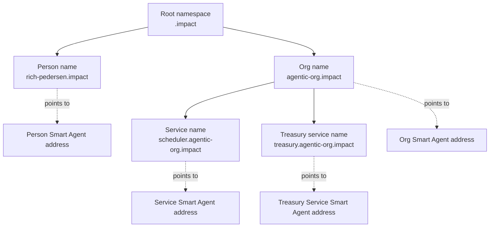

# Naming Service Architecture

Agent names are human-readable facets for Smart Agents. They make agents easier
to find and use, but the canonical identity remains the Smart Agent address
(`CanonicalAgentId`, usually CAIP-10).

Examples:

- `rich-pedersen.impact` points at Rich's person Smart Agent.
- `treasury.rich-pedersen.impact` points at a service Smart Agent for treasury
  work.
- `volunteer.impact` or `agentic-org.impact` can point at org or service Smart
  Agents.

The top-level suffix is deployment configured. `.impact` is a valid app/community
namespace. `.agent` is not special doctrine; it is only one possible root label.

## Mental Model



Names are tree nodes. Every node can have:

- an owner Smart Agent
- a resolver
- typed records such as `addr`, `nativeId`, `displayName`, `a2aEndpoint`,
  `mcpEndpoint`, and `metadataUri`
- an optional subregistry that can issue child names

## Contracts

The naming layer has three main contract surfaces:

| Contract                     | Role                                                                                                                                                 |
| ---------------------------- | ---------------------------------------------------------------------------------------------------------------------------------------------------- |
| `AgentNameRegistry`          | Owns the namespace tree, root initialization, child registration, owner/resolver rotation, subregistry assignment, and primary-name reverse records. |
| `AgentNameAttributeResolver` | Stores typed records for a name node.                                                                                                                |
| `PermissionlessSubregistry`  | Optional child-name issuer for a parent namespace where anyone can claim one child name.                                                             |

The registry is multi-root. It can hold `.impact`, `.member`, `.agent`, or any
other app-approved root. A package or app should not assume one universal suffix.

## Permission Model

### Top-Level Roots Are Permissioned

Creating a root like `.impact` is a governance/deployment action.

`AgentNameRegistry.initializeRoot(label, rootOwner, resolver, kind)` can only be
called by the registry initializer. This is intentional. If top-level roots were
permissionless, an attacker could front-run or squat important community
namespaces.

Use this for:

- `.impact`
- `.member`
- `.donor`
- customer/community controlled namespaces
- any suffix that should have brand, trust, or governance meaning

Root ownership should normally be held by a governance Smart Agent, multisig, or
other custody-governed Smart Agent. The deployer should not remain the long-term
root owner.

### Subdomains Can Be Permissioned

By default, child names are owner-issued. The parent owner registers children
directly through the registry.

Example:

```text
.impact root owner registers rich-pedersen.impact
rich-pedersen.impact owner registers treasury.rich-pedersen.impact
agentic-org.impact owner registers scheduler.agentic-org.impact
```

Use permissioned issuance when:

- names carry organizational trust
- names are employee, role, treasury-service, ministry, or service-agent names
- the parent owner must approve who appears under the namespace
- registration should go through custody policy or governance

### Subdomains Can Be Permissionless

A parent owner can delegate child issuance to a subregistry:

```text
setSubregistry(namehash("impact"), PermissionlessSubregistry)
```

After that, the subregistry can register children under that parent according to
its own policy. The shipped `PermissionlessSubregistry` lets any caller claim one
child name for a chosen owner.

Use permissionless issuance when:

- a public community lets users claim names
- anti-spam rules are enough for the demo or product tier
- the product wants low-friction onboarding
- the child owner should control the name after claim

For production, permissionless does not have to mean "no rules." A product can
ship a different subregistry that requires a fee, invite, credential proof,
allowlist, CAPTCHA-equivalent proof, or rate limit.

## Permissioned Vs Permissionless

| Level                                         | Default                  | Who Can Create                         | Good For                                                  |
| --------------------------------------------- | ------------------------ | -------------------------------------- | --------------------------------------------------------- |
| Root / TLD, e.g. `.impact`                    | Permissioned             | Registry initializer / governance      | Brand and community namespaces                            |
| Child name with no subregistry                | Permissioned             | Parent owner Smart Agent               | Org names, treasury service names, official service names |
| Child name through permissionless subregistry | Permissionless by policy | Any caller accepted by the subregistry | User self-claim, demos, open communities                  |
| Deeper child name                             | Inherits parent policy   | Parent owner or parent subregistry     | Teams, services, treasury services, local groups          |

The parent decides the issuance model for its direct children.

## Creating A Top-Level Domain

This is a deployment/governance operation, not normal app signup.

1. Pick the root label, such as `impact`.
2. Deploy or reuse `AgentNameRegistry` and `AgentNameAttributeResolver`.
3. Choose the root owner Smart Agent or governance address.
4. Call `initializeRoot("impact", rootOwner, resolver, KIND_AGENT)`.
5. Store the deployment config so apps know their naming suffix is `.impact`.

Conceptual call:

```ts
import { encodeFunctionData, keccak256, stringToBytes } from 'viem';
import { agentNameRegistryAbi } from '@agenticprimitives/agent-naming';

const KIND_AGENT = keccak256(stringToBytes('namespace:Agent'));

const data = encodeFunctionData({
  abi: agentNameRegistryAbi,
  functionName: 'initializeRoot',
  args: ['impact', rootOwner, resolver, KIND_AGENT],
});
```

After this, `namehash('impact')` is the parent node for `*.impact` names.

## Creating A Permissioned Subdomain

Use direct registry registration when the parent owner controls issuance.

```ts
import {
  buildRegisterSubnameCall,
  buildRecordCalls,
  namehash,
} from '@agenticprimitives/agent-naming';

const parentNode = namehash('impact');

const register = buildRegisterSubnameCall({
  registry,
  parentNode,
  label: 'rich-pedersen',
  newOwner: richSmartAgent,
  resolver,
});

const childNode = namehash('rich-pedersen.impact');

const records = buildRecordCalls({
  resolver,
  node: childNode,
  records: {
    addr: richSmartAgent,
    nativeId: `eip155:84532:${richSmartAgent}`,
    agentKind: 'person',
    displayName: 'Rich Pedersen',
    a2aEndpoint: 'https://rich-pedersen.agentictrust.io/a2a',
  },
});
```

Submit these calls from the parent owner. In production, that usually means a
Smart Agent custody ceremony or governance execution, not a raw private key.

## Creating A Permissionless Subdomain

Use a subregistry when the parent wants open claims.

Setup by parent owner:

```ts
import { buildSetSubregistryCall, namehash } from '@agenticprimitives/agent-naming';

const setIssuer = buildSetSubregistryCall({
  registry,
  node: namehash('impact'),
  subregistry: permissionlessSubregistry,
});
```

Claim by user:

```ts
import { buildSubregistryRegisterCall } from '@agenticprimitives/agent-naming';

const claim = buildSubregistryRegisterCall({
  subregistry: permissionlessSubregistry,
  label: 'rich-pedersen',
  newOwner: richSmartAgent,
});
```

The subregistry calls the registry, and the resulting
`rich-pedersen.impact` node is owned by `richSmartAgent`.

## Common Product Patterns

### Open Community Signup

```text
Governance creates .impact
Governance installs PermissionlessSubregistry on .impact
User claims rich-pedersen.impact
Connect creates or finds the user's Smart Agent
Resolver records point rich-pedersen.impact at that Smart Agent
```

This is the best fit for low-friction person onboarding.

### Official Org Namespace

```text
Governance creates .impact
Governance registers agentic-org.impact to the org Smart Agent
Org Smart Agent registers staff.agentic-org.impact
Org Smart Agent registers treasury.agentic-org.impact
```

This is the best fit for names that imply official authority.

### Hybrid Namespace

```text
.impact is governance-owned
people.impact uses permissionless claims
orgs.impact is permissioned
services.impact is permissioned or credential-gated
```

This keeps public signup easy while preserving trust for org and service names.

## Naming And Auth Origins

Naming roots are not the same thing as DNS or WebAuthn RP IDs.

`rich-pedersen.impact` is the agent name. It can have an `a2aEndpoint`,
`mcpEndpoint`, or profile record that points to a DNS URL such as:

```text
https://rich-pedersen.agentictrust.io
```

That DNS origin can be used for passkey ceremonies and SSO, while the naming
record remains the chain-resolved facet pointing at the Smart Agent address.

## Rules

- The Smart Agent address is the identity; the name is a facet.
- Root/TLD creation is permissioned.
- Child issuance is decided by the parent owner.
- Permissionless child issuance should happen through an explicit subregistry.
- Resolver records are discovery data, not authorization.
- Apps should configure their naming suffix; packages should not hardcode product
  TLDs.
- Product read paths use direct contract reads or an explicit indexer, not
  `eth_getLogs`.
