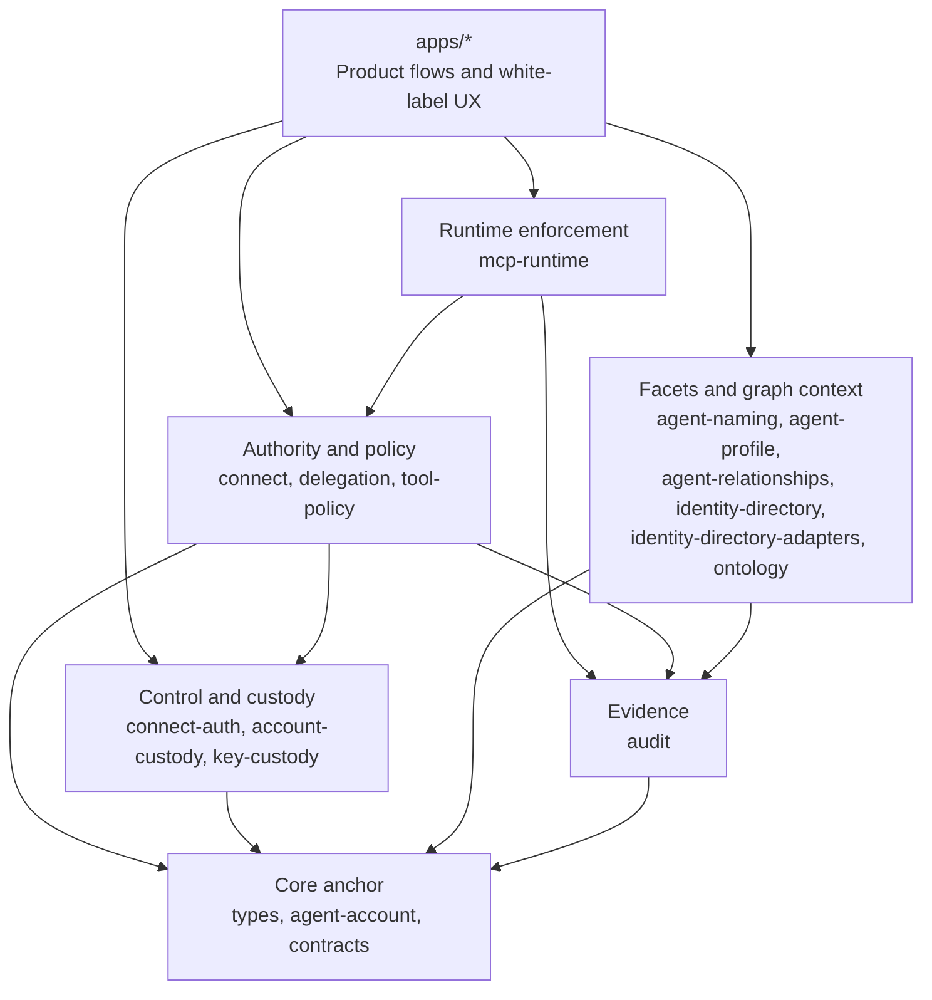
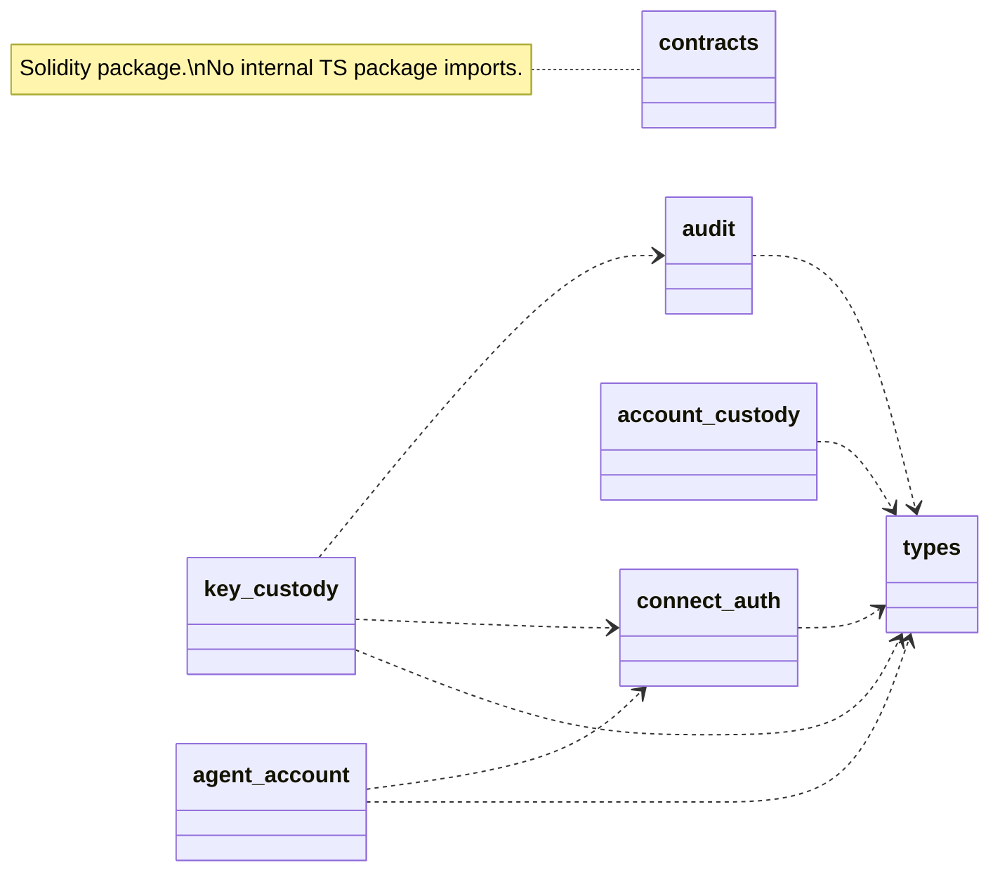
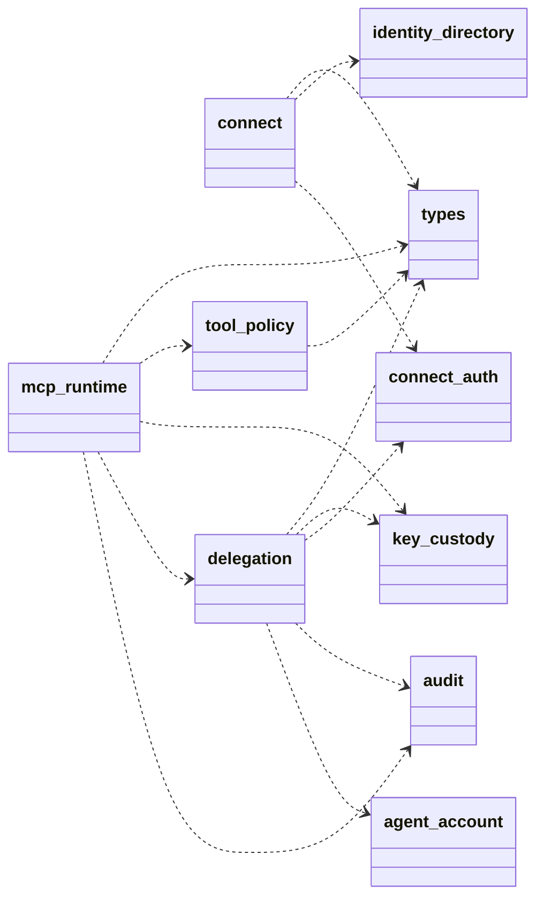
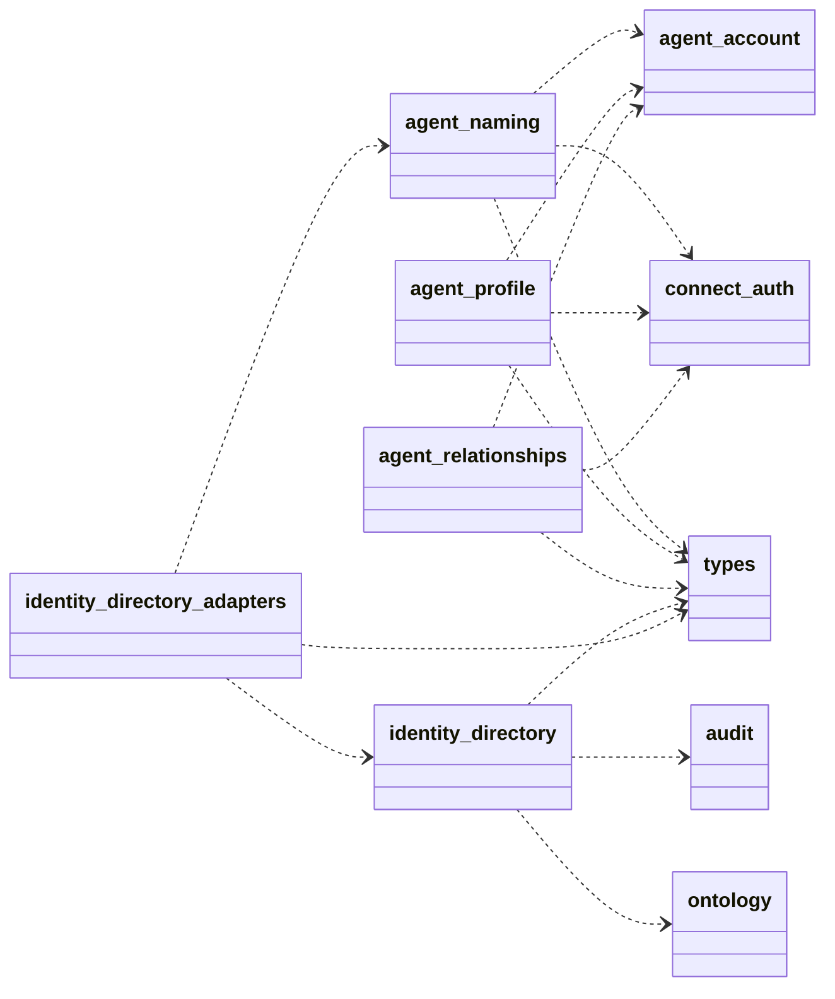

# Package Architecture Guide

This guide is for developers who want to build quickly with the
`@agenticprimitives/*` packages without first reading every spec. It explains the
mental model, how the packages fit together, and which combinations solve common
product flows.

For the short "I need X → import Y" table, use
[`package-consumer-map.md`](./package-consumer-map.md). For ownership conflicts,
use [`task-routing.md`](./task-routing.md). For the formal boundary doctrine, use
[`specs/100-package-boundary-doctrine.md`](../../specs/100-package-boundary-doctrine.md).

## One Sentence

`agenticprimitives` is a native Smart Agent platform: a person, organization, or
service is anchored by a Smart Agent address, and every other surface is a facet,
credential, permission, policy, runtime, or audit trail around that anchor. A
treasury is modeled as a service-agent subtype, not as a fourth Smart Agent kind.

## The Mental Model

Start with four questions:

1. **Who is acting?**  
   A canonical Smart Agent address. This is the identity anchor.

2. **How did they prove control?**  
   A passkey, SIWE wallet, Google login facet, KMS signer, or custody quorum.

3. **What may act on their behalf?**  
   A scoped delegation, tool policy, or connected app permission.

4. **Where is it enforced and evidenced?**  
   Account contracts, MCP/A2A runtime boundaries, audit logs, and package tests.

Do not start with "which SDK do I glue in?" Start with the user journey, then map
the journey to the primitive layers below.

## Layered Package Stack

The first diagram is the mental model. The smaller UML-style diagrams show the
actual import graph. In the import diagrams, arrows point from the package doing
the importing to the package it depends on.



### Core And Custody Imports



### Authority And Runtime Imports



### Directory And Facet Imports



Dependency direction stays one-way. Product flows compose packages in `apps/*`;
packages should not import app code or become white-label product surfaces. The
actual graph is enforced by `pnpm check:dependency-graph` and package boundary
checks.

## Package Roles

For deeper ownership, dependency, and usage guidance, use the per-package
architecture docs:

| Package                       | Detailed Architecture                                                                  |
| ----------------------------- | -------------------------------------------------------------------------------------- |
| `types`                       | [`packages/types.md`](./packages/types.md)                                             |
| `agent-account`               | [`packages/agent-account.md`](./packages/agent-account.md)                             |
| `contracts`                   | [`packages/contracts.md`](./packages/contracts.md)                                     |
| `connect-auth`                | [`packages/connect-auth.md`](./packages/connect-auth.md)                               |
| `account-custody`             | [`packages/account-custody.md`](./packages/account-custody.md)                         |
| `key-custody`                 | [`packages/key-custody.md`](./packages/key-custody.md)                                 |
| `connect`                     | [`packages/connect.md`](./packages/connect.md)                                         |
| `delegation`                  | [`packages/delegation.md`](./packages/delegation.md)                                   |
| `tool-policy`                 | [`packages/tool-policy.md`](./packages/tool-policy.md)                                 |
| `mcp-runtime`                 | [`packages/mcp-runtime.md`](./packages/mcp-runtime.md)                                 |
| `agent-naming`                | [`packages/agent-naming.md`](./packages/agent-naming.md)                               |
| `agent-profile`               | [`packages/agent-profile.md`](./packages/agent-profile.md)                             |
| `agent-relationships`         | [`packages/agent-relationships.md`](./packages/agent-relationships.md)                 |
| `identity-directory`          | [`packages/identity-directory.md`](./packages/identity-directory.md)                   |
| `identity-directory-adapters` | [`packages/identity-directory-adapters.md`](./packages/identity-directory-adapters.md) |
| `ontology`                    | [`packages/ontology.md`](./packages/ontology.md)                                       |
| `audit`                       | [`packages/audit.md`](./packages/audit.md)                                             |

### `types`

Shared branded primitives: `Address`, `Hex`, Smart Agent identifiers, and common
domain types. Use this package when you need type compatibility across packages.
It should remain a leaf package.

### `agent-account`

The ERC-4337 / ERC-1271 Smart Agent account client. Use it to derive addresses,
build UserOps, check deployment, query passkeys or custodians, and interact with
the account/factory contracts. It does not own authentication UI or custody
policy.

### `contracts`

Solidity sources, ABIs, tests, and storage-layout snapshots for the on-chain
primitives. This is where authority must be smallest and most reviewable:
`AgentAccount`, modules, custody policy, delegation manager, naming, enforcers,
and paymaster surfaces.

### `connect-auth`

Credential proof layer. It owns passkey/WebAuthn helpers, SIWE verification,
Google OIDC helpers, JWT cookie sessions, CSRF, salts, and `Signer` interfaces.
It proves a credential; it does not decide product authority.

### `account-custody`

Who controls the Smart Agent: custody actions, quorum policy, recovery,
credential add/remove/replace arguments, and typed-data helpers. Use this when
the operation changes control of the Smart Agent.

### `key-custody`

How service keys are protected: KMS-backed signing, local dev signing,
envelope encryption, service MACs, and viem account adapters. Use this for
relayers, session wrapping, bridge MACs, and operator signers. Do not use raw
private keys in apps.

### `connect`

Agentic Connect broker primitives: asymmetric `AgentSession`, OIDC `id_token`,
JWKS, redirect/code helpers, and issuance gates. Use this when a relying site
needs a verifiable sign-in result from a secure home.

### `delegation`

What an agent may do for another agent: EIP-712 delegation structs, hashing,
caveats, session rows, delegation tokens, revocation-oriented authority. Use this
for connected apps, tool access, and on-behalf-of flows. Do not use it for
credential recovery.

### `tool-policy`

Protocol-agnostic action classification: risk tiers, exact-call rules, and
policy evaluation. Use it before granting or executing sensitive tool actions.
It should not depend on MCP, A2A, LangChain, or UI frameworks.

### `mcp-runtime`

MCP enforcement middleware. It wraps tools, verifies delegation tokens, checks
service MACs and replay state, evaluates policy, then runs handlers. Use it at
the tool boundary, not in browser UI.

### `agent-naming`

Name facet: deployment-configured names like `.impact` to Smart Agent addresses,
resolver calls, reverse records, and name-related contract calls. Apps choose the
top-level naming suffix for their context; names point at the anchor and are not
the identity. See
[`naming-service-architecture.md`](./naming-service-architecture.md) for root,
subdomain, permissioned, and permissionless issuance patterns.

### `agent-profile`

Profile facet: AgentCard, CAIP-10 helpers, profile content hashing, endpoint
verification shapes, and `authOrigin` style properties. Use it for public
metadata and discovery, not login sessions.

### `agent-relationships`

Graph edges between Smart Agents: membership, governance, trust fabric, and
relationship roles. Edges are graph context, not delegations.

### `identity-directory`

Evidence-backed read model that composes naming, profile, relationship,
credential, and indexer reads into queryable answers. Use it to answer "which
agent does this facet point to?" or "which agents match this intent?"

### `identity-directory-adapters`

Adapters for the directory ports: CAIP-10, on-chain, naming, indexer, and app
storage bridges. Use this when wiring a concrete deployment.

### `ontology`

Controlled vocabularies and semantic types for agents, facets, relationships,
skills, and shapes. Use it to keep product data from inventing incompatible
terms.

### `audit`

Audit event schema, sinks, guardrails, and metrics primitives. Use it when a
package or app must emit evidence for security, support, or third-party review.
Concrete persistence is wired by apps.

## Common Flows

### 1. Passkey secure-home sign-in

```text
connect-auth
  -> agent-account
  -> agent-naming / agent-profile
  -> connect
  -> relying app verifies JWKS
```

Use this for deployment-specific names like `alice.impact` or
`rich-pedersen.impact` sign-in. The secure home proves the passkey, resolves the
Smart Agent, issues an `id_token` / `AgentSession`, and the relying site verifies
it.

### 2. Create a new personal Smart Agent

```text
connect-auth creates passkey proof
agent-account derives/deploys Smart Agent
agent-naming claims name
agent-profile records authOrigin/profile facets
audit emits setup evidence
```

The product should tell the person they are getting their own Smart Agent and
personal sign-in page. The code should treat the Smart Agent address as the
canonical subject.

### 3. Add another passkey or recover control

```text
connect-auth proves existing credential
account-custody builds custody action
agent-account executes self-call / UserOp
audit records control change
```

This is custody. Do not route it through `delegation`. Delegations survive
credential rotation because authority belongs to the Smart Agent address.

### 4. Connect a relying app

```text
connect issues signed login result
delegation grants scoped app authority
tool-policy explains risk
audit records grant
```

The relying app becomes a connected app with a permission. It does not become a
custodian.

### 5. Read private data through MCP

```text
delegation token
key-custody service MAC / session key
mcp-runtime withDelegation
tool-policy evaluate
audit event
tool handler
```

This is the runtime enforcement path. The MCP server should receive only the
authority it needs and should emit evidence for each decision.

### 6. Discover agents for an intent

```text
agent-naming
agent-profile
agent-relationships
ontology
identity-directory
identity-directory-adapters
```

Use this when matching a user-defined intent to agents by name, role, skills,
relationships, geography, or validation signals. Discovery is a read model over
facets and graph context; it is not an auth path.

### 7. Operate a relayer or service signer

```text
key-custody
agent-account
audit
```

Use `key-custody` to produce a KMS-backed viem account. That account can pay gas
or submit transactions without app code holding raw private keys.

## Composition Rules

- **Credential proof is not account control.** `connect-auth` proves a passkey or
  wallet. `agent-account` and `account-custody` decide what that proof controls.
- **Custody is not delegation.** Credential add/remove/recovery belongs to
  `account-custody`. App permissions belong to `delegation`.
- **Names and profiles are facets.** `agent-naming` and `agent-profile` point at
  a Smart Agent address. They do not replace it.
- **Policy stays protocol-agnostic.** Keep `tool-policy` free of MCP, A2A, and
  UI imports.
- **Runtime adapters live at the edge.** MCP-specific logic belongs in
  `mcp-runtime`; A2A-specific logic should earn `a2a-runtime` before becoming a
  package.
- **No silent fallback chains.** One read/auth path, one mechanism. Empty is an
  answer, not a trigger to try a different mechanism.
- **Apps compose; packages stay generic.** White-label copy, community language,
  deploy domains, and vertical UX belong in apps or config, not packages.

## Where To Start

| Goal                                     | Start with                                             |
| ---------------------------------------- | ------------------------------------------------------ |
| "I need login with passkeys"             | `packages/connect-auth/README.md`                      |
| "I need a Smart Agent address or UserOp" | `packages/agent-account/README.md`                     |
| "I need to add/recover credentials"      | `packages/account-custody/README.md`                   |
| "I need SSO / JWKS / OIDC"               | `packages/connect/README.md`                           |
| "I need connected-app authority"         | `packages/delegation/README.md`                        |
| "I need to classify a tool/action"       | `packages/tool-policy/README.md`                       |
| "I need MCP enforcement"                 | `packages/mcp-runtime/README.md`                       |
| "I need names/profiles/relationships"    | `agent-naming`, `agent-profile`, `agent-relationships` |
| "I need to wire real storage/indexers"   | `identity-directory` + `identity-directory-adapters`   |
| "I need relayer/KMS signing"             | `packages/key-custody/README.md`                       |
| "I need audit evidence"                  | `packages/audit/README.md`                             |

## Developer Checklist

Before building a flow, answer:

- What is the canonical Smart Agent address?
- Which credential or signer is proving control?
- Is this custody or delegated authority?
- What is the revocation path?
- Which package owns the invariant?
- Which app owns the UX and deployment config?
- What evidence will an auditor or support operator inspect?

If you cannot answer those, start with the relevant spec before writing code.
