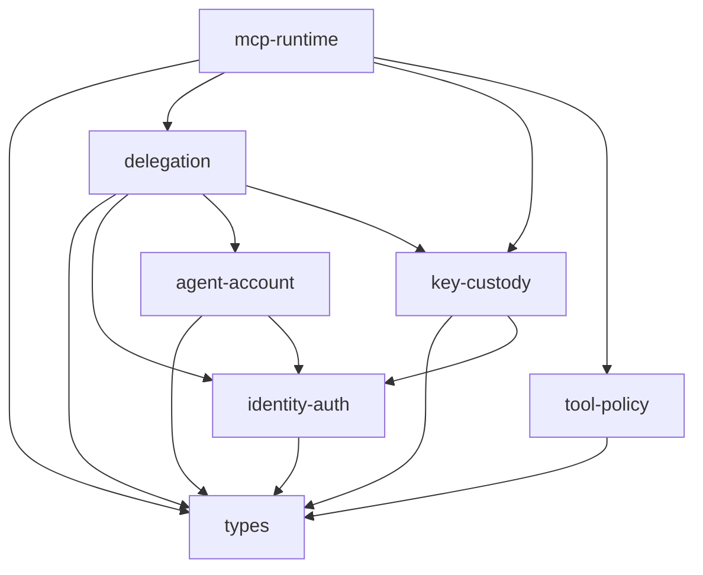
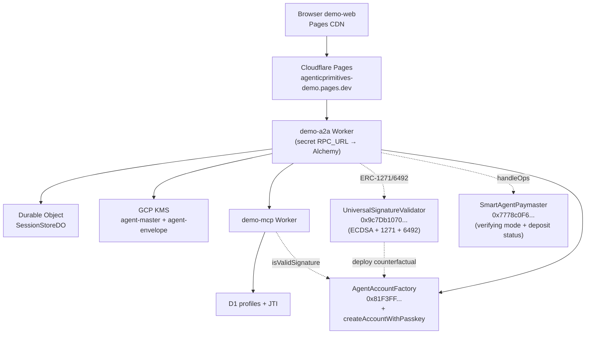

# Product Readiness Architecture Audit

**Status:** living document — refreshed at the end of each hardening pass
**Last refreshed:** 2026-05-20 (hardening pass 5c — audit reconciliation + deploy-script hygiene)
**Original draft:** 2026-05-19
**Scope:** all `@agenticprimitives/*` packages, demo apps, contracts, deploy path, CI, architecture docs, live production deployment
**Verdict:** strong pre-alpha architecture with a working vertical slice end-to-end on Base Sepolia; not product-ready until the P0/P1 controls below are closed.

This document is intentionally direct. It treats the repo as if it were preparing for a third-party security and technical architecture review.

## Audit layout

This system-level audit pairs with per-package `AUDIT.md` files. Per the
doctrine "each package is a product boundary", an external reviewer
should be able to evaluate ONE package by reading just that package's
source + its `AUDIT.md`, cross-referencing this system audit for
cross-cutting concerns.

- **Index of all audits:** [`docs/audits/index.md`](../audits/index.md)
- **Per-package audits:**
  [types](../../packages/types/AUDIT.md) ·
  [identity-auth](../../packages/identity-auth/AUDIT.md) ·
  [agent-account](../../packages/agent-account/AUDIT.md) ·
  [delegation](../../packages/delegation/AUDIT.md) ·
  [key-custody](../../packages/key-custody/AUDIT.md) ·
  [tool-policy](../../packages/tool-policy/AUDIT.md) ·
  [mcp-runtime](../../packages/mcp-runtime/AUDIT.md)
- **Template for new package audits:** [`docs/audits/_template.md`](../audits/_template.md)
- **Findings ID convention:** system-level findings use letter+number (C1, H3, N2); package-local findings use `<PKG>-N` (e.g. `DEL-1`, `KC-1`).

---

## What's Closed Since 2026-05-19

| ID | Change | Impact on audit |
| --- | --- | --- |
| (H4 partial) | **Passkey arc complete** — `identity-auth/passkey` is fully implemented; on-chain `_verifyWebAuthn` proven end-to-end via Playwright virtual authenticator + live Base Sepolia smoke test. Google auth remains a stub. | H4 reduced from P1 to P2 — only Google remains a stub. |
| (new) | **`UniversalSignatureValidator` deployed live** at `0x9c7Db1070BeC933f6456D0F65DEDa9Ae74bbbC96` (Base Sepolia). Verifies ECDSA + ERC-1271 + ERC-6492 in one entry point. demo-a2a's `/auth/siwe-verify` no longer does ECDSA recovery — dispatch happens on-chain. | Architectural improvement: demo-a2a is now signer-agnostic. Closes a long-standing coupling between server-side verification and signer method. |
| (new) | **Counterfactual signature support** — passkey-owned accounts sign SIWE / delegations via ERC-6492 envelope; validator deploys the account in `eth_call` simulation before ERC-1271 verification. No "is account deployed?" checks in app code. | Removes a UX cliff and a class of "deploy before verify" race conditions. |
| (RPC URL in `[vars]`) | **`RPC_URL` moved from public `[env.production.vars]` to wrangler secret** on both demo-a2a and demo-mcp. API-keyed URLs (Alchemy / Infura / etc.) no longer in tracked config. | One leak vector closed; documented in `apps/demo-a2a/wrangler.toml` so future deployers know the pattern. |
| (new) | **PasskeySigner adapter (Phase 4b)** — viem-shaped signer that produces `0x01`-prefixed WebAuthn blobs. demo-web's `deploy-flow.ts` + `authorize-flow.ts` accept either an EOA viem account or a PasskeySigner — no branch elsewhere. | Demonstrates the signer-agnostic doctrine at the consumer layer; closes the passkey arc. |
| (new) | **`/account/derive-address` server-side view-call relay** — browser no longer needs an RPC URL; demo-a2a does the factory view call. Keeps RPC API keys server-side. | Necessary corollary to moving `RPC_URL` to a secret. |
| (new) | **15-spec Playwright e2e suite** including the full passkey flow (Step 0 → 1 → 1.5 → 2 → 3) using Chrome DevTools Protocol virtual authenticator. | Closes some of M4 (test pyramid). Full strategy from `specs/110-test-strategy.md` still incomplete; layers 5 (Anvil system tests beyond E2E), 6 (deployed smoke), and 7 (type locks + property tests) still missing. |
| (C1 follow-up) | **Local MAC production posture clarified** — `LocalAesProvider` now refuses production only for session-data-key envelope encryption/decryption. `generateMac()` remains available in production as HMAC-SHA256 over a wrangler-secret-loaded value. `LocalSecp256k1Signer` still refuses production. | Corrects an overbroad guard: service MAC can be production-valid with a shared secret, while session key wrapping still requires managed KMS. Remaining hardening: managed HMAC key support/rotation policy (N13). |
| (C2/N3) | **Paymaster lockdown + monitoring landed** — `SmartAgentPaymaster` now supports verifying-paymaster mode; demo-a2a signs paymaster envelopes through the master KMS account; `/paymaster/status` exposes deposit health for monitors. | Closes C2 and N3 for the demo architecture. Remaining production work is operational: alert wiring, runbooks, and clean governance. |
| (M7) | **Supply-chain CI landed** — CodeQL, `pnpm audit`, gitleaks, SBOM generation, Dependabot, local `pnpm check:supply-chain`, and runbook docs are in place. | Closes M7 as an audit finding. |
| (deploy hygiene) | **Shell scripts are executable and stray Windows metadata removed** — `apps/contracts/setup.sh`, `scripts/dev.sh`, and `scripts/set-cloudflare-secrets.sh` now have executable mode; `fresh-sa.json:Zone.Identifier` was removed. | No finding closed, but reduces setup/deploy friction and metadata noise. |

---

## New Findings (raised by today's review)

| ID | Severity | Finding | Evidence | Why now |
| --- | --- | --- | --- | --- |
| **N1** | **P0** | **Leaked deployer key controls live demo governance.** The deployer EOA `0x31ed17fb99e82E02085Ab4B3cbdaB05489098b44` has been disclosed multiple times in chat transcripts (and in earlier prior commits) — yet it is currently authorized as `governance`, `bundlerSigner`, and `sessionIssuer` on the live `AgentAccountFactory` (`0x81F3FF...`), and as `owner` + `governance` on the live `SmartAgentPaymaster` (`0xf181cB7...`). Anyone with the leaked private key can: rotate factory roles to a hostile address (no timelock in our factory), withdraw stake from the paymaster after the configured 1-day unstake delay, pause the paymaster, and submit malicious bundler txs from the live bundlerSigner role. | `cloudflare-urls.json` deployer field; chat history; `AgentAccountFactory.setBundlerSigner` is `onlyGovernance`, no timelock in our contract. | Accepted for internal demo only. Production requires rotating roles to a clean key OR redeploying contracts with a clean deployer. |
| **N2** | **P1** | **`/account/derive-address` had no input validation or rate limit.** | `apps/demo-a2a/src/index.ts` `/account/derive-address` handler. | **CLOSED 2026-05-20.** Validation + simple per-IP rate limit landed. Broader A2A numeric parsing remains open as N11. |
| **N3** | **P1** | **Paymaster had no balance monitoring or auto-refill.** Production hit `AA31 paymaster deposit too low` in real users' faces — caught only by manual `cast send EntryPoint.depositTo(paymaster, ...)`. | Live incident on 2026-05-20; `/paymaster/status` now exposes deposit and threshold status. | **CLOSED 2026-05-20.** Remaining work moved under M8: alert routing + refill runbook. |
| **N4** | **P2** | **Verification gas ceiling is wasteful on RIP-7212 chains.** Default `verificationGasLimit = 1_200_000n` for passkey deploys covers anvil's pure-Solidity P-256 fallback (~350k) but is ~4× the actual gas used on Base Sepolia (with RIP-7212 precompile). EntryPoint pre-funds against the ceiling, so paymaster deposit drains 4× faster than necessary. | `packages/agent-account/src/client.ts:374` (`buildDeployUserOpWithPasskey`). | Cost amplifier even with monitoring. Easy fix: per-chain config. |
| **N5** | **P2** | **No live canary / deployed smoke test.** Live deploy state is only verified by the user manually trying the demo. Silent failures (RPC quota burned, paymaster drained, GCP KMS quota exhausted, certificate expiry) only surface when a real user hits them. | Absence of post-deploy hook in `scripts/deploy-cloudflare.ts`. | Intersects M4 (test pyramid). Should run after every deploy + on a schedule. |
| **N6** | **P2** | **Old orphaned contracts on Base Sepolia.** Previous deploy at `0x4879fCAe.../0x06fc483b65...` (factory / paymaster) is unused but still exists. The old paymaster has stake. Same `0x31ed` deployer controls both old and new — see N1. | `cloudflare-urls.json` (current) vs prior commit messages noting old addresses. | Funds recoverable via `withdrawStake` after the unstake delay. |
| **N7** | **P3** | **No documented account recovery for passkey-only smart accounts.** If a user loses their only registered passkey, the account is bricked. The contract supports `addPasskey` / `removePasskey` (both `onlySelf`) and a single passkey-only account can be promoted to multi-sig via `addOwner`, but no UI flow exists. | `apps/contracts/src/AgentAccount.sol` `_passkeyStorage`; absence of recovery in `apps/demo-web`. | Will surface on first real-user passkey loss. |
| **N8** | **P0** | **`tool-policy.evaluatePolicy()` still fails open for unknown or incomplete classification metadata.** `withDelegation()` now calls the policy engine when a classification is provided, but the pure policy engine returns `allow` for empty objects, unknown tags, missing risk tier, or missing auth/tool tags. | `packages/tool-policy/src/decision.ts`; `packages/mcp-runtime/src/with-delegation.ts` makes classification optional for back-compat. | H2 is closed at the runtime integration layer, but policy correctness still needs a fail-closed default. |
| **N9** | **P1** | **`/session/package` stores delegations even when ERC-1271 verification fails.** The route calculates `isValidSignature()` and returns `erc1271Verified`, but persists the package regardless of false. | `apps/demo-a2a/src/index.ts` `/session/package`. | This can create misleading or invalid session state; production should reject failed signature verification. |
| **N10** | **P1** | **Production preflight exists but is not yet strict enough.** The script checks several shapes, but does not fully prove production secrets are present, `A2A_KMS_BACKEND=gcp-kms` is enforced at runtime, the paymaster is non-dev/locked down, every production tool has classification + audit sink, or the skip flag is policy-controlled. | `scripts/check-production-deploy.ts`. | C4 moved from "missing" to "partial"; it is still a launch gate, not a completed control. |
| **N11** | **P1** | **A2A BigInt parsing remains unsafe outside `/account/derive-address`.** `/session/deploy` and `/session/deploy/submit` still parse user-supplied strings with `BigInt(...)` directly. | `apps/demo-a2a/src/index.ts` deploy routes. | N2 is closed for one endpoint; the same validation pattern must cover all browser-facing numeric input. |
| **N12** | **P1** | **Credentialed CORS still reflects the request origin.** `cors({ origin: (origin) => origin ?? '*', credentials: true })` is too broad for cookie-authenticated APIs. | `apps/demo-a2a/src/index.ts` CORS middleware. | CSRF is now wired, but CORS should still be exact-whitelist when credentials are enabled. |
| **N13** | **P2** | **Managed production MAC key support is not yet implemented.** Shared-secret HMAC is acceptable for production service auth, but there is no GCP KMS HMAC backend, key rotation story, or key-id verification policy yet. | `key-custody` local MAC implementation; demo apps use `A2A_MAC_SECRET`. | Not a blocker for internal demo, but needed before scale and multi-service key rotation. |
| **N14** | **P2** | **Passkey ceremonies use user verification as preferred rather than required.** | `identity-auth` passkey flow and demo-web passkey signer path. | Decide whether production requires UV or document the accepted risk. |
| **N15** | **P2** | **Contracts lack a dedicated audit dossier.** | `apps/contracts` has tests and architecture docs, but no `AUDIT.md` covering invariants, upgrade/governance assumptions, paymaster economics, and `UniversalSignatureValidator`. | Needed before third-party review. |

---

## Top Priorities (Next Hardening Pass)

These are the items the next pass should close. Selected by impact × ease — biggest reduction in attack surface per hour of work.

| # | ID | Action | Effort | Owner |
| --- | --- | --- | --- | --- |
| **1** | **N8** | **Make `tool-policy.evaluatePolicy()` fail closed.** Deny empty classification, unknown `@sa-tool`, unknown `@sa-auth`, missing/unknown risk tier, and missing delegation for delegation-verified tools. Add negative unit tests. | 1 h | tool-policy |
| **2** | **N9** | **Reject invalid delegation packages.** `/session/package` must fail when ERC-1271 validation returns false or reverts; do not persist the package. | 30 min | apps/demo-a2a |
| **3** | **N10/C4** | **Tighten production preflight.** Require GCP signing + envelope keys for production session encryption/signing, `A2A_MAC_SECRET` or managed HMAC config, exact CORS allowlist, non-dev paymaster mode, audit sink wiring, tool classification, and skip-flag approval policy. | 2-3 h | deploy scripts + apps |
| **4** | **N11** | **Apply input validation to all A2A deploy routes.** Reuse the `/account/derive-address` validators for `/session/deploy` and `/session/deploy/submit`; return 400 instead of throwing. | 1 h | apps/demo-a2a |
| **5** | **N12** | **Lock CORS to `ALLOWED_ORIGINS` for credentialed requests.** No reflect-origin fallback in production; localhost only in development. | 30 min | apps/demo-a2a |

The next pass after these should pick up **N1 (production key rotation)**, **C3 (identity-auth/key-custody envelope/deploy audit events)**, **H5 (cross-delegation)**, **N13 (managed MAC key/rotation)**, and **M8 (operational runbooks + alerts)**.

---

## Executive Verdict (carried forward from 2026-05-19, updated)

The core decomposition is sound. The seven-package split follows the repo doctrine: identity, account substrate, delegation authority, key custody, protocol-agnostic policy, MCP runtime, and shared types are separated with explicit dependency direction.

The implementation is now beyond a stub scaffold: the demo path exercises SIWE, passkey-only smart accounts, counterfactual signatures via ERC-6492, deterministic addressing, paymaster-sponsored deployment, session encryption, delegation packaging, delegation-token minting, MCP verification, D1-backed JTI tracking, and Cloudflare deployment — **all proven end-to-end on Base Sepolia with passkey ownership** as of 2026-05-20. GCP KMS support is materially useful: `agent-master` signs secp256k1 digests through HSM, while `agent-envelope` wraps session data keys through symmetric encrypt/decrypt.

It is not product-ready yet. The highest risks are:
- **N1**: production governance must move off the leaked demo deployer before any external use.
- **C3/C4/N10**: audit coverage is mostly closed, but production preflight is not complete enough to be a launch gate.
- **N8/N9/N11/N12**: policy fail-closed behavior, delegation packaging, deploy-route validation, and credentialed CORS need a focused hardening pass.

Board-style launch decision: **Internal demo only.** The repository can support controlled demos and architecture review, but it should not be used for external pilots until the top-5 hardening pass lands AND production key rotation, stricter preflight, and full audit coverage are closed.

Severity language used in this audit:

| Severity | Meaning | Launch impact |
| --- | --- | --- |
| P0 / Critical | A production blocker that can compromise authority, funds, keys, or auditability. | Must fix before any external deployment. |
| P1 / High | Must fix before external pilot or beta. | Blocks customer/user exposure. |
| P2 / Medium | Hardening before scale. | May be accepted only with explicit risk sign-off. |
| P3 / Low | Polish, maintainability, or clearly accepted demo risk. | Track but does not block demo. |

Production rule: **demo shortcuts must be impossible to activate in production.** A production boot or deploy should fail if mock auth, dev private keys, seed routes, bypass tokens, local-only session secrets, unprotected debug endpoints, counterfactual-only verification, or accept-all sponsorship are enabled.

---

## Architecture Summary



Runtime topology (Base Sepolia production):



Primary trust boundaries:

| Boundary | Current control | Product-readiness concern |
| --- | --- | --- |
| Browser to A2A | SIWE + JWT cookie + CSRF double-submit token | **N12**: credentialed CORS still reflects origin. |
| A2A SIWE verification | Universal validator on-chain (ECDSA + 1271 + 6492) | Strong direction; depends on validator being audited. |
| A2A session storage | Durable Object + envelope-encrypted session package | Production requires GCP envelope key; **C3**: no append-only audit. |
| A2A to KMS | GCP service account with key-scoped IAM | Demo reuses one SA; split for production. |
| A2A to MCP | Delegation token + HMAC service envelope + nonce/JTI replay tracking | **N13**: managed MAC key + rotation story still missing. |
| MCP to chain | ERC-1271 + revocation + caveat checks | H3 closed for production; keep RPC outage tests in CI. |
| UserOp sponsorship | EntryPoint + verifying paymaster + KMS relayer + status endpoint | C2/N3 closed for demo; production still needs alert wiring and runbook. |
| Governance | Demo deployer EOA (0x31ed...) | **N1**: accepted for internal demo only; production needs clean governance. |
| Package boundaries | Manifest checks + forbidden-term checks + import checks | Good baseline; not a substitute for behavioral tests. |

---

## Package Review (deltas only since 2026-05-19)

### `@agenticprimitives/identity-auth`

- **+** `verifyUserSignature` / `verifyUserSignatureView` / `verifyOnchain` (siwe) now ship, calling the universal validator.
- **+** Passkey methods (`buildWebAuthnAssertion`, `parseAttestationObject`, etc.) fully implemented.
- **-** Google method still a stub (H4 partial).
- **+** CSRF helpers are now enforced in demo-a2a mutating routes.

### `@agenticprimitives/agent-account`

- **+** `buildDeployUserOpWithPasskey`, `encodeWebAuthnSignature`, `SIG_TYPE_WEBAUTHN`, `getAddressForPasskey` shipped.
- **+** ABI now declares `FailedOp` + `FailedOpWithRevert` so viem decodes EntryPoint reverts.
- **-** N4 — `verificationGasLimit: 1.2M` ceiling wasteful on RIP-7212 chains.

### `@agenticprimitives/delegation`

- **+** H3 closed: revocation read now defaults to fail-closed when `NODE_ENV=production`, with explicit `revocationFailMode='open'` available for dev/demo.
- **+** C3 partially closed: `verifyDelegationToken()` can emit `delegation.verify.{accept,reject}` through an `AuditSink`.
- **-** Mint/revoke audit events still missing.

### `@agenticprimitives/key-custody`

- **+** `LocalAesProvider` production guard narrowed to session-data-key encryption/decryption. `generateMac()` now works in production as shared-secret HMAC for service auth.
- **-** M1, M2 still open.
- **-** N13 — managed HMAC key / rotation policy still missing.

### `@agenticprimitives/mcp-runtime`

- **+** C1 closed at the runtime level: `generateServiceMac()` / `verifyServiceMac()` bind audience, service, route, nonce, timestamp, and body digest.
- **+** H2 closed at integration level: `withDelegation()` accepts classification and denies policy `deny` / `requires-consent`.
- **+** C3 partially closed: `withDelegation()` and service-MAC verification emit accept/reject audit events when an `AuditSink` is provided.
- **-** `classification` and `auditSink` are still optional for back-compat; production preflight should forbid omission.

### `@agenticprimitives/tool-policy`

- **+** Runtime integration exists through `mcp-runtime`.
- **-** N8 — pure policy engine still returns allow for unknown / incomplete classification metadata.

---

## Demo App / Deploy Review (deltas)

### `apps/demo-web`

- **+** Step 0 signer chooser (EOA / Passkey).
- **+** `passkey-flow.ts`, `passkey-signer.ts`, `passkey-siwe-flow.ts`, `erc6492-wrap.ts`.
- **+** Steps 1.5 / 2 / 3 work for both signer kinds.
- **-** Still stores mnemonic in localStorage (accepted demo risk).
- **-** No passkey recovery UX (N7).

### `apps/demo-a2a`

- **+** `verifyOnchain` (universal validator) for SIWE verification — signer-agnostic.
- **+** `addressIsSmartAccount: true` siwe-verify flag for passkey path.
- **+** `/session/deploy` `initMethod` enum (eoa / passkey).
- **+** `/account/derive-address` server-side view-call relay.
- **+** CSRF middleware on mutating routes.
- **+** `/account/derive-address` validation + simple per-IP rate limit.
- **+** `RPC_URL` now a wrangler secret.
- **-** **N9** — `/session/package` persists even when ERC-1271 verification fails.
- **-** **N11** — deploy routes still parse untrusted BigInt values directly.
- **-** **N12** — credentialed CORS still reflects origin.

### `apps/demo-mcp`

- **+** M3 closed: `/_dev/seed` is guarded for production.
- **+** Service-MAC middleware verifies A2A requests before delegation parsing and emits audit events.
- **+** D1 audit sink (`audit_events`) wired via `composeSinks(console, d1)`.

### `apps/contracts`

- **+** `UniversalSignatureValidator` (116 LOC, ported from smart-agent) deployed live.
- **+** `AgentAccount.initializeWithPasskey` + `AgentAccountFactory.createAccountWithPasskey` + `getAddressForPasskey`.
- **+** `SmartAgentPaymaster` verifying mode deployed live at `0x7778c0F6...` with dev mode off.
- **+** 17 new Forge tests for passkey-owned accounts + 9 new for the universal validator.
- **-** Still no third-party audit.
- **-** **N1** — governance roles all held by the leaked deployer key.
- **-** Old orphaned contracts (N6).

### Deploy and CI

- **+** Validator address propagated through `gen-dev-vars.ts` + `deploy-cloudflare.ts`.
- **+** Playwright passkey e2e (`05-passkey-login.spec.ts`) with virtual authenticator.
- **+** C4 partially closed: `scripts/check-production-deploy.ts` exists and runs production-shape checks.
- **+** M7 closed: supply-chain workflow + local check + runbook exist.
- **+** Deploy/dev shell scripts are executable; stray `Zone.Identifier` metadata file removed.
- **-** **N10** — preflight is not yet strict enough for production.
- **-** **N5** — no post-deploy smoke / scheduled canary.

---

## Open Findings — Critical

| ID | Finding | Impact | Owner | Remediation |
| --- | --- | --- | --- | --- |
| **N1** | Leaked demo deployer key controls live demo governance. | **Accepted internal-demo risk only.** This blocks any external or production use of the current deployment. | contracts + ops | For production: generate a clean deployer, rotate `bundlerSigner` / `sessionIssuer` (factory) + paymaster ownership/governance, or redeploy with clean governance. Then burn the leaked key and document the runbook. |
| ~~**C1**~~ | ~~Service-to-service authentication is not load-bearing.~~ | **CLOSED 2026-05-20.** `mcp-runtime.{generateServiceMac,verifyServiceMac}` shipped + wired into demo-a2a/demo-mcp. MAC binds audience + service + route + nonce + timestamp + body digest. Nonce replay tracked via JTI store. 18 unit tests + e2e proof. Current production-acceptable path is shared-secret HMAC via wrangler secret; managed HMAC rotation remains N13. | — | Done. |
| ~~**C2**~~ | ~~Paymaster is not production-safe by default.~~ | **CLOSED 2026-05-20.** Verifying-paymaster mode is live, demo-a2a signs paymaster envelopes via the master KMS account, and dev mode is off on the current paymaster. | — | Keep contract tests and monitor signer/governance drift. |
| **C3** | Full product audit/forensics trail is incomplete. | Security incidents cannot be reconstructed end-to-end yet. **MOSTLY CLOSED 2026-05-20 (pass 5b)** — `@agenticprimitives/audit` package, mcp-runtime/service-MAC accept+reject events, delegation verify accept+reject events, delegation mint events, key-custody signA2AAction events (Local + GCP), D1 sink, and per-request correlationId all wired. Remaining: identity-auth caller-emit + key-custody envelope encrypt/decrypt emission + PII guardrail sink (`createPiiGuardrailSink`) — none are launch blockers. Demo-a2a uses console-only sink (no D1 binding yet); demo-mcp persists to D1 — unifying destinations is a future-spec item. | cross-cutting | Continue: identity-auth emit at caller sites, envelope encrypt/decrypt emit, PII guardrail sink, then make production preflight require a durable sink. |
| **C4** | Production deploy hard-fail gate is partial, not complete. | Demo shortcuts or missing production secrets can still slip through because checks are shape-based and incomplete. | deploy scripts, apps, contracts | Close N10: stricter checks for KMS, MAC secret/key, non-dev paymaster, exact CORS, audit sink, tool classification, and skip-flag policy. |
| **N8** | `tool-policy.evaluatePolicy()` fails open for unknown/incomplete classification. | An unclassified or malformed tool can be allowed by default. | tool-policy | **Top priority #1.** Deny missing/unknown classification fields and add negative tests. |

## Open Findings — High

| ID | Finding | Impact | Owner | Remediation |
| --- | --- | --- | --- | --- |
| ~~**H1**~~ | ~~CSRF is not enforced on cookie-authenticated A2A mutations.~~ | **CLOSED 2026-05-20.** demo-a2a now uses a double-submit CSRF token for mutating routes. | — | Keep tests and ensure production preflight rejects disabled CSRF. |
| ~~**H2**~~ | ~~Policy classification is not enforced in MCP runtime.~~ | **CLOSED 2026-05-20.** `withDelegation` now accepts `opts.classification` and runs `evaluatePolicy()` after delegation verify. Fail-closed on `deny` + `requires-consent`. demo-mcp wires `GET_PROFILE_CLASSIFICATION`. | — | Done. |
| ~~**H3**~~ | ~~Revocation check tolerates RPC failure.~~ | **CLOSED 2026-05-20.** `revocationFailMode` defaults closed in production. | — | Keep explicit dev/demo opt-out only. |
| ~~**N2**~~ | ~~/account/derive-address has no input validation or rate limit.~~ | **CLOSED 2026-05-20** for this endpoint. | — | Broader A2A BigInt validation remains open as N11. |
| ~~**N3**~~ | ~~Paymaster has no balance monitoring or auto-refill.~~ | **CLOSED 2026-05-20.** `/paymaster/status` exposes deposit health and threshold status for external monitors. | ops + apps/demo-a2a | Follow-up: wire alerting and document refill runbook under M8. |
| **H5** | Cross-delegation is not implemented. | Steward/data-owner and cross-agent flows cannot be supported. | delegation, mcp-runtime | Implement delegate-binding and data-scope verification with negative tests. |
| **N9** | `/session/package` stores delegations even when ERC-1271 verification fails. | Invalid sessions can be persisted and later confuse authorization state. | apps/demo-a2a | **Top priority #2.** Reject on false/reverted ERC-1271 result. |
| **N10** | Production preflight is incomplete. | Deploy can pass while still missing launch-critical guarantees. | deploy scripts + apps | **Top priority #3.** Expand preflight checks and define skip approval policy. |
| **N11** | Other A2A deploy routes still parse untrusted BigInts directly. | Malformed inputs can produce 500s and possible DoS. | apps/demo-a2a | **Top priority #4.** Reuse strict uint256/hex/address validation across deploy routes. |
| **N12** | Credentialed CORS reflects origin. | Cookie-authenticated API is exposed more broadly than intended. | apps/demo-a2a | **Top priority #5.** Exact whitelist via `ALLOWED_ORIGINS`; localhost only in dev. |

## Open Findings — Medium

| ID | Finding | Impact | Owner | Remediation |
| --- | --- | --- | --- | --- |
| **H4** | Google auth surface is incomplete. | Public API implies Google support; method throws. | identity-auth | Mark experimental in docs OR implement. (Passkey portion of original H4 is now closed.) |
| **M1** | AWS KMS backend is advertised but not implemented. | Consumers selecting AWS get runtime errors. | key-custody | Hide AWS from stable docs OR implement provider + signer + tests. |
| **M2** | Per-tool executor keys are not isolated. | Tool compromise has master-key blast radius. | key-custody | Implement per-tool KMS key selection + IAM separation. |
| ~~**M3**~~ | ~~Dev-only profile seeder exposed in MCP app.~~ | **CLOSED 2026-05-20.** Route is production-gated and preflight checks for unguarded `/_dev/*` routes. | — | Keep regression check. |
| **M4** | Test pyramid is incomplete in CI. | Integration regressions across packages, deployed contracts, browser flows may escape. | repo CI | Add cross-package integration, Anvil system tests, E2E, smoke, property tests, type locks. |
| **M5** | Local fallback and dev secret names remain in production-shaped app code. | Misconfiguration can route production through dev paths. | apps/demo-a2a, key-custody, deploy scripts | Production deploy must require GCP for session encryption/signing. Local MAC via `A2A_MAC_SECRET` is acceptable, but should be explicitly configured and rotated. |
| **M6** | Documentation drift exists. | Reviewers may trust stale comments. | key-custody | Refresh package docs after the LocalAesProvider MAC guard change + add doc drift check. |
| ~~**M7**~~ | ~~Supply-chain + static-analysis gates are minimal.~~ | **CLOSED 2026-05-20** (Phase 5a). `.github/workflows/security.yml`: CodeQL (security-extended) SAST + `pnpm audit --audit-level=high` + gitleaks + CycloneDX SBOM artifact. `pnpm check:supply-chain` mirrors locally. Dependabot weekly + security-update-immediate. Runbook + branch-protection setup in `docs/audits/supply-chain.md`. | — | Done. |
| **M8** | Reliability posture is not yet specified. | RPC outages, KMS errors, D1 failures may produce inconsistent auth. | apps, deploy docs | Define retry policy, timeout budgets, fail-closed paths, alerting, runbooks. |
| **N4** | Verification gas ceiling wasteful on RIP-7212 chains. | Paymaster deposit drains 4× faster than necessary. | agent-account, deploy config | Per-chain `verificationGasLimit` config (e.g. 400k on Base, 1.2M on anvil). |
| **N5** | No live canary / deployed smoke test. | Silent breakages only surface on real-user request. | repo CI + deploy scripts | Add post-deploy smoke + scheduled canary. |
| **N6** | Old orphaned contracts on Base Sepolia. | Funds locked in old paymaster's stake; same leaked key (N1) controls them. | ops | Withdraw stake from old paymaster after unstake delay; document deprecation. |
| **N13** | Managed production MAC key support is missing. | Shared secret works, but rotation/IAM/key-id story is immature. | key-custody + apps | Add GCP KMS HMAC backend or document shared-secret rotation policy as the production v0 posture. |
| **N14** | Passkey user verification is not required. | UV-less credentials may be accepted depending on platform behavior. | identity-auth + demo-web | Decide `required` vs `preferred`; encode in spec and tests. |
| **N15** | Contracts lack dedicated audit dossier. | Third-party reviewer lacks one place for invariants and threat model. | apps/contracts | Add `apps/contracts/AUDIT.md` covering factory, account, paymaster, enforcers, delegation manager, validator. |

## Open Findings — Low

| ID | Finding | Notes |
| --- | --- | --- |
| **L1** | Demo browser stores mnemonic in localStorage. | Accepted demo risk. |
| **L2** | Memory JTI store is not distributed-safe. | Test-only; documented. |
| **L3** | Some docs still describe old deployment assumptions. | Reconcile after audit remediation pass. |
| **N7** | No documented account recovery for passkey-only accounts. | Will surface on first real passkey loss. Mitigation: encourage multi-passkey enrollment + multi-sig promotion via `addOwner`. |

---

## Product-Readiness Checklist (refreshed)

Must fix before production:

- [ ] **N1**: Rotate / replace the leaked deployer key controlling factory governance + paymaster ownership.
- [ ] **C3**: Finish append-only audit events for identity-auth, key-custody envelope encrypt/decrypt, deployment/paymaster actions, and PII guardrail sink.
- [ ] **C4/N10**: Production preflight that fails on demo mode, dev keys, missing KMS/MAC/audit/classification config, seed routes, accept-all paymaster, and unsafe CORS.
- [ ] **N8**: Make `tool-policy.evaluatePolicy()` fail closed for missing/unknown classification.
- [ ] **N9**: Reject `/session/package` when ERC-1271 verification fails.
- [ ] **N11**: Input validation + rate limits on all browser-facing A2A deploy/package routes.
- [ ] **N12**: Exact CORS allowlist for credentialed A2A requests.
- [ ] **M4**: Add system + E2E + smoke CI gates for the full deployed flow.
- [ ] **M5**: Production deploy hard-fails on local session encryption/signing backends.
- [ ] Third-party smart-contract audit.

Closed in current hardening passes:

- [x] **C1**: HMAC service envelopes for A2A-to-MCP.
- [x] **H1**: CSRF on browser-cookie mutating routes.
- [x] **H2**: `tool-policy.evaluatePolicy()` wired into `withDelegation()`.
- [x] **H3**: Production revocation check fail-closed.
- [x] **N2**: `/account/derive-address` input validation + rate limit.
- [x] **C2**: Verifying paymaster mode for sponsored UserOps.
- [x] **N3**: Paymaster status endpoint for deposit health monitoring.
- [x] **M3**: `/_dev/*` production route guard.
- [x] **M7**: Supply-chain checks (dependency audit, secret scanning, SAST, SBOM).

Should fix before beta:

- [ ] **H4**: Implement Google auth OR remove from product-facing promises.
- [ ] **H5**: Implement cross-delegation.
- [ ] **M1**: Implement AWS KMS OR mark unsupported.
- [ ] **M2**: Implement per-tool executor keys.
- [ ] **M6**: Doc drift cleanup.
- [ ] **M8**: Operational runbooks for RPC, KMS, D1, Worker, Durable Object failures.
- [ ] Paymaster alerting + refill runbook.
- [ ] **N4**: Per-chain `verificationGasLimit` config.
- [ ] **N5**: Live canary smoke test on schedule.
- [ ] **N7**: Documented passkey recovery / multi-passkey enrollment flow.
- [ ] **N13**: Managed MAC key or documented shared-secret rotation policy.
- [ ] **N14**: Passkey UV decision (`required` vs `preferred`) encoded in spec/tests.
- [ ] **N15**: `apps/contracts/AUDIT.md`.
- [ ] Property tests for caveat evaluation, AAD binding, policy decisions.
- [ ] Public API type tests.
- [ ] Rate limits + abuse controls for browser-facing and MCP-facing routes.

Accepted demo risks:

- Demo EOA mnemonic in browser localStorage (L1).
- Local Anvil secrets in `.dev.vars` (auto-generated).
- Demo profile data seeded in D1 via `/_dev/seed` (mitigation: M3).
- Single GCP service account for multiple key permissions.
- Minimal UI consent copy on delegation grants.

Deferred roadmap items:

- `a2a-runtime` package.
- Framework adapters (LangChain / Vercel AI SDK / etc.).
- Contracts ABI / deployments package.
- Account relay / paymaster policy package.
- External audit-chain anchoring (e.g. Sigsum, Rekor).

---

## Continuous Audit Process

Every PR that touches auth, keys, delegation, policy, MCP, contracts, or deploy should include:

```text
Security note:
- What authority does this introduce or change?
- What signs, decrypts, or stores sensitive material?
- What is the fail-closed path?
- What replay, expiry, nonce, or JTI protection exists?
- What audit event is emitted?
- Which package owns the invariant?
- Which demo shortcut, if any, is explicitly non-production?
```

Reviewer checklist:

- Package boundary still matches `capability.manifest.json`.
- Public API matches spec and architecture docs.
- Security invariants have tests.
- New runtime paths call existing primitives rather than reimplementing crypto or verification.
- Error messages do not leak auth failure mode to external callers.
- Production deploy cannot silently use local secrets.
- Production deploy cannot enable demo shortcuts.
- Data handling is reviewed for browser exposure, logs, PII retention, and seeded demo data.
- Agent/tool execution is gated by verified authority and policy, not just UI affordances.
- New docs update specs when behavior changes.

---

## Audit History

| Date | Pass | Highlights |
| --- | --- | --- |
| 2026-05-19 | Initial audit draft | 4 P0, 5 P1, 8 P2, 3 P3 findings catalogued. |
| 2026-05-20 | Phase 4b refresh | Closed: H4 partial (passkey done), passkey arc, RPC-in-config leak. Added: N1 (leaked deployer key), N2 (`/account/derive-address` validation), N3 (paymaster monitoring), N4 (gas ceiling), N5 (live canary), N6 (orphaned contracts), N7 (passkey recovery). |
| 2026-05-20 | Hardening pass 1 | Partially closed: **C4** (production preflight exists, stricter launch checks remain N10). Closed: **M3** (`/_dev/seed` gating), **H1** (CSRF middleware on demo-a2a), **H3** (fail-closed revocation in production), **N2** (input validation + rate limit on `/account/derive-address`). |
| 2026-05-20 | Hardening pass 2 | Closed: **C1** (HMAC service envelope A2A→MCP, load-bearing with nonce replay-tracking + clock-skew bound), **H2** (`tool-policy.evaluatePolicy()` wired into `withDelegation` with deny/requires-consent handling). Added follow-up **N8** for fail-closed policy metadata validation. N1 remains accepted internal-demo risk only; production must rotate to clean governance. |
| 2026-05-20 | Hardening pass 3a | Partially closed: **C3** (audit/forensics trail) — new `@agenticprimitives/audit` package with `AuditEvent` + `AuditSink` + console/memory/compose sinks, mcp-runtime emits accept/reject events from `withDelegation` + `verifyServiceMac`, demo-mcp wires console sink. Per-package emission across `delegation` / `key-custody` / `identity-auth` is the follow-up. |
| 2026-05-20 | Hardening pass 3b | C3 extended: `delegation.verifyDelegationToken` emits `delegation.verify.{accept,reject}` per call; sink threaded through from `mcp-runtime.withDelegation`. Durable D1 sink ships as `createD1AuditSink(db)` in demo-mcp alongside the existing JTI store adapter + migration `0002_audit_events.sql` (append-only audit_events table with action/outcome/correlation_id indices). demo-mcp now wires `composeSinks(console, d1)` so a D1 outage never blackholes forensics. Remaining: key-custody + identity-auth emission, mint/revoke events, runtime PII-leak guardrail sink. |
| 2026-05-20 | Hardening pass 3c | Refreshed after LocalAesProvider MAC guard split. Confirmed shared-secret HMAC is acceptable for service auth while local envelope encryption/signing remain non-production. Added N8-N15 residual findings and reprioritized next hardening pass. |
| 2026-05-20 | Phase 4 | Closed: **C2** (paymaster lockdown) — SmartAgentPaymaster gains a verifying-paymaster mode (ERC-4337 v0.7 reference pattern); on-chain ECDSA recovery against a designated KMS-backed signer; demo-a2a signs every paymaster envelope via the master KMS account; live paymaster at `0x7778c0F6...` with `verifyingSigner=0x3C7B58...` and dev mode off. **N3** (paymaster monitoring) — new `GET /paymaster/status` endpoint returns deposit + threshold + 503/200 toggle for external monitors. 8 new Forge tests; 103 total Forge tests passing. |
| 2026-05-20 | Phase 5a | Closed: **M7** (supply-chain CI). `.github/workflows/security.yml`: CodeQL `security-extended` SAST + `pnpm audit --audit-level=high` + gitleaks + CycloneDX SBOM. Dependabot weekly + security-update-immediate. `pnpm check:supply-chain` mirrors the workflow locally. Runbook + branch-protection setup in `docs/audits/supply-chain.md`. Local pre-flight clean (3 moderate deps below threshold; no high/critical). |
| 2026-05-20 | Phase 5b | C3 progressed to **MOSTLY CLOSED**. `delegation.mintDelegationToken` now accepts `{ auditSink, correlationId }` and emits `delegation.mint` per call (`subject: jti`, `audience` populated, fail-soft on sink errors, 2 new tests in `token.test.ts`). `key-custody.BuildOpts` gained an `auditSink` field threaded through `buildSignerBackend` into `LocalSecp256k1Signer` and `GcpKmsSigner`; both emit `key-custody.sign` on every `signA2AAction` with hashed sessionId (`keccak256(sessionId).slice(0,18)`) per the CLAUDE.md invariant "Raw sessionId MUST NEVER be logged". demo-a2a wires a console-only sink today (no D1 binding) and propagates `X-Correlation-Id` to demo-mcp for trail stitching. Spec drafted: `specs/206-audit.md`. Doctrine drift caught + fixed: manifest.publicExports + manifest.imports synced for agent-account / identity-auth / mcp-runtime / delegation / key-custody (carry-over from earlier passes). Remaining C3 slice: identity-auth caller-emit, envelope encrypt/decrypt emit, `createPiiGuardrailSink`. |
