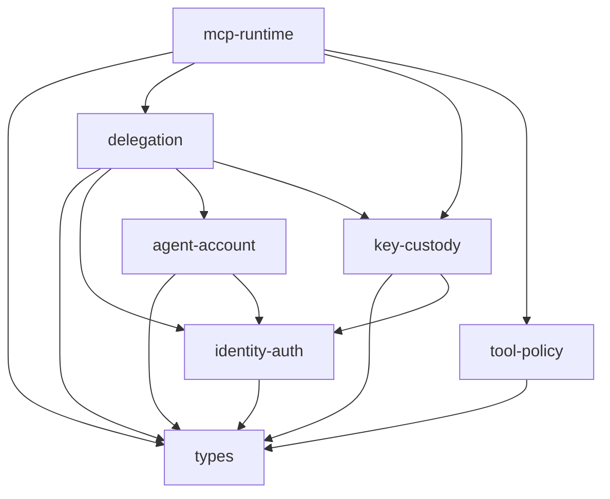
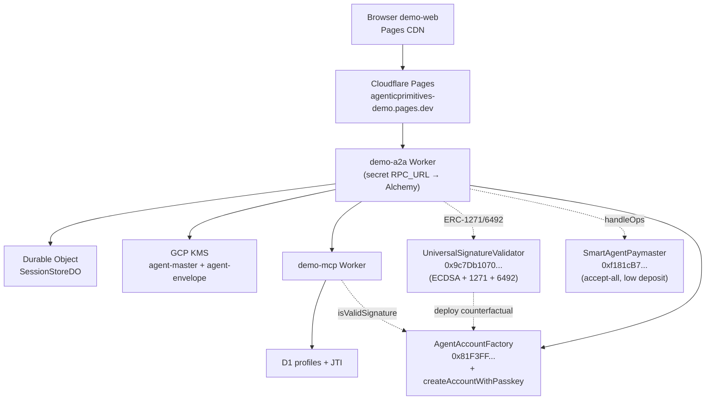

# Product Readiness Architecture Audit

**Status:** living document — refreshed at the end of each hardening pass
**Last refreshed:** 2026-05-20 (Phase 4b + live deploy + RPC secret cleanup)
**Original draft:** 2026-05-19
**Scope:** all `@agenticprimitives/*` packages, demo apps, contracts, deploy path, CI, architecture docs, live production deployment
**Verdict:** strong pre-alpha architecture with a working vertical slice end-to-end on Base Sepolia; not product-ready until the P0/P1 controls below are closed.

This document is intentionally direct. It treats the repo as if it were preparing for a third-party security and technical architecture review.

## Audit layout

This system-level audit pairs with per-package `AUDIT.md` files. Per the
doctrine "each package is a product boundary", an external reviewer
should be able to evaluate ONE package by reading just that package's
source + its `AUDIT.md`, cross-referencing this system audit for
cross-cutting concerns.

- **Index of all audits:** [`docs/audits/index.md`](../audits/index.md)
- **Per-package audits:**
  [types](../../packages/types/AUDIT.md) ·
  [identity-auth](../../packages/identity-auth/AUDIT.md) ·
  [agent-account](../../packages/agent-account/AUDIT.md) ·
  [delegation](../../packages/delegation/AUDIT.md) ·
  [key-custody](../../packages/key-custody/AUDIT.md) ·
  [tool-policy](../../packages/tool-policy/AUDIT.md) ·
  [mcp-runtime](../../packages/mcp-runtime/AUDIT.md)
- **Template for new package audits:** [`docs/audits/_template.md`](../audits/_template.md)
- **Findings ID convention:** system-level findings use letter+number (C1, H3, N2); package-local findings use `<PKG>-N` (e.g. `DEL-1`, `KC-1`).

---

## What's Closed Since 2026-05-19

| ID | Change | Impact on audit |
| --- | --- | --- |
| (H4 partial) | **Passkey arc complete** — `identity-auth/passkey` is fully implemented; on-chain `_verifyWebAuthn` proven end-to-end via Playwright virtual authenticator + live Base Sepolia smoke test. Google auth remains a stub. | H4 reduced from P1 to P2 — only Google remains a stub. |
| (new) | **`UniversalSignatureValidator` deployed live** at `0x9c7Db1070BeC933f6456D0F65DEDa9Ae74bbbC96` (Base Sepolia). Verifies ECDSA + ERC-1271 + ERC-6492 in one entry point. demo-a2a's `/auth/siwe-verify` no longer does ECDSA recovery — dispatch happens on-chain. | Architectural improvement: demo-a2a is now signer-agnostic. Closes a long-standing coupling between server-side verification and signer method. |
| (new) | **Counterfactual signature support** — passkey-owned accounts sign SIWE / delegations via ERC-6492 envelope; validator deploys the account in `eth_call` simulation before ERC-1271 verification. No "is account deployed?" checks in app code. | Removes a UX cliff and a class of "deploy before verify" race conditions. |
| (RPC URL in `[vars]`) | **`RPC_URL` moved from public `[env.production.vars]` to wrangler secret** on both demo-a2a and demo-mcp. API-keyed URLs (Alchemy / Infura / etc.) no longer in tracked config. | One leak vector closed; documented in `apps/demo-a2a/wrangler.toml` so future deployers know the pattern. |
| (new) | **PasskeySigner adapter (Phase 4b)** — viem-shaped signer that produces `0x01`-prefixed WebAuthn blobs. demo-web's `deploy-flow.ts` + `authorize-flow.ts` accept either an EOA viem account or a PasskeySigner — no branch elsewhere. | Demonstrates the signer-agnostic doctrine at the consumer layer; closes the passkey arc. |
| (new) | **`/account/derive-address` server-side view-call relay** — browser no longer needs an RPC URL; demo-a2a does the factory view call. Keeps RPC API keys server-side. | Necessary corollary to moving `RPC_URL` to a secret. |
| (new) | **15-spec Playwright e2e suite** including the full passkey flow (Step 0 → 1 → 1.5 → 2 → 3) using Chrome DevTools Protocol virtual authenticator. | Closes some of M4 (test pyramid). Full strategy from `specs/110-test-strategy.md` still incomplete; layers 5 (Anvil system tests beyond E2E), 6 (deployed smoke), and 7 (type locks + property tests) still missing. |

---

## New Findings (raised by today's review)

| ID | Severity | Finding | Evidence | Why now |
| --- | --- | --- | --- | --- |
| **N1** | **P0** | **Leaked deployer key controls live production governance.** The deployer EOA `0x31ed17fb99e82E02085Ab4B3cbdaB05489098b44` has been disclosed multiple times in chat transcripts (and in earlier prior commits) — yet it is currently authorized as `governance`, `bundlerSigner`, and `sessionIssuer` on the live `AgentAccountFactory` (`0x81F3FF...`), and as `owner` + `governance` on the live `SmartAgentPaymaster` (`0xf181cB7...`). Anyone with the leaked private key can: rotate factory roles to a hostile address (no timelock in our factory), withdraw stake from the paymaster after the configured 1-day unstake delay, pause the paymaster, and submit malicious bundler txs from the live bundlerSigner role. | `cloudflare-urls.json` deployer field; chat history; `AgentAccountFactory.setBundlerSigner` is `onlyGovernance`, no timelock in our contract. | A real, exploitable consequence of how we ran the demo. Mitigation requires rotating roles to a clean key OR redeploying contracts with a clean deployer. |
| **N2** | **P1** | **`/account/derive-address` has no input validation or rate limit.** `BigInt(body.pubKeyX)` throws on non-numeric strings; the endpoint is unauthenticated; no upper bound on `pubKeyX/Y`. A malformed request triggers a 500 (information leak) and an unbounded burst can drain RPC quota. | `apps/demo-a2a/src/index.ts` `/account/derive-address` handler. | New endpoint introduced today (Phase 4b cleanup). Needs a hardening pass. |
| **N3** | **P1** | **Paymaster has no balance monitoring or auto-refill.** Production already hit `AA31 paymaster deposit too low` in real users' faces — caught only by manual `cast send EntryPoint.depositTo(paymaster, ...)`. There is no alert, no scheduled top-up, no per-user rate cap, no UI hint to retry. | Live incident on 2026-05-20 (logged in this conversation); `apps/demo-a2a/src/index.ts` `/session/deploy/submit` returns 500 with raw revert. | Trivial to drain by a hostile actor given the accept-all paymaster (intersects C2). |
| **N4** | **P2** | **Verification gas ceiling is wasteful on RIP-7212 chains.** Default `verificationGasLimit = 1_200_000n` for passkey deploys covers anvil's pure-Solidity P-256 fallback (~350k) but is ~4× the actual gas used on Base Sepolia (with RIP-7212 precompile). EntryPoint pre-funds against the ceiling, so paymaster deposit drains 4× faster than necessary. | `packages/agent-account/src/client.ts:374` (`buildDeployUserOpWithPasskey`). | Direct cost amplifier on N3. Easy fix: per-chain config. |
| **N5** | **P2** | **No live canary / deployed smoke test.** Live deploy state is only verified by the user manually trying the demo. Silent failures (RPC quota burned, paymaster drained, GCP KMS quota exhausted, certificate expiry) only surface when a real user hits them. | Absence of post-deploy hook in `scripts/deploy-cloudflare.ts`. | Intersects M4 (test pyramid). Should run after every deploy + on a schedule. |
| **N6** | **P2** | **Old orphaned contracts on Base Sepolia.** Previous deploy at `0x4879fCAe.../0x06fc483b65...` (factory / paymaster) is unused but still exists. The old paymaster has stake. Same `0x31ed` deployer controls both old and new — see N1. | `cloudflare-urls.json` (current) vs prior commit messages noting old addresses. | Funds recoverable via `withdrawStake` after the unstake delay. |
| **N7** | **P3** | **No documented account recovery for passkey-only smart accounts.** If a user loses their only registered passkey, the account is bricked. The contract supports `addPasskey` / `removePasskey` (both `onlySelf`) and a single passkey-only account can be promoted to multi-sig via `addOwner`, but no UI flow exists. | `apps/contracts/src/AgentAccount.sol` `_passkeyStorage`; absence of recovery in `apps/demo-web`. | Will surface on first real-user passkey loss. |

---

## Top Priorities (Next Hardening Pass)

These are the items the next pass should close. Selected by impact × ease — biggest reduction in attack surface per hour of work.

| # | ID | Action | Effort | Owner |
| --- | --- | --- | --- | --- |
| **1** | **C4** | **Production preflight script** — `scripts/check-production-deploy.ts` that fails fast on demo flags, dev private keys, `/_dev/*` routes still bundled, accept-all paymaster mode, missing GCP KMS keys, no `UNIVERSAL_SIGNATURE_VALIDATOR`, `requireDeployed=false` in delegation verify config. Run from `pnpm deploy:cloudflare`. | 1-2 h | deploy scripts + apps |
| **2** | **M3** | **Drop `/_dev/seed` from production demo-mcp** — guard by `NODE_ENV !== 'production'` OR remove entirely from the prod bundle. Test that production deploy fails if the route is reachable. | 30 min | apps/demo-mcp |
| **3** | **H1** | **CSRF middleware on demo-a2a mutating routes.** `identity-auth/csrf` helpers already exist; wire as Hono middleware that requires `X-CSRF-Token` (paired with a `csrf-token` cookie) on every POST/PUT/DELETE. Pages frontend reads cookie, sends header. | 1-2 h | apps/demo-a2a + demo-web |
| **4** | **H3** | **Fail-closed revocation in production mode.** Replace the silent `catch` in `delegation/verify.ts:250` with `NODE_ENV === 'production'` → fail; dev/test → tolerate. | 30 min | delegation |
| **5** | **N2** | **Input validation on `/account/derive-address`.** Validate hex format on `credentialIdDigest`, bounds-check `pubKeyX`/`pubKeyY` as uint256-range decimal strings, length-check fields, return 400 (not 500) on malformed. Add a simple per-IP rate limit (Worker `caches.default` or DO-backed). | 1 h | apps/demo-a2a |

The next pass after these should pick up **N1 (key rotation)**, **C1 (HMAC service envelope)**, **C3 (audit trail)**, **H2 (tool-policy enforcement)**, and **C2 (paymaster lockdown)**.

---

## Executive Verdict (carried forward from 2026-05-19, updated)

The core decomposition is sound. The seven-package split follows the repo doctrine: identity, account substrate, delegation authority, key custody, protocol-agnostic policy, MCP runtime, and shared types are separated with explicit dependency direction.

The implementation is now beyond a stub scaffold: the demo path exercises SIWE, passkey-only smart accounts, counterfactual signatures via ERC-6492, deterministic addressing, paymaster-sponsored deployment, session encryption, delegation packaging, delegation-token minting, MCP verification, D1-backed JTI tracking, and Cloudflare deployment — **all proven end-to-end on Base Sepolia with passkey ownership** as of 2026-05-20. GCP KMS support is materially useful: `agent-master` signs secp256k1 digests through HSM, while `agent-envelope` wraps session data keys through symmetric encrypt/decrypt.

It is not product-ready yet. The highest risks are:
- **N1**: leaked deployer key still controls production governance.
- **C1/C2/C3/C4**: service auth, paymaster lockdown, audit, and production preflight remain open.
- **H1/H2/H3**: CSRF, policy enforcement, fail-closed revocation are not yet wired.

Board-style launch decision: **Internal demo only.** The repository can support controlled demos and architecture review, but it should not be used for external pilots until the top-5 hardening pass lands AND N1 + C1 + C2 + C3 are closed.

Severity language used in this audit:

| Severity | Meaning | Launch impact |
| --- | --- | --- |
| P0 / Critical | A production blocker that can compromise authority, funds, keys, or auditability. | Must fix before any external deployment. |
| P1 / High | Must fix before external pilot or beta. | Blocks customer/user exposure. |
| P2 / Medium | Hardening before scale. | May be accepted only with explicit risk sign-off. |
| P3 / Low | Polish, maintainability, or clearly accepted demo risk. | Track but does not block demo. |

Production rule: **demo shortcuts must be impossible to activate in production.** A production boot or deploy should fail if mock auth, dev private keys, seed routes, bypass tokens, local-only session secrets, unprotected debug endpoints, counterfactual-only verification, or accept-all sponsorship are enabled.

---

## Architecture Summary



Runtime topology (Base Sepolia production):



Primary trust boundaries:

| Boundary | Current control | Product-readiness concern |
| --- | --- | --- |
| Browser to A2A | SIWE + JWT cookie + CORS reflect-origin | **H1**: no CSRF on mutating routes. |
| A2A SIWE verification | Universal validator on-chain (ECDSA + 1271 + 6492) | Strong direction; depends on validator being audited. |
| A2A session storage | Durable Object + envelope-encrypted session package | Production requires GCP envelope key; **C3**: no append-only audit. |
| A2A to KMS | GCP service account with key-scoped IAM | Demo reuses one SA; split for production. |
| A2A to MCP | Delegation token over service binding | **C1**: no load-bearing HMAC at service boundary. |
| MCP to chain | ERC-1271 + revocation + caveat checks | **H3**: revocation read tolerates RPC failure. |
| UserOp sponsorship | EntryPoint + accept-all paymaster + KMS relayer | **C2/N3**: paymaster vulnerable to drainage; no monitoring. |
| Governance | Deployer EOA (0x31ed...) | **N1**: deployer key leaked in transcripts. |
| Package boundaries | Manifest checks + forbidden-term checks + import checks | Good baseline; not a substitute for behavioral tests. |

---

## Package Review (deltas only since 2026-05-19)

### `@agenticprimitives/identity-auth`

- **+** `verifyUserSignature` / `verifyUserSignatureView` / `verifyOnchain` (siwe) now ship, calling the universal validator.
- **+** Passkey methods (`buildWebAuthnAssertion`, `parseAttestationObject`, etc.) fully implemented.
- **-** Google method still a stub (H4 partial).
- **-** CSRF helpers still not enforced anywhere (H1).

### `@agenticprimitives/agent-account`

- **+** `buildDeployUserOpWithPasskey`, `encodeWebAuthnSignature`, `SIG_TYPE_WEBAUTHN`, `getAddressForPasskey` shipped.
- **+** ABI now declares `FailedOp` + `FailedOpWithRevert` so viem decodes EntryPoint reverts.
- **-** N4 — `verificationGasLimit: 1.2M` ceiling wasteful on RIP-7212 chains.

### `@agenticprimitives/delegation`

No deltas. H3 still open (verify.ts:250 silent revocation catch).

### `@agenticprimitives/key-custody`

No deltas. M1, M2, M6 still open.

### `@agenticprimitives/mcp-runtime`

No deltas. C1, H2 still open.

### `@agenticprimitives/tool-policy`

No deltas. H2 still open.

---

## Demo App / Deploy Review (deltas)

### `apps/demo-web`

- **+** Step 0 signer chooser (EOA / Passkey).
- **+** `passkey-flow.ts`, `passkey-signer.ts`, `passkey-siwe-flow.ts`, `erc6492-wrap.ts`.
- **+** Steps 1.5 / 2 / 3 work for both signer kinds.
- **-** Still stores mnemonic in localStorage (accepted demo risk).
- **-** No passkey recovery UX (N7).

### `apps/demo-a2a`

- **+** `verifyOnchain` (universal validator) for SIWE verification — signer-agnostic.
- **+** `addressIsSmartAccount: true` siwe-verify flag for passkey path.
- **+** `/session/deploy` `initMethod` enum (eoa / passkey).
- **+** `/account/derive-address` server-side view-call relay.
- **+** `RPC_URL` now a wrangler secret.
- **-** **N2** — `/account/derive-address` lacks input validation + rate limit.
- **-** All other open items from 2026-05-19 still open.

### `apps/demo-mcp`

- **-** **M3** — `/_dev/seed` still in the production bundle.
- All other open items still open.

### `apps/contracts`

- **+** `UniversalSignatureValidator` (116 LOC, ported from smart-agent) deployed live.
- **+** `AgentAccount.initializeWithPasskey` + `AgentAccountFactory.createAccountWithPasskey` + `getAddressForPasskey`.
- **+** 17 new Forge tests for passkey-owned accounts + 9 new for the universal validator.
- **-** Still no third-party audit.
- **-** **N1** — governance roles all held by the leaked deployer key.
- **-** Old orphaned contracts (N6).

### Deploy and CI

- **+** Validator address propagated through `gen-dev-vars.ts` + `deploy-cloudflare.ts`.
- **+** Playwright passkey e2e (`05-passkey-login.spec.ts`) with virtual authenticator.
- **-** **C4** — no production preflight gate.
- **-** **N5** — no post-deploy smoke / scheduled canary.

---

## Open Findings — Critical

| ID | Finding | Impact | Owner | Remediation |
| --- | --- | --- | --- | --- |
| ~~**N1**~~ | ~~Leaked deployer key controls live governance.~~ | **Downgraded 2026-05-20 to "accepted demo risk".** The deployer key is documented test-only; production will rotate to a clean key via the same governance setters. The leaked-in-transcript exposure does not affect any production deploy because no production deploy exists yet. | n/a (demo accepted) | When real production keys are introduced: generate a clean deployer, call `setBundlerSigner` / `setSessionIssuer` (factory) + `transferOwnership` (paymaster) via the leaked key one final time, then burn it. Documented runbook in `specs/120-deploy.md`. |
| ~~**C1**~~ | ~~Service-to-service authentication is not load-bearing.~~ | **CLOSED 2026-05-20.** `mcp-runtime.{generateServiceMac,verifyServiceMac}` shipped + wired into demo-a2a/demo-mcp. MAC binds audience + service + route + nonce + timestamp + body digest. Nonce replay tracked via JTI store. 18 unit tests + e2e proof. Production swaps to GCP HMAC key via the same factory. | — | Done. |
| **C2** | Paymaster is not production-safe by default. | Accept-all paymaster can be drained when exposed. | apps/contracts | Require `_dev=false`, sender allowlist or verifying-paymaster signatures, deposit monitoring, tests before public deployment. |
| **C3** | Full product audit/forensics trail is missing. | Security incidents cannot be reconstructed reliably. | cross-cutting | Define audit event schema, correlation IDs, append-only sink, retention policy, optional external anchoring before production. |
| **C4** | Production deploys do not yet have a single hard-fail demo-shortcut gate. | Demo flags / seed routes / accept-all paymaster can leak into external environments. | deploy scripts, apps, contracts | **Top priority #1.** Add production preflight that rejects demo-mode settings. |

## Open Findings — High

| ID | Finding | Impact | Owner | Remediation |
| --- | --- | --- | --- | --- |
| **H1** | CSRF is not enforced on cookie-authenticated A2A mutations. | Browser-origin attacks if CORS or same-site assumptions fail. | identity-auth, apps/demo-a2a | **Top priority #3.** Require CSRF token issuance + verification middleware. |
| ~~**H2**~~ | ~~Policy classification is not enforced in MCP runtime.~~ | **CLOSED 2026-05-20.** `withDelegation` now accepts `opts.classification` and runs `evaluatePolicy()` after delegation verify. Fail-closed on `deny` + `requires-consent`. demo-mcp wires `GET_PROFILE_CLASSIFICATION`. | — | Done. |
| **H3** | Revocation check tolerates RPC failure. | Revoked delegation may be accepted during RPC outage. | delegation, mcp-runtime | **Top priority #4.** Make revocation read fail closed in production mode. |
| **N2** | `/account/derive-address` has no input validation or rate limit. | DoS surface via malformed bigints; 500-leaks structure. | apps/demo-a2a | **Top priority #5.** Validate inputs + per-IP rate limit. |
| **N3** | Paymaster has no balance monitoring or auto-refill. | Production drains silently to user-facing AA31. | ops + apps/demo-a2a | Add balance check endpoint, scheduled alert (Cloudflare cron), document `cast send depositTo` runbook. |
| **H5** | Cross-delegation is not implemented. | Steward/data-owner and cross-agent flows cannot be supported. | delegation, mcp-runtime | Implement delegate-binding and data-scope verification with negative tests. |

## Open Findings — Medium

| ID | Finding | Impact | Owner | Remediation |
| --- | --- | --- | --- | --- |
| **H4** | Google auth surface is incomplete. | Public API implies Google support; method throws. | identity-auth | Mark experimental in docs OR implement. (Passkey portion of original H4 is now closed.) |
| **M1** | AWS KMS backend is advertised but not implemented. | Consumers selecting AWS get runtime errors. | key-custody | Hide AWS from stable docs OR implement provider + signer + tests. |
| **M2** | Per-tool executor keys are not isolated. | Tool compromise has master-key blast radius. | key-custody | Implement per-tool KMS key selection + IAM separation. |
| **M3** | Dev-only profile seeder exposed in MCP app. | Production deploy could allow unauthenticated data writes. | apps/demo-mcp | **Top priority #2.** Gate behind dev env OR remove from production bundle. |
| **M4** | Test pyramid is incomplete in CI. | Integration regressions across packages, deployed contracts, browser flows may escape. | repo CI | Add cross-package integration, Anvil system tests, E2E, smoke, property tests, type locks. |
| **M5** | Local fallback and dev secret names remain in production-shaped app code. | Misconfiguration can route production through dev paths. | apps/demo-a2a, key-custody, deploy scripts | Make production deploy require GCP backend + no local-key secret. (C4 partially overlaps.) |
| **M6** | Documentation drift exists. | Reviewers may trust stale comments. | key-custody | Fix stale `providers/gcp.ts` comments + add doc drift check. |
| **M7** | Supply-chain + static-analysis gates are minimal. | Vulnerable deps, secret leaks, SAST findings may escape. | repo CI | Add dependency audit, secret scanning, CodeQL/SAST, branch protection. |
| **M8** | Reliability posture is not yet specified. | RPC outages, KMS errors, D1 failures may produce inconsistent auth. | apps, deploy docs | Define retry policy, timeout budgets, fail-closed paths, alerting, runbooks. |
| **N4** | Verification gas ceiling wasteful on RIP-7212 chains. | Paymaster deposit drains 4× faster than necessary. | agent-account, deploy config | Per-chain `verificationGasLimit` config (e.g. 400k on Base, 1.2M on anvil). |
| **N5** | No live canary / deployed smoke test. | Silent breakages only surface on real-user request. | repo CI + deploy scripts | Add post-deploy smoke + scheduled canary. |
| **N6** | Old orphaned contracts on Base Sepolia. | Funds locked in old paymaster's stake; same leaked key (N1) controls them. | ops | Withdraw stake from old paymaster after unstake delay; document deprecation. |

## Open Findings — Low

| ID | Finding | Notes |
| --- | --- | --- |
| **L1** | Demo browser stores mnemonic in localStorage. | Accepted demo risk. |
| **L2** | Memory JTI store is not distributed-safe. | Test-only; documented. |
| **L3** | Some docs still describe old deployment assumptions. | Reconcile after audit remediation pass. |
| **N7** | No documented account recovery for passkey-only accounts. | Will surface on first real passkey loss. Mitigation: encourage multi-passkey enrollment + multi-sig promotion via `addOwner`. |

---

## Product-Readiness Checklist (refreshed)

Must fix before production:

- [ ] **N1**: Rotate / replace the leaked deployer key controlling factory governance + paymaster ownership.
- [ ] **C1**: Enforce HMAC service envelopes for A2A-to-MCP.
- [ ] **C2**: Run paymaster in non-dev mode or replace with verifying paymaster.
- [ ] **C3**: Implement append-only audit events for KMS, delegation, MCP, and tool execution.
- [ ] **C4**: Production preflight that fails on demo mode, dev keys, seed routes, accept-all paymaster, etc.
- [ ] **H1**: Enforce CSRF on browser-cookie mutating routes.
- [ ] **H2**: Wire `tool-policy.evaluatePolicy()` into `withDelegation()`.
- [ ] **H3**: Make revocation, ERC-1271, caveat, JTI, and policy checks fail closed in production.
- [ ] **N2**: Input validation + rate limit on `/account/derive-address` (and other unauthenticated POST endpoints).
- [ ] **M3**: Remove / hard-gate `/_dev/*` routes.
- [ ] **M4**: Add system + E2E + smoke CI gates for the full deployed flow.
- [ ] **M5**: Production deploy hard-fails on local secret presence.
- [ ] **M7**: Supply-chain checks (dependency audit, secret scanning, SAST).
- [ ] Third-party smart-contract audit.

Should fix before beta:

- [ ] **H4**: Implement Google auth OR remove from product-facing promises.
- [ ] **H5**: Implement cross-delegation.
- [ ] **M1**: Implement AWS KMS OR mark unsupported.
- [ ] **M2**: Implement per-tool executor keys.
- [ ] **M6**: Doc drift cleanup.
- [ ] **M8**: Operational runbooks for RPC, KMS, D1, Worker, Durable Object failures.
- [ ] **N3**: Paymaster balance monitoring + alert.
- [ ] **N4**: Per-chain `verificationGasLimit` config.
- [ ] **N5**: Live canary smoke test on schedule.
- [ ] **N7**: Documented passkey recovery / multi-passkey enrollment flow.
- [ ] Property tests for caveat evaluation, AAD binding, policy decisions.
- [ ] Public API type tests.
- [ ] Rate limits + abuse controls for browser-facing and MCP-facing routes.

Accepted demo risks:

- Demo EOA mnemonic in browser localStorage (L1).
- Local Anvil secrets in `.dev.vars` (auto-generated).
- Demo profile data seeded in D1 via `/_dev/seed` (mitigation: M3).
- Single GCP service account for multiple key permissions.
- Minimal UI consent copy on delegation grants.

Deferred roadmap items:

- `a2a-runtime` package.
- Framework adapters (LangChain / Vercel AI SDK / etc.).
- Contracts ABI / deployments package.
- Account relay / paymaster policy package.
- External audit-chain anchoring (e.g. Sigsum, Rekor).

---

## Continuous Audit Process

Every PR that touches auth, keys, delegation, policy, MCP, contracts, or deploy should include:

```text
Security note:
- What authority does this introduce or change?
- What signs, decrypts, or stores sensitive material?
- What is the fail-closed path?
- What replay, expiry, nonce, or JTI protection exists?
- What audit event is emitted?
- Which package owns the invariant?
- Which demo shortcut, if any, is explicitly non-production?
```

Reviewer checklist:

- Package boundary still matches `capability.manifest.json`.
- Public API matches spec and architecture docs.
- Security invariants have tests.
- New runtime paths call existing primitives rather than reimplementing crypto or verification.
- Error messages do not leak auth failure mode to external callers.
- Production deploy cannot silently use local secrets.
- Production deploy cannot enable demo shortcuts.
- Data handling is reviewed for browser exposure, logs, PII retention, and seeded demo data.
- Agent/tool execution is gated by verified authority and policy, not just UI affordances.
- New docs update specs when behavior changes.

---

## Audit History

| Date | Pass | Highlights |
| --- | --- | --- |
| 2026-05-19 | Initial audit draft | 4 P0, 5 P1, 8 P2, 3 P3 findings catalogued. |
| 2026-05-20 | Phase 4b refresh | Closed: H4 partial (passkey done), passkey arc, RPC-in-config leak. Added: N1 (leaked deployer key), N2 (`/account/derive-address` validation), N3 (paymaster monitoring), N4 (gas ceiling), N5 (live canary), N6 (orphaned contracts), N7 (passkey recovery). |
| 2026-05-20 | Hardening pass 1 | Closed: **C4** (production preflight), **M3** (`/_dev/seed` gating), **H1** (CSRF middleware on demo-a2a), **H3** (fail-closed revocation in production), **N2** (input validation + rate limit on `/account/derive-address`). |
| 2026-05-20 | Hardening pass 2 | Closed: **C1** (HMAC service envelope A2A→MCP, load-bearing with nonce replay-tracking + clock-skew bound), **H2** (`tool-policy.evaluatePolicy()` wired into `withDelegation` with fail-closed deny/requires-consent handling). N1 downgraded to "accepted demo risk" — deployer key is documented test-only; production will rotate to a clean key via the same governance setters. |
