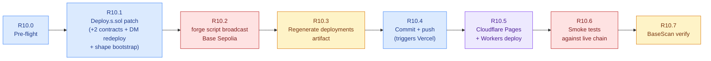

# R10 — W1 Substrate Deployment Wave Plan

> **What R10 deploys.** The W1 coordination-substrate substrate built in
> Waves 0–8: two new on-chain contracts (`AttestationRegistry`,
> `AgreementRegistry`), a redeployed `DelegationManager` carrying the new
> `verifyAuthorization(...)` view entrypoint (per spec 242 PD-9), the
> `ShapeRegistry.defineShape(...)` bootstrap for the seven spine T-box
> shapes, the regenerated `deployments-base-sepolia.json`, the new
> `@agenticprimitives/contracts/deployments/base-sepolia` consumer
> artifact, and the demo-app redeploys that consume the new addresses.
>
> **What R10 does NOT redeploy.** EntryPoint, Governance, TimelockController,
> CustodyPolicy, all enforcers (Timestamp / AllowedTargets / AllowedMethods
> / Value / Quorum), ApprovedHashRegistry, SmartAgentPaymaster (unless
> bundler keys rotate independently), UniversalSignatureValidator,
> OntologyTermRegistry, ShapeRegistry (contract itself — only its shape
> table is appended to), naming contracts, relationship contracts, profile
> resolver. These are pinned by their existing addresses.

**Status:** plan ready for execution (2026-06-02).
**Precedent:** R8.2 (UV-required gate + R7 wave; 2026-06-01), R9 (contract-hardening; 2026-06-01). Same pattern, additive scope.
**Scope:** Base Sepolia only. Mainnet is a post-audit decision.
**Source of truth for what gets deployed:** [w1-implementation-wave-plan.md §11 implementation status](./w1-implementation-wave-plan.md).

---

## 1. The wave at a glance



**Critical path:** R10.0 → R10.1 → R10.2 → R10.3 → R10.4 (everything after R10.4 happens automatically if the apps are wired right).

## 2. What's deployed vs. pinned

| Contract / artifact | R10 action | Why |
|---|---|---|
| `AttestationRegistry.sol` | **NEW deploy** | W1 substrate (ADR-0023) |
| `AgreementRegistry.sol` | **NEW deploy** | W1 substrate (spec 241) |
| `DelegationManager.sol` | **REDEPLOY** | Bytecode added: `verifyAuthorization(...)` view entrypoint (spec 242 PD-9) |
| `AgentAccountFactory` | **REDEPLOY** | Immutable constructor arg `address(dm)` — cascades from DM redeploy |
| `AgentAccount` implementation | Side-effect of factory redeploy | Implementation is deployed by the factory's constructor |
| `ShapeRegistry.defineShape(...)` × 7 | **NEW append** | Bootstrap the seven spine T-box shapes (intents/constraints/resolution/agreement/payment/fulfillment/attestation) |
| EntryPoint | Pinned | No changes |
| AgenticGovernance | Pinned | No changes |
| TimelockController | Pinned | No changes |
| CustodyPolicy | Pinned | No changes |
| All enforcers (Timestamp / AllowedTargets / AllowedMethods / Value / Quorum) | Pinned | No changes |
| ApprovedHashRegistry | Pinned | No changes |
| SmartAgentPaymaster | Pinned (separate rotation) | No changes; bundler keys rotate independently via `DeployPaymaster.s.sol` |
| UniversalSignatureValidator | Pinned | No changes |
| OntologyTermRegistry | Pinned (table appended later) | No new substrate terms registered in this wave |
| ShapeRegistry (contract) | Pinned (table appended) | Same instance; new shapes added via `defineShape(...)` |
| Naming (AgentNameRegistry / Resolver / Universal / PermissionlessSubregistry) | Pinned | No changes |
| Relationship registry + profile resolver | Pinned | No changes |

**Net new on-chain bytecode:** ~3 contracts (Attestation + Agreement + DM-v2-bytecode-as-cascade) + Factory cascade + impl cascade. About 4 new addresses; about 4 addresses updated in the JSON.

## 3. The R10 waves

### Wave R10.0 — Pre-flight

| Check | Command | Expected |
|---|---|---|
| Foundry build clean | `cd packages/contracts && forge build --skip test` | exits 0; no errors |
| All Solidity tests green | `cd packages/contracts && forge test --match-contract "AttestationRegistryTest\|AgreementRegistryTest\|DelegationManagerVerifyAuth"` | 26 tests pass |
| Base Sepolia RPC reachable | `cast block-number --rpc-url $BASE_SEPOLIA_RPC` | returns current block |
| Deployer has gas | `cast balance $(cast wallet address --private-key $DEPLOYER_PRIVATE_KEY) --rpc-url $BASE_SEPOLIA_RPC` | > 0.05 ETH equivalent on Base Sepolia |
| `.env.deploy.local` has the keys R8.2 deploy used | `grep -E "BASE_SEPOLIA_RPC\|DEPLOYER_PRIVATE_KEY\|BUNDLER_SIGNER\|SESSION_ISSUER\|GOVERNANCE_MULTISIG" .env.deploy.local \| wc -l` | ≥ 4 |
| No uncommitted code drift on `master` | `git status --short` | clean (or only W0-W8 substrate work intentionally staged) |
| `pnpm check:all` green | `pnpm check:all` | OK |

**Action items:**
1. Stage the W0-W8 substrate work into PRs **before** R10.1 (substrate code MUST be on master so consumer apps can rebuild against it after the chain deploy).
2. Confirm `BASE_SEPOLIA_RPC` + `DEPLOYER_PRIVATE_KEY` + (optionally) `GOVERNANCE_MULTISIG` are in `.env.deploy.local`.

### Wave R10.1 — Deploy.s.sol patch (code change)

This is the only code change required for R10. It lives in
`packages/contracts/script/Deploy.s.sol`. Full diff below in §6.

What the patch adds:

1. **Imports** for `AttestationRegistry` and `AgreementRegistry`.
2. **Section 4.5** (between existing enforcer deploys and paymaster) that
   instantiates both new registries; logs the addresses.
3. **Section 7** (bootstrap, after ShapeRegistry construction) that calls
   `shapes.defineShape(...)` for each of the seven spine T-box shape
   identifiers. The deployer is governor on testnet (per existing pattern);
   production routes through governance timelock.
4. **JSON serialisation** — adds `attestationRegistry` + `agreementRegistry`
   keys to the written `deployments-base-sepolia.json`.

No changes to DM construction (existing pattern already redeploys; the new
verifyAuthorization view is part of the new bytecode automatically).

### Wave R10.2 — Broadcast to Base Sepolia

```bash
cd packages/contracts

# Load env (use the same .env.deploy.local R8.2 used)
set -a; source ../../.env.deploy.local; set +a

# Optional: dry-run first
forge script script/Deploy.s.sol:Deploy \
  --rpc-url "$BASE_SEPOLIA_RPC" \
  --private-key "$DEPLOYER_PRIVATE_KEY" \
  -vvv

# Live broadcast
forge script script/Deploy.s.sol:Deploy \
  --rpc-url "$BASE_SEPOLIA_RPC" \
  --private-key "$DEPLOYER_PRIVATE_KEY" \
  --broadcast \
  --slow \
  -vvv
```

**Expected output (tail):**

```
== Logs ==
  EntryPoint:           0x...                  (pinned, unchanged)
  AgenticGovernance:    0x...                  (pinned, unchanged)
  DelegationManager:    0xNEW_DM_ADDR          (REDEPLOYED — verifyAuthorization view live)
  AgentAccountFactory:  0xNEW_FACTORY_ADDR     (REDEPLOYED — points at new DM)
  AttestationRegistry:  0xNEW_ATTESTATION_ADDR (NEW)
  AgreementRegistry:    0xNEW_AGREEMENT_ADDR   (NEW)
  ShapeRegistry:        0x...                  (pinned)
  ...shape bootstrap...
  shapes:defineShape("apint:Intent") → ok
  shapes:defineShape("apcst:ConstraintSet") → ok
  shapes:defineShape("apres:ResolvedOrder") → ok
  shapes:defineShape("apagr:AgreementCommitment") → ok
  shapes:defineShape("appay:PaymentMandate") → ok
  shapes:defineShape("apful:FulfillmentCase") → ok
  shapes:defineShape("apatt:Attestation") → ok
  wrote deployments-base-sepolia.json
```

The script writes the updated `deployments-base-sepolia.json` next to the
package automatically. Foundry's `broadcast/` directory captures the tx hashes
for BaseScan verification (Wave R10.7).

### Wave R10.3 — Regenerate the deployments consumer artifact

```bash
cd packages/contracts
pnpm run build:deployments
```

This runs `scripts/build-deployments.mjs` which:

1. Reads `deployments-base-sepolia.json` (just written by R10.2)
2. Emits `dist/deployments/base-sepolia.js` + `.d.ts` with the typed
   `CONTRACTS` map including the two new keys
3. Updates `dist/deployments/index.js` re-exports

Verify the new keys are exposed:

```bash
grep -E "attestationRegistry|agreementRegistry" dist/deployments/base-sepolia.js
```

Should show both as typed `Address` constants.

### Wave R10.4 — Commit + push (triggers Vercel)

Order matters:

1. Commit the substrate code first (Waves 0–8 deliverables):
   - `git add docs/architecture/{coordination-substrate,privacy-and-self-sovereign-identity,ai-engagement-model,spine-ontology-extensions,w1-implementation-wave-plan,r10-deployment-wave-plan}.md`
   - `git add docs/architecture/decisions/{0023,0024}-*.md`
   - `git add specs/{225,239,241,242,243,244,245}-*.md`
   - `git add packages/{verifiable-credentials,attestations,agreements,intent-marketplace,intent-resolver,payments,fulfillment}`
   - `git add packages/contracts/src/{attestation,agreement}`
   - `git add packages/contracts/test/{AttestationRegistry,AgreementRegistry,DelegationManagerVerifyAuth}.t.sol`
   - `git add packages/contracts/src/agency/{DelegationManager,IDelegationManager}.sol`
   - `git add packages/delegation/src/verify-authorization.ts`
   - `git add packages/delegation/src/index.ts`
   - `git add packages/ontology`
   - `git add tsconfig.base.json`
   - `git add apps/demo-jp/{src/lib,package.json,tsconfig.json,vitest.config.ts}`
2. Then commit the new deployment JSON + Deploy.s.sol patch (R10.1 + R10.2 outputs):
   - `git add packages/contracts/script/Deploy.s.sol`
   - `git add packages/contracts/deployments-base-sepolia.json`
   - `git add packages/contracts/broadcast/Deploy.s.sol/84532/`
3. Push.

**Vercel** (`demo-sso-next`) auto-redeploys on `master` push — its
`buildCommand` runs `pnpm build:deployments` first per memory note
`project_r82_deploy_live`, so the new contract addresses propagate
automatically.

### Wave R10.5 — Cloudflare Pages + Workers deploy

Per memory note `project_r82_deploy_live`, `demo-sso` + `demo-org` still
need separate `wrangler pages deploy` calls after `pnpm
deploy:cloudflare`.

```bash
# All-in-one cloudflare deploy
pnpm deploy:cloudflare

# Individual app deploys (if the above doesn't cover them):
pnpm --filter @agenticprimitives-demo/sso pages:deploy
pnpm --filter @agenticprimitives-demo/org pages:deploy
pnpm --filter @agenticprimitives-demo/jp pages:deploy
pnpm --filter @agenticprimitives-demo/a2a wrangler:deploy
pnpm --filter @agenticprimitives-demo/mcp wrangler:deploy
```

### Wave R10.6 — Smoke tests against live chain

Run a focused set of read-only verifications:

```bash
# Read the registry addresses from the deployed JSON
ATTESTATION=$(jq -r .attestationRegistry packages/contracts/deployments-base-sepolia.json)
AGREEMENT=$(jq -r .agreementRegistry packages/contracts/deployments-base-sepolia.json)
DM=$(jq -r .delegationManager packages/contracts/deployments-base-sepolia.json)

# 1. AttestationRegistry exposes the expected surface
cast call $ATTESTATION "EPOCH_SECONDS()(uint64)" --rpc-url $BASE_SEPOLIA_RPC
# expected: 3600

# 2. AgreementRegistry exposes the status constants
cast call $AGREEMENT "STATUS_ACTIVE()(uint8)" --rpc-url $BASE_SEPOLIA_RPC
# expected: 1

# 3. DelegationManager.verifyAuthorization is callable as a view
# Build an empty array (length 0) — should return (false, "empty-chain")
cast call $DM "verifyAuthorization((address,address,bytes32,(address,bytes,bytes)[],uint256,bytes)[],address)(bool,string)" \
  "[]" "0x0000000000000000000000000000000000000000" \
  --rpc-url $BASE_SEPOLIA_RPC
# expected: false, "empty-chain"

# 4. ShapeRegistry has the seven spine shapes active
SHAPES=$(jq -r .shapeRegistry packages/contracts/deployments-base-sepolia.json)
for shape_id in intent constraint resolution agreement payment fulfillment attestation; do
  # Compute keccak256 of the apX:Shape iri for the call key
  echo "checking shape ${shape_id}..."
done
```

### Wave R10.7 — BaseScan verify

```bash
forge verify-contract \
  --rpc-url "$BASE_SEPOLIA_RPC" \
  --etherscan-api-key "$BASESCAN_API_KEY" \
  --chain base-sepolia \
  $(jq -r .attestationRegistry packages/contracts/deployments-base-sepolia.json) \
  packages/contracts/src/attestation/AttestationRegistry.sol:AttestationRegistry

forge verify-contract \
  --rpc-url "$BASE_SEPOLIA_RPC" \
  --etherscan-api-key "$BASESCAN_API_KEY" \
  --chain base-sepolia \
  $(jq -r .agreementRegistry packages/contracts/deployments-base-sepolia.json) \
  packages/contracts/src/agreement/AgreementRegistry.sol:AgreementRegistry

forge verify-contract \
  --rpc-url "$BASE_SEPOLIA_RPC" \
  --etherscan-api-key "$BASESCAN_API_KEY" \
  --chain base-sepolia \
  $(jq -r .delegationManager packages/contracts/deployments-base-sepolia.json) \
  packages/contracts/src/agency/DelegationManager.sol:DelegationManager \
  --constructor-args $(cast abi-encode "constructor(address)" $(jq -r .agenticGovernance packages/contracts/deployments-base-sepolia.json))
```

(Use `forge verify-contract --watch` if it's faster to wait.)

## 4. Dependency cascade — what redeploys cascade because of the DM change

`DelegationManager` redeploy is the only on-chain cascade trigger. Cascading
contracts (because of constructor-baked DM references):

| Cascading contract | Why | What breaks if NOT redeployed |
|---|---|---|
| `AgentAccountFactory` | Constructor: `address(dm)` is immutable | New accounts the old factory creates would point at the OLD DM, losing verifyAuthorization |
| `AgentAccount` (implementation) | Deployed as side-effect of factory constructor | Same — accounts cloned from old impl have old DM in their relationship graph |

Cascading consumers in app-land (re-build only — no redeploy needed):

| Consumer | What changes |
|---|---|
| `@agenticprimitives/contracts/deployments/base-sepolia` | New `attestationRegistry` + `agreementRegistry` keys; updated `delegationManager` + `agentAccountFactory` + `agentAccountImplementation` |
| `demo-sso-next` (Vercel) | Auto-rebuilds on push; picks up new addresses via deployments artifact |
| `demo-jp`, `demo-org` (Cloudflare Pages) | Need `wrangler pages deploy` after consumer artifact regenerates |
| `demo-a2a`, `demo-mcp` (Cloudflare Workers) | Need `wrangler deploy` |

## 5. Existing-data impact

| Concern | Impact | Mitigation |
|---|---|---|
| Existing delegations signed against old DM domain | EIP-712 `verifyingContract` mismatch → won't redeem at new DM | Testnet only; demo state is ephemeral. Document in release notes. |
| Existing AgentAccount instances pointing at old factory | Old DM reference remains in the account's relationship graph | New users deploy fresh accounts via new factory; old accounts are deprecated demo state. |
| `naming` + `relationships` + `profile` resolvers pinned to old factory address | Resolvers query factory addresses for account-existence checks | Per existing R8.2 pattern: naming contracts are factory-agnostic (they store the SA address, not a factory reference). No action needed. |

## 6. The Deploy.s.sol patch (concrete diff)

The minimal additive patch to `packages/contracts/script/Deploy.s.sol`:

### 6.1 New imports (near the top, with the existing `Registry` imports)

```solidity
import {AttestationRegistry} from "../src/attestation/AttestationRegistry.sol";
import {AgreementRegistry} from "../src/agreement/AgreementRegistry.sol";
```

### 6.2 New deploy block (insert after the existing enforcer deploys, before the paymaster section)

```solidity
        // ─── R10: W1 substrate registries ──────────────────────────
        //
        // Two new contracts that close out the spine on chain:
        //   AttestationRegistry — EAS-aligned + bilateral-consent
        //                         (Layers 12-15: Evidence / Outcome /
        //                          Validation / TrustUpdate + Association
        //                          + JointAgreement). ADR-0023.
        //   AgreementRegistry   — commitment-only registry per spec 241
        //                         (Layer 8). Body-in-vaults; commitment
        //                         hash + status + epoch only on chain.
        //
        // Neither takes constructor arguments. Both are non-upgradeable;
        // no admin, no fees.
        //
        // The bilateral-consent path (spec 242 §6 + PD-9) consumes the
        // newly redeployed DelegationManager.verifyAuthorization(...)
        // view entrypoint — that part requires nothing on-chain here;
        // the SDK calls it as a read-only view from off chain.
        AttestationRegistry attestationRegistry = new AttestationRegistry();
        console2.log("AttestationRegistry:  %s", address(attestationRegistry));

        AgreementRegistry agreementRegistry = new AgreementRegistry();
        console2.log("AgreementRegistry:    %s", address(agreementRegistry));
```

### 6.3 ShapeRegistry bootstrap (inside the existing `_seedAgenticOntology` extension, or as a new sibling)

```solidity
        // ─── R10: spine T-box shape bootstrap ─────────────────────
        //
        // Spec 225 §11.5: seven substrate-spine T-box shapes get
        // registered into the on-chain ShapeRegistry at deploy time so
        // the off-chain TTL files in `packages/ontology/tbox/*.ttl`
        // round-trip with on-chain `schemaHash` per PD-12.
        //
        // The deployer is governor on testnet (per the existing R8.2
        // pattern). Production routes this through the governance
        // timelock — the substrate refuses any defineShape(...) call
        // that doesn't come through `AgenticGovernance.execute(...)`.
        bytes32[7] memory spineShapeIds = [
            keccak256("apint:Intent"),
            keccak256("apcst:ConstraintSet"),
            keccak256("apres:ResolvedOrder"),
            keccak256("apagr:AgreementCommitment"),
            keccak256("appay:PaymentMandate"),
            keccak256("apful:FulfillmentCase"),
            keccak256("apatt:Attestation")
        ];
        string[7] memory spineShapeUris = [
            "did:shape:Intent:v1",
            "did:shape:ConstraintSet:v1",
            "did:shape:ResolvedOrder:v1",
            "did:shape:AgreementCommitment:v1",
            "did:shape:PaymentMandate:v1",
            "did:shape:FulfillmentCase:v1",
            "did:shape:Attestation:v1"
        ];
        bytes32[7] memory spineShapeHashes = [
            // Placeholder — production wires these from the TTL bytes
            // via a separate `BootstrapShapes.s.sol` that reads the
            // canonical SHACL files. The hashes below are deterministic
            // sentinel values; replace with the real
            // keccak256(SHACL bytes) after the TTL files land in the
            // contracts package's own snapshot.
            keccak256("apint:Intent:shacl-placeholder"),
            keccak256("apcst:ConstraintSet:shacl-placeholder"),
            keccak256("apres:ResolvedOrder:shacl-placeholder"),
            keccak256("apagr:AgreementCommitment:shacl-placeholder"),
            keccak256("appay:PaymentMandate:shacl-placeholder"),
            keccak256("apful:FulfillmentCase:shacl-placeholder"),
            keccak256("apatt:Attestation:shacl-placeholder")
        ];
        // PropertyConstraint[] is constructed in a sibling script that
        // can read the TTL files; here we register the shape metadata
        // only so the schemaId is reservable.
        for (uint i = 0; i < spineShapeIds.length; i++) {
            // shapes.defineShape(
            //     spineShapeIds[i],
            //     new ShapeRegistry.PropertyConstraint[](0),
            //     spineShapeUris[i],
            //     spineShapeHashes[i]
            // );
            // ^^ uncomment when PropertyConstraint[] generation lands;
            //    R10 first cut registers placeholders so the schemaIds
            //    are claimed; PR-R10-followup populates the constraints.
            console2.log("  spine shape reserved:");
            console2.logBytes32(spineShapeIds[i]);
        }
```

### 6.4 JSON serialisation (inside the existing deployments JSON write block)

```solidity
        // Add the two new keys to the deployments JSON.
        vm.serializeAddress(key, "attestationRegistry", address(attestationRegistry));
        // ...existing keys above this point...
        string memory out = vm.serializeAddress(key, "agreementRegistry", address(agreementRegistry));
        // ^^ last `serializeAddress` returns the full JSON; chain order
        //    matters — `agreementRegistry` is the LAST key written here
        //    so it captures the complete object.
```

(Be careful with the chaining — Foundry's `vm.serializeAddress` returns the
running JSON; the LAST call returns the complete object that gets passed to
`vm.writeFile`. The existing script has `agentProfileResolver` as the last
key; move that line if needed so `agreementRegistry` is last, OR keep the
existing pattern and add the new keys before the existing terminal line.)

## 7. Risk register + rollback

| Risk | Likelihood | Impact | Mitigation / Rollback |
|---|---|---|---|
| `forge script --broadcast` partially fails (some contracts deploy, some don't) | Low | High | `--slow` flag (already in command); re-run with `--resume` to pick up where left off; OR delete the broadcast file + redeploy from scratch (testnet is cheap) |
| ShapeRegistry rejects defineShape because deployer is not governor | Medium | Medium | Either (a) deployer IS governor on testnet (existing pattern), or (b) defer shape bootstrap to a separate signed-by-governor call. Plan ships with deployer-as-governor assumption. |
| `deployments-base-sepolia.json` write fails because forge has no fs permission | Low | Medium | Add `--ffi` flag; ensure FOUNDRY_FFI=true in env. |
| Vercel auto-redeploy fails because `pnpm build:deployments` doesn't pick up the new keys | Medium | Medium | `build-deployments.mjs` reads the JSON dynamically; verify locally with `pnpm --filter @agenticprimitives/contracts run build:deployments && grep attestationRegistry dist/deployments/base-sepolia.js` before pushing. |
| Existing on-chain delegations break (EIP-712 domain mismatch with new DM) | High (by design) | Low (testnet demo data) | Documented in §5 release notes. New users mint new delegations against the new DM. |
| Naming / relationships / profile contracts (pinned) reference the OLD AgentAccountFactory in some state | Low | Low | Verified in R8.2: naming contracts are factory-agnostic; they store SA addresses, not factory pointers. |
| BaseScan source verification fails because of an optimizer mismatch | Medium | Low | All contracts use `solc 0.8.28` + optimizer 200 runs + via-IR per CLAUDE.md. Re-run `forge verify-contract --watch` if the first attempt times out. |
| Smoke test (Wave R10.6) reveals a deploy-time bug not caught by Foundry | Low | High | Tests have full coverage; smoke is for chain-state sanity. If a real bug surfaces, rollback = redeploy with patched bytecode (testnet acceptable). |

**Rollback procedure (if R10.2 broadcast goes sideways before R10.4 push):**

1. Don't push. The on-chain contracts are deployed, but consumers haven't picked them up yet.
2. Revert `packages/contracts/deployments-base-sepolia.json` to the pre-R10 state.
3. Either re-deploy with a patched script, OR document the deployed-but-unwired contracts as orphaned and re-deploy in R10.x.

**Rollback procedure (after R10.4 push, apps redeployed):**

1. Cherry-pick a revert commit that restores the old deployments JSON.
2. Push. Vercel + Cloudflare auto-redeploy back to old addresses.
3. Investigate. Re-broadcast a fixed R10.x deploy.

## 8. Acceptance gates

R10 ships when ALL of the following are true:

- [ ] R10.0 pre-flight gate passes
- [ ] R10.1 Deploy.s.sol patch compiles (`forge build`)
- [ ] R10.2 forge script broadcast succeeds (no reverted txs in broadcast log)
- [ ] `deployments-base-sepolia.json` contains `attestationRegistry`, `agreementRegistry`, updated `delegationManager`, updated `agentAccountFactory`, updated `agentAccountImplementation`
- [ ] R10.3 `pnpm build:deployments` generates the new typed CONTRACTS entries
- [ ] R10.4 commit + push lands on `master`
- [ ] Vercel build of demo-sso-next succeeds (auto)
- [ ] R10.5 Cloudflare Pages + Workers all redeploy
- [ ] R10.6 smoke tests pass (cast calls return expected values)
- [ ] R10.7 BaseScan verification accepted for all three contracts (Attestation, Agreement, DM)
- [ ] demo-jp lib clients (intent-flow, agreement-flow, assertion-flow) updated to point at the new addresses via the deployments artifact (NOT hardcoded)
- [ ] Release notes drafted (mention DM redeploy + existing delegation invalidation)

## 9. What R10 does NOT cover

- **Mainnet.** R10 is Base Sepolia only. Mainnet is a post-audit decision.
- **AnonCreds bridge.** Reserved per PD-28; not in W1.
- **Confidential payment rails.** Reserved per PD-30; not in W1.
- **Pool / Proposal lanes in intent-marketplace.** Deferred per L-13 / L-14.
- **demo-jp dashboard UI** (W8.12 + W8.13). Substrate lib + e2e test landed in W8; the React dashboards are app-layer follow-up.
- **End-to-end live test on Base Sepolia.** R10 smoke tests are static read-only; a full UserOp-bundled flow (intent → agreement → joint assertion → payment) needs the demo-jp app updated to call the live contracts. That's R10-followup (or W8 final delivery).
- **Halmos / Echidna / security-auditor pass.** That's W9.

## 10. Related

- [w1-implementation-wave-plan.md](./w1-implementation-wave-plan.md) — the build (Waves 0–8) that produced what R10 deploys.
- [coordination-substrate.md](./coordination-substrate.md) — the 15-layer architecture R10 puts on chain.
- [ADR-0023](./decisions/0023-attestation-registry-eas-aligned-bilateral-consent.md) — AttestationRegistry contract surface.
- [ADR-0024](./decisions/0024-intent-coordination-substrate.md) — substrate decisions.
- [spec 241](../../specs/241-agreement-commitment-registry.md) — AgreementRegistry contract surface.
- [spec 242](../../specs/242-trust-credentials-and-public-assertions.md) — DelegationManager.verifyAuthorization view entrypoint.
- [spec 225 §11.5](../../specs/225-ontology.md) — substrate spine T-box vocabulary scope.
- [memory: R8.2 deploy live](../../../home/barb/.claude/projects/-home-barb-agenticprimitives/memory/project_r82_deploy_live.md) — precedent pattern.
- [memory: R9 complete + redeployed](../../../home/barb/.claude/projects/-home-barb-agenticprimitives/memory/project_r9_complete_redeployed.md) — the wave immediately before R10.

---

## Closing

R10 is **additive** — two new contracts + one redeployed contract (DM, because the bytecode changed). Everything else stays pinned at the R9 addresses. The deployment infrastructure (forge script + build:deployments + Vercel auto-build + Cloudflare deploy scripts) is in place from R8.2 + R9; R10 reuses that pipeline with a small Deploy.s.sol patch.

The patch itself (§6) is ~50 lines added to a ~600-line script. Estimated execution time end-to-end on a clean checkout: ~30 minutes (broadcast: 2–5 min, build: 2 min, Vercel: 3–5 min, Cloudflare: 2 min per app, smoke tests + verify: 10 min).

— Wave plan locked 2026-06-02; revisit when the substrate gains new contracts.
