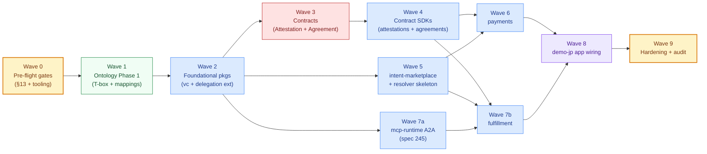

# W1 Implementation Wave Plan — the v2 spine substrate build

> **What this is.** PR-ordered, dependency-respecting implementation plan for the entire W1 substrate: 6 packages + 1 skeleton package + 2 contracts + 1 existing-contract extension + 1 existing-package extension + 7 ontology T-box files + 8 SHACL shape files + demo-jp end-to-end app wiring.
>
> **What this is NOT.** A timeline. Velocity is unknown; complexity buckets (XS/S/M/L/XL) are used instead of person-days. This is the dependency graph + the PR sequence — not the calendar.

**Status:** draft (2026-06-02).
**Scope:** the v2 coordination-substrate wave — all artifacts settled in the planning phase ([coordination-substrate.md](./coordination-substrate.md), [privacy-and-self-sovereign-identity.md](./privacy-and-self-sovereign-identity.md), [ai-engagement-model.md](./ai-engagement-model.md), [spine-ontology-extensions.md](./spine-ontology-extensions.md), [ADR-0023](./decisions/0023-attestation-registry-eas-aligned-bilateral-consent.md), [ADR-0024](./decisions/0024-intent-coordination-substrate.md), specs 239 / 241 / 242 / 243 / 244 / 245).
**Authoritative source-of-truth:** the specs + ADRs above. This plan narrates how they get built.

---

## 1. The wave at a glance



**Critical path:** W0 → W1 → W2 → W3 → W4 → W6 → W8 → W9
**Parallel opportunities:** W5 (intent-marketplace) is parallel to W3+W4; W7a (mcp-runtime A2A) is parallel to W3+W4+W5; W7b (fulfillment) joins after W4+W6+W7a.

## 2. Complexity budgeting

Each PR is sized by complexity bucket. The buckets are calibrated to the existing repo's PR scale (~the past R8/R9 hardening waves).

| Bucket | Loc range | Effort | Examples in this plan |
|---|---|---|---|
| **XS** | ≤ 50 LoC + tests | trivial wiring | Spec text addendum; CLAUDE.md edit |
| **S** | 50–250 LoC + tests | targeted change | TTL file; small SDK helper; single Solidity invariant test |
| **M** | 250–800 LoC + tests | well-bounded module | A package's SDK surface; a focused contract module |
| **L** | 800–2000 LoC + tests | substantive package | Full SDK package; full contract w/ invariants |
| **XL** | > 2000 LoC + tests | multi-component subsystem | App wiring across many files; full demo flow |

## 3. Wave-by-wave breakdown

### Wave 0 — Pre-flight gates 🟡

**Purpose.** Unblock ontology Phase 1 (per [spine-ontology-extensions.md §13](./spine-ontology-extensions.md)) and confirm tooling readiness for the rest of the wave.

| PR | Title | Bucket | Touch |
|---|---|---|---|
| **0.1** | spec 225 §11.5 scope expansion (substrate spine vocabulary added to monorepo-wide ontology) | XS | `specs/225-ontology.md` |
| **0.2** | `packages/ontology/CLAUDE.md` drift-trigger revision (split runtime-SHACL trigger from T-box scope) | XS | `packages/ontology/CLAUDE.md` |
| **0.3** | ADR-0018 acknowledgment paragraph (substrate spine vocabulary IS monorepo-wide formal ontology) | XS | `docs/architecture/decisions/0018-agenticprimitives-wide-formal-ontology.md` |
| **0.4** | Tooling readiness check: Foundry + pnpm + Mermaid renderer + check:* scripts cover new packages | XS | `scripts/check-*.ts`, `package.json` |
| **0.5** | Stub package directories for the 7 W1 packages (empty `package.json` + `CLAUDE.md` + `capability.manifest.json` only, so dependency graph checks pass) | S | `packages/verifiable-credentials/` + `attestations/` + `agreements/` + `intent-marketplace/` + `intent-resolver/` + `payments/` + `fulfillment/` |

**Validation gate W0:**
- [ ] All `pnpm check:*` scripts pass with the stub packages in place
- [ ] `pnpm check:cross-cutting-capabilities` green
- [ ] Ontology CLAUDE.md drift trigger reflects new scope
- [ ] Spec 225 §11.5 lands

**Parallelization:** PRs 0.1–0.4 are independent and can land in any order. PR 0.5 depends on the stub structure but not on the doc edits.

### Wave 1 — Ontology Phase 1 (T-box centralization) 🟢

**Purpose.** Land the substrate-wide T-box files + spine-standards mappings + namespace prefix additions in `@agenticprimitives/ontology` per the hybrid model. This unblocks downstream packages to reference canonical spine IRIs.

| PR | Title | Bucket | Touch |
|---|---|---|---|
| **1.1** | `packages/ontology/tbox/intents.ttl` (Intent + IntentMatch + Commitment + Desire classes) | S | `packages/ontology/tbox/intents.ttl` |
| **1.2** | `packages/ontology/tbox/constraints.ttl` (ConstraintSet + AssumptionSet + Constraint domains) | S | same dir |
| **1.3** | `packages/ontology/tbox/resolution.ttl` (Resolver + ResolvedOrder; skeleton) | XS | same dir |
| **1.4** | `packages/ontology/tbox/agreement.ttl` (AgreementCommitment + AgreementCredential) | S | same dir |
| **1.5** | `packages/ontology/tbox/payment.ttl` (PaymentMandate + PaymentReceipt + ContextBinding + MandateConstraints) | S | same dir |
| **1.6** | `packages/ontology/tbox/fulfillment.ttl` (FulfillmentCase + Task + Message + Artifact + HandoffPolicy + IntentTraceSpan) | S | same dir |
| **1.7** | `packages/ontology/tbox/attestation.ttl` (Association + Evidence + Outcome + Validation + TrustUpdate credential types) | S | same dir |
| **1.8** | `packages/ontology/mappings/spine-standards.ttl` (owl:equivalentClass to ERC-7521/7683/8004 + A2A + Anoma + x402) | S | `packages/ontology/mappings/` |
| **1.9** | `packages/ontology/context.jsonld` namespace additions (apint / apcst / apres / apagr / appay / apful / apatt / apvc) | XS | same |
| **1.10** | `packages/ontology/src/index.ts` IRI constants (NS / CLASS / PREDICATE extensions for spine concepts) | S | same |

**Validation gate W1:**
- [ ] `pnpm --filter @agenticprimitives/ontology typecheck` green
- [ ] `pnpm --filter @agenticprimitives/ontology test` green (TTL parses, IRIs round-trip)
- [ ] Mapping crosswalks resolve (no dangling external IRIs in strict mode)
- [ ] `pnpm check:forbidden-terms` green (no vertical/branding leakage)

**Parallelization:** PRs 1.1–1.7 are independent TTL files; can be authored by different reviewers. PRs 1.8 + 1.9 + 1.10 depend on the TTL files settling but not on each other.

### Wave 2 — Foundational packages (verifiable-credentials + delegation extension) 🟢

**Purpose.** Land the envelope substrate every downstream package needs. `verifiable-credentials` is a leaf in the dependency graph; everything else depends on it.

| PR | Title | Bucket | Touch | Spec ref |
|---|---|---|---|---|
| **2.1** | `@agenticprimitives/verifiable-credentials` core (envelope + W3C VC 2.0 types + Eip712Signature2026 proof) | M | `packages/verifiable-credentials/src/` | spec 242 §4 |
| **2.2** | DOLCE+DnS Situation / Description / Roles / Participants TypeScript types + helpers | S | same | spec 242 §5 |
| **2.3** | RFC 8785 JCS canonical hash helper (`credentialHash`) + cross-stack typehash test | S | same | spec 242 §4.3 |
| **2.4** | Schema-registration helper (PD-12 round-trip: `did:shape:<name>:<version>` ↔ on-chain `schemaHash`) | S | same | spec 242 §5.4 |
| **2.5** | Verifier (ERC-1271 issuer signature + StatusList2021 fetch + canonical-hash reconciliation) | M | same | spec 242 §7 |
| **2.6** | `DelegationManager.verifyAuthorization(...)` view-only entrypoint (PD-9) + foundry tests | M | `packages/contracts/src/delegation/DelegationManager.sol` + tests | spec 242 §6 |
| **2.7** | `@agenticprimitives/delegation` SDK helper for `verifyAuthorization` typed-data call | XS | `packages/delegation/src/` | same |
| **2.8** | SHACL Phase 2: `packages/intent-marketplace/src/shapes/intents.shacl.ttl` + `constraints.shacl.ttl` | S | `packages/intent-marketplace/src/shapes/` | spec 239 §11.3 |

**Validation gate W2:**
- [ ] `pnpm --filter @agenticprimitives/verifiable-credentials typecheck && test` green
- [ ] `pnpm --filter @agenticprimitives/delegation typecheck && test` green (regression)
- [ ] `pnpm --filter @agenticprimitives-contracts test` green (DelegationManager.verifyAuthorization invariants pass)
- [ ] Cross-stack typehash test passes (TS hash == Solidity hash for VC envelope)

**Parallelization:** 2.1–2.5 are sequential within `verifiable-credentials`. 2.6–2.7 (delegation extension) can land in parallel. 2.8 (SHACL for intent-marketplace) is independent and can land any time after W1.

### Wave 3 — Contracts (AttestationRegistry + AgreementRegistry) 🟢

**Purpose.** Land the two new on-chain registries per [ADR-0023](./decisions/0023-attestation-registry-eas-aligned-bilateral-consent.md) + [spec 241](../../specs/241-agreement-commitment-registry.md).

| PR | Title | Bucket | Touch | Spec ref |
|---|---|---|---|---|
| **3.1** | `AttestationRegistry.sol` per ADR-0023 surface (`Attestation` struct + 6 entrypoints + 3 events) | L | `packages/contracts/src/attestation/` | ADR-0023 |
| **3.2** | `AttestationRegistry` foundry unit tests (assertAssociation / assertJointAgreement / revokeOwn happy paths) | M | `packages/contracts/test/attestation/` | ADR-0023 |
| **3.3** | `AttestationRegistry` foundry invariant tests (no issuer-revoke; bilateral-consent enforced; uid determinism; epoch buckets) | M | same | ADR-0023 §7 |
| **3.4** | `AgreementRegistry.sol` per spec 241 §5 (`AgreementIssuancePayload` + register + updateStatus + isAssertableCommitment) | L | `packages/contracts/src/agreement/` | spec 241 |
| **3.5** | `AgreementRegistry` foundry unit tests (issuance + status transitions per §5.4.1 matrix) | M | `packages/contracts/test/agreement/` | spec 241 |
| **3.6** | `AgreementRegistry` foundry invariant tests (AR-01..AR-16; party-SAs never in calldata regression) | M | same | spec 241 §9 |
| **3.7** | ShapeRegistry bootstrap: `defineShape` calls for all spine SHACL shapes (governance-signed one-time deploy step) | M | `apps/contracts/script/BootstrapShapes.s.sol` | spec 225 + ADR-0009 |
| **3.8** | Deploy to Base Sepolia + update `apps/contracts/deployments-base-sepolia.json` | S | `apps/contracts/script/Deploy.s.sol` + json | — |

**Validation gate W3:**
- [ ] `forge test --match-contract AttestationRegistry` green
- [ ] `forge test --match-contract AgreementRegistry` green
- [ ] `forge coverage --ir-minimum --match-contract Attestation` ≥ 95%
- [ ] `forge coverage --ir-minimum --match-contract Agreement` ≥ 95%
- [ ] Halmos proofs pass for the bilateral-consent paths
- [ ] No `issuerRevoke` entrypoint exists (static-analysis regression test)
- [ ] Static-analysis: party SA addresses never appear in `register(...)` calldata (AR-12)
- [ ] Successful Base Sepolia deploy + deployments JSON committed

**Parallelization:** PRs 3.1–3.3 (Attestation) and PRs 3.4–3.6 (Agreement) are independent and can be split between two reviewers. PR 3.7 depends on both. PR 3.8 depends on 3.7.

### Wave 4 — Contract SDKs (attestations + agreements) 🟢

**Purpose.** TypeScript SDKs against the W3 contracts.

| PR | Title | Bucket | Touch | Spec ref |
|---|---|---|---|---|
| **4.1** | `@agenticprimitives/attestations` typed surface (Attestation + Association + JointAgreement payload types) | M | `packages/attestations/src/` | spec 242 §9 |
| **4.2** | `@agenticprimitives/attestations` ABI mirror + read client | S | same | spec 242 §9 |
| **4.3** | `@agenticprimitives/attestations` bilateral-consent helpers (CalldataHashEnforcer-pinned delegation builder) | M | same | spec 242 §6 |
| **4.4** | `@agenticprimitives/attestations` revocation encoders (holder-only / either-party) | S | same | spec 242 §6 |
| **4.5** | `packages/attestations/src/shapes/credentials.shacl.ttl` (Association + Evidence + Outcome + Validation + TrustUpdate shapes) | S | same | spine-ontology-extensions.md |
| **4.6** | `@agenticprimitives/agreements` typed surface (`AgreementCredential` shape + AgreementIssuancePayload + StatusUpdatePayload) | M | `packages/agreements/src/` | spec 241 + PD-22 |
| **4.7** | `@agenticprimitives/agreements` commitment math (per spec 241 §3 + IA §10) | M | same | spec 241 §3 |
| **4.8** | `@agenticprimitives/agreements` nullifier derivation + state tracking | S | same | spec 241 §5 |
| **4.9** | `@agenticprimitives/agreements` gateway helper (`isAssertableCommitment` payload builder) | XS | same | spec 241 §6 |
| **4.10** | `packages/agreements/src/shapes/agreement.shacl.ttl` (AgreementCommitment + AgreementCredential shapes) | S | same | spine-ontology-extensions.md |

**Validation gate W4:**
- [ ] `pnpm --filter @agenticprimitives/attestations typecheck && test` green
- [ ] `pnpm --filter @agenticprimitives/agreements typecheck && test` green
- [ ] Cross-stack typehash equality test (TS hash == Solidity hash for all payloads)
- [ ] End-to-end: build → sign → register → read attestation
- [ ] End-to-end: build → sign → register agreement → joint-attest happy path
- [ ] Static-analysis: `packages/attestations` has no runtime call into `delegation` (type-only edge enforced)

**Parallelization:** PRs 4.1–4.5 (attestations) and PRs 4.6–4.10 (agreements) split cleanly between two reviewers.

### Wave 5 — intent-marketplace + intent-resolver skeleton 🟢

**Purpose.** The marketplace layer (Layers 2–7 of the spine; vault-only in W1).

| PR | Title | Bucket | Touch | Spec ref |
|---|---|---|---|---|
| **5.1** | `@agenticprimitives/intent-marketplace` Intent typed envelope + state machine | M | `packages/intent-marketplace/src/` | spec 239 §5 |
| **5.2** | ConstraintSet + AssumptionSet first-class types (D-38) + Anoma CSP shape | M | same | spec 239 §4.4 |
| **5.3** | ResolutionReceipt type + invariants (RR-INV-01..05) | M | same | spec 239 §4.5a |
| **5.4** | `@agenticprimitives/intent-resolver` skeleton (IIntentResolver + ResolvedOrder + PassThroughResolver) | S | `packages/intent-resolver/src/` | spec 239 §4.5 |
| **5.5** | MatchInitiation vs IntentMatch separation + state transitions | M | `packages/intent-marketplace/src/` | spec 239 §6.3 |
| **5.6** | Matcher: compatibility rule (filter) + composite score (rank) + Laplace smoothing | L | same | spec 239 §7 |
| **5.7** | Visibility tiers + projection model (Full / Coarse / Summary / Null) | M | same | spec 239 §8 |
| **5.8** | Three-tier delegation model (T1 session + T2 system + T3 cross-delegations) | M | same | spec 239 §9 |
| **5.9** | Scope catalog + cross-delegation builders | S | same | spec 239 §9.3 |
| **5.10** | Index page three-section layout (UX pattern; React-agnostic helper) | S | same | spec 239 §11.7 |

**Validation gate W5:**
- [ ] `pnpm --filter @agenticprimitives/intent-marketplace typecheck && test` green
- [ ] `pnpm --filter @agenticprimitives/intent-resolver typecheck && test` green (skeleton)
- [ ] Compatibility-rule unit tests (opposite-direction + same-object + topicSimilarity ≥ threshold)
- [ ] Composite-score golden-vector tests
- [ ] ResolutionReceipt requiresUserConfirmation gate test (RR-INV-01)
- [ ] Visibility projection tests (no-duplication invariant P4)

**Parallelization:** PRs 5.1–5.3 are foundational (types). 5.4 is parallel to anything. 5.5–5.9 split cleanly between matchmaker (5.5+5.6) and authority (5.7+5.8+5.9) workstreams.

### Wave 6 — payments 🟢

**Purpose.** PaymentMandate primitive + rail abstraction + open/closed mode + W1 rails (x402 + wallet + sponsored-userop) + PaymentReceipt assertion.

| PR | Title | Bucket | Touch | Spec ref |
|---|---|---|---|---|
| **6.1** | `@agenticprimitives/payments` core types (PaymentMandate + ContextBinding + MandateConstraints + Mode discriminator) | M | `packages/payments/src/` | spec 243 §4 |
| **6.2** | EIP-712 typed-data builder + signer + verifier | M | same | spec 243 §4 |
| **6.3** | Mode invariants (open/closed; PMT-10.1; PMT-INV-13..15) | M | same | spec 243 §4.1z |
| **6.4** | Rail interface + registry (PaymentRailExecutor + registry pattern) | S | same | spec 243 §5.1 |
| **6.5** | Wallet rail (smart-agent treasury pattern adapted; SA-as-payer UserOp) | M | `packages/payments/rails/wallet/` | spec 243 §5.3 |
| **6.6** | x402 rail + reference facilitator | L | `packages/payments/rails/x402/` | spec 243 §5.2 |
| **6.7** | Sponsored-userop rail | M | `packages/payments/rails/sponsored-userop/` | spec 243 §5.4 |
| **6.8** | PaymentReceipt VC issuance + assertion (depends on attestations + verifiable-credentials) | M | `packages/payments/src/receipts/` | spec 243 §7 |
| **6.9** | `packages/payments/src/shapes/payment.shacl.ttl` | S | same | spine-ontology-extensions.md |
| **6.10** | Integration tests: full lifecycle (mandate → redeem → receipt) | M | `packages/payments/test/integration/` | spec 243 §10 |

**Validation gate W6:**
- [ ] `pnpm --filter @agenticprimitives/payments typecheck && test` green
- [ ] All 3 rails pass PMT-T-01..PMT-T-10 scenarios
- [ ] Mode invariant PMT-10.1 enforced (open mandate refuses final-charge)
- [ ] Replay-attempt regression tests pass (PMT-INV-05)
- [ ] PaymentReceipt immutability test (no revoke entrypoint per PMT-INV-11)

**Parallelization:** 6.1–6.3 foundational. 6.5 + 6.6 + 6.7 (the three rails) are independent and split cleanly between reviewers. 6.8 depends on 6.1+6.2+W4. 6.10 depends on all.

### Wave 7a — mcp-runtime A2A extension 🟢

**Purpose.** Adopt A2A Task model in `mcp-runtime` per [spec 245](../../specs/245-a2a-task-adoption-in-mcp-runtime.md). Independent of fulfillment package; quick W1 interop win.

| PR | Title | Bucket | Touch | Spec ref |
|---|---|---|---|---|
| **7a.1** | `mcp-runtime/src/a2a/types.ts` (Task + Message + Artifact + AgentCard typed surface) | M | `packages/mcp-runtime/src/a2a/` | spec 245 §5 |
| **7a.2** | Task state machine + transition validation (8 states; per spec 245 §4) | M | same | spec 245 §4 |
| **7a.3** | AgentCard signer + verifier (ERC-1271-bound) | M | same | spec 245 A2A-4 |
| **7a.4** | Message + Artifact + JV client integration | M | same | spec 245 §6 |
| **7a.5** | `IntentTraceSpan` emission + trace store (in mcp-runtime, not new pkg per PD-26) | M | `packages/mcp-runtime/src/trace/` | ADR-0024 Dec 7 |
| **7a.6** | A2A wire adapter (JSON-RPC + SSE) | L | `packages/mcp-runtime/src/a2a/wire/` | spec 245 §5 |
| **7a.7** | Reference A2A client interop test (against Google A2A example) | M | `packages/mcp-runtime/test/interop/` | spec 245 A2A-INV-10 |
| **7a.8** | `packages/mcp-runtime/src/shapes/a2a-task.shacl.ttl` | S | `packages/mcp-runtime/src/shapes/` | spine-ontology-extensions.md |

**Validation gate W7a:**
- [ ] `pnpm --filter @agenticprimitives/mcp-runtime typecheck && test` green
- [ ] A2A wire-format round-trip test passes
- [ ] AgentCard signature verification (ERC-1271 bound) passes
- [ ] Messages never anchor on chain (vault-residency invariant)
- [ ] Trace span emission on every state transition

**Parallelization:** PRs 7a.1–7a.8 are largely independent within `mcp-runtime`. Can be done by a single reviewer in series or split into types/machine vs wire-adapter workstreams.

### Wave 7b — fulfillment 🟢

**Purpose.** FulfillmentCase + Task/Message/Artifact lifecycle wrapping + EvidenceCredential + OutcomeCredential assertion.

| PR | Title | Bucket | Touch | Spec ref |
|---|---|---|---|---|
| **7b.1** | `@agenticprimitives/fulfillment` core types (FulfillmentCase + lifecycle state machine per spec 244 §4.2) | M | `packages/fulfillment/src/` | spec 244 §4 |
| **7b.2** | Re-export Task / Message / Artifact / AgentCard from `mcp-runtime/a2a` + add case binding | S | same | spec 245 §11 |
| **7b.3** | HandoffPolicy evaluator + delegation minting | M | same | spec 244 §7 |
| **7b.4** | EvidenceCredential + promotion path (depends on attestations + verifiable-credentials) | M | `packages/fulfillment/src/evidence/` | spec 244 §8.1 |
| **7b.5** | OutcomeCredential + assertion + validation citation enforcement (FLF-OUT-1 + D-40) | M | `packages/fulfillment/src/outcomes/` | spec 244 §8.2 |
| **7b.6** | Lifecycle ↔ spec 241 status synchronization (FLF-INV-01) | M | same | spec 244 §4 |
| **7b.7** | Payment binding tests (mandate.contextBinding.taskId per spec 243 PMT-3 + FLF-INV-11) | S | `packages/fulfillment/test/payment-binding/` | spec 244 §11 |
| **7b.8** | `packages/fulfillment/src/shapes/fulfillment.shacl.ttl` | S | same | spine-ontology-extensions.md |
| **7b.9** | Privacy regression suite (D-46 JV/PV/PR boundaries; D-42 field-level disclosure) | M | `packages/fulfillment/test/privacy/` | spec 244 §11 |

**Validation gate W7b:**
- [ ] `pnpm --filter @agenticprimitives/fulfillment typecheck && test` green
- [ ] FLF-T-01..FLF-T-12 all pass
- [ ] Lifecycle ↔ AgreementRegistry status synchronization verified
- [ ] EvidenceCredential issuer-revoke does NOT exist (regression per ADR-0023)
- [ ] OutcomeCredential without evidence citation rejected (FLF-OUT-1)
- [ ] D-46 vault residency boundaries enforced

**Parallelization:** PRs 7b.1–7b.3 foundational. 7b.4 + 7b.5 + 7b.6 split cleanly between Evidence (7b.4) / Outcome (7b.5) / Lifecycle-sync (7b.6) workstreams.

### Wave 8 — demo-jp app wiring 🟠

**Purpose.** End-to-end product realization on Base Sepolia. The substrate's first real deployment.

| PR | Title | Bucket | Touch | Companion |
|---|---|---|---|---|
| **8.1** | `apps/demo-jp/src/lib/personas.ts` (Pete + Jill EOA + lifecycle) | M | `apps/demo-jp/src/lib/` | IA §1 |
| **8.2** | `apps/demo-jp/src/lib/org-personas.ts` (Global Church + JP SA derivation + lazy deploy) | M | same | IA §0 + §1 |
| **8.3** | `apps/demo-jp/src/lib/jp-shapes.ts` (JP-vertical SHACL: JpFacilitator + JpAdopter Association Descriptions) | S | same | spec 242 PD-15 |
| **8.4** | `apps/demo-jp/src/lib/intent-payload.ts` (JP-vertical intent payload: FPG ids + capacity matrices + MOU receipt format) | M | same | IA §3b |
| **8.5** | `apps/demo-jp/src/lib/agreement-payload.ts` (JP-vertical agreement: terms doc + capability list) | M | same | IA §9 + §4c |
| **8.6** | Intent flow orchestrator (`intent-flow.ts` — IA §4d steps I-1..I-7) | L | same | spec 239 + IA §4d |
| **8.7** | Agreement flow orchestrator (`agreement-flow.ts` — IA §4c steps 5a..6) | L | same | spec 241 + IA §4c |
| **8.8** | Association issuance flow (Jill-as-JP issues `JpAssociationCredential`) | M | same | spec 242 §5 + IA §4a |
| **8.9** | Agreement issuance flow (Pete-as-Global-Church issues `AgreementCredential` + registers commitment) | M | same | spec 241 §4 |
| **8.10** | Public assertion flow (Org → JP Association) | M | same | spec 242 §6 + IA §4b |
| **8.11** | Joint agreement assertion flow (bilateral consent gate) | L | same | spec 242 §6 + IA §10b |
| **8.12** | New dashboards (Pete-issuer + Jill-broker + Facilitator + Adopter + Facilitator Org + Adopter Org) | L | `apps/demo-jp/src/components/` | IA §0 |
| **8.13** | Persona-switching UX | S | same | IA §8 |
| **8.14** | End-to-end test: full IA §4 lifecycle (Pete issues → adopter declares → facilitator matches → agreement → joint assertion) | M | `apps/demo-jp/test/e2e/` | IA |

**Validation gate W8:**
- [ ] `pnpm check:demo-jp` green
- [ ] `pnpm check:forbidden-terms` green against `packages/` (no faith vocabulary leaked into substrate)
- [ ] `pnpm check:no-domain-in-packages` green
- [ ] End-to-end test (PR 8.14) passes on Base Sepolia
- [ ] All 6 personas can switch and operate
- [ ] Audit trail visible end-to-end (TrustUpdate → ValidationCredential → OutcomeCredential → EvidenceCredential → Agreement → IntentMatch → Intent)

**Parallelization:** Maximum parallelism across the workstream:
- Persona + shape work: 8.1 + 8.2 + 8.3 (parallel)
- Payload work: 8.4 + 8.5 (parallel, depend on 8.3)
- Flow work: 8.6 + 8.7 (parallel, depend on payload work)
- Issuance work: 8.8 + 8.9 (parallel, depend on flow work)
- Assertion work: 8.10 + 8.11 (parallel, depend on issuance work)
- Dashboards: 8.12 (split by persona; 6 sub-PRs possible)
- E2E: 8.13 + 8.14 (sequential at the end)

### Wave 9 — Hardening + audit prep 🔴

**Purpose.** Production-ready hardening; close the audit-evidence loop; security-auditor pass.

| PR | Title | Bucket | Touch | Companion |
|---|---|---|---|---|
| **9.1** | Cross-stack typehash equality regression matrix (all VC types across all packages) | M | `tools/typehash-check/` | — |
| **9.2** | Foundry invariant test suite (consolidated across both new contracts) | L | `packages/contracts/test/invariants/` | ADR-0023 + spec 241 §9 |
| **9.3** | Halmos symbolic verification (bilateral-consent + nullifier replay) | L | `packages/contracts/halmos/` | — |
| **9.4** | Echidna sequence fuzzing for AttestationRegistry + AgreementRegistry | M | `packages/contracts/echidna/` | — |
| **9.5** | Audit-evidence layer integration (spec 237 — emit substrate's authority graph) | L | `packages/contracts/src/audit/` + manifests | spec 237 + ADR-0022 |
| **9.6** | Threat-model dossier update (incorporates all DOC-1 / DOC-2 / RR-INV / PMT-INV / FLF-INV invariants) | M | `docs/threat-model/` | ai-engagement-model.md §3 |
| **9.7** | Security-auditor agent pass on the entire wave | L | review artifacts | — |
| **9.8** | Pre-launch dossier delta for the W1 packages | M | `docs/pre-launch/` | — |
| **9.9** | Production-readiness audit update | M | `docs/architecture/product-readiness-audit.md` | — |

**Validation gate W9 (production-ready):**
- [ ] All invariant tests + Halmos proofs + Echidna fuzz pass
- [ ] Audit-evidence layer emits the substrate's authority graph
- [ ] Threat-model dossier addresses every threat from `ai-engagement-model.md` §3
- [ ] Security-auditor sign-off
- [ ] Pre-launch dossier complete

**Parallelization:** Most W9 PRs are sequential by nature (audit work). 9.6 can land in parallel with 9.2/9.3/9.4. 9.7 must come after all others.

## 4. Cross-wave invariants enforced by CI

Every PR in every wave MUST pass:

```bash
pnpm check:no-domain-in-packages       # vocabulary firewall
pnpm check:forbidden-terms             # no leakage
pnpm check:dependency-graph             # no back-edges
pnpm check:cross-cutting-capabilities   # cross-package consistency
pnpm check:all                          # full validation suite
```

Plus the wave-specific gate (named in each wave's "Validation gate" section above).

## 5. Milestone gates + risk callouts

### Milestones

| ID | Milestone | Achieved when |
|---|---|---|
| **M1** | Substrate foundation | W0 + W1 + W2 green; envelope + delegation extension live |
| **M2** | Contracts live | W3 green; both registries deployed to Base Sepolia |
| **M3** | All W1 packages green | W4 + W5 + W6 + W7a + W7b all green; substrate is feature-complete |
| **M4** | Demo-jp live | W8 green; end-to-end JP adoption flow on Base Sepolia |
| **M5** | Audit-ready | W9 green; security-auditor sign-off + threat-model dossier complete |

### Risk register

| Risk | Likelihood | Impact | Mitigation |
|---|---|---|---|
| Spec drift during build (impl diverges from spec) | Medium | High | Spec is source of truth; CI gates from W3.7 onward verify invariants AR-01..AR-16 + RR-INV-01..05 + PMT-INV-13..15 + FLF-INV-01..16 + A2A-INV-01..10 |
| Cross-stack typehash mismatch (TS hash ≠ Solidity hash) | Medium | High | W9.1 dedicated typehash regression matrix; cross-stack test in every package's W3/W4 wave |
| Ontology drift (TTL files in ontology diverge from runtime types) | Low | Medium | Phase 1 lands BEFORE packages; CI verifies IRI round-trip per ADR-0009 lockstep |
| Bilateral-consent edge cases in AttestationRegistry | Medium | Critical | W3.3 invariant tests + W9.3 Halmos proofs + W9.7 security-auditor pass |
| Open/closed PaymentMandate misuse | Medium | High | W6.3 mode invariants + W6.10 integration tests + W9.6 threat-model coverage |
| Demo-jp vocabulary leakage into packages | Medium | High | W8 vocabulary firewall checks; existing `pnpm check:no-domain-in-packages` + `check:forbidden-terms` |
| A2A wire-format drift (Google updates A2A spec) | Low | Medium | A2A-INV-10 pinned to spec version; W9 includes version-bump procedure |
| Privacy regressions (data leaks into PR from PV/JV) | Medium | Critical | D-46 vault residency tests in W7b.9 + W9.6 threat-model coverage |
| Resolver engine assumed where only skeleton exists | Low | Medium | RR-INV-05 W1 PassThrough stub explicitly specced; downstream consumers refuse intents missing ResolutionReceipt |

## 6. Parallelization map — maximum throughput

If we had 4 parallel workstreams, the critical-path completion time minimizes when:

| Workstream | Waves |
|---|---|
| **Stream A (contracts)** | W0 → W1 → W2.6/2.7 → W3 → W4 → W6 → W7b → W8 → W9 |
| **Stream B (intent layer)** | W1 → W2.1–2.5 → W5 → W8 |
| **Stream C (interop)** | W1 → W7a → W8 |
| **Stream D (app + ops)** | W0 → (await M2) → W8 → W9 |

The critical path is Stream A. Streams B + C + D wait on specific waves but can each run mostly in parallel after W2.

## 7. PR conventions

Per the repo's existing convention:
- One narrow concern per PR; no megaPRs
- PR title format: `feat(<package>): <intent>` / `feat(contracts): <intent>` / `chore(<scope>): <intent>`
- Every PR includes: `Reference: smart-agent patterns to port` section in commit body if applicable (per CLAUDE.md hard rule for new specs)
- Every PR closes a numbered item from the relevant spec
- W3 + W4 PRs must include both forge and pnpm validation in PR body

## 8. What this plan does NOT cover

- **Wave plan for W2+ deferred items** (Pool Lane / Proposal Lane / BBS+ / SD-JWT / stealth-address / confidential rails / zkML / AnonCreds bridge) — separate plan when W1 ships
- **Timing estimates in person-days / weeks** — velocity unknown; complexity buckets only
- **Specific PR assignees** — team allocation is a separate ops decision
- **Wave plan for the `apps/demo-org` + `apps/demo-sso-next` updates** to consume the new substrate — separate wave after demo-jp lands as the reference
- **Mainnet deployment** — Base Sepolia only for W1; mainnet is a post-audit-pass decision
- **HCS mirroring** (L-6) — deferred per IA §12

## 9. What this plan enables

Once W9 completes:

- **A production-grade v2 coordination substrate live on Base Sepolia** — 6 packages + 2 contracts + extensions, fully specced + audited
- **Demo-jp as the reference implementation** — Joshua Project adoption flow end-to-end with the full lifecycle visible
- **An audit-ready dossier** — threat model, security-auditor sign-off, pre-launch checklist, authority manifest
- **A platform pattern other verticals can adopt** — white-label config swaps demo-jp's vocabulary for any vertical's vocabulary without forking packages
- **Composability with the broader agentic ecosystem** — A2A interop, x402 payments, ERC-7710/7715 delegations, ERC-8004 reputation, all working at the substrate level

## 10. Sequence-of-PR summary (the build, listed)

If you read top-to-bottom, this is the build:

```
W0.1  spec 225 §11.5 + W0.2  ontology CLAUDE.md drift + W0.3  ADR-0018 ack
  ↓
W0.4  tooling check + W0.5  stub packages
  ↓
W1.1..1.7  ontology tbox/*.ttl
  ↓
W1.8..1.10  ontology mappings + context.jsonld + index.ts
  ↓
W2.1..2.5  verifiable-credentials  +  W2.6..2.7  delegation extension  +  W2.8  intent SHACL
  ↓
W3.1..3.3  AttestationRegistry contracts  +  W3.4..3.6  AgreementRegistry contracts
  ↓
W3.7  ShapeRegistry bootstrap  +  W3.8  Base Sepolia deploy
  ↓
W4.1..4.5  attestations SDK  +  W4.6..4.10  agreements SDK
  ↓
[parallel] W5.1..5.10  intent-marketplace + intent-resolver skeleton
[parallel] W6.1..6.10  payments (3 rails)
[parallel] W7a.1..7a.8  mcp-runtime A2A extension
  ↓
W7b.1..7b.9  fulfillment
  ↓
W8.1..8.14  demo-jp app wiring (end-to-end on Base Sepolia)
  ↓
W9.1..9.9  hardening + audit prep
  ↓
M5 — Production-ready
```

## 11. Related

**Specs (source of truth):**
- [spec 239 — Intent Marketplace](../../specs/239-intent-spine.md)
- [spec 241 — Agreement Registry](../../specs/241-agreement-commitment-registry.md)
- [spec 242 — Verifiable Credentials + Attestations](../../specs/242-trust-credentials-and-public-assertions.md)
- [spec 243 — Payments](../../specs/243-payments.md)
- [spec 244 — Fulfillment](../../specs/244-fulfillment.md)
- [spec 245 — A2A Task in mcp-runtime](../../specs/245-a2a-task-adoption-in-mcp-runtime.md)
- [spec 225 — Ontology](../../specs/225-ontology.md) (§11.5 expansion pending)

**ADRs:**
- [ADR-0023 — Attestation registry](./decisions/0023-attestation-registry-eas-aligned-bilateral-consent.md)
- [ADR-0024 — Intent coordination substrate](./decisions/0024-intent-coordination-substrate.md)
- [ADR-0009 — On-chain ontology + SHACL](./decisions/0009-on-chain-ontology-shacl-naming.md)
- [ADR-0018 — monorepo-wide formal ontology](./decisions/0018-agenticprimitives-wide-formal-ontology.md) (acknowledgment pending)
- [ADR-0022 — Authority must be declarative](./decisions/0022-authority-must-be-declarative.md)

**Architecture overviews:**
- [coordination-substrate.md](./coordination-substrate.md) — the 15-layer reference + three planes + DOC-1/DOC-2
- [privacy-and-self-sovereign-identity.md](./privacy-and-self-sovereign-identity.md) — privacy posture
- [ai-engagement-model.md](./ai-engagement-model.md) — five AI roles + threat model
- [spine-ontology-extensions.md](./spine-ontology-extensions.md) — T-box + SHACL hybrid model

**App-level:**
- [demo-jp IA](../../apps/demo-jp/docs/information-architecture.md)
- [demo-jp packages](../../apps/demo-jp/docs/packages.md)
- [demo-jp app spec — spec 236](../../specs/236-jp-adoption-pilot.md)

---

## Closing

**This is the build, ordered.** Wave 0 unblocks Wave 1; Waves 1+2 enable Waves 3+5+7a in parallel; Wave 4 follows Wave 3; Waves 6+7b consume what Wave 4 produces; Wave 8 is the integration; Wave 9 is hardening. Critical path is contracts → SDKs → payments → fulfillment → app → audit. Parallel streams (intent-marketplace, mcp-runtime A2A) absorb downstream-independent work.

Every PR is sized; every wave has a validation gate; every milestone has a check. Velocity is the unknown; complexity is bounded.

— Wave plan locked 2026-06-02; revisit when scope or critical-path dependencies materially shift.
