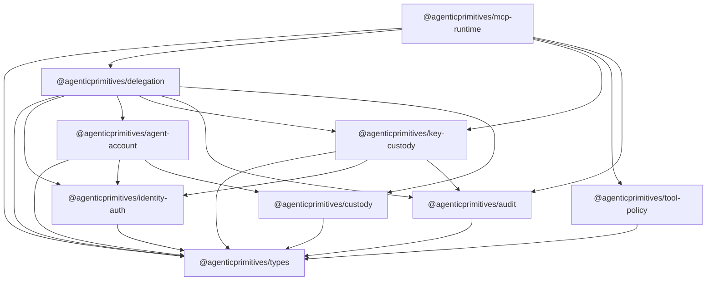
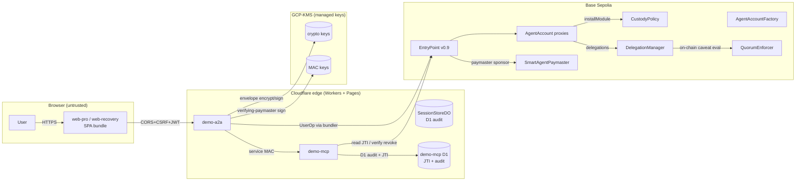
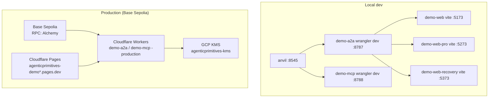
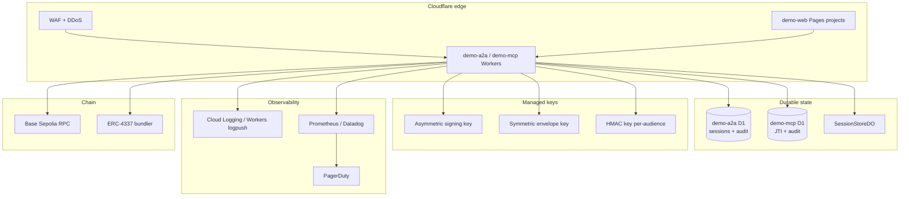

# Architecture Diagram — agenticprimitives

**Owner:** [technical-architect-auditor](../agents/technical-architect-auditor.md).
**Refresh cadence:** every wave that adds/removes a package, a trust
boundary, or a deployment target.
**Last refresh:** 2026-05-23 (Wave H1-H4).
**Source of truth:** these diagrams are hand-maintained today. Future
work (see Gate 2 of `specs/214-production-audit-dossier.md`) is a
generator that derives them from `capability.manifest.json` data.

Companion docs: [`threat-model.md`](./threat-model.md) ·
[`evidence-checklist.md`](./evidence-checklist.md) ·
[`docs/architecture/cross-cutting-capabilities.md`](../architecture/cross-cutting-capabilities.md).

---

## 1. Dependency graph (acyclic, one-directional)



**Invariants:**
- No back-edges (verified by `pnpm check:all` + workspace typecheck).
- `tool-policy`, `types`, `audit` are leaves of the protocol graph
  (no MCP / A2A / wallet imports).
- `custody` and `delegation` share `types` but otherwise stay in
  separate vocabularies (custody-domain vs delegation-domain words —
  spec 213).

---

## 2. Capability flow — happy path of one MCP tool call

```mermaid
sequenceDiagram
    participant U as User (browser)
    participant W as demo-web-pro
    participant A as demo-a2a (Worker)
    participant M as demo-mcp (Worker)
    participant K as GCP-KMS
    participant C as Base Sepolia

    Note over U,W: 1. Authenticate
    U->>W: SIWE or passkey enrol
    W->>A: /auth/siwe-verify or /auth/passkey-verify
    A->>C: UniversalSignatureValidator.isValidSig (ERC-1271/6492)
    A-->>W: JWT session cookie

    Note over U,W: 2. Issue delegation
    U->>W: Authorize agent (delegation surface)
    W->>W: delegation.DelegationClient.issueDelegation
    W->>A: /session/package (EIP-712 sig + caveats)
    A->>C: agent-account.isValidSignature (ERC-1271)
    A->>A: persist (D1 + DurableObject)
    A->>K: key-custody.generateSessionDataKey (envelope wrap)
    A-->>W: sessionPackage (delegation + wrapped session key)

    Note over U,M: 3. Tool call
    U->>M: tool invoke (token in body)
    M->>M: mcp-runtime.verifyServiceMac (a2a→mcp envelope)
    M->>M: withDelegation wrapper
    M->>M: tool-policy.evaluatePolicy (fail-closed shape gate, Wave H1)
    M->>M: delegation.verifyDelegationToken
    Note right of M: quorumProof required if requireQuorumCaveat<br/>set (Wave H3); off-chain stub today
    M->>C: optional: isRevoked / isAcceptedSessionDelegation
    M->>K: optional: signA2AAction (per-tool executor)
    M-->>M: audit.emit accept/reject
    M-->>U: result | opaque auth_failed
```

---

## 3. Trust boundaries (system map)



**Trust boundary labels:**
- Browser ↔ demo-a2a — Boundary A (threat-model § 2).
- demo-a2a ↔ demo-mcp — Boundary B (threat-model § 3).
- demo-mcp ↔ tool handler — Boundary C (in-process, threat-model § 4).
- AgentAccount ↔ EntryPoint ↔ Bundler — Boundary D (threat-model § 5).
- CustodyPolicy ↔ AgentAccount — Boundary E (threat-model § 6).
- Factory ↔ Account deploy — Boundary F (threat-model § 7).
- KMS ↔ key-custody — Boundary G (threat-model § 8).

---

## 4. Deployment topology



---

## 5. Deployed addresses (Base Sepolia, post-Wave H1-H4)

| Contract | Address |
| --- | --- |
| EntryPoint v0.9 | `0x36149FBf6dF65FFE52462bfece72DE7586D5dF45` |
| CustodyPolicy (factory-immutable) | `0xf66F7e41D5420a99Ae2670b8e4a751C133d59968` |
| AgentAccountFactory | `0x24045061dc2dd6FfdE1218F27C79637eCe5e7ec7` |
| QuorumEnforcer | `0x044D099Ed5B31E782002167Bb699e0FE2f901B56` |

Authoritative source: `apps/contracts/deployments-base-sepolia.json`.
Cloudflare deploy state: `cloudflare-urls.json` (gitignored).

---

## 6. Package boundary table

| Package | Owns | Does NOT own | Top consumers |
| --- | --- | --- | --- |
| `types` | branded primitives (Address, Hex) | anything else | all other packages |
| `identity-auth` | SIWE / passkey / JWT / CSRF | smart-account logic | agent-account, delegation |
| `agent-account` | AgentAccountClient, addressing, UserOp build, ERC-1271 sign | KMS, caveats, delegation, MCP transport | delegation, demo apps |
| `delegation` | Caveats, EIP-712, token mint/verify, session lifecycle | tier taxonomy, transport, KMS implementations | mcp-runtime, demo apps |
| `key-custody` | KMS providers, envelope encryption (AAD-bound), MAC, viem signer adapter | session lifecycle (moved to delegation), policy | delegation, mcp-runtime, demo-a2a |
| `tool-policy` | classification, decision engine, threshold policy, exact-call DSL | transport, signing | mcp-runtime |
| `mcp-runtime` | `withDelegation`, JTI replay store, MCP-side audit + metrics, service-MAC verify | delegation primitive, policy taxonomy, MCP SDK transport | demo-mcp |
| `custody` | CustodyAction enum, ABI, action builders (range-guarded), EIP-712 typed-data, quorum-slot pack, recovery args | delegation, KMS, agent-account internals | agent-account, demo apps |
| `audit` | event schema, sinks (console/memory/D1/PII-guardrail), metrics primitives, compose | sink-specific transport contracts | all packages, demo apps |

---

## 7. Operational topology (production target)



**Gaps relative to this target (as of 2026-05-23):**
- demo-a2a uses **console-only audit** (H5 task). Production deploys
  need D1A wired.
- Per-IP rate limit not yet implemented at edge (relies on Cloudflare's
  WAF default rules).
- No external SIEM exporter (planned).
- Per-tool KMS-key isolation (HKDF derivation) not implemented; tool
  executor reuses master signer.

---

## 8. Diagram-update protocol

When a wave changes one of these structures, the author updates the
relevant section + the change log below.

| Date | Wave | What changed |
| --- | --- | --- |
| 2026-05-23 | H1-H4 | Added `audit` + `custody` to dependency graph. Updated trust-boundary diagram for Wave 2A C-1/2/3 closure. Added production-default labels on the capability-flow sequence. Added deployed-addresses table (post-H1 redeploy). |
| earlier | various | Initial diagrams. |
