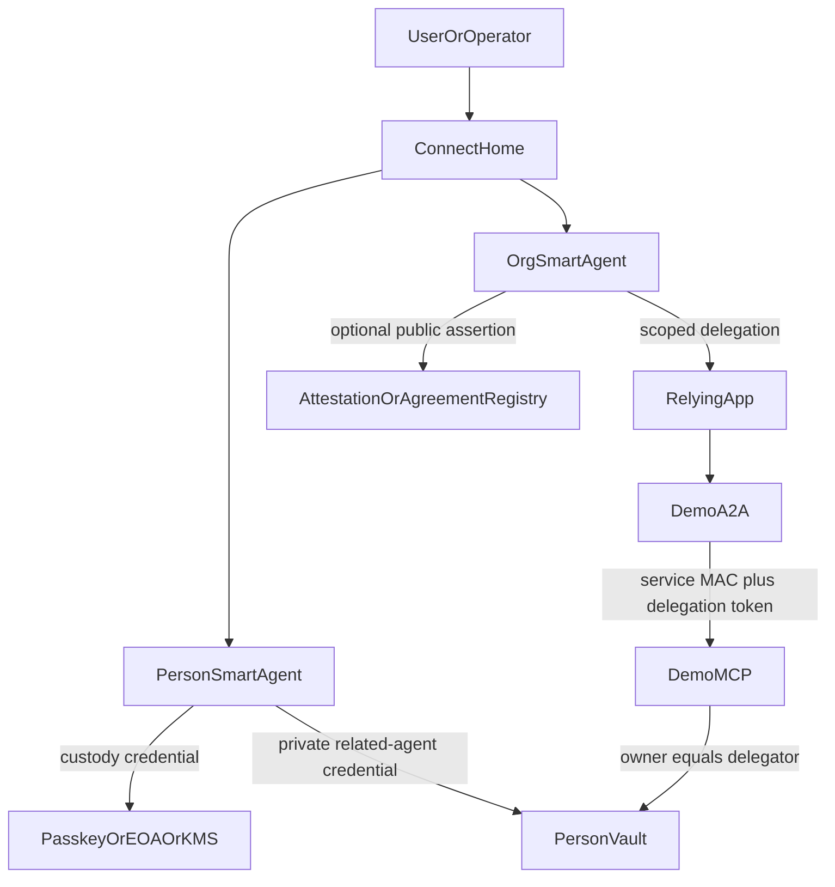

# Public Self-Audit Report — June 2026

| Field | Value |
|---|---|
| Status | Public review packet |
| Date | 2026-06-03 |
| Scope | `@agenticprimitives/*` packages, `packages/contracts`, demo authority paths, audit evidence surface |
| Review target | Public self-audit + open community review, not a paid firm report |
| Primary evidence index | [`audit-evidence-index.md`](./audit-evidence-index.md) |
| Open review instructions | [`open-review-2026-06.md`](./open-review-2026-06.md) |
| Bug bounty terms | [`bug-bounty-2026-06.md`](./bug-bounty-2026-06.md) |
| Validation ledger | [`validation-results-2026-06.md`](./validation-results-2026-06.md) |

## 1. Executive Summary

`agenticprimitives` is an alpha-stage, Base Sepolia-deployed substrate for Smart Agent accounts, custody and recovery, scoped delegation, MCP resource access, naming, attestations, and demo applications that exercise those primitives.

This report packages the repository's internal audit evidence into a public review artifact. It is intended to make external review possible before a paid firm audit or public contest. It does not claim production readiness for real funds.

**Verdict:** external-review-ready alpha. The core authority substrate has strong internal evidence: Foundry tests, stateful invariants, Halmos proofs, Slither/Aderyn triage, coverage floors, storage-layout snapshots, and package-boundary CI. The remaining high-risk blockers are operational and evidence-process issues, especially clean production governance and public disclosure of the testnet deployer key.

## 2. Scope

In scope:

- Solidity contracts in [`packages/contracts/src`](../../packages/contracts/src).
- Published package surfaces under `packages/*`.
- Authority paths across `agent-account`, `account-custody`, `delegation`, `key-custody`, `tool-policy`, `mcp-runtime`, `connect`, and `audit`.
- Base Sepolia deployment provenance and operational posture.
- Demo app authority paths where they exercise the substrate (`demo-a2a`, `demo-mcp`, `demo-sso-next`, `demo-jp`).

Out of scope for this open review:

- UI polish and ordinary product defects unless they create security impact.
- Denial-of-service requiring unrealistic resource spend against testnet-only endpoints.
- Social engineering, phishing, or attacks against third-party platforms.
- Mainnet TVL assumptions. No mainnet production deployment is claimed.

## 3. System Model

The system uses a faceted Smart Agent model:

- The canonical identifier is the ERC-4337 Smart Agent address.
- Names, profiles, credentials, attestations, related-agent links, and org relationships are facets or claims around that address.
- Custody controls identity continuity; delegation controls scoped authority.
- MCP and A2A paths verify signed delegations and caveats before serving private data.

## 4. Evidence Index

Start here:

- [`audit-evidence-index.md`](./audit-evidence-index.md) — single-page map of audit evidence.
- [`index.md`](./index.md) — audit hub and per-package `AUDIT.md` links.
- [`threat-model.md`](./threat-model.md) — STRIDE trust-boundary model.
- [`evidence-checklist.md`](./evidence-checklist.md) — control-by-control evidence checklist.
- [`packages/contracts/AUDIT.md`](../../packages/contracts/AUDIT.md) — contracts dossier.
- [`r9-static-analysis-triage.md`](./r9-static-analysis-triage.md) — Slither and Aderyn triage.
- [`2026-06-01-r10-internal-readiness-assessment.md`](./2026-06-01-r10-internal-readiness-assessment.md) — prioritized readiness backlog.

## 5. Contract Evidence Summary

Current contract evidence, as documented in [`packages/contracts/AUDIT.md`](../../packages/contracts/AUDIT.md) and [`audit-evidence-index.md`](./audit-evidence-index.md):

- Foundry test corpus: 680 tests across 37 Solidity files.
- Stateful invariants:
  - `CustodyPolicy.invariant.t.sol`
  - `DelegationManager.invariant.t.sol`
  - `SmartAgentPaymaster.invariant.t.sol`
- Halmos symbolic proofs:
  - WebAuthn UV gate.
  - WebAuthn UP gate.
  - `AgentAccount` `onlySelf` properties for sensitive admin paths.
- Static analysis:
  - Slither is PR-blocking on HIGH findings.
  - Aderyn is advisory, with HIGH categories triaged.
  - Solhint and CodeQL run in security workflows.
- Fuzzing:
  - Echidna nightly artifact-only run.
  - Medusa weekend artifact-only run.
- Storage:
  - Storage layout snapshots for key contracts.
- Coverage:
  - Security-critical contracts are above the documented line-coverage floors.

## 6. Known Blockers And Disclosures

### N1 — Disclosed Testnet Deployer EOA

Status: **open production blocker; accepted testnet risk only.**

The known deployer EOA is publicly disclosed and controls live testnet authority surfaces. This is documented in [`packages/contracts/AUDIT.md`](../../packages/contracts/AUDIT.md) § 4.1 and [`product-readiness-audit.md`](../architecture/product-readiness-audit.md) N1.

Impact if used beyond testnet:

- Authority roles could be rotated by anyone holding the disclosed key.
- Paymaster stake and governance controls could be abused.
- Factory signer roles could be changed.

Required production remediation:

1. Generate clean deployer/signing keys inside KMS.
2. Deploy production governance under multisig + timelock.
3. Redeploy or rotate all authority roles away from the disclosed key.
4. Revoke/destroy the old key material.
5. Verify with `pnpm check:production-deploy` and `pnpm verify:governance-shape`.

### EIP-712 Typehash Sync

Status: **partially closed; evidence must remain current.**

The repo has a cross-stack typehash test and wrapper command:

- `packages/delegation/test/integration/cross-stack-typehashes.test.ts`
- `scripts/check-eip712-typehash-equality.ts`
- `pnpm check:eip712-typehash-equality`

The public packet treats this as a required validation command. Any failure is a release blocker because drift between TypeScript and Solidity delegation hashes can break ERC-1271 validation or on-chain redemption.

### WebAuthn Authenticator Data Length

Status: **open medium finding; UP/UV/rpIdHash controls are separately closed.**

Current evidence proves or tests:

- UP bit required.
- UV bit behavior when `requireUv = true`.
- RP ID hash binding.
- Malformed WebAuthn payloads return false rather than reverting.

Remaining risk:

- A dedicated runtime length gate for `authenticatorData` is still tracked as open. The Halmos proofs use the 37-byte minimum layout as a symbolic bound; that is proof setup, not a production length check.

### Public Relationship Privacy

Status: **explicit design caveat.**

`AgentRelationship.sol` is a public on-chain edge model. Public edges leak social or organizational graph data. The private person-to-org model is now expected to live as related-agent credentials in the person's vault, not as a public relationship edge. Production deployments with sensitive membership or participation data should avoid public `AgentRelationship` writes unless users explicitly request publication.

## 7. Manual Review Checklist

Reviewers are asked to inspect:

- Contract authority closure: `onlySelf`, factory init one-shot, disabled legacy upgrade path.
- Custody and recovery: threshold defaults, timelocks, zero digest rejection, rotate-all semantics.
- Delegation: EIP-712 hashing, caveat hashing, revocation, quorum caveat gates, timestamp/value/target/method enforcers.
- WebAuthn: UP/UV flags, RP ID hash, malformed assertion handling, authenticator-data length assumptions.
- Paymaster: dev vs allowlist vs verifying modes, hash binding, stake/deposit economics.
- Naming: root initialization, permissionless subregistry behavior, reverse-resolution round trip.
- MCP/A2A: service MAC, delegation-token verification, JTI replay, audit event durability.
- Key custody: KMS assumptions, local-aes production guards, signer audit events, rotation plans.
- Privacy: public relationship edges, related-agent vault credentials, optional publication consent.
- CI and release: supply-chain checks, secret scanning, SBOM, storage layout snapshots, ABI sync.

## 8. Validation Snapshot

The current command ledger lives in [`validation-results-2026-06.md`](./validation-results-2026-06.md). Each entry records command, commit, date, result, and notes.

Deep fuzzers are expensive and may be referenced from retained CI artifacts rather than run locally on every packet refresh.

## 9. Residual Risks

The public review should assume the following are known and not hidden:

- N1 remains a production blocker until clean governance is executed.
- A paid third-party Solidity audit has not yet been completed.
- Echidna and Medusa are currently artifact-only rather than PR-blocking.
- Some evidence docs are manually maintained until the audit evidence generator lands.
- Demo app key/custody shortcuts are testnet-only and must not be copied to production.
- Private relationship claims and public assertions are still being separated across newer related-agent/vault flows.

## 10. Review Outcome Tracking

Valid findings from the open review should be added to:

- [`product-readiness-audit.md`](../architecture/product-readiness-audit.md) for cross-cutting/system findings.
- The relevant `packages/<name>/AUDIT.md` for package-local findings.
- This report's follow-up section in a closing report after the review window ends.

Each accepted finding should include severity, affected file(s), proof of concept or reasoning, recommended fix, owner, status, and retest evidence.
