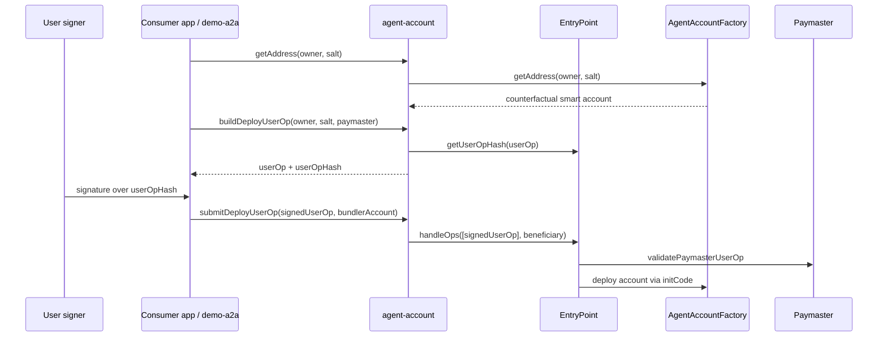
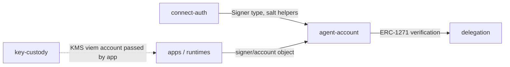

# Agent Account Architecture

`@agenticprimitives/agent-account` owns the ERC-4337 smart-account substrate. It turns authenticated user identity into deterministic smart-account addresses, deployment calls, ERC-1271 checks, and UserOperation shapes.

## Role

The package is intentionally signer-agnostic. It accepts signer/account objects from callers and does not know whether they came from a browser wallet, passkey flow, local dev key, or Cloud KMS.

Main capabilities:

- `AgentAccountClient` for address derivation, factory deployment, owner checks, and ERC-1271 verification.
- `BundlerClient` for EntryPoint `getUserOpHash`, nonce lookup, and direct `handleOps` submission.
- `PackedUserOperation` helpers such as `packGasLimits()` and `unpackGasLimits()`.
- ABI exports for the EntryPoint/account interaction surface.

## Account Lifecycle

The package knows how to shape and submit the operation. It does not decide whether a user is eligible for sponsorship.

## Package Interactions

`delegation` uses this package for ERC-1271 checks against a deployed account.

Apps may combine `key-custody.createKmsViemAccount()` with `agent-account.submitDeployUserOp()` to run a KMS-backed relayer. The dependency remains app-level so `agent-account` does not depend on `key-custody`.

## Paymaster and Bundler Boundary

`agent-account` may encode `paymasterAndData` and send `handleOps`. Paymaster policy is outside the package.

Owned here:

- EntryPoint version binding.
- UserOperation shape.
- Gas-field packing.
- Direct bundler helper for self-operated bundling.

Not owned here:

- Paymaster selection.
- Sponsorship eligibility.
- Abuse controls, quotas, gas budgets.
- SaaS bundler/paymaster credentials.

If relay logic becomes a reusable product surface, it should move to a future `account-relay` or `paymaster-policy` package.

## Security Invariants

- EntryPoint version is part of the account model and must not drift silently.
- Sensitive account writes are owner-gated or ERC-1271-gated on-chain.
- Salt derivation must avoid collision-prone raw user input.
- Bootstrap/deploy signer should be distinct from user authority and from master signing roles.
