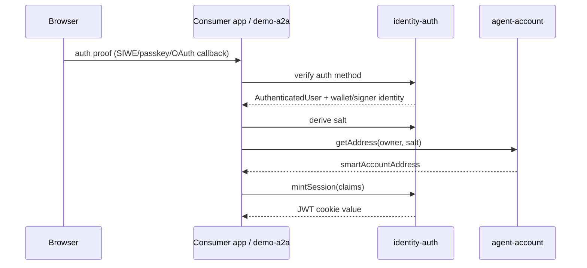
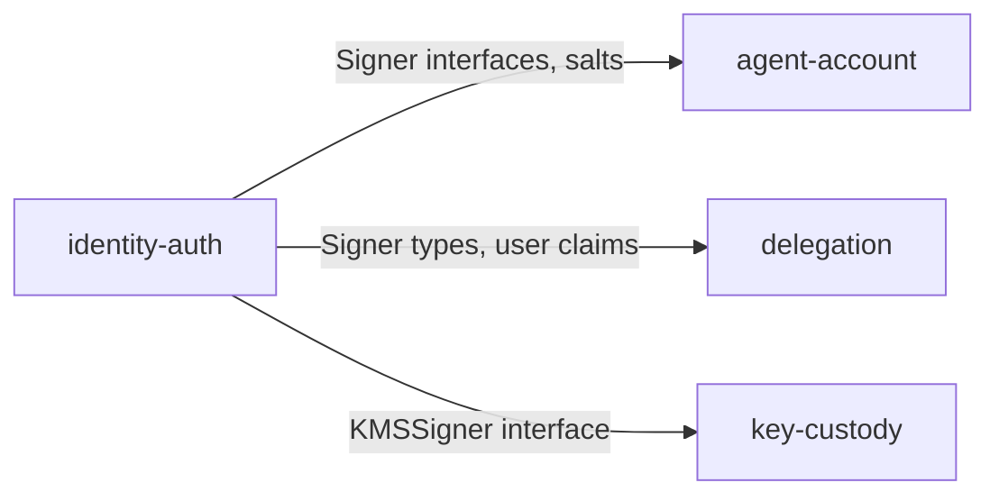

# Identity Auth Architecture

`@agenticprimitives/connect-auth` owns user authentication primitives and signer interfaces. It does not own the smart account, concrete KMS signers, delegation sessions, HTTP routes, or persistence.

## Role

This package sits at the base of the dependency graph. It tells the rest of the system who the user is and what signer interface can represent that user.

Main capabilities:

- JWT session minting and verification.
- CSRF token helpers with exact-origin checks.
- Deterministic salt derivation for account addresses.
- Signer interfaces consumed by `agent-account`, `delegation`, and `key-custody`.
- Auth-method subpaths for passkey, SIWE, and Google.

## Core Flow

`identity-auth` produces values. The consuming app writes cookies, stores nonce state, and chooses routing.

## Package Interactions

`agent-account` consumes signer interfaces and salt helpers to derive deterministic smart-account addresses.

`delegation` consumes signer types for browser-side EIP-712 issuance and for token/session signing surfaces.

`key-custody` provides concrete KMS-backed implementations of signer-like interfaces; `identity-auth` only defines the shape.

## Boundary

`identity-auth` owns JWT-cookie sessions only. A JWT session says "this browser request is authenticated as this user." That is different from a `delegation.SessionRow`, which binds a delegation to a session-signing keypair and is owned by `delegation`.

This package must not:

- Generate or store concrete private keys.
- Encrypt session packages.
- Build delegations or caveats.
- Read or write app databases.
- Register HTTP routes.

## Security Invariants

- JWT secrets are never logged.
- CSRF origin checks are exact URL/origin matches, never substring checks.
- Passkey challenges are one-shot and replay-protected by the consumer's challenge store.
- Salt derivation is deterministic and hash-based.
- HMAC verification uses constant-time comparison.
