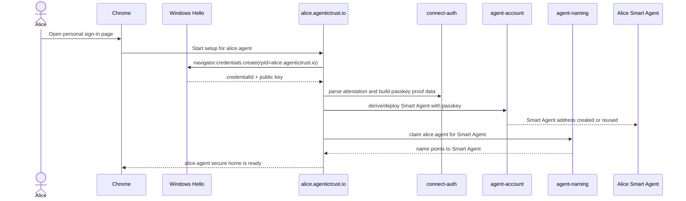
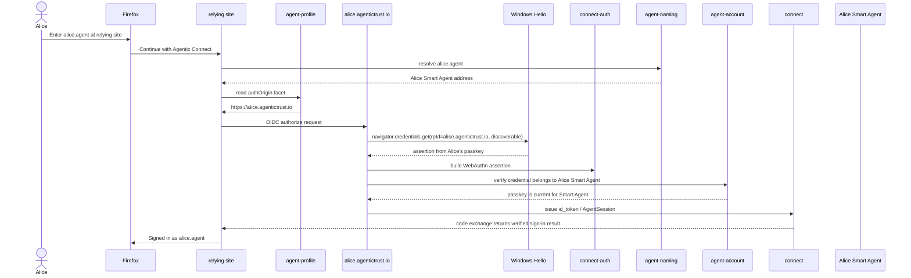

# Cross-browser secure-home passkey flow

This document explains how a user can create a passkey-backed personal Smart
Agent from one browser, then connect to the same existing agent from another
browser on the same Windows machine.

The short version:

- The portable identity is the Smart Agent address, usually reached by a name
  like `alice.agent`.
- The passkey is scoped to the personal sign-in page origin, for example
  `alice.agentictrust.io`.
- Chrome and Firefox do not share `localStorage`, but both can ask Windows Hello
  for a discoverable passkey scoped to the same WebAuthn RP ID.
- `connect-auth` owns the WebAuthn ceremony helpers. Other packages own account
  deployment, name resolution, broker tokens, app permissions, and tool access.

## User Story

Alice first creates `alice.agent` in Chrome. Later she opens Firefox, visits a
relying app, enters `alice.agent`, and is redirected to her personal sign-in page.
Firefox has no Chrome-local cache, but Windows Hello can still offer the same
discoverable passkey because the request is for the same RP ID:

```text
alice.agentictrust.io
```

The browser that created the passkey is not the identity. The Smart Agent is the
identity. The passkey is one replaceable control credential for that Smart Agent.

## Interaction: Chrome Creates The Personal Agent



What matters:

- `connect-auth` parses the WebAuthn attestation and assertion material.
- `agent-account` turns the passkey public key into Smart Agent control.
- `agent-naming` makes `alice.agent` resolve to the Smart Agent.
- The browser stores demo metadata locally, but the durable control relationship
  is on the Smart Agent.

## Interaction: Firefox Connects To Existing Name



The important cross-browser request is:

```ts
navigator.credentials.get({
  publicKey: {
    challenge,
    allowCredentials: [],
    userVerification: 'required',
  },
});
```

An empty `allowCredentials` lets the platform offer any discoverable passkey for
the current RP ID. Firefox does not need Chrome's stored credential ID. Windows
Hello returns the selected credential's `rawId`, and the app computes the
credential digest from that returned ID.

## Package Roles

| Package | Role in this flow |
| --- | --- |
| `connect-auth` | WebAuthn ceremony helpers: parse passkey attestation, build assertions, normalize signatures, expose signer interfaces. It does not decide which Smart Agent owns the credential. |
| `agent-account` | Deploys/derives the Smart Agent and verifies whether a passkey digest is currently registered on that Smart Agent. |
| `agent-naming` | Resolves `alice.agent` to the canonical Smart Agent address. |
| `agent-profile` | Carries the `authOrigin` facet so a relying site can discover `https://alice.agentictrust.io`. |
| `connect` | Issues and verifies cross-origin `AgentSession` / OIDC `id_token` values with JWKS. |
| `identity-directory` | Composes name, credential, and on-chain reads into "this credential maps to this canonical agent" answers for apps. |
| `identity-directory-adapters` | Provides app-specific adapters/indexes for directory reads. |
| `delegation` | Owns the app-permission token primitive used after sign-in when a relying site receives scoped authority from the Smart Agent. |
| `mcp-runtime` | Enforces approved access at MCP tool boundaries. |
| `tool-policy` | Classifies tool/action risk so apps can require stronger confirmation for sensitive actions. |
| `key-custody` | Wraps session keys and service MAC material in A2A/MCP paths. |
| `audit` | Provides event schemas and sinks for authentication, token, and access traces. |
| `types` | Shared `Address`, `Hex`, and canonical identifier types. |

## Boundary Notes

`connect-auth` is intentionally low-level and stateless. It should not learn about
names, profiles, app permissions, MCP, or storage. Its job in this flow is to
turn browser WebAuthn responses into well-formed passkey proof material that
other packages can verify against the Smart Agent.

In production, the personal sign-in page must keep using the same RP ID for the
same agent home. If Chrome registers the passkey at `agentictrust.io` and Firefox
later asks for `alice.agentictrust.io`, Windows treats those as different RP IDs.
The cross-browser flow works when both browsers use the same personal origin.

