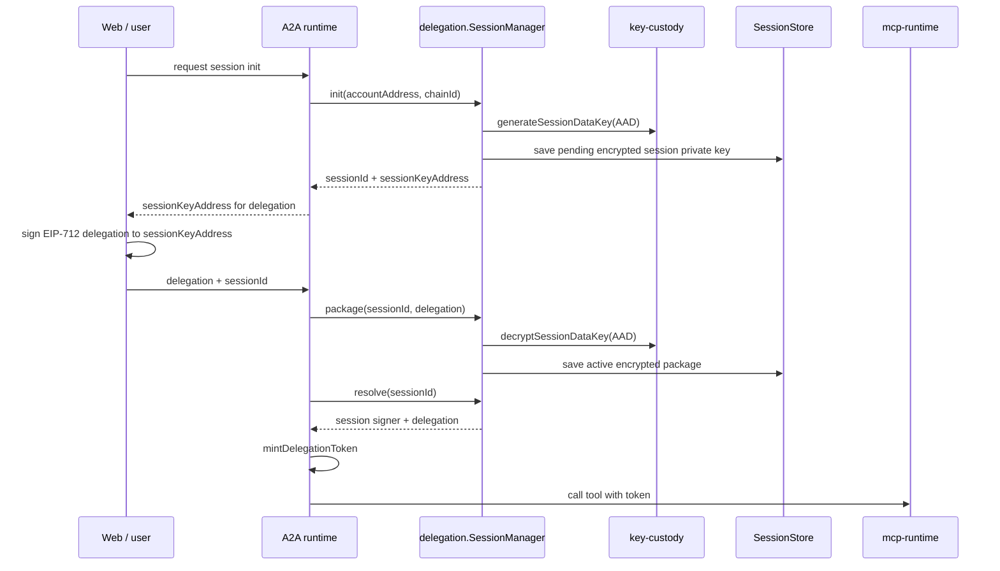
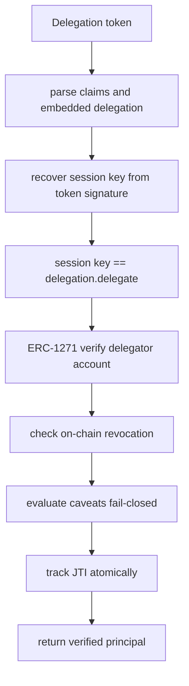
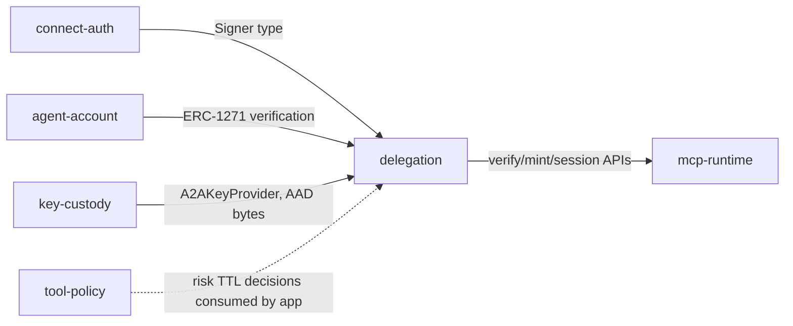

# Delegation Architecture

`@agenticprimitives/delegation` owns authority delegation and the lifecycle of delegation-bound session keys. It is the package that decides what a delegated session can do, when it expires, and how a runtime verifies it.

## Role

Main capabilities:

- EIP-712 `Delegation` and `Caveat` structures.
- Caveat builders, encoders, hashing, and fail-closed evaluation.
- Browser-side `DelegationClient` issuance.
- `SessionManager` lifecycle: `init`, `package`, `resolve`, `revoke`.
- Delegation token minting and verification.
- JTI and session store interfaces.
- On-chain revocation surface.

## Session Lifecycle

`SessionManager` owns the lifecycle state machine, while `key-custody` owns the data-key wrapping primitive.

Session private keys are plaintext only inside `SessionManager` calls that need to encrypt, decrypt, or sign. At rest they are always inside an encrypted session package.

## Verification Flow

`mcp-runtime` calls this package for token verification and then maps the result into runtime-specific handler context.

## Package Interactions

`delegation` must not depend on `mcp-runtime` or `tool-policy`; those packages sit above it. Apps can combine policy decisions with session creation, but the primitive stays transport-agnostic.

## Boundary

Owned here:

- Authority objects: `Delegation`, `Caveat`, `DelegationTokenClaims`.
- Session row shape and lifecycle state transitions.
- Fail-closed caveat evaluation.
- Token minting, token verification, and JTI interface.

Not owned here:

- KMS implementations or AES primitives.
- MCP transport wrappers.
- Tool classification taxonomy.
- Auth methods and JWT-cookie sessions.
- Smart-account deployment internals.

## Security Invariants

- Unknown caveat enforcers reject.
- Session private keys are never stored plaintext.
- Tokens bind the delegation and a session-key signature over canonical claims.
- JTI usage tracking must be atomic.
- Delegate binding caveats validate every bound address, not just one side.
- Revocation and ERC-1271 checks should fail closed for production verification paths.
