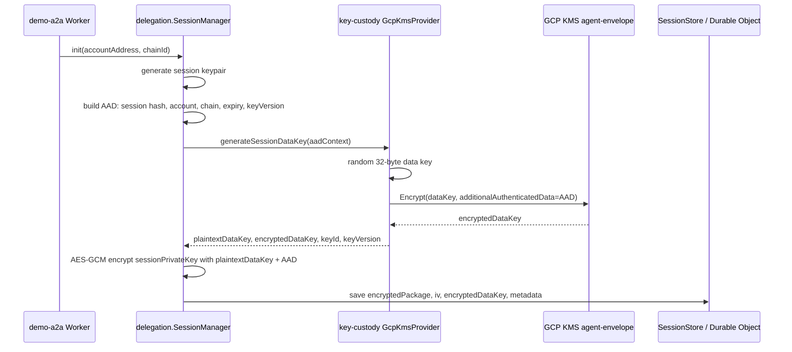
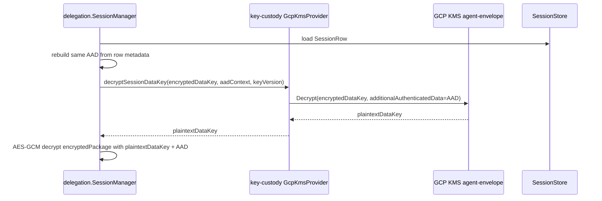
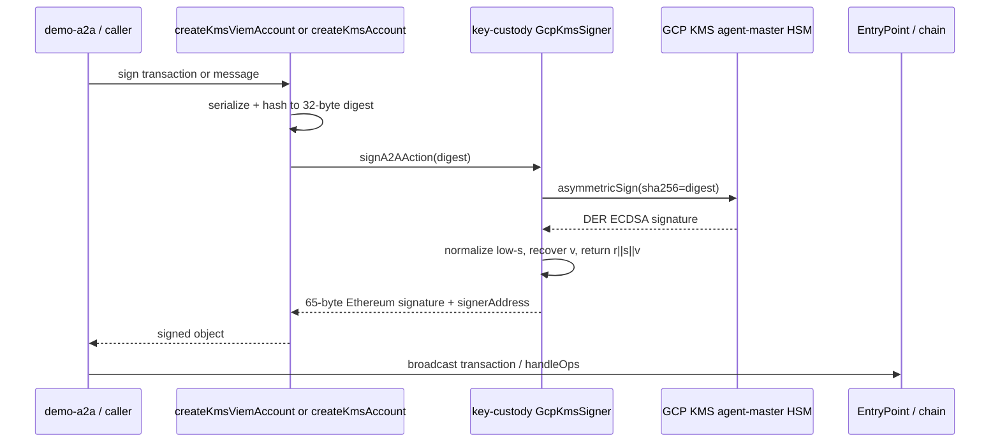

# Key Custody Architecture

`@agenticprimitives/key-custody` owns the crypto and KMS primitives used by the rest of the system. It does not decide what a session means, which tool is authorized, or which MCP route may run. Those authority decisions live in `delegation`, `tool-policy`, and runtime packages.

The package has four jobs:

1. Wrap and unwrap session data keys for envelope encryption.
2. Sign 32-byte digests with KMS-held secp256k1 keys.
3. Produce MACs for inter-service request envelopes.
4. Select local, AWS, or GCP backends behind the same interfaces.

## Public Surfaces

| Surface | Purpose | Main consumers |
| --- | --- | --- |
| `buildKeyProvider()` | Returns an `A2AKeyProvider` for envelope encryption and optional MACs. | `delegation.SessionManager`, `apps/demo-a2a` |
| `generateSessionDataKey()` | Creates plaintext data key plus KMS-wrapped data key. | `delegation.SessionManager.init()` |
| `decryptSessionDataKey()` | Unwraps the encrypted data key when AAD matches. | `delegation.SessionManager.package()` and `.resolve()` |
| `buildSignerBackend()` | Returns a KMS-backed `KmsAccountBackend`. | `apps/demo-a2a`, `agent-account` relay flows |
| `signA2AAction()` | Signs an already-hashed 32-byte digest. | `createKmsAccount()`, `createKmsViemAccount()` |
| `createKmsAccount()` | Adapts a backend to the `connect-auth` `KMSSigner` shape. | Identity/delegation callers that need message signing |
| `createKmsViemAccount()` subpath | Adapts a backend to a viem `LocalAccount`. | Bundler/relayer transaction submission |
| `buildToolExecutorBackend()` | **Deprecated** (H7-B.1 / PKG-KEY-CUSTODY-001). Throws with redirect. | — |
| `buildToolExecutorBackendNoIsolation()` | Returns the master signer (NO per-tool isolation). Refused in production; gated by `AP_ALLOW_NO_TOOL_ISOLATION=true` in dev. Use `deriveSubjectSigner` for true isolation. | dev-only / test fixtures |
| `buildMacProvider()` | Selects backend for service HMACs. | `mcp-runtime` and future `a2a-runtime` |
| `canonicalContextBytes()` | Canonicalizes AAD records. | `delegation.SessionManager` |

## GCP Key Model

Production GCP uses two different Cloud KMS keys because signing and encryption are different cryptographic operations with different blast radii.

| Key | Env var | GCP purpose | Protection | Used by | What it protects |
| --- | --- | --- | --- | --- | --- |
| Agent master signing key | `GCP_KMS_KEY_NAME` | `asymmetric-signing`, `EC_SIGN_SECP256K1_SHA256` | HSM required for secp256k1 | `GcpKmsSigner` | Agent identity signatures, relayer/bundler transactions |
| Agent envelope encryption key | `GCP_KMS_ENCRYPT_KEY_NAME` | `encryption`, `GOOGLE_SYMMETRIC_ENCRYPTION` | Software is acceptable | `GcpKmsProvider` | Session data keys used to encrypt session packages |

The signing key env var points to a **key version**:

```text
projects/<P>/locations/<L>/keyRings/<R>/cryptoKeys/agent-master/cryptoKeyVersions/1
```

The envelope key env var points to the **key**, not a version:

```text
projects/<P>/locations/<L>/keyRings/<R>/cryptoKeys/agent-envelope
```

GCP chooses the active symmetric key version internally for encrypt/decrypt.

## Envelope Encryption Flow

`key-custody` wraps only the session data key. The actual session package encryption is performed by `delegation.SessionManager` with AES-GCM and the plaintext data key returned by this package.



Resolve and package use the reverse path:



If account, chain, expiry, session hash, or key version is changed, AAD changes and Cloud KMS refuses to unwrap the data key. AES-GCM also receives the same AAD, so tampering trips both layers.

## Asymmetric Signing Flow

`GcpKmsSigner` never receives a private key. It fetches the public key once, derives the Ethereum address, and sends 32-byte digests to Cloud KMS for `asymmetricSign`.



This path is used by the demo relayer/bundler flow: `apps/demo-a2a` builds or receives a signed UserOp, wraps the KMS signer with `createKmsViemAccount()`, and calls `agent-account.submitDeployUserOp()`. The HSM-backed key pays gas and signs the `handleOps` transaction; user authority remains in the user's smart account and delegation signatures.

## Backend Selection

`buildKeyProvider({ backend })` selects envelope/MAC provider implementations:

- `local-aes`: development only. It derives wrapping material from `A2A_SESSION_SECRET` and refuses production.
- `gcp-kms`: production GCP. Uses `GCP_KMS_ENCRYPT_KEY_NAME` and `GCP_SERVICE_ACCOUNT_JSON`.
- `aws-kms`: declared backend shape; implementation is intentionally narrower/stubbed where not complete.

`buildSignerBackend({ backend })` selects signing backends:

- `local-aes`: development secp256k1 signer from `A2A_MASTER_PRIVATE_KEY`.
- `gcp-kms`: production signer from `GCP_KMS_KEY_NAME` and `GCP_SERVICE_ACCOUNT_JSON`.
- `aws-kms`: AWS KMS signer surface.

The same service account may be used for both GCP keys in the demo, but IAM grants are scoped separately:

- `roles/cloudkms.signer` and `roles/cloudkms.publicKeyViewer` on `agent-master`.
- `roles/cloudkms.cryptoKeyEncrypterDecrypter` on `agent-envelope`.

Production deployments should split master signer, deploy relayer, per-tool executors, MAC keys, and envelope key when operationally feasible.

## Use By Other Packages

`delegation` depends on `A2AKeyProvider` and `canonicalContextBytes`. Its `SessionManager` owns lifecycle state and calls `generateSessionDataKey()` and `decryptSessionDataKey()` when storing or resolving encrypted session packages.

`agent-account` does not depend on `key-custody`, but app code can pass a `createKmsViemAccount()` result into its bundler/deploy functions. This preserves the boundary: account code accepts a signer-like account; key-custody owns how the key is held.

`mcp-runtime` may consume `@agenticprimitives/key-custody/mac` for HMAC verification of inter-service envelopes. Token and caveat verification still belongs to `delegation`.

`apps/demo-a2a` wires both GCP paths: `sessionManagerFor()` uses `buildKeyProvider({ backend: 'gcp-kms', config: { cryptoKeyName: GCP_KMS_ENCRYPT_KEY_NAME } })`; deployment submission uses `buildSignerBackend()` plus `createKmsViemAccount()`.

## Security Invariants

- No production fallback from GCP/AWS to local secrets.
- Session private keys are never stored plaintext.
- AAD must be canonical and must bind account, chain, expiry, session hash, and key version.
- Signing accepts only 32-byte digests.
- secp256k1 signing key must use `EC_SIGN_SECP256K1_SHA256`; GCP Software keys cannot provide this curve.
- Master signing, session wrapping, MAC, deploy relayer, and per-tool execution are separate roles even when v0 demo reuses one service account.
