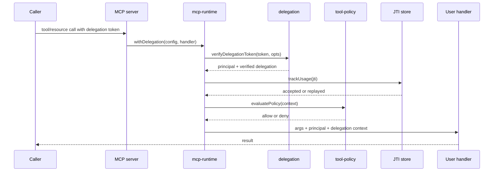
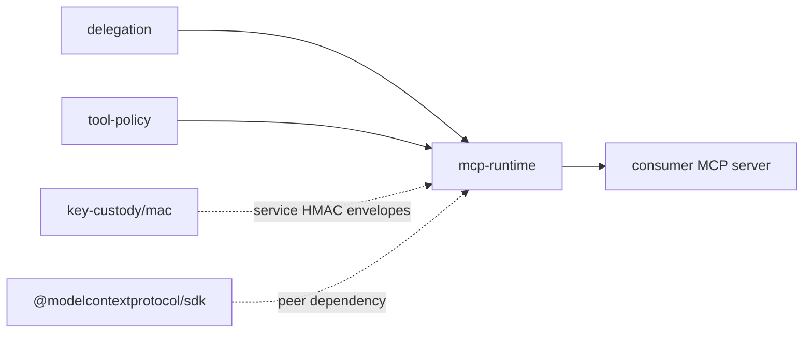

# MCP Runtime Architecture

`@agenticprimitives/mcp-runtime` adapts delegation and policy primitives to MCP resource/tool execution. It is middleware around the official MCP SDK, not a replacement for the SDK.

## Role

Main capabilities:

- `withDelegation()` and `withCrossDelegation()` wrappers.
- Low-level resource verification helpers.
- JTI replay-protection stores for memory, SQLite, and Postgres.
- `declareResource()` to connect MCP resource metadata with `tool-policy` classification.
- MCP-shaped auth errors with non-leaky external messages.

## Handler Flow

Errors returned to callers should remain opaque. Detailed reasons are for internal logs and audit events.

## Package Interactions

`mcp-runtime` consumes `delegation` verification and `tool-policy` decisions. It may use `key-custody/mac` for service-to-service request envelopes, but it does not perform session package encryption.

## Boundary

Owned here:

- MCP-oriented wrapper functions.
- Verification pipeline assembly.
- JTI store implementations.
- Policy-to-error mapping.
- Resource declaration helper.

Not owned here:

- EIP-712 delegation encoding or caveat builders.
- Tool taxonomy and risk tiers.
- The official MCP transport and server registration machinery.
- A2A runtime behavior.
- App database schemas and business resources.

## Security Invariants

- `withDelegation` must execute the complete verification pipeline before calling user handlers.
- JTI tracking must be atomic for persistent stores.
- Cross-delegation must validate delegate-binding caveats.
- External errors must not distinguish malformed, expired, revoked, replayed, or caveat-failed tokens.
- Policy denial must stop execution.

## Deployment Pattern

A consumer MCP server should register tools/resources with the official MCP SDK, then wrap sensitive handlers with `withDelegation()`. The runtime receives verified principal context and passes it to the handler so business logic can query app-owned data stores under the caller's authority.
