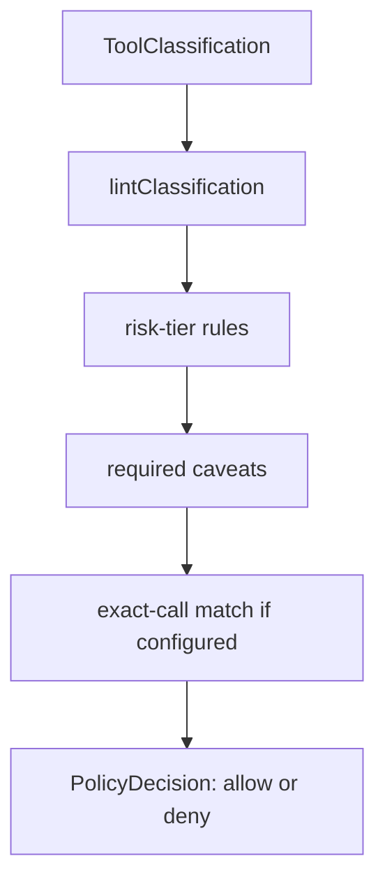
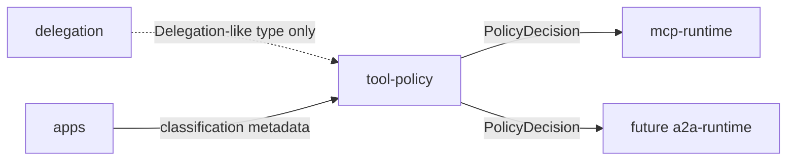

# Tool Policy Architecture

`@agenticprimitives/tool-policy` owns protocol-agnostic tool classification and policy decisions. It does not know about MCP, A2A, HTTP, sessions, KMS, or storage.

## Role

This package answers: "Given this classified tool, this requested call, and this delegation-like authority, should execution be allowed?"

Main capabilities:

- `declareTool()` to attach classification metadata.
- Risk tiers and TTL/caveat requirements.
- Exact-call policies for byte-identical calldata matching.
- `evaluatePolicy()` deterministic decision engine.
- `lintClassification()` for checking metadata blocks.

## Decision Flow

The decision engine has no clocks, random values, network calls, or database access. Callers provide all facts through `PolicyContext`.

## Package Interactions

`mcp-runtime` consumes decisions and maps them into MCP auth failures or handler execution. A future `a2a-runtime` can consume the same decision engine without pulling MCP dependencies into this package.

## Boundary

Owned here:

- Risk tier taxonomy.
- Classification tags.
- Exact-call DSL.
- Deterministic allow/deny decisions.
- Linting of classification metadata.

Not owned here:

- Caveat construction or EIP-712 verification.
- Runtime enforcement.
- MCP/A2A framework adapters.
- KMS, MAC, JWT, OAuth, or session state.
- Database persistence and audit sinks.

## Security Invariants

- Deny by default.
- Unknown classification fields fail closed.
- Exact-call checks compare exact calldata hashes, not partial method names.
- Risk tiers clamp TTLs and require caveats consistently.
- The same input must always produce the same decision.

## Runtime Use

The intended runtime pattern is:

1. App or framework declares a tool with classification metadata.
2. Runtime verifies caller authority through `delegation` or `mcp-runtime`.
3. Runtime calls `evaluatePolicy()` with the verified principal, tool metadata, requested call, and caveats.
4. Runtime enforces the returned decision.

This split keeps policy reusable and auditable across MCP, A2A, and future framework adapters.
