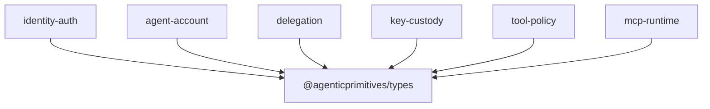

# Types Architecture

`@agenticprimitives/types` is the leaf package for cross-package primitive TypeScript types. It contains no runtime code and has no dependencies.

## Role

This package exists to prevent repeated primitive definitions from drifting across packages. It only holds values that are genuinely shared by multiple packages and are not owned by a single domain.

Current exports:

| Type | Meaning | Notes |
| --- | --- | --- |
| `Address` | Ethereum-style `0x...` address string. | Compile-time shape only; no checksum validation. |
| `Hex` | Hex string with `0x` prefix. | Used for signatures, calldata, hashes, and encoded terms. |
| `ChainId` | Branded number for chain IDs. | Prevents accidental mixing with arbitrary numbers. |
| `BrandedId<T>` | Generic opaque string ID. | Promoted here only when multiple packages need the same pattern. |

## Dependency Position

Every other package may depend on `types`. `types` must never depend on any other package.

## Boundary

This package should not grow into `common`, `shared`, or `utils`. A type belongs here only when:

1. It is a primitive, not a domain concept.
2. At least two packages use it today.
3. It can be represented with TypeScript types only.

Examples that do not belong here: `SessionRow`, `Delegation`, `ToolClassification`, `JwtClaims`, `UserOperation`, or app-specific user/profile models.

## Security Model

The package provides compile-time guardrails, not runtime validation. Consumers that accept untrusted input must still parse and validate addresses, hex strings, and chain IDs at runtime.
