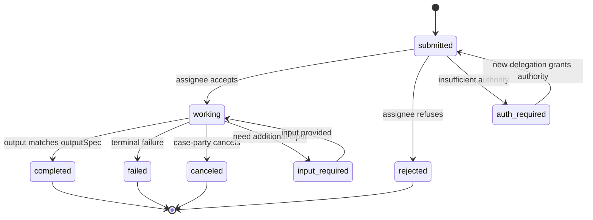

# Spec 245 — A2A Task model adoption in mcp-runtime

**Status:** Drafted (2026-06-02).
**Owns:** A2A interop substrate inside `mcp-runtime` — separately, and earlier than, the full `@agenticprimitives/fulfillment` package.
**Owns spine layers:** 11 Task/WorkItem (interop substrate); contributes to Layer 10 (FulfillmentCase) by providing the underlying Task state machine fulfillment consumes.
**Companion specs:** [244 — Fulfillment](244-fulfillment.md) (consumes this spec's Task substrate); [239 — Intent Marketplace](239-intent-spine.md); [coordination-substrate.md](../docs/architecture/coordination-substrate.md) Layer 11.
**Architecture-of-record:** [ADR-0024](../docs/architecture/decisions/0024-intent-coordination-substrate.md) Decision 2 (Task/WorkItem lives in `fulfillment` + `mcp-runtime`); Decision 7 (trace spans in `mcp-runtime`).
**Industry references:** [A2A — Agent-to-Agent Protocol](https://google.github.io/A2A/), [A2A Task lifecycle](https://google.github.io/A2A/specification/), [MCP Spec](https://modelcontextprotocol.io/specification), [OpenAI Agents SDK handoffs](https://platform.openai.com/docs/guides/agents).

---

## 0. Why this spec exists separately from spec 244

Spec 244 (`@agenticprimitives/fulfillment`) is the W1 home for `FulfillmentCase` + `Task` + `Message` + `Artifact` + `HandoffPolicy` + `EvidenceCredential` issuance. That's a substantial package; it lands as one of the six W1 deliverables.

But the **A2A Task model itself** is interop-critical infrastructure that EVERY agent in the platform needs the moment it talks to another agent — not just when fulfillment lands. A2A is the dominant inter-agent protocol of 2026; agents that don't speak it can't participate in the broader agentic ecosystem.

This spec is a **focused W1 quick win**: adopt the A2A Task state machine + Message/Artifact distinction inside `mcp-runtime` (existing package) right now, decoupled from the full `fulfillment` package timeline. `fulfillment` then *consumes* this substrate when it ships, rather than re-implementing it.

## 1. Decisions

| ID | Decision | Why |
|---|---|---|
| **A2A-1** | A2A Task state machine is implemented in `mcp-runtime` (existing package); not gated by `fulfillment` shipping | Decoupling: agents need A2A interop independently of fulfillment lifecycle |
| **A2A-2** | A2A wire-format compat is **at the wire boundary** (HTTP transport for cross-agent JSON-RPC + SSE); internal representation is our typed substrate | Get interop + keep our type discipline |
| **A2A-3** | `Task`, `Message`, `Artifact` are **typed inside mcp-runtime**; `fulfillment` package re-exports + extends them when it lands | Single source of truth for the types |
| **A2A-4** | A2A AgentCard MUST be ERC-1271-signed by the agent's SA | Aligns A2A identity layer with our SA-canonical identity ([ADR-0010](../docs/architecture/decisions/0010-smart-agent-canonical-identifier.md)) |
| **A2A-5** | A2A Task creation MAY be bound to an Intent or FulfillmentCase via `parentIntentId` / `parentCaseId`; required when minted by spec 244 flows | Connects A2A's stateless task model to our spine without forcing premature binding |
| **A2A-6** | A2A Message bodies live in JVs per D-46.1; never on chain | Privacy invariant |
| **A2A-7** | A2A Artifact hashes are emittable as `EvidenceCredential` (spec 242) when promoted; the substrate provides the promotion path but doesn't auto-promote | Holder opt-in |

## 2. Non-goals

- **NOT a fork of A2A.** We adopt the wire format + state model; we don't re-spec it.
- **NOT a re-implementation of MCP transport.** MCP stays the model-to-tools protocol; A2A is the agent-to-agent protocol. They coexist.
- **NOT the full `fulfillment` package.** This spec is the substrate; spec 244 is the lifecycle wrapper.
- **NOT a runtime container.** This is a typed library + transport adapter; orchestration is app-layer.

## 3. Reference: A2A + MCP patterns to port

- **Ported from A2A as-is.** Task state machine; Task / Message / Artifact separation; AgentCard discovery pattern; status / artifact emission via SSE (Server-Sent Events) when long-running.
- **Ported from A2A with modification.** AgentCard signing — A2A allows multiple signature schemes; we require ERC-1271 (SA-signed) for canonical identity binding (A2A-4). Message sender authentication — we require SA-signed messages.
- **Ported from MCP.** Tool / resource / prompt model continues to live in `mcp-runtime`; A2A Tasks may invoke MCP tools inside their `working` state; the relationship is "MCP is what tools are; A2A is how agents collaborate on tasks."
- **Ported from OpenAI Agents SDK.** Handoff pattern — already in spec 244 §7; here we surface the underlying transport (A2A delegate-task envelope).

## 4. The Task state machine (A2A-canonical)



Identical to A2A's official state machine. Names normalized to snake_case for our codebase conventions.

## 5. Typed surface

```ts
// @agenticprimitives/mcp-runtime/a2a
export interface Task {
  taskId: Hex32;
  parentIntentId?: string;
  parentCaseId?: Hex32;          // spec 244 binding when present
  state: TaskState;
  stateHistory: TaskStateTransition[];
  assignee: SAAddress;
  assigneeKind: 'person' | 'org' | 'agent' | 'oracle' | 'hybrid';
  assigneeProfile?: AgentCardRef;
  inputSpec: TaskInputSpec;
  inputHash: Hex32;
  outputSpec: TaskOutputSpec;
  artifactIds: Hex32[];
  messageThreadId?: Hex32;
  deadline?: number;
  maxRetries: number;
  permissionGrantRef: Hex32;
  handoffPolicy?: HandoffPolicy;
  traceSpanIds: Hex32[];
}

export type TaskState =
  | 'submitted' | 'working' | 'completed' | 'failed'
  | 'canceled' | 'input-required' | 'rejected' | 'auth-required';

export interface Message {
  messageId: Hex32;
  threadId: Hex32;
  taskId?: Hex32;
  sender: SAAddress;
  signature: EIP712Signature;
  bodyRef: VaultRef;
  bodyHash: Hex32;
  bodyContentType: string;
  inReplyTo?: Hex32;
  timestamp: number;
  recipients: SAAddress[];
}

export interface Artifact {
  artifactId: Hex32;
  taskId?: Hex32;
  producer: SAAddress;
  artifactKind: ArtifactKind;
  bodyRef: VaultRef;
  bodyHash: Hex32;
  bodyContentType: string;
  disclosurePolicy: DisclosurePolicy;
  merkleRoot?: Hex32;
  evidenceAssertionUid?: Hex32;  // populated on promotion
  parents?: Hex32[];
  traceSpanId: Hex32;
  createdAt: number;
}

export interface AgentCard {
  agentId: SAAddress;
  name: string;
  description: string;
  capabilities: AgentCapability[];
  mcpEndpoints: McpEndpoint[];
  a2aEndpoints: A2aEndpoint[];
  supportedTrustModels: TrustModel[];
  signature: EIP712Signature;    // ERC-1271 by agentId SA (A2A-4)
  validUntil: number;
}

// Wire boundary — JSON-RPC + SSE per A2A spec
export interface A2aWireAdapter {
  publishAgentCard(card: AgentCard): Promise<void>;
  resolveAgentCard(agentId: SAAddress): Promise<AgentCard>;
  submitTask(targetAgent: SAAddress, task: Task): Promise<TaskAck>;
  subscribeTaskUpdates(taskId: Hex32): AsyncIterable<TaskStateTransition | Message | Artifact>;
  postMessage(threadId: Hex32, msg: Message): Promise<void>;
  publishArtifact(taskId: Hex32, artifact: Artifact): Promise<void>;
}
```

## 6. SDK surface

```ts
// Task lifecycle
export function buildTask(spec: TaskBuildSpec): UnsignedTask;
export async function transitionTaskState(taskId: Hex32, to: TaskState, actor: SaSigner): Promise<void>;
export function getTask(taskId: Hex32): Promise<Task>;

// Message + artifact
export async function postMessage(threadId: Hex32, body: Uint8Array, sender: SaSigner, recipients: SAAddress[]): Promise<Message>;
export async function publishArtifact(taskId: Hex32, body: Uint8Array, kind: ArtifactKind, producer: SaSigner, policy: DisclosurePolicy): Promise<Artifact>;

// Promotion to evidence (spec 242 integration)
export async function promoteArtifactToEvidence(artifactId: Hex32, producer: SaSigner, attestationClient: AttestationClient): Promise<Hex32 /* uid */>;

// AgentCard
export async function publishAgentCard(card: UnsignedAgentCard, signer: SaSigner): Promise<void>;
export async function resolveAgentCard(agentId: SAAddress): Promise<AgentCard>;
export function verifyAgentCardSignature(card: AgentCard, publicClient: PublicClient): Promise<boolean>;

// Wire adapter
export function getA2aWireAdapter(config: A2aConfig): A2aWireAdapter;
```

## 7. Privacy posture

Per [privacy doc](../docs/architecture/privacy-and-self-sovereign-identity.md) §4 Layers 10–12 + D-46:

- Messages: **vault-only** (JV between sender and recipients). Wire transport encrypts to recipients. Never anchored on chain.
- Artifact bodies: vault-only. Hash MAY anchor on chain via promotion to `EvidenceCredential`.
- Task state transitions: emit `IntentTraceSpan` events; spans default vault-only; aggregated to audit feed if case visibility is public.
- AgentCard: published to a discovery service (app-layer) but signed; consumers verify signature via ERC-1271.

## 8. Invariants (A2A-INV-01 .. A2A-INV-10)

| ID | Invariant | Enforcement |
|---|---|---|
| **A2A-INV-01** | Task state transitions are signed by authorized actor | ERC-1271 verification |
| **A2A-INV-02** | Task state machine follows the A2A diagram exactly (no backward transitions except `input-required → working` and `auth-required → submitted`) | Transition table |
| **A2A-INV-03** | AgentCard signatures verify via ERC-1271 against `agentId` | Verifier helper |
| **A2A-INV-04** | Messages NEVER appear in PR | Vault client refuses |
| **A2A-INV-05** | Artifact bodies NEVER appear in PR (only hashes) | Vault client refuses |
| **A2A-INV-06** | Wire-format adapter is the ONLY transport layer | Architectural fence; reviewed in CI |
| **A2A-INV-07** | Task → Intent / Case binding (when present) is immutable | Set at creation only |
| **A2A-INV-08** | `IntentTraceSpan` emitted on every state transition | Side-effect of transition fn |
| **A2A-INV-09** | Promotion of Artifact → EvidenceCredential requires producer's SA signature | Per spec 244 + spec 242 |
| **A2A-INV-10** | A2A wire format compatibility is preserved across mcp-runtime versions (binary-compat with A2A spec) | Schema-version pinning + interop tests |

## 9. Test scenarios (A2A-T-01 .. A2A-T-08)

1. **A2A-T-01** — Submit task → working → completed; trace spans emitted.
2. **A2A-T-02** — Submit task → rejected; case-party notified.
3. **A2A-T-03** — Submit task → auth-required → submit additional delegation → submitted → working.
4. **A2A-T-04** — Message thread between two agents; sender signature verified; bodies in JV.
5. **A2A-T-05** — Publish artifact; hash anchors; promote to EvidenceCredential succeeds.
6. **A2A-T-06** — Publish AgentCard signed by SA; resolve by another agent; signature verifies.
7. **A2A-T-07** — A2A wire-format round-trip: produce JSON-RPC envelope; consume same envelope from a reference A2A client; interop test passes.
8. **A2A-T-08** — Trace span tree spans an inter-agent handoff between two SAs.

## 10. Implementation order

1. **A2A-IO-01** — Type definitions in `mcp-runtime/src/a2a/types.ts`.
2. **A2A-IO-02** — Task state machine + transition validation.
3. **A2A-IO-03** — AgentCard signer + verifier (ERC-1271-bound).
4. **A2A-IO-04** — Message + Artifact + JV client integration.
5. **A2A-IO-05** — `IntentTraceSpan` emission.
6. **A2A-IO-06** — A2A wire adapter (JSON-RPC + SSE).
7. **A2A-IO-07** — Interop test against a reference A2A client (Google A2A example).
8. **A2A-IO-08** — Documentation + CLAUDE.md updates in `mcp-runtime`.

## 11. Boundary with spec 244 (fulfillment package)

When spec 244 ships:
- `@agenticprimitives/fulfillment` re-exports `Task`, `Message`, `Artifact`, `AgentCard` types from `@agenticprimitives/mcp-runtime`.
- `FulfillmentCase` carries `Task[]` references and `messageThreadId` per spec 244 §4.
- The state machine (`A2A-T-01`..`08`) is the same; fulfillment adds the case-level lifecycle on top.
- No duplication of types; clean upstream → downstream dependency.

If spec 244 doesn't ship before this spec is implemented:
- Apps consume `mcp-runtime/a2a` directly.
- They define their own ad-hoc case container until fulfillment lands.
- This is the W1 interop quick win this spec enables.

## 12. Drift acknowledgments

- **A2A version pinning.** This spec targets A2A spec version 0.2.x (as of 2026-06-02). When A2A bumps to 1.0 or beyond, this spec gains a versioned interop layer.
- **MCP composition.** A Task may invoke MCP tools internally; we don't spec the cross-protocol composition here (it's implementation-detail of the assignee).
- **AgentCard discovery.** Where AgentCards are published (well-known URLs, DHTs, on-chain registries) is app/operator concern. The substrate signs them; discovery is app-layer.

## 13. Related

- [spec 244 — Fulfillment](244-fulfillment.md) — downstream consumer
- [spec 239 — Intent Marketplace](239-intent-spine.md) — produces `parentIntentId`
- [spec 242 — Verifiable Credentials + Attestations](242-trust-credentials-and-public-assertions.md) — `EvidenceCredential` envelope + AttestationRegistry promotion
- [coordination-substrate.md](../docs/architecture/coordination-substrate.md) Layer 11
- [ADR-0024](../docs/architecture/decisions/0024-intent-coordination-substrate.md) Decision 2 + 7
- [A2A protocol — google.github.io/A2A](https://google.github.io/A2A/)
- [MCP protocol — modelcontextprotocol.io](https://modelcontextprotocol.io/specification)
