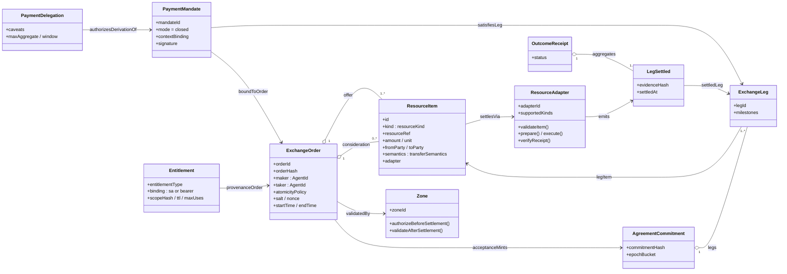
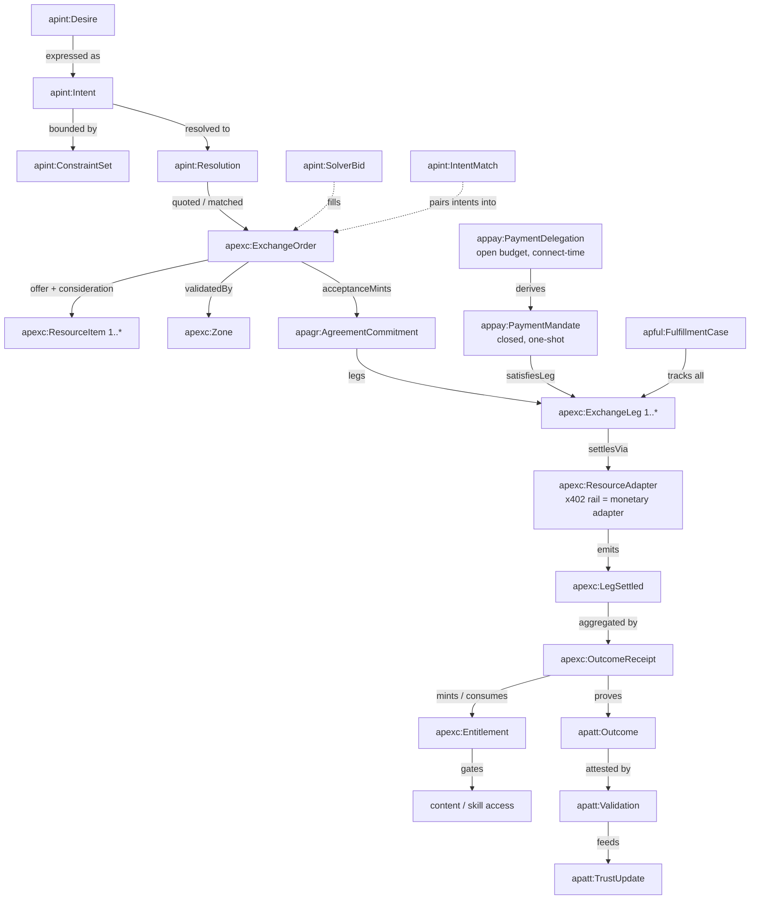
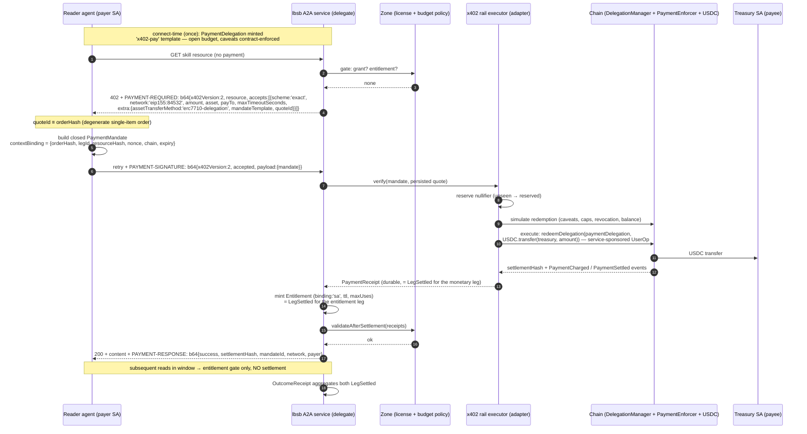
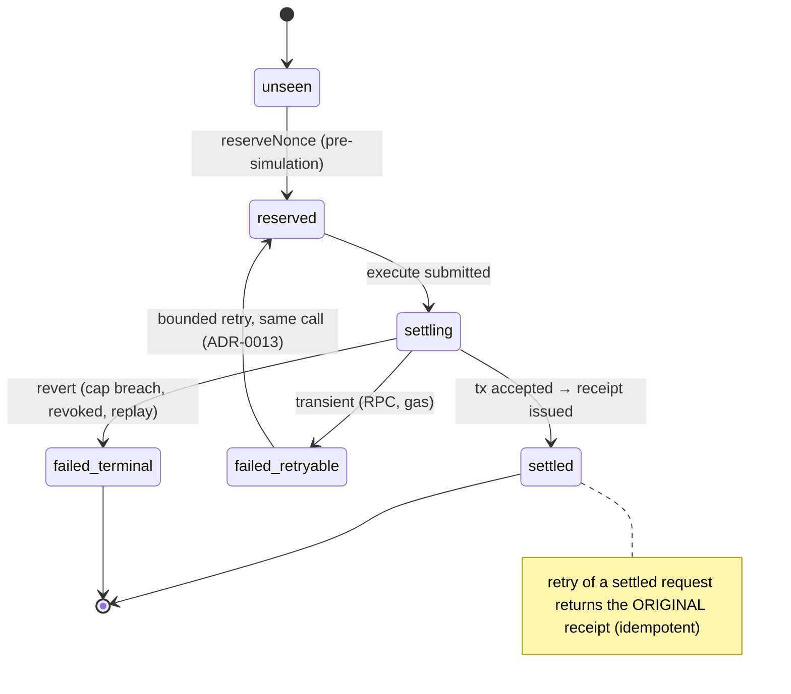

# Spec 274 — Exchange Ontology (Intent → Outcome) + x402 Conformance Profile

**Status:** Drafted (2026-06-11).
**Owns:** The formal vocabulary (`apexc:` T-box + C-box) for the value-exchange kernel of [spec 273](./273-value-exchange-consideration.md), presented end-to-end — intent → order → settlement → fulfillment → outcome/entitlement — with the **x402 v2 standard layered in as the payment profile** of one consideration-item class. Also owns the x402 conformance checklist our implementation is held to.
**Architecture-of-record:** [ADR-0024](../docs/architecture/decisions/0024-intent-coordination-substrate.md) (the 15-layer spine), [ADR-0018](../docs/architecture/decisions/0018-agenticprimitives-wide-formal-ontology.md) (monorepo-wide ontology), [ADR-0009](../docs/architecture/decisions/0009-on-chain-ontology-shacl-naming.md) (on-chain lockstep).
**Companion specs:** [225](./225-ontology.md) (ontology package — this spec adds `tbox/exchange.ttl` to its §11.5 scope), [239](./239-intent-spine.md) (intent classes), [241](./241-agreement-commitment-registry.md) (agreement), [243](./243-payments.md) (PaymentMandate), [244](./244-fulfillment.md) (fulfillment), [266](./266-verifiable-content-substrate.md) (`apcnt:Entitlement`, content-scoped), [272](./272-x402-pay-per-use.md) (x402 executor), [273](./273-value-exchange-consideration.md) (exchange kernel doctrine).

**Posture on Seaport:** patterns learned, nothing cloned. The crosswalk (§7) links our classes to Seaport/AP2/ERC-7683 concepts with `rdfs:seeAlso` — never `owl:equivalentClass` — they are design inputs per ADR-0038, not conformance targets. **x402 v2 is the one external standard we DO conform to** (§6), because it is our wire protocol.

---

## 1. Namespaces

Per spec 225 §4 (base `https://agenticprimitives.dev/ns/`; final strings pinned in `context.jsonld`):

| prefix | IRI | scope | status |
|---|---|---|---|
| `apexc` | `…/ns/exchange#` | ResourceItem, ExchangeOrder, Zone, Adapter, LegSettled, OutcomeReceipt, Entitlement | **NEW (this spec)** |
| `apint` | `…/ns/intent#` | Desire, Intent, ConstraintSet, Resolution, SolverBid, IntentMatch | existing plan (225 §11.5 `tbox/intents.ttl` et al.) |
| `apagr` | `…/ns/agreement#` | AgreementCommitment, AgreementCredential | existing plan (`tbox/agreement.ttl`) |
| `appay` | `…/ns/payment#` | PaymentMandate, PaymentQuote, ContextBinding, PaymentReceipt | existing plan (`tbox/payment.ttl`; PaymentQuote added here) |
| `apful` | `…/ns/fulfillment#` | FulfillmentCase, Task, Artifact | existing plan (`tbox/fulfillment.ttl`) |
| `apatt` | `…/ns/attestation#` | Evidence, Outcome, Validation, TrustUpdate | existing plan (`tbox/attestation.ttl`) |
| `apdel`, `ap`, `apcnt` | per 225 §4 / §11.6 | Delegation/Caveat/Enforcer; Agent; content Entitlement | existing |

## 2. T-box — the complete intent → outcome vocabulary

### 2.1 Spine classes (existing plan, listed for the end-to-end picture)

| Layer | Class | Definition (one line) |
|---|---|---|
| 1 | `apint:Desire` | Latent want; never actionable until expressed as Intent |
| 2 | `apint:Intent` | Expressed want: `direction (Receive\|Give)` × `object` × `topic` + visibility tier. Matcher never branches on type (239 §7.1) |
| 3 | `apint:ConstraintSet` / `apint:AssumptionSet` | CSP-grounded bounds on acceptable exchanges; per-field DisclosurePolicy (D-42) |
| 4 | `apint:Resolution` | Normalized, provenance-tagged canonical intent (USER-ASSERTED / LLM-INFERRED / POLICY-IMPOSED) |
| 6 | `apint:SolverBid` | A solver's priced proposal against an intent |
| 7 | `apint:IntentMatch` | Accepted opposite-direction pairing |
| 8 | `apagr:AgreementCommitment` | On-chain hash anchor of the agreement body (body in JV) |
| 9a | `apdel:Delegation` / `apdel:Caveat` / `apdel:Enforcer` | Scoped authority (the payment delegation is one) |
| 10 | `apful:FulfillmentCase` | Tracks ALL legs to completion |
| 11 | `apful:Task` | Unit of work (A2A task on that transport) |
| 12 | `apful:Artifact` / `apatt:Evidence` | Work product + provenance |
| 13 | `apatt:Outcome` | Did the promised state become true |
| 14 | `apatt:Validation` | Third-party attestation of the outcome |
| 15 | `apatt:TrustUpdate` | Reputation delta citing the chain below it |

### 2.2 Exchange kernel classes (NEW — `tbox/exchange.ttl`)

| Class | Definition | Key properties |
|---|---|---|
| `apexc:ResourceItem` | The universal unit of exchangeable value (EXC-D6). Money is one kind | `apexc:itemKind` (C-box `resourceKind`), `apexc:resourceRef` (CAIP-19 / agent / entitlement type / skill id / content URI), `apexc:amount`, `apexc:unit`, `apexc:fromParty`, `apexc:toParty`, `apexc:itemSemantics` (C-box `transferSemantics`), `apexc:settlesVia` (→ Adapter), `apexc:hasCriteria`, `apexc:privacyPolicy` |
| `apexc:ResourceCriteria` | Predicate item ("any provider with score > X"); solver lanes V3+ | `apexc:criteriaExpr`, `apexc:criteriaSchema` |
| `apexc:ExchangeOrder` | Layer-5 artifact freezing an exchange (EXC-D7); acceptance mints the agreement | `apexc:hasOfferItem` (1..*), `apexc:hasConsiderationItem` (0..*), `apexc:orderHash`, `apexc:maker`, `apexc:taker`, `apexc:validatedBy` (→ Zone), `apexc:atomicityPolicy` (C-box), `apexc:salt`, `apexc:orderNonce`, `apexc:startTime`/`endTime`, `apexc:derivedFromIntent` (→ `apint:Intent`), `apexc:acceptanceMints` (→ `apagr:AgreementCommitment`) |
| `apexc:ExchangeLeg` | A ResourceItem in agreement context (Layer 8 view); `legId` stable across order → agreement | `apexc:legOf` (→ AgreementCommitment), `apexc:legItem` (→ ResourceItem), `apexc:legMilestones` |
| `apexc:Zone` | Deterministic policy validator (EXC-D8): authorize-before-settlement, validate-after-settlement | `apexc:zoneId`, `apexc:enforcesPolicy`; on-chain realization: `apdel:Enforcer` (the caveat-enforcer family IS the on-chain zone) |
| `apexc:ResourceAdapter` | Settlement executor for one or more `resourceKind`s (EXC-D5/D8); the x402 rail is one | `apexc:adapterId`, `apexc:supportsKind` |
| `apexc:SettlementPlan` | Ordered adapter executions satisfying an order under its atomicity policy | `apexc:planFor` (→ ExchangeOrder), `apexc:planStep` |
| `apexc:LegSettled` | Uniform per-leg evidence (EXC-D3); subclass of `apatt:Evidence` | `apexc:settledLeg`, `apexc:evidenceHash`, `apexc:settledAt`, `apexc:settlementRef` (tx hash / VC id) |
| `apexc:OutcomeReceipt` | Aggregate proof the exchange completed; subclass of `apatt:Evidence` | `apexc:receiptFor` (→ orderHash), `apexc:aggregates` (→ LegSettled 1..*), `apexc:receiptStatus` (success/partial/error) |
| `apexc:Entitlement` | Durable access resource (EXC-D9) — issuable, consumable, revocable, receipted. `apcnt:Entitlement` (266) is its content-scoped subclass | `apexc:entitlementType`, `apexc:subject`, `apexc:issuer`, `apexc:scopeHash`, `apexc:rights`, `apexc:entitlementBinding` (C-box: `sa`/`bearer`, X402-D7), `apexc:ttl`, `apexc:maxUses`, `apexc:provenanceOrder` (→ orderHash) |
| `apexc:EntitlementConsumption` | Receipted use of an entitlement | `apexc:consumes` (→ Entitlement), `apexc:usageHash` |

### 2.3 Payment classes (x402 profile of the kernel — `tbox/payment.ttl` additions)

| Class | Definition | Kernel relationship |
|---|---|---|
| `appay:PaymentQuote` | The x402 projection of ONE monetary consideration item (X402-D9.2); immutable once persisted | `appay:quoteOf` (→ `apexc:ResourceItem`); `quoteId ≡ orderHash` in the degenerate single-item case (EXC-R5) |
| `appay:PaymentMandate` | Closed, context-bound authorization to settle a monetary item (spec 243) | `appay:satisfiesLeg` (→ `apexc:ExchangeLeg`), `appay:boundToOrder` (→ orderHash) — never bare resource-only binding (EXC-INV-6) |
| `appay:ContextBinding` | The load-bearing anti-replay object (PMT-3) | carries `orderHash`, `legId`, `resourceHash`, `taskId`, nonce, chain, expiry |
| `appay:PaymentReceipt` | Immutable settlement VC (243 §7) | `rdfs:subClassOf apexc:LegSettled` realization for monetary legs |
| `appay:PaymentDelegation` | The connect-time open budget (X402-D5); `rdfs:subClassOf apdel:Delegation` | authorizes derivation of closed mandates ("open budget, closed charge") |

### 2.4 Key predicates (the relationship spine)

```
apint:Intent          --apexc:derivedFromIntent⁻¹-->  apexc:ExchangeOrder
apexc:ExchangeOrder   --apexc:hasOfferItem-->         apexc:ResourceItem
apexc:ExchangeOrder   --apexc:hasConsiderationItem--> apexc:ResourceItem
apexc:ExchangeOrder   --apexc:validatedBy-->          apexc:Zone
apexc:ExchangeOrder   --apexc:acceptanceMints-->      apagr:AgreementCommitment
apagr:AgreementCommitment --apexc:legOf⁻¹-->          apexc:ExchangeLeg (1..*)
apexc:ResourceItem    --apexc:settlesVia-->           apexc:ResourceAdapter
appay:PaymentMandate  --appay:satisfiesLeg-->         apexc:ExchangeLeg
appay:PaymentMandate  --appay:boundToOrder-->         apexc:ExchangeOrder
apexc:LegSettled      --apexc:settledLeg-->           apexc:ExchangeLeg
apexc:OutcomeReceipt  --apexc:aggregates-->           apexc:LegSettled (1..*)
apexc:Entitlement     --apexc:provenanceOrder-->      apexc:ExchangeOrder
apful:FulfillmentCase --apful:tracks-->               apexc:ExchangeLeg (all of them)
apatt:Outcome         --apatt:provenBy-->             apexc:OutcomeReceipt
```

## 3. C-box — controlled vocabularies (SKOS; lockstep per ADR-0009)

| Vocabulary | Members | Notes |
|---|---|---|
| `resourceKind` | `native-token, erc20, erc721, erc1155, entitlement, credential, attestation, a2a-skill, mcp-tool, content-access, content-license, compute, data, service, custom` | OPEN family — registered via the kit (EXC-R4), enumerated nowhere in spine logic (EXC-INV-3) |
| `transferSemantics` | `transfer, mint, burn, consume, issue, attest, deliver, execute, grant, revoke, prove` | what "settling" means per kind |
| `atomicityPolicy` | `sequential, escrowed, atomic-onchain` | EXC-D4; declared in the order, covered by the hash |
| `entitlementBinding` | `sa, bearer` | X402-D7; W1 writes `sa` only, gate rejects `bearer` until tier A3 |
| `mandateMode` | `open, closed` | PMT-10; closed is always one-shot |
| `x402Scheme` | `exact, upto, batch-settlement` | per x402 v2; W1 implements `exact` only, others rejected fail-closed |
| `assetTransferMethod` | `erc7710-delegation, eip3009, permit2` | our `extra` extension point; W1 = erc7710-delegation, W5 adds eip3009 |
| `settlementFinality` | `tx-submitted, confirmed, receipt-attested` | per-skill policy (272 §5.3) |
| `x402PaymentStatus` | `payment-required, payment-submitted, payment-verified, payment-completed, payment-failed` | a2a-x402 v0.2 `x402.payment.status` values — adopted verbatim, no invented states |
| `nullifierState` | `unseen, reserved, settling, settled, failed_retryable, failed_terminal` | PAY-RAIL-5 off-chain reservation lifecycle |

## 4. Diagrams

### 4.1 Class diagram — the exchange kernel



### 4.2 Class-relationship diagram — intent to outcome (spine view)



### 4.3 Interaction diagram — x402 v2 sync HTTP flow (272 layered on the kernel)



### 4.4 Interaction diagram — A2A async path (a2a-x402 v0.2, no new TaskState)

```mermaid
sequenceDiagram
    autonumber
    participant Client as Client agent
    participant Srv as A2A server (priced skill)
    participant X as x402 rail executor

    Client->>Srv: message/send (task created)
    Srv-->>Client: task: state=input-required,<br/>metadata: x402.payment.status='payment-required',<br/>x402.payment.required={accepts[...]}
    Client->>Srv: resume message, metadata: x402.payment.payload={mandate}
    Srv->>X: verify → reserve → simulate → execute → receipt
    X-->>Srv: settlement receipt
    Srv-->>Client: task resumes; x402.payment.status='payment-completed',<br/>x402.payment.receipts[] appended; handler runs ONLY now
```

### 4.5 State diagram — settlement reservation (PAY-RAIL-5)



## 5. Reference: smart-agent patterns to port

- **T-box/C-box discipline** (`/docs/ontology/tbox/intents.ttl`, `cbox/intent-types.ttl`): one class + direction property, SKOS controlled vocabularies, SHACL shapes per class — the exact authoring style `tbox/exchange.ttl` follows. **Ported wholesale.**
- **`generalized-intent-matchmaking.md`** resource catalog → `resourceKind` members. **Ported.**
- **Deliberate divergence:** smart-agent has no exchange-order, adapter, zone, or payment ontology (its settlement layer is planned-not-built). `apexc:`/`appay:` classes are new, with Seaport/AP2/ERC-7683 as `rdfs:seeAlso` design inputs only.

## 6. x402 v2 conformance profile (NORMATIVE — implementation MUST adhere)

x402 is the one wire standard we conform to. Each row is checkable against [spec 272] requirements; the §6.3 fixtures make it CI-enforced.

### 6.1 Conformance matrix

| # | x402 v2 requirement | Our implementation | Status |
|---|---|---|---|
| C1 | `402` status + `PAYMENT-REQUIRED` response header, base64-encoded JSON | PAY-WIRE-1 `buildPaymentRequired(quote)` | Conformant |
| C2 | Body shape `{ x402Version: 2, resource{url,description,mimeType}, accepts: PaymentRequirements[], error? }` | PAY-WIRE-1 | Conformant |
| C3 | `PaymentRequirements` = `{ scheme, network (CAIP-2), amount (atomic-unit string), asset, payTo, maxTimeoutSeconds, extra? }` | PAY-WIRE-1; `network: 'eip155:84532'` | Conformant |
| C4 | Client retry carries `PAYMENT-SIGNATURE` header, b64 `{ x402Version, accepted, payload }` | PAY-WIRE-2 `parsePaymentSignature` | Conformant |
| C5 | Settlement response carries `PAYMENT-RESPONSE` header, b64 `{ success, settlementHash, network, payer, … }` | PAY-WIRE-3 `buildPaymentResponse` | Conformant |
| C6 | `scheme: 'exact'` semantics — exact amount, single asset, single payee | X402-D3 + `PaymentEnforcer` exact-amount check | Conformant |
| C7 | Facilitator-less direct settlement permitted IFF duplicate detection implemented | PAY-RAIL-4 nullifier + PAY-RAIL-5 reservation + on-chain nonce | Conformant |
| C8 | Extension data rides `extra`, never new top-level fields | `extra.assetTransferMethod`, `extra.mandateTemplate`, `extra.quoteId` | Conformant (extension point used as designed) |
| C9 | a2a-x402 v0.2: extension URI declared in agent-card `capabilities.extensions[]`; activation via `X-A2A-Extensions` | PAY-A2A-4 | Conformant |
| C10 | a2a-x402: NO new TaskState; park in `input-required`; status via `x402.payment.status`; payload via `x402.payment.payload`; receipts appended to `x402.payment.receipts[]` | PAY-A2A-2/3; `x402PaymentStatus` C-box adopted verbatim | Conformant |
| C11 | `upto` / `batch-settlement` schemes | Not implemented W1; **rejected fail-closed**, reserved as future `accepts[]` entries | Conformant (non-support is explicit, not silent) |
| C12 | EIP-3009 `exact` EVM transfer method for external clients | Wave 5 second `accepts[]` entry (`assetTransferMethod:'eip3009'`, EIP-712 domain in `extra`) | Deferred — wire-compatible by construction |
| C13 | v1 headers (`X-PAYMENT` / `X-PAYMENT-RESPONSE`) | **Not supported, by decision** (ADR-0013, PAY-WIRE-2) | Deliberate divergence: we are v2-only; v1 is deprecated upstream |
| C14 | Raw `network` chain ids (v1 style `'84532'`) | Rejected; CAIP-2 only | Conformant (v2) |

### 6.2 Where x402 sits in the ontology (the layering claim)

`x402` is the **wire protocol of the monetary ResourceAdapter** — nothing more:

```
apexc:ExchangeOrder                    ← business object (NOT on the wire)
  └─ consideration item (kind=erc20)   ← what x402 settles
       └─ appay:PaymentQuote           ← its x402 projection  = accepts[] entry
            └─ PAYMENT-REQUIRED        ← wire (C1–C3)
       └─ appay:PaymentMandate         ← authorization         = PAYMENT-SIGNATURE payload (C4)
       └─ appay:PaymentReceipt         ← evidence              → PAYMENT-RESPONSE projection (C5)
```

Raw x402 headers are never the internal authorization primitive (273 north star); the internal chain is Quote → Mandate → LegSettled → OutcomeReceipt. Conversely, nothing internal leaks onto the wire outside `extra` (C8) — a stock x402 v2 client can read our 402s.

### 6.3 Conformance enforcement

- **Golden wire fixtures** in `packages/payments` tests: canonical `PAYMENT-REQUIRED` / `PAYMENT-SIGNATURE` / `PAYMENT-RESPONSE` vectors (valid + malformed + v1 + unknown-scheme), asserted byte-for-byte by `pnpm check:payments` (rides 272 §11 wire tests).
- **SHACL shapes** (`packages/payments/src/shapes/*.shacl.ttl` per PD-19): `PaymentQuoteShape`, `PaymentMandateShape` (closed mode ⇒ maxRedemptions=1; contextBinding ⇒ orderHash present), `OutcomeReceiptShape` (≥1 LegSettled).
- **Lockstep** (ADR-0009): every `apexc:`/`appay:` term above registers via `ShapeRegistry.defineShape(...)`; `check:ontology-lockstep` covers `tbox/exchange.ttl`.

## 7. Crosswalk (`mappings/spine-standards.ttl` additions)

All `rdfs:seeAlso` / `rdfs:comment` — learned-from, never equivalent-to (except x402 wire classes, which are profile-conformant):

| Our class | Learned from | Relation |
|---|---|---|
| `apexc:ExchangeOrder` (offer/consideration/salt/counter/time-window) | Seaport order | `rdfs:seeAlso`; divergence: items may be off-chain obligations + evidence, not atomic-token-only |
| `apexc:Zone` | Seaport zone (restricted-order validation, 1.6 pre/post hooks) | `rdfs:seeAlso`; ours is also off-chain + realized on-chain by caveat enforcers |
| `apexc:ResourceAdapter` | Seaport conduit | `rdfs:seeAlso`; generalized from token transfer to issue/deliver/execute semantics |
| `apexc:ResourceCriteria` | Seaport criteria-based items; ERC-7683 resolver | `rdfs:seeAlso` |
| `appay:PaymentMandate` open/closed | AP2 intent/checkout vs payment mandate split | `rdfs:seeAlso`; PMT-10 already adopted the distinction |
| `appay:PaymentQuote` / wire headers | **x402 v2 + a2a-x402 v0.2** | **conformant profile** (§6) — the one true external conformance |
| `apexc:ResourceItem` flows | ValueFlows `EconomicEvent`/`EconomicResource` | `rdfs:seeAlso` (already in 225's crosswalk scope) |

## 8. Requirements

- **ONT-X-1** — `tbox/exchange.ttl` + C-box vocab files added to `packages/ontology` per 225 §11.5 conventions (this spec adds the file to that list); SHACL runtime shapes live in owning packages (PD-19).
- **ONT-X-2** — every C-box vocabulary in §3 is SKOS + lockstep-registered; the OPEN families (`resourceKind`) register members via the kit, closed sets (`atomicityPolicy`, `mandateMode`, `x402Scheme`) are enum-bound on-chain.
- **ONT-X-3** — the §6.1 conformance matrix is kept current in THIS spec; any wire-touching change to 272/243 must update it (architect-of-record duty).
- **ONT-X-4** — golden wire fixtures (§6.3) land with 272 Wave 3 and gate `check:payments`.

## 9. Invariants

- **ONT-X-INV-1** — wire conformance is v2-only and fail-closed: unknown version/scheme/method → reject; never silently degrade (ADR-0013, C11/C13).
- **ONT-X-INV-2** — internal primitives never leak to the wire outside `extra`; external standards never become internal primitives (the quote/mandate/receipt chain is canonical, headers are projections).
- **ONT-X-INV-3** — crosswalks to Seaport/AP2/ERC-7683 stay `rdfs:seeAlso`; promoting one to `owl:equivalentClass` or a conformance target requires a new ADR.
- **ONT-X-INV-4** — diagram-of-record: §4 diagrams are normative for class relationships; code that contradicts them is wrong or this spec gets amended first (specs precede code).
